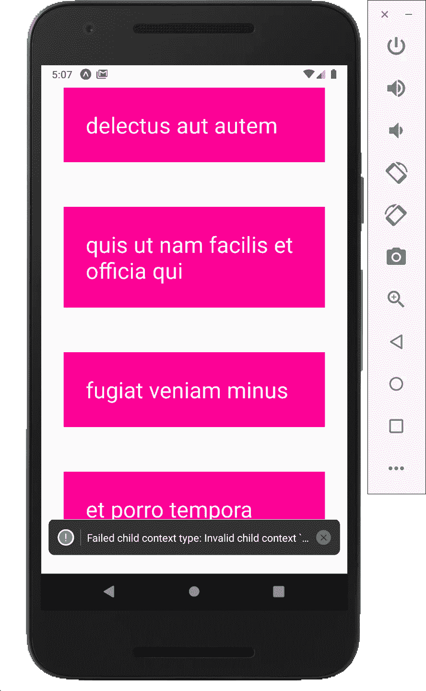
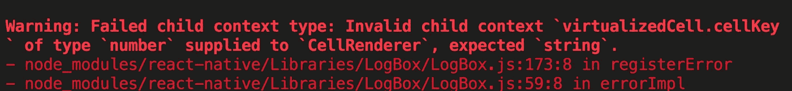
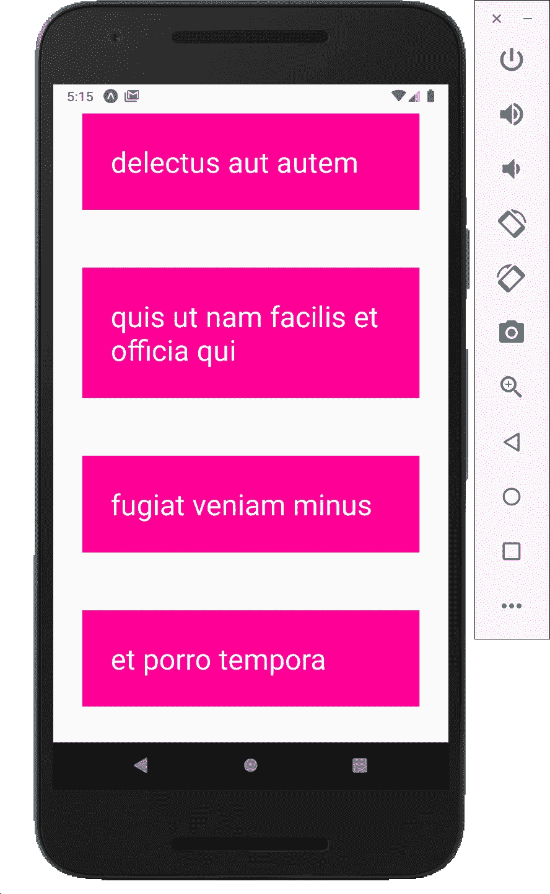
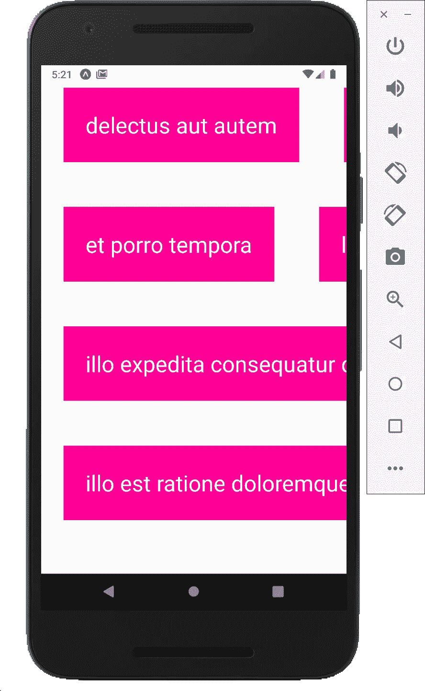
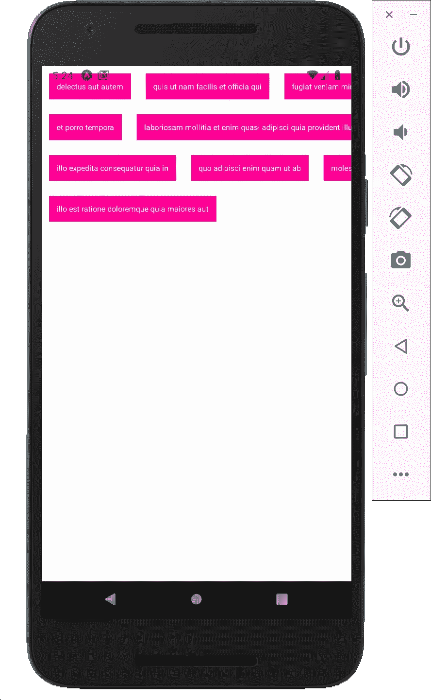

# 我们如何以及为什么在 Expo 中使用 Flatlist

> 原文：<https://javascript.plainenglish.io/how-and-why-we-use-flatlist-in-expo-react-native-894bded78774?source=collection_archive---------7----------------------->

## 使用 Flatlist 的好处


Photo by [Emma Matthews Digital Content Production](https://unsplash.com/@emmamatthews?utm_source=medium&utm_medium=referral) on [Unsplash](https://unsplash.com?utm_source=medium&utm_medium=referral)

我们已经看到了一种方法，使用数组上的 map 函数将列表输出到屏幕上，然后为每个 todo 返回一些 JSX。

Flatlist 是另一种输出列表的方式，很多人认为它更好。因此，我们转到顶部并导入平面列表。我们也可以去掉滚动视图，因为
FlatList 自动提供上下滚动列表的功能

完整的 React 本地文章:

1.  [如何用 Expo 打造 React 原生 app](https://medium.com/swlh/how-to-build-a-react-native-app-with-expo-e6e024838b86)
2.  [如何在模拟器上运行 Expo React 原生 app](https://medium.com/swlh/how-to-run-the-expo-react-native-app-on-the-emulator-dc322699e3d9)
3.  [世博会文件夹和文件结构](https://medium.com/swlh/expo-folder-and-file-structure-872661bdf339)
4.  [世博反应本土观点、文本和风格](https://medium.com/swlh/expo-react-native-view-text-and-style-8e4c0723890b)
5.  [Expo React Native —使用 React Hook useState()](https://medium.com/swlh/expo-react-native-using-react-hook-usestate-a2b5fb41090a)
6.  [如何在 React Native 中使用 TextInput 组件改变状态？](https://medium.com/swlh/how-to-use-textinput-component-to-change-state-in-react-native-8c7b2eb93305)
7.  [如何使用 Expo React 原生列表和 ScrollView](https://medium.com/swlh/how-to-use-expo-react-native-list-and-scrollview-e2c24c025241)
8.  [我们如何以及为什么在 Expo React Native 中使用 flat list](https://medium.com/javascript-in-plain-english/how-and-why-we-use-flatlist-in-expo-react-native-894bded78774)
9.  [Expo React Native 中的 TouchableOpacity 是什么？](https://ckmobile.medium.com/what-is-touchableopacity-in-expo-react-native-ead5863dd6fe)

```
import { StyleSheet, Text, View, **FlatList** } from 'react-native';
```

FlatList 有许多不同的属性来控制我们的列表是如何工作的

```
<FlatListkeyExtractor={(item) => item.id.toString()}data={todos}renderItem={({ item }) => (<Text style={styles.todo}>{item.title}</Text>)}/>
```

数据属性是指定我们想要循环的数据。

renderItem prop 和将等于一个函数，返回一些 JSX。我们需要的数据在“item”属性中，所以我们需要析构来访问数据。我们不需要 FlatList 中的键。它会自动寻找一个关键属性。



我们可以看到有一个警告“`Failed child context type: Invalid child context `virtualizedCell.cellKey` of type `number` supplied to `CellRenderer`, expected `string`.`”。我们稍后会解决这个问题。我们还为每个项目添加了 todo 样式。

```
<Text style={styles.todo}>{item.title}</Text>
```

## 为什么 FlatList 更好

1.  较少代码
2.  更好的性能

“平面列表”只加载前几个，然后当你向下滚动时会加载更多，而“列表”和“滚动视图”从头开始渲染每个项目，即使是大列表。

我们已经提到过，FlatLess 组件会自动查找每个项目的 key 属性。

在这种情况下，它已经将 id 作为关键属性，然而它期望的应该是“字符串”,而得到的是“数字”



我们需要添加另一个道具到平面列表中，这个道具叫做 key extractor。

```
<FlatList**keyExtractor={(item) => item.id.toString()}**data={todos}renderItem={({ item }) => (<Text style={styles.todo}>{item.title}</Text>)}/>
```

我们用转换成字符串的 id 更新密钥。它不应该再在底部得到警告。



## 设置列

另一个属性叫做“numColumns”，我们可以把这个设为一个数字。

我们把它设为 3，它会被分成某种网格。



我们可以改变样式，将字体大小、边距和填充降低到 10，这样可以得到更清晰的图片。

```
todo: {margin: 10,backgroundColor: 'deeppink',color: 'white',fontSize: 10,padding: 10}
```



完整代码:

```
import React, { useState } from 'react';import { StyleSheet, Text, View, FlatList } from 'react-native';export default function App() {const [todos, setTodo] = useState([{"userId": 1,"id": 1,"title": "delectus aut autem","completed": false},{"userId": 1,"id": 2,"title": "quis ut nam facilis et officia qui","completed": false},{"userId": 1,"id": 3,"title": "fugiat veniam minus","completed": false},{"userId": 1,"id": 4,"title": "et porro tempora","completed": true},{"userId": 1,"id": 5,"title": "laboriosam mollitia et enim quasi adipisci quia provident illum","completed": false},{"userId": 1,"id": 6,"title": "qui ullam ratione quibusdam voluptatem quia omnis","completed": false},{"userId": 1,"id": 7,"title": "illo expedita consequatur quia in","completed": false},{"userId": 1,"id": 8,"title": "quo adipisci enim quam ut ab","completed": true},{"userId": 1,"id": 9,"title": "molestiae perspiciatis ipsa","completed": false},{"userId": 1,"id": 10,"title": "illo est ratione doloremque quia maiores aut","completed": true}])return (<View style={styles.container}><FlatListnumColumns={3}keyExtractor={(item) => item.id.toString()}data={todos}renderItem={({ item }) => (<Text style={styles.todo}>{item.title}</Text>)}/></View>);}const styles = StyleSheet.create({container: {flex: 1,backgroundColor: '#fff',alignItems: 'center',justifyContent: 'center',},todo: {margin: 10,backgroundColor: 'deeppink',color: 'white',fontSize: 10,padding: 10}});
```

在 YouTube 上获取免费教程:

[](https://www.youtube.com/channel/UCu4-4FnutvSHVo9WHvq80Ww) [## ckmobile

### 无论你是在后台还是前台工作，JavaScript 现在都非常重要。NodeJS、Angular、VueJS 或 React all…

www.youtube.com](https://www.youtube.com/channel/UCu4-4FnutvSHVo9WHvq80Ww) 

关注我们:[https://twitter.com/ckmobilejavasc1](https://twitter.com/ckmobilejavasc1)