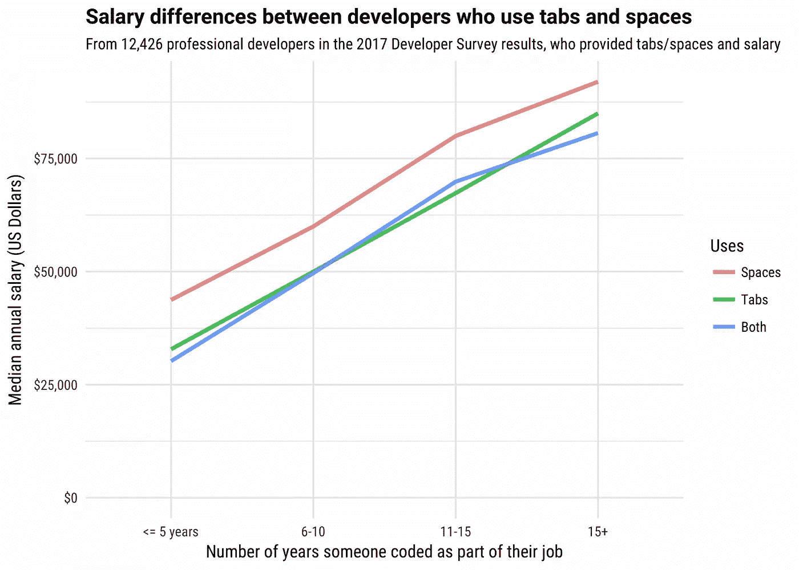
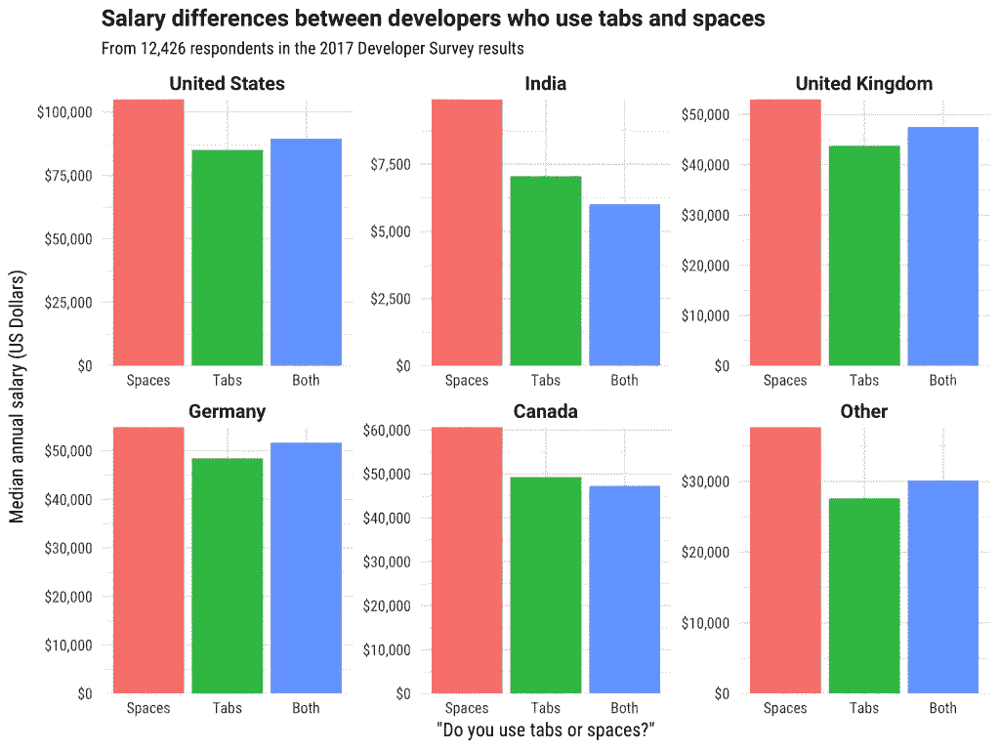
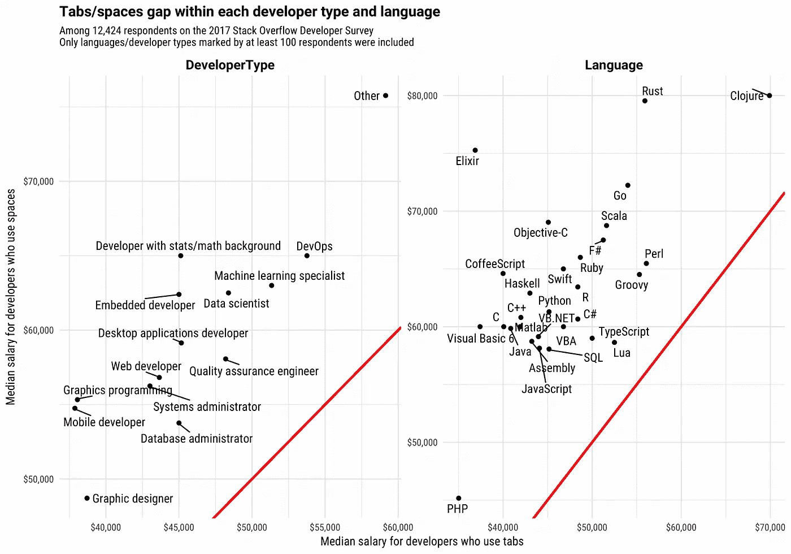

# 开发商如何赚更多的钱？

> 原文：<https://javascript.plainenglish.io/how-are-developers-making-more-money-21d6c0c71082?source=collection_archive---------9----------------------->

## 他们在制表符上使用空格

Photo by [Sharon McCutcheon](https://unsplash.com/@sharonmccutcheon?utm_source=medium&utm_medium=referral) on [Unsplash](https://unsplash.com?utm_source=medium&utm_medium=referral)

我有好消息告诉你！我找到了让你赚更多钱的方法。解决方案一直就在你眼前。坐在那里，在你的键盘中间。你已经用过了。但显然，你应该更多地使用它。

如果你还不明白，我说的是空格键。这听起来可能令人困惑，但是请听我说完。

说到代码缩进，有两个团队。一个是使用空格，第二个是使用制表符。虽然这两者之间有一点竞争。我从没想过它会对某件事产生影响。但我发现，确实如此。

# 空格比标签赚钱多

这种说法不是一些疯狂的主张，它实际上是有数据支持的。每年，Stack Overflow 都会邀请其他开发人员参与调查。我通常每年检查结果。主要是因为我想看看哪些技术的回报最高。

然而，当我浏览结果时，一个特别的调查引起了我的注意。这是制表符和空格的问题。调查如下。

> 有 28，657 名调查对象回答了制表符和空格。他们都认为自己是专业开发人员。在这个群体中，40.7%的人使用制表符，41.8%的人使用空格(17.5%的人两者都用)。其中，12，426 人还提供了工资。

就我个人而言，我使用制表符缩进，我从来没有想到有这么多人使用空格。不用说，我对结果感到惊讶。

然而，这还不是全部。真正让我吃惊的是下面这个结果。

使用空格缩进的编码者赚更多的钱。

Source: [Stack Overflow](https://stackoverflow.blog/2017/06/15/developers-use-spaces-make-money-use-tabs/)

那么这对你意味着什么呢？你应该继续用空格替换你所有的标签吗？它会神奇地说服你的老板给你加薪吗？我们一会儿会研究这个问题。

那么公司老板和创业公司的首席执行官呢？为了降低员工的工资，你应该解雇所有使用空间的开发商吗？毕竟，你为什么要多付钱给某人，仅仅是因为他们缩进代码的方式。

但是坚持住！在你开始采取这些激烈的措施之前，我认为我们需要再看一看数据。我们需要进一步分析。并找到薪资差异背后的驱动因素。

可以考虑国家这个因素吗？毕竟，来自低 GDP 国家的人可能更喜欢标签。与此同时，来自高 GDP 国家的人可能更喜欢空间。这可以很好地解释工资差异。

Stack Overflow 的优秀员工也考虑到了这一点。他们根据国家对参与者进行分组。现在，我们可以看看这种影响是否仍然存在。令我惊讶的是，确实如此。

**在每个国家，使用空间的开发者收入更高(与使用标签的开发者相比)。**

Source: [Stack Overflow](https://stackoverflow.blog/2017/06/15/developers-use-spaces-make-money-use-tabs/)

现在那个国家已经不在考虑范围内，我们需要看得更远。这一切背后的驱动因素是什么？我的第二个猜测是职位本身。

开发者有很多种类型。我们使用不同的语言，不同的框架，但是我们都属于一个大团体。在这个群体中，有一个职业引起了我的思考。

是 DevOps 的工程师，他们一天的大部分时间都呆在码头。或者使用某种脚本语言编写脚本。

我相信 DevOps 工程师经常使用空间。而且我也知道 DevOps 是一个高薪的职位。一开始，我以为一定是这个。这不得不成为工资差异的原因。但我发现，事实并非如此。

这种效应存在于每一个开发者群体中。

Source: [Stack Overflow](https://stackoverflow.blog/2017/06/15/developers-use-spaces-make-money-use-tabs/)

这绝对是一个令人惊讶的结果。我仔细阅读了调查，试图找出可能的混淆因素。但事实证明，根本没有。该研究试图通过其他因素对开发者进行分组，但不可能消除这种影响。

**使用共享空间的开发者可以赚更多的钱。**

那么，如果没有控制因素，这真的意味着空间可以与更高的工资联系起来吗？数据肯定是这样告诉我们的。但是我不太相信。

# 总结想法

说到薪水，我觉得混杂因素肯定是年龄。这也是有意义的。过去，ide 中没有很好的标签支持，空间控制也是一个问题。换句话说，开发人员倾向于使用空格进行缩进。这个习惯可能会持续下去，直到今天他们还在使用它。

资历随着开发人员的年龄而增长。通常情况下，资历越深意味着经验越丰富。更多的经验意味着更高的薪水。

 [## 人们实际编写的 19 个垃圾代码片段

### 其中一个可能是你的。

javascript.plainenglish.io](/19-garbage-code-snippets-people-actually-wrote-7e176e52f7e1)  [## 这个空的 NPM 包有超过 70 万的下载量。原因如下。

### 让我告诉你这个不起眼的软件包，它在过去的一年里产生了超过 70 万次的下载。

javascript.plainenglish.io](/this-empty-npm-package-has-over-700-000-downloads-7718b48bf997) 

*更多内容尽在*[***plain English . io***](http://plainenglish.io/)