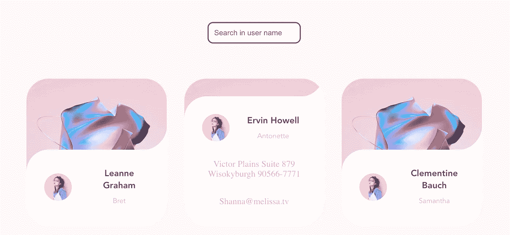
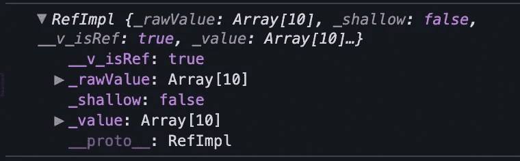

# 如何用组合 API 从 JSON 文件创建一个搜索框

> 原文：<https://javascript.plainenglish.io/how-can-i-create-a-search-box-from-a-json-file-with-the-composition-api-c36058753c07?source=collection_archive---------8----------------------->

## 如何使用 Composition API 制作搜索框，如何从 JSON 文件中读取数据，如何在屏幕上显示数据——我们可以在 5 分钟内了解所有这些内容。


Photo by [Daniel Lerman](https://unsplash.com/@dlerman6?utm_source=medium&utm_medium=referral) on [Unsplash](https://unsplash.com?utm_source=medium&utm_medium=referral)



今天我们将使用 Vue 合成 API 来做搜索框。我们将在`setup()`函数中完成所有操作。我在以前的帖子中分享了组合 API 的使用。您可以通过下面的链接访问它。

[](/how-to-use-the-composition-api-to-get-data-from-service-with-vue-js-4da1eca19ad6) [## 如何使用组合 API 通过 Vue.js 从服务中获取数据

### 通过使用组合 API 而不是选项 API，可以使服务结构更加可用。

javascript.plainenglish.io](/how-to-use-the-composition-api-to-get-data-from-service-with-vue-js-4da1eca19ad6) 

首先，我想指定我使用的资源。我从[**这个链接**](https://jsonplaceholder.typicode.com/users) 得到的用户数据。在这里你可以访问 [**链接**](https://freefrontend.com/css-cards/) ，在那里我得到了用户卡的 CSS。我的主要目标是做搜索逻辑，所以我不想准备好 CSS。我找到的网站上有非常好的例子。我建议你去那里看看。

[](https://bestte.medium.com/membership) [## 用我的推荐链接加入媒体

### 作为一个媒体会员，你的会员费的一部分会给你阅读的作家，你可以完全接触到每一个故事…

bestte.medium.com](https://bestte.medium.com/membership) 

首先，我们将从数据开始。让我们在`src`文件夹下创建一个数据文件夹。让我们在其中创建一个 JSON 文件。在本例中，我将从本地文件夹中获取数据。

*我们的样本数据会是这样的。*

现在让我们在 components 文件夹下创建一个 **User.vue** 文件。

如果您键入`<vue`，IDE 将推荐您使用 Vue 模式。

我们需要导入 **User.json、ref 和 computed。**

`import {ref, computed } from "Vue"`

`import User from '../data/user.json'`

```
const user = ref(User)const search = ref(“”)
```

我们需要使我们使用的变量具有反应性。*无功*是指变量可以变化。如果我们给一个变量赋一个常数值，我们就不能改变赋给该变量的数据。这是我们不想要的。Vue 为它开发了`ref`任务。如你所知，我们不能在`setup()`中使用`this`关键字。为此，我们将使用`ref` it 使数据变得可行。

在我创建的`user`中，分配我从 JSON 文件导入的用户。

我会把数据必须放在一个“为”的`search.`

在搜索方法之前，我想先说一下返回值。

您必须定义您在`setup()` return 中创建的变量和方法。否则，如果您想在安装程序之外使用它，它会给你一个警告。刚开始会忘记，但是你的手已经习惯了。

你必须用`value`调用在`setup()`中创建的常量变量。

如果你写`console.log(user),`输出会是这样的。所以我们需要用`const`它作为`user.value.`



```
const searchFunction = computed(() => { return user.value.filter((item) => { return item.name.toLowerCase().includes(search.value); })})
```

让我们来关注一下我们的`searchfunction`方法。

> `computed`是我们执行监听操作，根据一个值或数据对另一个字段进行即时更改的地方。当链接变量发生变化时，它会立即更新它所连接的其他位置。

在第一个`return`值处，我们过滤从 JSON 文件中获得的**用户**数据。

第二个`return`值，我们得到了我们正在寻找的值。

`item.name`是来自我的数据。我想过滤名字值。如果我们的操作包含我们正在寻找的单词，则返回值。

```
<input type=”search” v-model=”search” placeholder=”Search in blog title” />
```

在`<template>`部分，我们使用`input`。你可以`type` `text`或者搜索一下，我觉得不会有问题。

我们用一个`v-model`来搜索。

```
<li v-for="user in searchFunction" :key="user"> <h3 class="card__title"> {{user.name}} </h3> <span class="card__status"> {{user.username}} </span> <p class="card__description"> {{user.address.street}}       {{user.address.suite}} {{user.address.city}}  {{user.address.zipcode}} </p> <p class="card__description"> {{user.email}} </p></li>
```

我不想提 *CSS* 和*风格*结构。让我们看看如何在*模板*中显示我们得到的数据。

`v-for="user in users" :key="user.id"`

根据`users`数据，我们创建了与用户数量一样多的`user`。我们需要确定一个`:key`。这是强制性的。如果不指定，您将收到一个错误。

经过这个过程，这样无论什么时候打电话都可以联系到用户；

`{{ user.name }}, {{ user.username }}, {{ user.address.street }}`

您可以访问下面的所有项目代码。你可以处理它。

[](/how-to-use-angulars-attribute-directives-in-your-class-hierarchy-d3a1d0adac32) [## 如何在类层次结构中使用 Angular 的属性指令

### 使用 Angular CLI 构建属性指令

javascript.plainenglish.io](/how-to-use-angulars-attribute-directives-in-your-class-hierarchy-d3a1d0adac32) [](/how-to-create-marker-and-marker-cluster-with-leaflet-map-95e92216c391) [## 如何使用传单地图创建标记和标记簇

### 在活页地图架构中创建标记和图层，然后对标记进行聚类的方法。

javascript.plainenglish.io](/how-to-create-marker-and-marker-cluster-with-leaflet-map-95e92216c391) [](/chart-and-calendar-design-in-flip-card-using-angular-nebular-db0ffd434d5b) [## 使用角状星云在翻转卡中设计图表和日历

### 在活动卡片上创建一个快速、友好的图表和日历。

javascript.plainenglish.io](/chart-and-calendar-design-in-flip-card-using-angular-nebular-db0ffd434d5b) [](/create-a-card-design-with-the-free-vue-js-template-now-ui-kit-5676a738e518) [## 使用免费的 Vue.js 模板创建卡片设计

### 使用免费主题可能是开发设计和学习的最佳方式之一。

javascript.plainenglish.io](/create-a-card-design-with-the-free-vue-js-template-now-ui-kit-5676a738e518) 

*更多内容看*[***plain English . io***](http://plainenglish.io/)