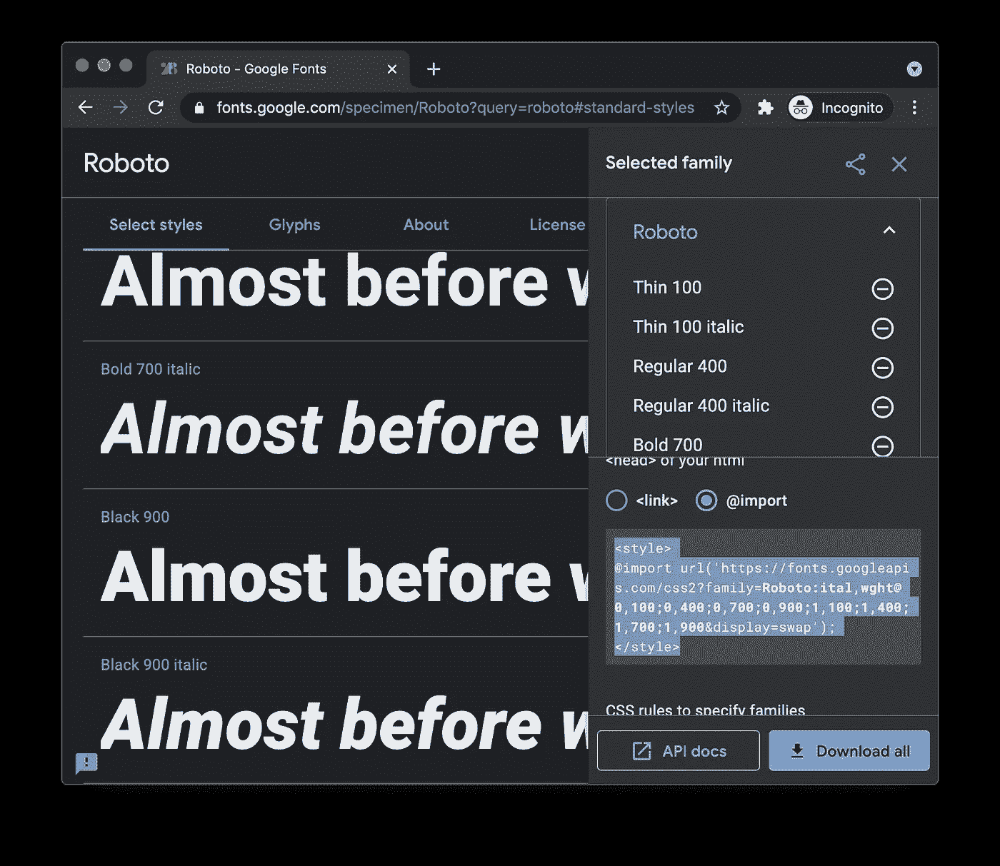

# Tailwind CSS 如何提升你的开发体验？

> 原文：<https://javascript.plainenglish.io/how-can-tailwind-css-boost-your-development-experience-ed4204500cbd?source=collection_archive---------16----------------------->


Photo by [Danial Igdery](https://unsplash.com/@ricaros?utm_source=medium&utm_medium=referral) on [Unsplash](https://unsplash.com?utm_source=medium&utm_medium=referral)

用 Next.js 和 Tailwind CSS 创建一个签到页面|第 1 集

# 介绍

作为一名网络开发人员，你应该听说过[自 2016 年以来每年都进行的 JavaScript 调查](https://stateofjs.com/)。创作者还调查了 CSS，[CSS 调查状态](https://stateofcss.com/)。让我们来看看[CSS 2020](https://2020.stateofcss.com/)的状态结果吧！

## CSS 2020 的状态


*Figure 1\. CSS Framework Usage ratio rankings from The state of CSS 2020*

从调查来看，Bootstrap 仍然是使用最多的 CSS 框架。事实上，Bootstrap 是如此强大。它很好地处理了模块化。多年来，它非常流行，非常适合快速项目原型开发。

## 顺风 CSS


*Figure 2\. CSS Framework Satisfaction Ratio Rankings from The state of CSS 2020*

根据上面的图表， [Tailwind CSS](https://tailwindcss.com/) 去年的使用量增长最快。整个 2019 年和 2020 年的满意度百分比都很惊人。

Tailwind CSS 是一个实用优先的底层 CSS 框架。Tailwind CSS 和其他框架如 [Bootstrap](https://getbootstrap.com/) 或[布尔玛](https://bulma.io/)有一个根本的区别。与大多数提供预定义组件和元素的 CSS 框架不同，Tailwind CSS 为我们提供了一组庞大的实用程序类来构建组件。


*Figure 3\. CSS* Methodologies *Satisfaction Ratio Rankings from The state of CSS 2020*

根据 CSS 2020 的状态，效用优先的 CSS 是最令人满意的 CSS 方法论。

在这个故事中，我们将把 Tailwind CSS 与 Next.js 集成在一起。然后，我们将构建一个登录页面，并用这个实用程序优先的 CSS 框架来设计页面的样式。

# 我们开始吧！

我们没有从头开始一个新的 Next.js 应用程序，而是将 [nextjs-100](https://github.com/rockyliyanlok/nextjs-100) 存储库克隆为样板文件。这个存储库是用一个渐进式 web 应用程序的基本配置建立的，这个应用程序获得了 100%的 lighthouse 分数。

如果你错过了，请阅读下面的故事，了解如何设置的细节。

[](https://rockyli.medium.com/build-a-pwa-with-next-js-to-achieve-100-lighthouse-score-8bbb86598ed4) [## 用 Next.js 构建 PWA，实现 100% lighthouse 评分

### 这篇文章讲述了我们如何用 Next.js (React.js)构建一个渐进的 Web 应用程序，并获得 100%的分数…

rockyli.medium.com](https://rockyli.medium.com/build-a-pwa-with-next-js-to-achieve-100-lighthouse-score-8bbb86598ed4) 

## 安装顺风 CSS

按照顺风 CSS 网站上的官方指南[安装顺风 CSS 包。](https://tailwindcss.com/docs/guides/nextjs)

```
# yarn add -D tailwindcss@latest postcss@latest autoprefixer@latest
```

## 生成配置文件

接下来，我们需要生成配置文件， *tailwind.config.js* 和 *postcss.config.js* 。

```
# npx tailwindcss init -p
```

执行上述命令后，将创建最小的 *tailwind.config.js* 和 *postcss.config.js* 。在 *postcss.config.js* 中，添加`tailwindcss`和`autoprefixer`插件。

./*tailwind.config.js*

./postcss.config.js

## 包括顺风 CSS

打开*。/styles/globals.css* ，Next.js 默认生成，包含使用 **@tailwind** 指令的 **base** 、 **components** 和 **utilities** 样式。

*./styles/globals.css*

确保*。/styles/globals.css* 被导入到。/ *pages/_app.js* 。

./pages/_app.js

## 将全局样式添加到基础层

然后，用 **@apply** 指令将全局样式添加到**基础**层。

在这里，我们使用全局样式制作了应用程序:

*   全宽(***w-全宽*** )
*   最小高度与屏幕高度相同( ***最小高度屏幕*** )
*   防止水平滚动( ***溢出-x-隐藏*** )
*   平滑字体(*)*

## *带有顺风 CSS 的样式*

*./pages/index.js*

*通过将 ***文本居中*** 和 ***文本绿色-500*** 类名添加到`*<div>*`，元素将居中对齐，颜色为绿色。*

**

*Figure 4\. Style with Tailwind CSS*

# *构建索引页面*

*创建*。/pages/signin.js* 作为最少元素的签到页面组件。稍后，登录表单将嵌入到该组件中。*

*./pages/signin.js*

*更新索引页面，以便在用户点击`/`路径时将他们重定向到登录页面。*

*./pages/index.js*

*在上面的代码中，我们检查了***getServerSideProps()***中的登录状态。如果当前用户可用，则用户对象作为道具被推送到索引组件。否则，用户将被重定向到登录页面。*

*在***getServerSideProps()***中，我们可以通过返回一个重定向值来重定向用户，而不是用 *res.writeHead* 重写位置或者用 *next/router* 重定向用户。*

# *构建登录页面*

## *导入 SVG 图像*

*要在 Next.js 组件中显示 SVG 图像，请安装 *@svgr/webpack* 包，并在 *next.config.js* 中添加自定义 webpack 配置。*

```
*# yarn add -D @svgr/webpack*
```

*./next.config.js*

*在*里。/public/svg/* 文件夹，添加 Next.js logo 和 Tailwind CSS logo 的 svg 图片。然后，创建一个组件来呈现徽标。*

*./components/SignInLogos/index.js*

*使用 *@svgr/webpack* 包，我们可以将 SVG 图像作为 react 组件导入。调整 SVG 图像大小最简单的方法是创建一个目标大小的包装器，并用 100%宽度和高度的 SVG 填充包装器。*

*从 Tailwind CSS 的[文档](https://tailwindcss.com/docs/width)中，一个带有 ***w-{number}*** 的元素是设置元素宽度的实用程序类。对于 ***w-10*** 类，该元素的宽度为 2.5 雷姆。因此 Next.js SVG 包装器的尺寸是 2.5 rem x 1.5 rem。*

*为了给两个徽标之间的 *X* 添加一些填充，我们使用了非常容易理解的 Sizing 实用程序类。就像纯 CSS 中的 padding，***p { t | r | b | l }-{ size }***一样，utility 类的第二个字符分别代表上、右、下、左。我们甚至可以用 x 来表示左右两边的填充。尺寸值映射可在[文档](https://tailwindcss.com/docs/padding)中找到。*

*./pages/signin.js*

*在*中。/pages/signin.js* ，我们创建了一个`card`组件来包装`SignInLogos`组件。*

*`card`组件在页面上居中。在这里，我们使用响应式实用程序变体来使移动设备和中型设备之间的`card`组件风格不同。阴影和圆角实用程序仅在设备宽度大于 ***md*** 时适用。*

## *添加登录标签*

*接下来，我们将在页面中添加登录标签，并用 Tailwind CSS 实用程序类来设计标签的样式。*

*./components/SignInLabel/index.js*

*./pages/signin.js*

*如您所见，我们在页面中央构建了一个带有`logos`和`label`的签到卡。*

**

*Figure 5\. Sign-In card in the center of the page*

# *构建登录表单*

*登录页面的核心组件是用户可以输入凭证并提交凭证的表单。让我们构建一个在提交前进行验证的登录表单。*

*对于像输入框或按钮这样的小组件，构建 React 组件听起来有点沉重。使用来自 Tailwind CSS 的 **@apply** 指令，我们可以将多个实用程序类合并到一个 CSS 组件类中。*

## *创建输入元素*

*现在是时候创建带有输入和按钮的登录表单了。*

*./components/SignInForm/index.js*

*在代码片段中，**输入**类被指定为样式化`input`标签，我们将通过提取*中的组件来创建该标签。/styles/globals.css* 。不仅如此，添加**自动完成**属性非常重要，因为浏览器会建议自动完成之前填充的值。*

*我们还在`form`元素中添加了 **noValidate** 属性，这意味着表单数据在提交时不应该被验证。否则，将显示 html5 表单验证错误默认消息。*

*./styles/globals.css*

*在*中。/styles/globals.css* ，将提取组件包装在 **@layer** 中，帮助 Tailwind 知道组件应该放在哪一层。在这种情况下，提取组件将被移动到组件层，没有任何顺序问题。*

*下面是在登录表单中创建的输入元素的结果。*

**

*Figure 6\. Sign-In card with input elements*

## *在登录表单中创建按钮*

*是时候在登录表单中构建按钮了。与输入实用程序类相同，我们在*中向组件层添加了一个按钮实用程序类。/styles/globals.css* 。*

*当我们看一下`button`实用程序类时，当用户 ***悬停*** 或 ***聚焦*** 带有前缀实用程序的组件时，改变样式非常简单。*

*./styles/global.css*

*但是，颜色实用程序类不包括在自定义按钮实用程序类中。按钮颜色可通过***text-{ color }-{ level }***和 ***bg-{color}*** 灵活设置。另外，我们可以执行***e . prevent default()***来防止提交表单并重新加载的默认行为。*

*./components/SignInForm/index.js*

## *导入登录表单组件*

*一旦创建了登录表单，我们就可以将组件导入到登录页面中。*

*./pages/signin.js*

**

*Figure 7\. The Sign-In form*

# *表单验证*

*在这个部分中，添加了一个包`react-hook-form`用于表单验证。*

```
*# yarn add react-hook-form*
```

*包`react-hook-form`是一个定制的钩子，用于我们验证表单数据和显示错误。验证表单有三个主要步骤:*

1.  *注册要验证的表单数据*
2.  *添加表单提交处理程序*
3.  *显示错误消息*

*这些辅助功能都可以在**使用表单**钩子中找到。*

*./components/SignInForm/index.js*

## *1.注册要验证的表单数据*

*要注册表单数据字段，请将以下属性添加到 email `input`标记中。*

*./components/SignInForm/index.js*

****register()*** 方法中的第一个参数是表单数据的*标签名*，第二个参数是*验证规则*。我们将**要求的**规则放在提交时检查邮件地址是否存在，否则将返回`Enter your email address`错误消息。**模式**规则是检查邮件地址格式是否正确，**值**是输入的正则表达式模式，**消息**是表单数据无效时返回的错误消息。*

## *2.添加表单提交处理程序*

***useForm** 钩子中的***handle submit()***函数用于处理表单提交后的验证。创建一个 ***onSubmit()*** 回调函数，并用***handle submit()***回调处理程序将其分配给表单标签的 **onSubmit** 属性。*

*./components/SignInForm/index.js*

## *3.显示错误消息*

*如果表单提交验证失败，来自 **useForm** 钩子的 ***errors*** 对象会列出所有带有表单数据标签的错误信息。我们只需添加一个***console . log()***来捕捉错误消息，以防表单数据验证失败。*

*./components/SignInForm/index.js*

*在集成了`react-hook-form`之后，如果验证通过，我们就有了表单数据。否则**错误**对象将列出所有错误。*

**

*Figure 8\. On Sign-In form validation success*

**

*Figure 9\. On Sign-In form validation failure*

## *创建登录表单输入组件*

*让我们为*中的输入创建一个组件。/components/sign inform/input . js*并用新的`Input`组件替换`input`组件。*

**./components/SignInForm/Input.js**

*然后，我们可以用`Input`组件替换输入标签。*

*./components/InputForm/index.js*

# *检索并显示错误消息*

*一个包`@hookform/error-message`可以帮助容易地检索和显示表单验证消息。*

```
*# yarn add @hookform/error-message*
```

*包中的`ErrorMessage`处理来自**使用表单**钩子的错误对象。我们需要做的就是在注册字段和**错误**对象时提供表单标签。我们还添加了一个渲染道具来定制错误消息的样式。*

*./components/InputForm/index.js*

*为了突出显示表单域，当相应的表单标签名称出现错误消息时，边框颜色也将变为红色。*

*./components/InputForm/input.js*

*为了在**错误**不为空时添加实用程序类，我们还需要添加`classnames`包。*

```
*# yarn add classnames*
```

**

*Figure 10\. Error messages when form validation failed*

# *奖金*

## *按回车键提交*

*大多数用户期望在他们填写凭证后点击 **Enter** 键等同于表单提交。我认为这是登录表单的必备特性之一。尽管这个特性实现起来并不困难。*

*./components/InputForm/index.js*

*./components/InputForm/index.js*

*在`SignInForm`组件中，当组件被挂载时，我们向 *keydown* 事件添加了一个事件监听器。如果按下 **Enter** 键，`Submit`按钮将被编程触发并执行表单提交。*

## *添加 Google 字体以自定义字体系列*

*在 Tailwind CSS 中添加 Google 字体来定制字体系列非常简单。*

*首先，我们可以从[谷歌字体](https://fonts.google.com/)中挑选最喜欢的字体和样式。*

**

*Figure 11\. Pick favourite font and styles from Google Fonts*

*然后，从 Google fonts 中获取导入片段，添加到 *tailwind.config.js* 中。将指定家庭的 CSS 规则添加到***theme . font family***中，如下所示。将生成一个实用程序类 ***字体-{字体家族}*** 。*

*./tailwind.config.js*

*毕竟，我们可以将字体实用程序类添加到 ***@layer/base*** 来设置 web 应用程序的默认字体系列。*

*./styles/globals.css*

# *结论*

*当我们设计组件时，Tailwind CSS 提供了不同的体验。尽管 Tailwind CSS 中没有预构建的组件，但这个框架为开发人员提供了大量的实用程序类来创建更时尚的按钮，而不是 CSS 框架中的标准 UI。*

*在下一集，我将演示如何使用 Tailwind CSS 使 web 应用程序支持*黑暗主题*以及如何为制作进行*优化。**

*在这里随意克隆或派生[库](https://github.com/rockyliyanlok/nextjs-with-tailwind-css/tree/sign-in-form)。*

*编码快乐！*

*[*更多内容看 plainenglish.io*](http://plainenglish.io/)*