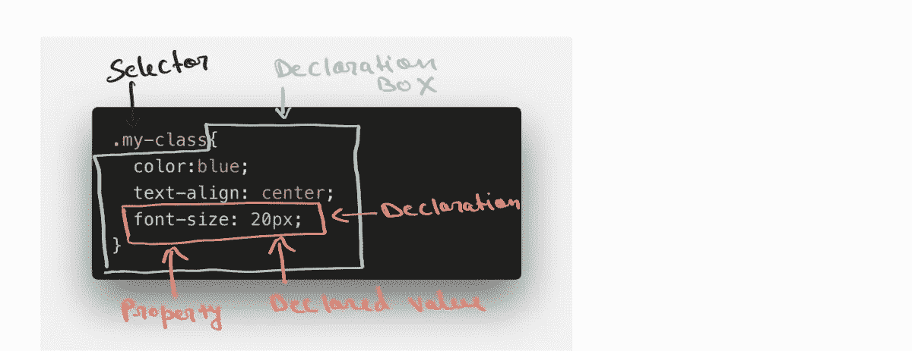
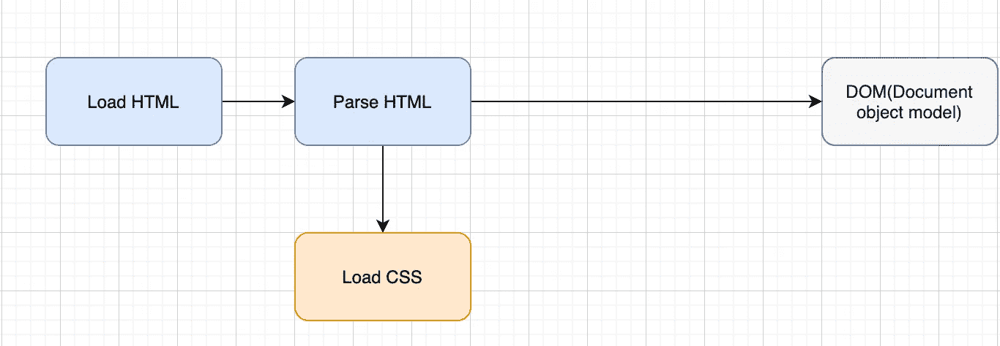
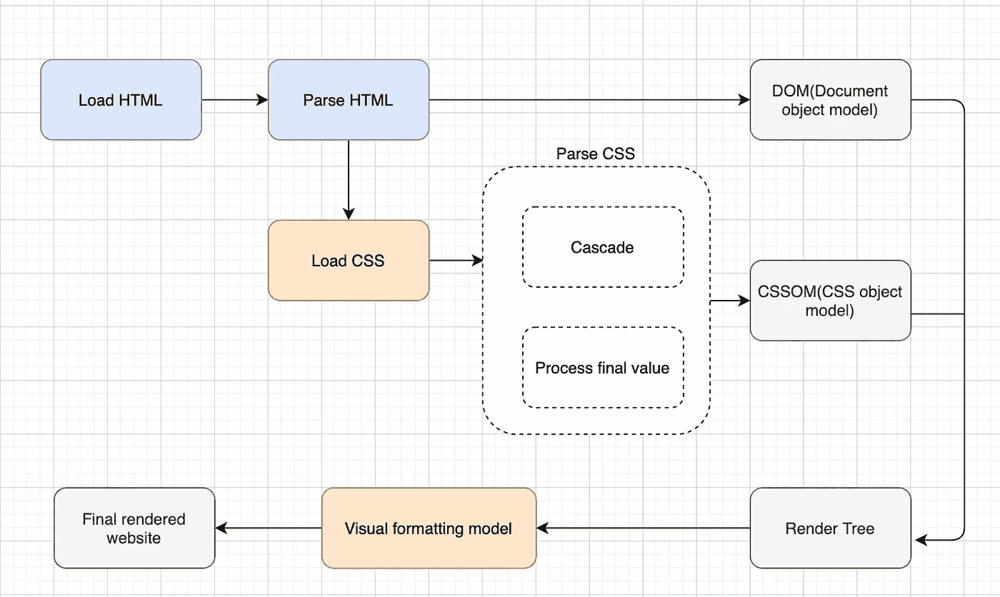
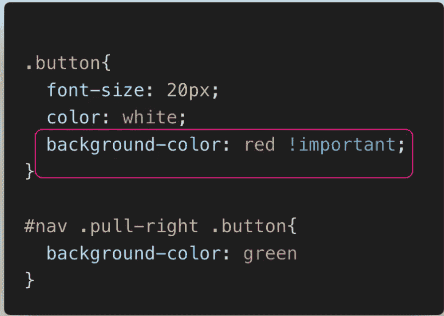
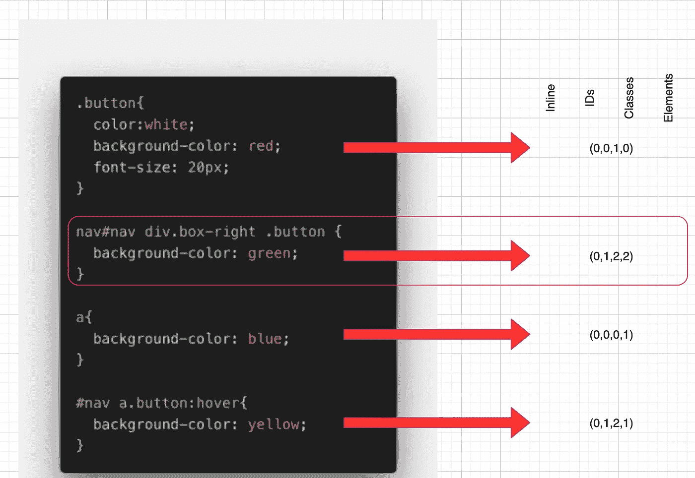

# CSS 如何工作

> 原文：<https://javascript.plainenglish.io/how-css-works-5a9741cf4ab9?source=collection_archive---------9----------------------->

作为 Web 开发人员，我们每天都在使用 CSS，但是您知道幕后的一切是如何工作的吗？我们如何得到漂亮的不同颜色和风格的网页，老实说，我每天都在使用 CSS，但我并没有很好地意识到它。所以我做了一些研究，看了一些视频，在这里我写了这篇文章，试图把一切都放在一个简单的博客里。

# 开始之前，让我们快速回顾一下 CSS 中使用的官方术语

> 现在我们都在同一页上，让我们开始吧

# 什么是 CSS？

根据 MDN 文档"**(****CSS****)是一种* [*样式表*](https://developer.mozilla.org/en-US/docs/Web/API/StyleSheet) *语言，用于描述用*[*HTML*](https://developer.mozilla.org/en-US/docs/Web/HTML)*或*[*XML*](https://developer.mozilla.org/en-US/docs/Web/XML/XML_introduction)*等 XML 方言编写的文档的表示 CSS 描述了元素应该如何呈现在屏幕上、纸上、演讲中或其他媒体上。**

*回答上面的问题:CSS 是用来样式化网站的。*

*是的，我知道，这很简单，但是 CSS 是如何工作的，当我们给*背景色:红色，*时会发生什么，当冲突发生时，浏览器如何决定将哪个属性分配给 DOM？*

# *让我们在 CSS 如何工作中讨论所有这些*

*让我们从用户加载初始 HTML 文件开始。浏览器一启动，它就获取加载的 Html 代码并对其进行解析，逐行对代码进行解码，并且 **DOM(文档对象模型)**被构建在一个树状结构中，该结构具有父元素、子元素和兄弟元素。在解析 HTML 的同时，浏览器也会找到样式表，就像 HTML 一样，CSS 也会被解析。*

**

*CSS 解析有两个主要步骤*

1.  *CSS 声明的冲突是通过一个叫做 *cascade 的过程解决的。**
2.  *处理最终值。*

> *我们将在下面详细介绍上述步骤*

*完成以上两个步骤后，CSS 也存储在树状结构 **CSS 对象模型(CSSOM)** 中。我们已经解析了 HTML 和 CSS，它们一起形成了一个**渲染树。**现在我们有了渲染页面的一切。*

*呈现页面的下一步是视觉格式化模型**。它使用了一堆东西，比如**盒子模型、浮动和定位**。在视觉格式化模型完成其工作之后，网站最终被呈现并且屏幕被绘制💃。***

**

*我希望事情到现在都很清楚。让我们深入研究 CSS 解析阶段*

*什么是**级联***

> *Cascade 是组合不同的样式表并解决不同 CSS 规则和声明之间的冲突的过程，当多个规则应用于某个元素时。*

*当给元素赋予不同的属性时，某些样式属性，比如字体大小，可以出现在几个样式表中，也可以在一个样式表中出现几次，CSS 也可以来自不同的来源。*

*这些是 CSS 的不同来源*

1.  ***作者 CSS** 。我们开发人员编写的 CSS*
2.  ***用户 CSS** 。当用户更改浏览器中的任何属性时*
3.  ***浏览器 CSS** 。浏览器的默认样式，例如，锚标记总是用蓝色文本和下划线呈现。*

*浏览器从如此多不同的地方获得如此多的样式表，它如何决定将哪一个分配给一个元素。为了解决来自所有这些不同资源的冲突，基于这三个因素。*

1.  ***重要性(权重)***
2.  ***特异性***
3.  ***来源顺序***

## *让我们了解浏览器将如何基于**重要性**解决冲突*

*   *标有**的用户声明！重要的**关键词。*
*   *标有**的作者声明！重要的**关键词。*
*   *作者声明。*
*   *用户声明。*
*   *浏览器声明。*

**

*根据上述规则，将应用**背景色:红色**，因为！**重要的**关键字。因为它凌驾于一切之上。*

*我希望这是清楚的，但是如果我们有同样重要的相互冲突的声明呢？*

## *在这种情况下，我们根据下面的优先级计算它们的选择器**特异性***

1.  ***内嵌样式***
2.  ***IDs***
3.  ***类、伪类和属性***
4.  ***元素和伪元素***

**

*在上图中，我们正在计算特异性，以确定哪个属性将具有最高优先级。*

*对于所有四种情况，我们可以将**标记为内联样式 0** ，因为它们没有任何内联样式。*

*我们只有第二个第四个案例中的 ID，所以我们可以为这两个案例标记 **ID 1** 。*

*说到类，我们有针对情况 1(按钮)的**类 1，针对情况 2(按钮和右框)的** **类 2，**，**针对情况 4 的【伪类:悬停】类 2。***

*计算元素，我们有**情况 2(nav 和 div)的元素 2，情况 3(a)的元素 1，情况 4(a)的元素 1**。*

*二号选择器具有最高的特异性，因此我们的按钮将具有绿色背景**。最终值是**级联值。*****

*让我们假设选择器四也有两个元素，那么选择器二和选择器四将具有相同的**特异性**。如果所有声明选择器都有相同的特性，那么它是基于顺序计算的，因此**是最后声明的值**。*

*需要记住的几个要点*

**一个选择器带 1 个 ID > 1000 个类。**

**一个选择器有 1 类> 1000 个元素。**

**通用选择器*没有特异性值(0，0，0，0)。**

*总是依赖特异性而不是选择器的命令。*

> *如果我错过了什么，或者你有什么建议，请在评论区告诉我。*
> 
> *你也可以联系我
> [https://www.linkedin.com/in/akhatun/](http://Linkedin)*
> 
> *[https://github.com/amnahkhatun](https://github.com/amnahkhatun)*

*快乐的 coding✌️*

**更多内容请看*[***plain English . io***](https://plainenglish.io/)*。**

**报名参加我们的* [***免费周报***](http://newsletter.plainenglish.io/) *。关注我们关于*[***Twitter***](https://twitter.com/inPlainEngHQ)，[***LinkedIn***](https://www.linkedin.com/company/inplainenglish/)*，*[***YouTube***](https://www.youtube.com/channel/UCtipWUghju290NWcn8jhyAw)*，以及* [***不和***](https://discord.gg/GtDtUAvyhW) ***。****

****有兴趣缩放你的软件启动*** *？检查* [***电路***](https://circuit.ooo?utm=publication-post-cta) *。**