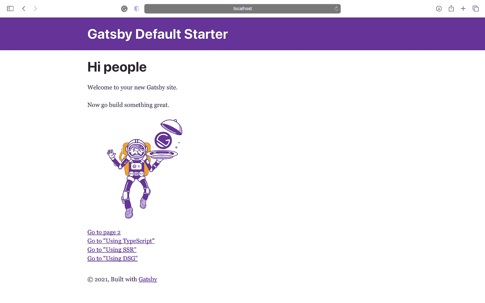

# 创建 React Web 应用程序的 6 种流行方法

> 原文：<https://javascript.plainenglish.io/how-did-i-create-a-react-web-app-in-various-different-ways-2849a8cdf00a?source=collection_archive---------7----------------------->

## 从简单到复杂

让我们把这篇文章保存在你的口袋里，我通常在这里更新创建 React web 应用程序的新方法。


Photo by [Lautaro Andreani](https://unsplash.com/@lautaroandreani?utm_source=medium&utm_medium=referral) on [Unsplash](https://unsplash.com?utm_source=medium&utm_medium=referral)

在本帖中，我们将从简单到复杂地探讨创建 React web 应用程序的各种方法。

我不能教你任何东西，我只能让你思考。

# 什么反应？

React.js 是脸书在 2013 年 5 月创建的开源 JavaScript 库。它用于构建用户界面。

开始之前，您需要设置环境:

## 安装 Node.js

Node.js 是一个开源的、跨平台的运行时环境，帮助我们编写 JavaScript 应用程序并执行它们。

*   节点> =14.0.0

可以从:[*https://nodejs.org/en/*](https://nodejs.org/en/)*得到。*

## 集成驱动电子设备

要用 React 开始编码，我们可以使用 Visual Studio Code IDE，可以从:[*https://code.visualstudio.com/download*](https://code.visualstudio.com/download)下载。

*   VS 代码(*或任何你选择的文本编辑器*)。

## 其他人

*   纱线(*可选*)

# 1.从头做起

这样，我们将学习和理解如何创建一个“hello world”web 应用程序。

```
.
├── index.html
└── lib
 ├── react-dom.js
 └── react.js
```

首先，我们为 web 应用程序创建一个空文件夹。

***【注意，您需要将当前目录更改为您的工作区。】***

```
 % mkdir **simple_react_app**
```

然后，我们创建一个`lib`文件夹来存储`react`库。

```
% mkdir simple_react_app/**lib**
```

接下来，我们需要添加两个 Javascript 文件:

*   第一个是`React`图书馆。

```
% curl -L [https://unpkg.com/react@17/umd/react.development.js](https://unpkg.com/react@17/umd/react.development.js) > simple_react_app/lib/react.js
```

*   第二个是`ReactDOM`附加。

之后，我们在目录中创建一个简单的页面，内容如下。

```
% vim index.html<!DOCTYPE html>
<html>

<head>
    <title>Hello React</title>
    <meta charset="utf-8" />
</head>

<body> 
    <div id="app" />
    <script src="lib/react.js"></script>
    <script src="lib/react-dom.js"></script>
    <script>
        ReactDOM.render(
            React.createElement('h1', null, 'Hello world!'),
            document.getElementById('app')
        );
    </script>
</body>

</html>
```

最后，我们完成了一个显示标题为“Hello world！”的网页消息。


Creating a React app from scratch

从头开始创建 React web 应用程序很难在以后维护，所以尽量使用一些有用的框架或库。

# 2.创建-反应-应用

这个工具是学习 React 的舒适环境，也是在 React 中开始构建新的单页面应用程序的最佳方式。

```
.
├── README.md
├── package.json
├── public
│ ├── favicon.ico
│ ├── index.html
│ ├── logo192.png
│ ├── logo512.png
│ ├── manifest.json
│ └── robots.txt
├── src
│ ├── App.css
│ ├── App.js
│ ├── App.test.js
│ ├── index.css
│ ├── index.js
│ ├── logo.svg
│ ├── reportWebVitals.js
│ └── setupTests.js
└── yarn.lock
```

在您的终端中，您可以导航到想要创建应用程序的目录，并执行以下命令。

```
% npx create-react-app **simple_react_app_with_cra**
```

注意，我们使用`npx`命令来确保我们用最新版本的`create-react-app`工具构建我们的应用程序。

> npm 是用来安装包的，而 npx 是用来执行包的。

要启动应用程序，只需运行`start`脚本:

```
% yarn start
```

上述命令在端口 3000 上启动一个服务器，并打开一个浏览器，如下所示。


*A React.js page running at* [http://localhost:3000](http://localhost:3000)

# 3.盖茨比（姓）

[Gatsby](https://www.gatsbyjs.com/) 是一个基于 React 构建静态站点的开源框架。通常称为*静态现场发生器* (SSG)。

这是一个典型的盖茨比项目结构。

```
.
├── LICENSE
├── README.md
├── gatsby-browser.js
├── gatsby-config.js
├── gatsby-node.js
├── gatsby-ssr.js
├── package-lock.json
├── package.json
├── public
│ ├── favicon-32x32.png
│ ├── icons
│ ├── manifest.webmanifest
│ ├── page-data
│ └── static
└── src
 ├── components
 ├── images
 ├── pages
 └── templates
```

下面的命令在名为 simple _ react _ app _ with _ Gatsby**的子目录中创建新的 Gatsby 项目。**

```
% npx gatsby new **simple_react_app_with_gatsby**
```

要启动您的应用程序，请切换到`simple_react_app_with_gatsby`目录并运行它:

```
% cd simple_react_app_with_gatsby
% npm run develop
```

在“ *http://localhost:8000”打开应用程序。*



*A Gatsby page running at* http://localhost:8000

# 4.狂欢

[Razzle](https://razzlejs.org/) 是一个工具，它将 SPA 和 SSR 应用程序所需的所有复杂配置抽象为一个依赖项。

这是一个典型的 Razzle 项目结构。

```
.
├── README.md
├── build
│ ├── assets.json
│ ├── server.js
│ └── server.js.map
├── cache
│ └── razzle-babel-loader
├── package.json
├── public
│ ├── favicon.ico
│ └── robots.txt
├── sandbox.config.json
├── src
│ ├── App.css
│ ├── App.js
│ ├── App.test.js
│ ├── Home.css
│ ├── Home.js
│ ├── client.js
│ ├── index.js
│ ├── react.svg
│ └── server.js
└── yarn.lock
```

要创建 Razzle web 应用程序，请执行以下命令。

```
% npx create-razzle-app **simple_react_app_with_razzle**
```

要启动该应用程序，请切换到一个新目录，并按如下方式运行它。

```
% cd simple_react_app_with_razzle
% yarn start
```


*A Razzle page running at* [http://localhost:3000](http://localhost:3000)

# 5.Next.js

[Next.js](https://nextjs.org/) 为您提供生产所需的所有功能，为您提供最佳的开发人员体验:混合静态&服务器渲染、类型脚本支持、智能绑定、路径预取等等。不需要配置。

```
.
├── README.md
├── next.config.js
├── package-lock.json
├── package.json
├── pages
│ ├── _app.js
│ ├── api
│ └── index.js
├── public
│ ├── favicon.ico
│ └── vercel.svg
└── styles
 ├── Home.module.css
 └── globals.css
```

要创建新的 Next 应用程序:

```
% npx create-next-app **simple_react_app_with_next**
```

要运行应用程序:

```
% cd simple_react_app_with_next
% npm run dev
```

导航到 localhost:3000 以访问该应用程序。


*A Next.js page running at* [http://localhost:3000](http://localhost:3000)

# 6.不承受重量的

你有一个关于 React npm 包的好主意，你想发布它并让其他人使用它，你有什么选择？试试`nwb`库。

```
.
├── CONTRIBUTING.md
├── README.md
├── demo
│ └── src
├── nwb.config.js
├── package.json
├── src
│ └── index.js
└── tests
 └── index.test.js
```

全局安装为快速开发和处理项目提供了一个`nwb`命令。

```
% npm install -g nwb
```

创建一个新组件。

```
% nwb new react-component **my-component**
```

尝试使用此组件运行应用程序。

```
% cd my-component
% npm run start
```

这是你能看到的:


Creating a React component using the nwb tool

# 结束语

正如您所了解的，有许多方法可以开始 React 项目。让我们选择你喜欢的方式，并每天学习理解和改进它。

很简单，对吧？

*更多内容看* [***说白了就是***](http://plainenglish.io/) ***。*** *报名参加我们的* [***免费每周简讯这里***](http://newsletter.plainenglish.io/) ***。***