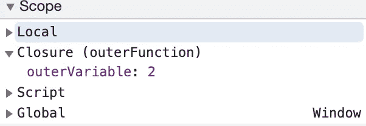

# JavaScript 中的闭包和提升是如何工作的？

> 原文：<https://javascript.plainenglish.io/how-do-closures-and-hoisting-work-in-javascript-under-the-hood-dabbc17c8897?source=collection_archive---------7----------------------->

## 精通闭包和吊装，擅长 JavaScript 面试准备。


Image 1: Crushing JS Interview by understanding Closure and Hoisting

在技术面试中被问到的最重要的问题之一是关于关闭和提升。关于关闭和提升有一些相当棘手的问题；因此，这篇文章将涵盖从基础到高级的**关闭和提升，**这样下次你在技术面试中被问到这些话题时，你就能毫无停顿地表现出色。


Image 2: You may have heard about it, or even used it, but wasn’t sure about the concept

# **我们开始吧！什么是终结？**

简单来说，我们举一个大圈里面的小圈的例子。


Image 3: Nested Circles / Nested Functions

在上图中，圆 1，即圆 2 中的嵌套圆。Circle 1 可以访问 Circle 2 中定义的所有元素/属性，因为 Circle 2 是其父 Circle。闭包基于相同的概念。 ***内部函数可以访问父函数中定义的作用域(可以是变量或其他属性)。*** 我们来看下面的例子:

上述代码的预期结果是什么？

**Ans。**是的！你一定是猜对了；输出为 **2。**这就是闭包的概念。在上面的例子中,` **innerFunction** `(在第 3 行)可以访问在 **outerFunction** 中定义的所有属性。

outerFunction 可以访问 innerFunction 中的所有属性吗？让我想想…

好的，上面代码的结果是:

```
ReferenceError: anotherOuterVariable is not defined
```

由此可见，innerFunction 可以访问外层函数/父函数的属性/变量，但父函数/外层函数不能访问嵌套函数的属性。

现在，我们知道了这个概念，但是闭包是如何在引擎盖下工作的呢？JavaScript 如何处理这个问题？

> 根据 Mozilla 文档中给出的定义，闭包让您可以访问外部函数的作用域。

让我们在浏览器开发工具中看到这一点:



Image 4: Developer Tool in Source Tab

正如您在上面的图片中所看到的，闭包就像是在作用域(词法环境)中定义的另一个函数。它包含父函数的所有变量值。

您可能在日常的 Javascript 编程中使用过它，比如当一个函数通过点击按钮(onClick)或任何其他基于事件的调用而被触发时。闭包在前端和后端开发中都有很多应用。它还有助于封装(在本文中我不会深入讨论它的用法)。

下面是另一种情况，对 ***外部函数*** 进行了两次不同的函数调用。

**外部变量**的期望值应该是多少？

行号(11)的输出可以是 **3** 吗？

**不，**每个函数调用都有它的词法环境。简单来说，每个函数调用都有自己的作用域，每个作用域都有不同的闭包；第二个函数调用(即第 11 行)有不同的闭包，因此**外部变量**的值也不同。因此，第一和第二控制台的输出都是 **2。**


Image 5: Vola, you got the Closures.

# 到目前为止，一切顺利！现在，什么是提升？

**吊装这个词是什么意思？**

> 根据谷歌搜索:提高或拖走。

但是等等！和 JavaScript 中的提升有什么关系？

***在 JavaScript 中，提升意味着将变量或函数声明拉到作用域的顶部。但是，JavaScript 只提升声明，不提升初始化。***

让我们来看看实际情况:

在上面的代码中，输出应该是什么？

```
Testing Hoisting
```

相当简单！现在，下面的代码会有什么结果呢？

上述代码的输出是:

```
Undefined
```

那么为什么输出**未定义**而不是**引用错误:测试未定义？**

答案是，在 JavaScript 中，代码执行分两个阶段完成:

第一个阶段是变量声明，它将内存分配给变量；然而，它并没有给变量赋值，变量*声明*在任何代码执行之前被处理。

第二阶段是变量赋值；在这个阶段，值被分配给变量。

记住，所有变量和函数声明都被提升到 JavaScript 代码的调用堆栈跟踪的顶部。因此，在上面的代码中，它给出了 ***未定义的*** 输出，因为在函数的调用堆栈中，它已经将内存分配给了那个变量；但是，没有给它赋值。这就是为什么它没有给出引用错误，但给出了未定义的错误。

我们可以在浏览器的开发者工具中的全局窗口的源代码选项卡中看到这一点:


Image 6: Developers Tool: Global Window

现在，让我们通过添加一个命名函数调用来修改上面的例子。

在上面的代码中，我已经在第 **2** 行添加了命名函数调用 **test** ，那么上面代码的预期结果应该是什么呢？

```
Inside the Function
Testing Hoisting
```

简单！首先打印变量，然后打印函数调用的返回值。现在让我们看看下面代码中棘手的部分:

你能猜出上面代码的结果吗？

```
Undefined
Inside the Function
```

哇哦。为什么函数调用被正确执行并返回了值，即使变量返回了 undefined？

嗯！你知道第一个的原因。如上所述，第 1 行返回未定义的
。但是，函数调用，即第 2 行返回“函数内部”，因为命名函数声明作为完整的函数存储在内存中。


Image 7: Developers Source Tool

上面的图像是运行脚本时从浏览器开发人员控制台获取的全局窗口；可以看到，在箭头 1 上，有一个包含函数调用的 **test** 属性，然而对于箭头 2，即 **test_variable 函数**，它包含 **undefined** 值，就像在 JavaScript 中一样，它将所有声明提升或拉到顶部，然而不是赋值，因为 test_variable 是赋值，所以它没有被提升。这就是函数返回值，但变量返回未定义的原因。

然而，如果你将使用一个箭头函数或将一个函数赋给一个变量，那么它也将返回 ***undefined。***

**#带“let”和“const”的边缘格**

虽然当使用 let 和 const 时，输出会有所不同。

```
let and const
```

让我们看看下面的实际情况:


Developers Tool Source “let” variable

如果对变量使用 let 或 const，那么它会给出**引用错误**而不是未定义的**。**在我们的示例中,‘test _ variable’将仅在评估行号(4)时被初始化。对于**变量**，情况并非如此。

## 吊装总结:


Image 8: Hoisting in JS (Variable vs Named Function Comparison)

**总结！**

封闭和提升都是重要的基本概念，都有一些边缘情况。我尝试用 JavaScript 演示了闭包和提升的基本工作流程，这可能会在面试过程中和使用 JavaScript 开发项目时对你有所帮助。

我希望你从这篇文章中学到了一些东西。请留下同样的反馈。享受编码，享受 JS！

**参考文献:**

图像 1、2、5:图像生成工具来源:[https://imgflip.com/](https://imgflip.com/)

*更多内容请看*[***plain English . io***](http://plainenglish.io/)