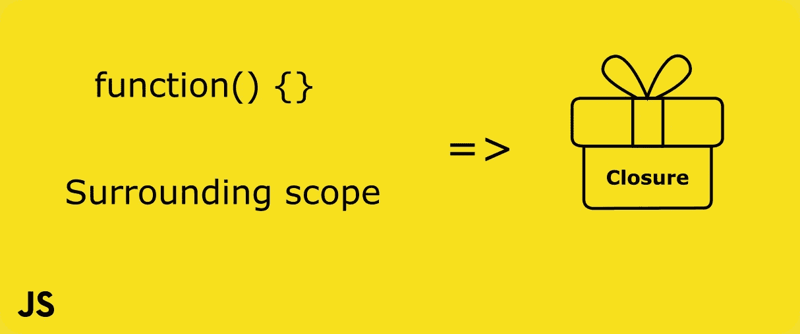
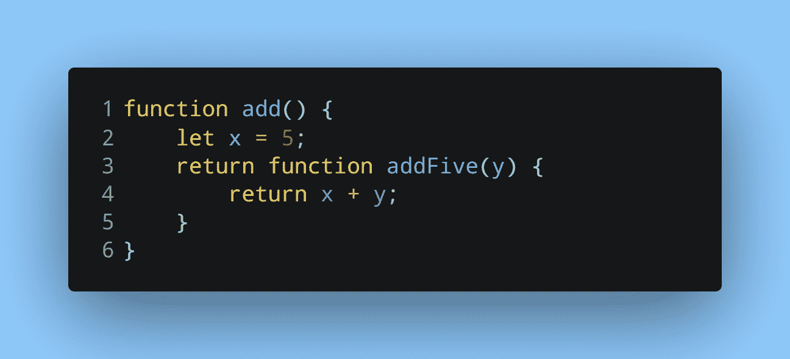
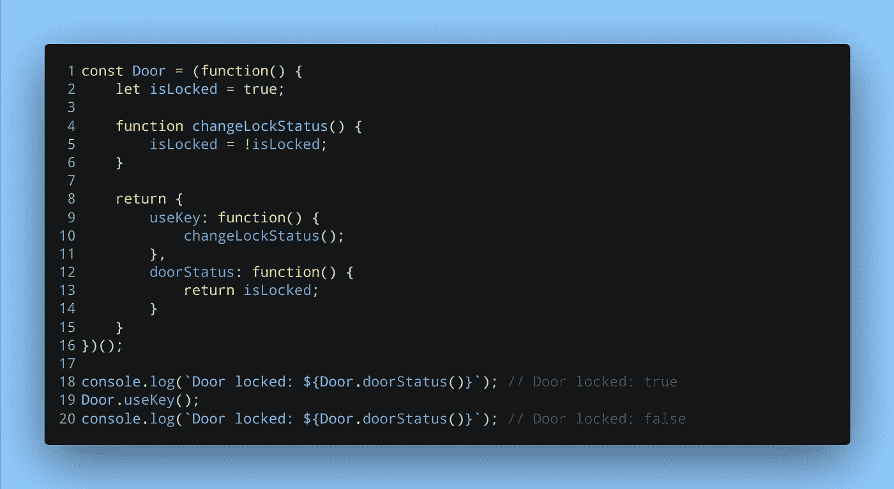

# 闭包是如何让私有变量在 JavaScript 中成为可能的？

> 原文：<https://javascript.plainenglish.io/how-do-closures-make-private-variables-possible-in-javascript-e4c0adf3f64b?source=collection_archive---------10----------------------->

能够实现私有变量和方法对于限制对代码的访问非常有帮助。通过使一个变量私有，它限制了可以改变它的代码的数量。在 JavaScript 中有几种方法可以实现私有变量和方法。其中一种方法是使用闭包。

# 什么是终结？

闭包是一个功能与其周围状态的组合。这意味着我们可以从函数内部访问定义函数的作用域。让我们看一个简单的例子:

An example of a closure

这里我们有一个外部函数`add`和一个内部函数`addFive`。将`add`赋给变量将返回内部函数`addFive`。

Executing closure example

调用变量并传递一个数字将执行`addFive`。起初，访问`x`似乎是不可能的，因为`x`属于已经执行完毕的外部函数的范围。但是，因为函数`addFive`形成了一个闭包，所以它还可以访问声明它的环境或范围(也称为词法环境)。

如果一个函数形成了一个闭包，它可以访问父/外部函数中声明的变量和函数，即使是在父/外部函数完成执行之后。这个原则允许我们实现私有变量。

# 实现私有变量

在 JavaScript 中，私有变量本身是不可用的。但是知道了闭包是如何工作的，我们可以模仿它们。

Implementing private variables

这个例子应用了我们在上一节中看到的概念。一个 IIFE(立即调用的函数表达式)被分配给常数`Door`。IIFE 立即执行，并用两个方法返回一个对象。这个返回的对象在其词法环境中有一个函数和一个变量。

生命结束执行，所以变量和函数都不能从外部访问。只有返回对象中的两个方法可以访问它们，因为它们形成了闭包。

*原载于* [*我的博客*](https://niharraoteblog.netlify.app/javascript-closures) *。*