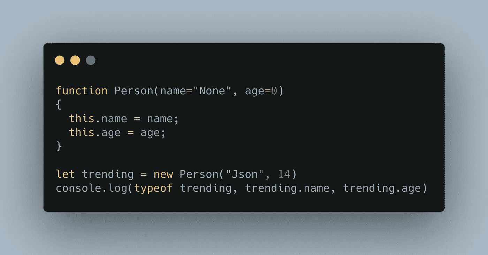
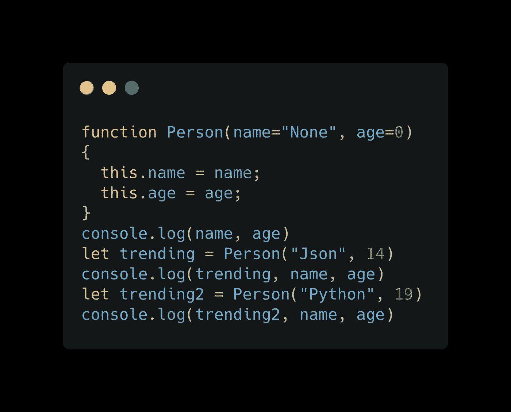
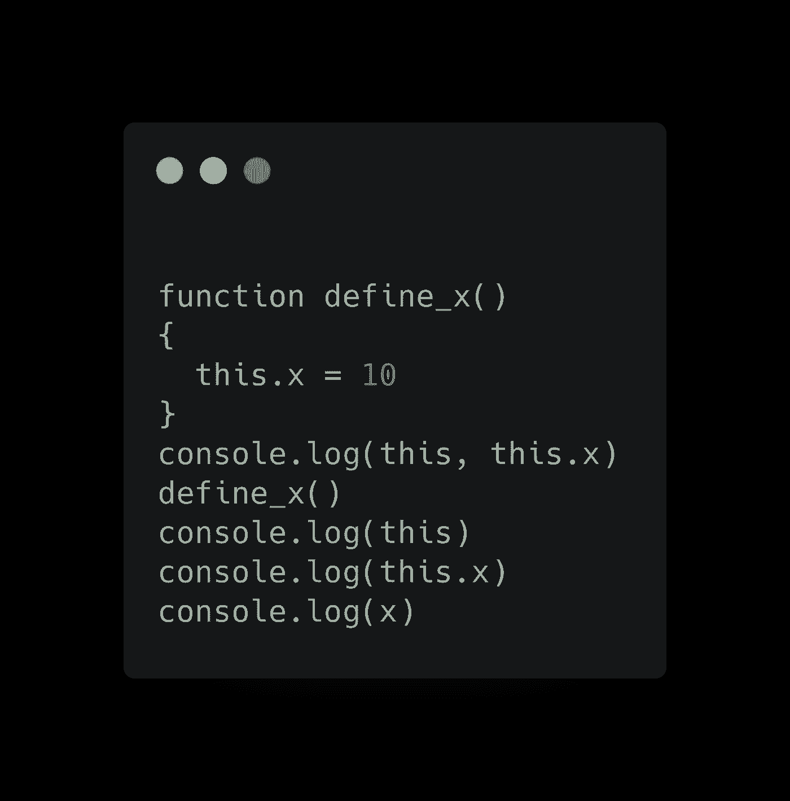
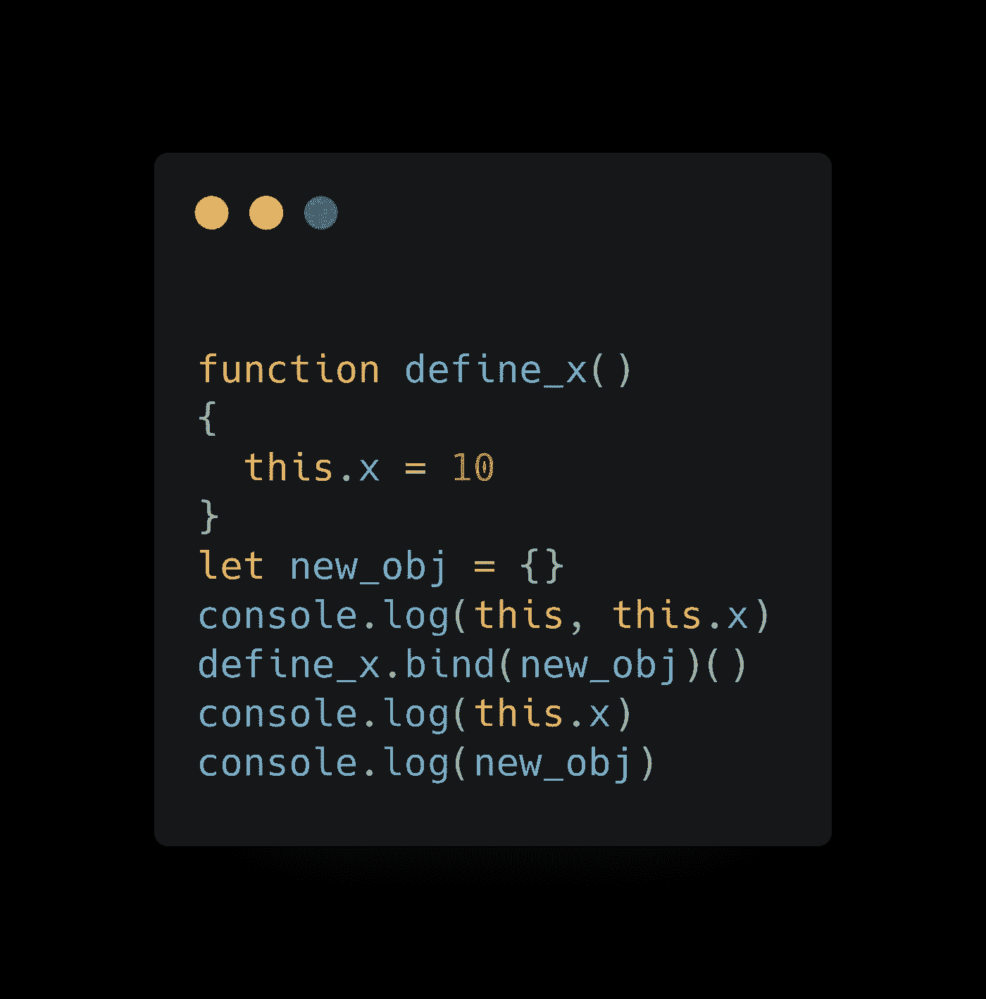
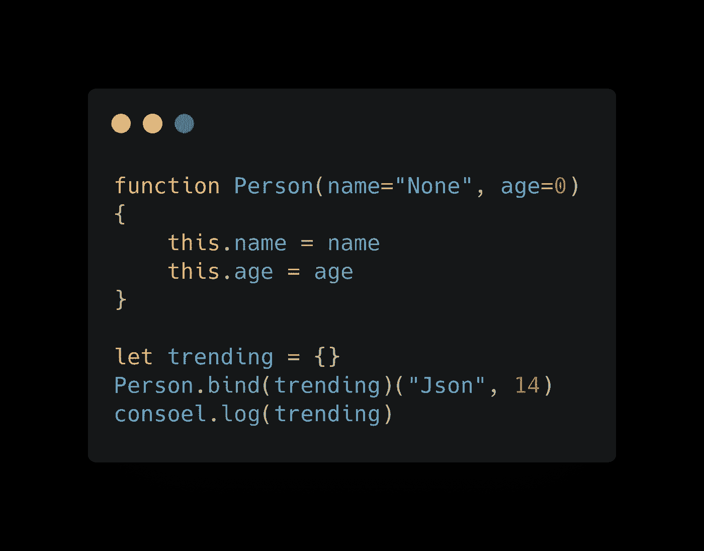

# JavaScript 中的构造函数是如何工作的？

> 原文：<https://javascript.plainenglish.io/how-do-constructor-functions-work-in-javascript-408c1fe4c196?source=collection_archive---------16----------------------->

在 JavaScript 中创建新对象的许多方法之一是使用构造函数。

这里有一个例子。

我们有一个简单的函数，名为“Person ”,它接受姓名和年龄，如果用 new 关键字调用，则返回一个带有姓名和年龄的新对象。但神奇的是，我们运行一个函数并得到一个对象，即使这个函数不返回任何东西。神奇之处在于“新”的力量。不过，在此之前，让我们先来探索一些其他现象。

## 如果我们只运行没有' new '关键字的函数会发生什么？

在这里，我们首先打印姓名和年龄，正如你可能想象的那样，答案将是未定义的，因为我们没有通过这些标识符定义任何东西。而我们的假设为真，第一个日志的输出是``undefined, undefined``。

但是当我们调用函数 Person，将它的返回值存储在一个名为 trending 的变量中时，突然就定义了名字和年龄。

如果你第二次尝试记录姓名和年龄，你不会再次得到 undefined，而是得到 undefined，JSON 和 14；这两个变量被定义了。这肯定与职能人员正在做的事情有关。为了确保这一点，这次让我们用不同的参数运行 Person 函数，看看会发生什么。

如果我们改变函数的参数，一切仍然工作，变量仍然被定义，但它们的值已经改变为新的参数，所以现在我们非常确定变量定义与函数调用有关，函数正在做一些有趣的事情来实现这一点。所以让我们更深入地研究一下这个函数，看看它在做什么。

这个函数只有两行长，它只是将 name 参数放入 this.name 中，将 age 参数放入 this.age 中，那么运行这个函数如何在函数之外定义两个变量，就像使用 let、var 或 const 关键字定义它们一样。

嗯，这与 JavaScript 如何处理作用域以及它指的是什么有关。

为了说明这一点，让我们看一个简单的例子。

在这段代码中，我们首先打印 this 和 this.x。因为我们在全局范围内，这将引用全局对象。根据 JavaScript 环境的不同，它可能是 window(对于浏览器)或 globalThis(对于 node)。在里面，你可以看到有多种类型的键-值对，但是没有键 x，所以你可能已经猜到了，试图打印这个，x 只会打印未定义的。

但是当你运行 define_x 函数时，会发生一些事情。如果你看到“this”的值，紧接着你可以看到有一个值为“10”的键“x”，这意味着函数能够从全局对象中改变一些东西。所以每当一个普通的函数被调用时，一个对象被绑定到它，这个对象可以被函数中的“this”引用。默认情况下，如果您在全局范围内，那么每当调用一个函数时，将绑定到这个函数的对象就是全局对象。在这种情况下，define_x 正在访问全局对象并添加 x 和 10 的键值对，之后你可以访问 this.x，但你不一定要做' this.x '，如果你只是做' x '，它会在全局对象内部查看。

现在我们明白了 Person 是如何创建这两个新变量的，但我们实际上想要的是创建一个具有这些属性的新对象，那么有没有办法改变函数内部的含义呢？

## 如果我们将一个函数绑定到另一个对象会发生什么？

这里，即使在函数被调用之后，打印 this.x 也会给出 undefined，因为我们将函数绑定到了其他东西。因为每个函数都继承自函数原型，所以所有函数都有类似 bind 和 call 的属性。我们在这里做的是，在调用函数之前，我们用不同的对象 new_obj 绑定它。

它给了我们一个新的函数，这个函数被绑定到这个对象上(在这个例子中是 new_obj)，然后我们运行它，这样 this.x = 10 在这个函数中，将引用新绑定的对象。而且我们可以通过运行 console.log(new_obj)看到这是怎么回事，new_obj 有属性 10，但是全局对象没有。出于同样的原因，我们可以创建一个新的人，而不实际使用 new 关键字，而是将函数绑定到一个新创建的新鲜对象。

以下是方法:

但是如果我们都明白 new 在做什么，为什么不直接使用它；它将自动创建对象，并为我们绑定，这给我们实际构造函数的感觉，而实际上它所做的是创建一个从对象原型继承的新对象，然后将其绑定到 Person 函数，然后运行 Person 函数。

*更多内容看*[***plain English . io***](http://plainenglish.io)