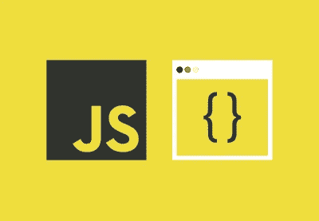
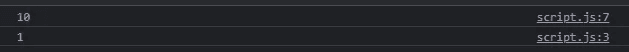
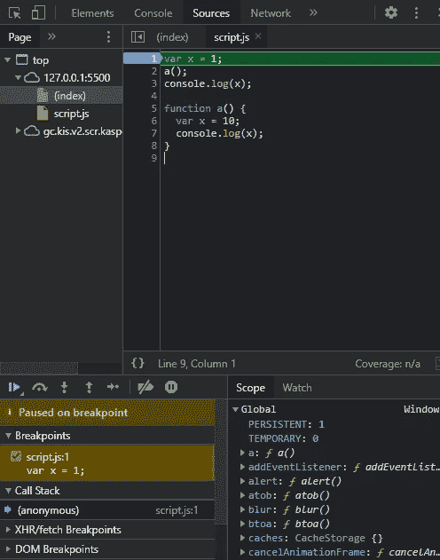
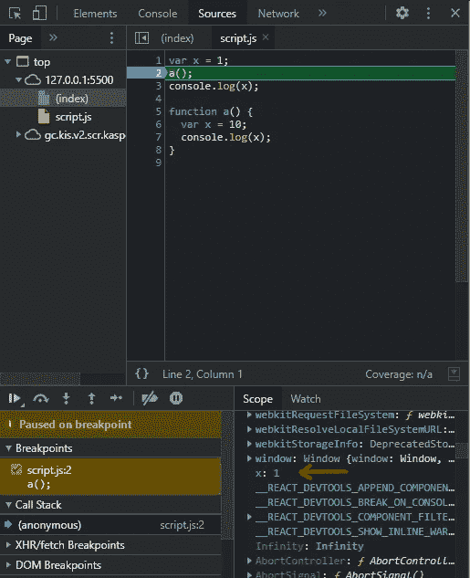
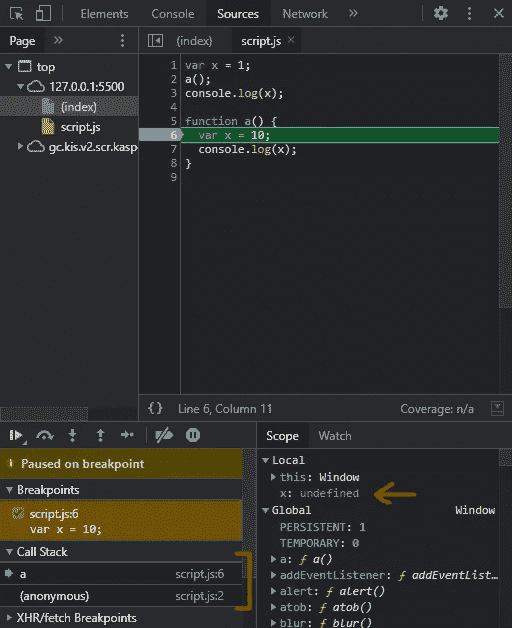
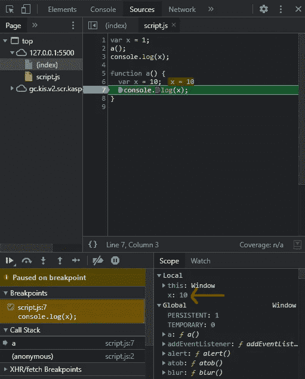
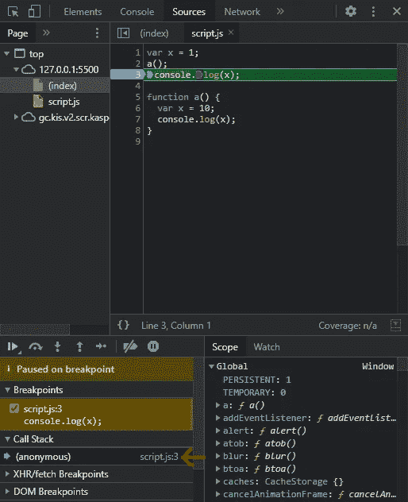
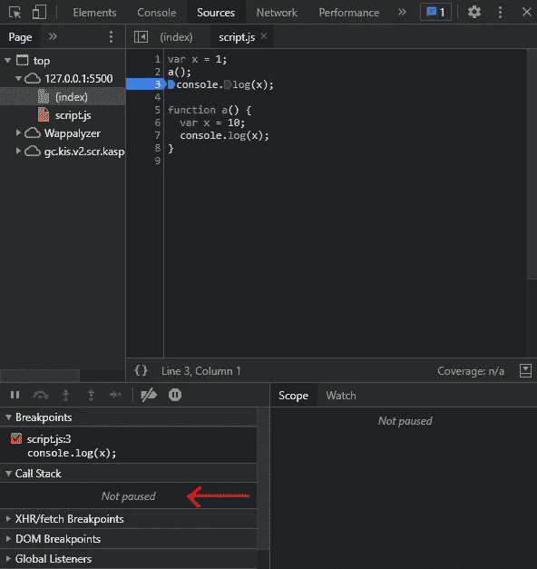

# JavaScript 中函数和变量环境是如何协同工作的？👀

> 原文：<https://javascript.plainenglish.io/how-do-functions-and-variable-environment-work-together-in-javascript-f3ce1f55863d?source=collection_archive---------11----------------------->



我知道你以前也使用过函数。但是你真的知道 JavaScript 中的函数是如何工作的吗？

# JavaScript 如何对待函数和可变环境？

让我们一起找出答案…

下面我们有一个非常小的简单程序。是的，这将在阅读的几分钟内让你大吃一惊。

```
var x = 1;
a();
console.log(x);

function a() {
  var x = 10;
  console.log(x);
}
```

请打开开发人员控制台，并使用键盘快捷键 Ctrl+Shift+J(在 Windows 上)或 Ctrl Option J(在 Mac 上)。在 console 选项卡中，一旦 JavaScript 运行上述程序，您将能够看到这一点。



到目前为止，你所做的一切都可能是你已经知道的事情。但真正的乐趣才刚刚开始。

让我们在第 1 行放置一个调试器。



在这里，JavaScript 为程序创建了一个全局执行上下文。它已被推入调用堆栈，控件位于第 1 行。

哦，等等！你不知道什么是*全局执行上下文*？然后继续读下去…

全局执行上下文有两个组成部分。

1.  可变环境阶段也称为记忆阶段。

2.代码执行阶段。

在变量环境阶段，JavaScript 为变量和函数分配内存。对于变量，它分配关键字' undefined ',对于函数，它分配它的函数体本身作为内存。

在代码执行阶段，JavaScript 按顺序执行程序行。

现在这个问题已经解决了，请继续阅读…

因为控件在第 1 行。JavaScript 将“未定义”分配给变量“x”和函数 a()，它已经分配了其函数体。

现在让我们将调试器放在第 2 行，并单击调试器播放按钮。



现在执行了第 1 行，JavaScript 将值 1 分配给变量 x。

现在让我们将调试器放在第 6 行，并单击调试器 play 按钮。



这里 JavaScript 为函数 a()创建了一个新的执行上下文。这已被推送到调用堆栈。现在控制权交给了一个()。这还没有结束。JavaScript 还专门为函数 a()创建了一个新的本地内存和全局内存。

至于内存阶段，JavaScript 将关键字“undefined”分配给函数 a()的本地内存中的变量。

现在让我们将调试器放在第 7 行，并单击调试器 play 按钮。

JavaScript 在本地内存中查找变量 x，并将值‘10’分配给变量 x。



现在让我们将调试器放在第 3 行，并单击调试器播放按钮。



您可以注意到，在调用堆栈中，刚刚弹出了函数 a()的执行上下文，现在控件在第 3 行返回到全局执行上下文。

如果你现在打开控制台标签，你会看到下面一行。


现在最后一次点击调试器播放按钮。



JavaScript 运行剩下的程序。它在全局内存中查找变量 x，并将值“1”分配给变量 x。现在，它在调用堆栈中完成了全局执行上下文。现在，全局执行上下文刚刚从堆栈中弹出。调用堆栈现在是空的。

转到控制台选项卡，您会看到下面几行。


这就是 JavaScript 中函数和变量环境的协同工作方式。

你没有被吹走吗？

哈哈！我知道这一切都很棒。

如果你做到了这一步，那么恭喜你！您刚刚了解到:

*   如何在控制台中使用调试器？
*   JavaScript 如何处理函数和可变环境。
*   调用堆栈如何工作。
*   函数调用是如何在幕后发生的。

如果你从这个博客中学到了什么，那么请留下一个赞，并评论你对这个博客的感受。

*更多内容看*[***plain English . io***](http://plainenglish.io/)