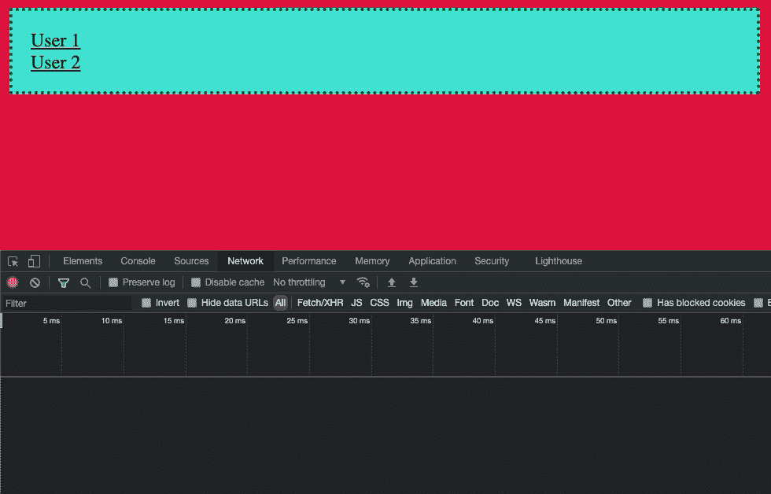
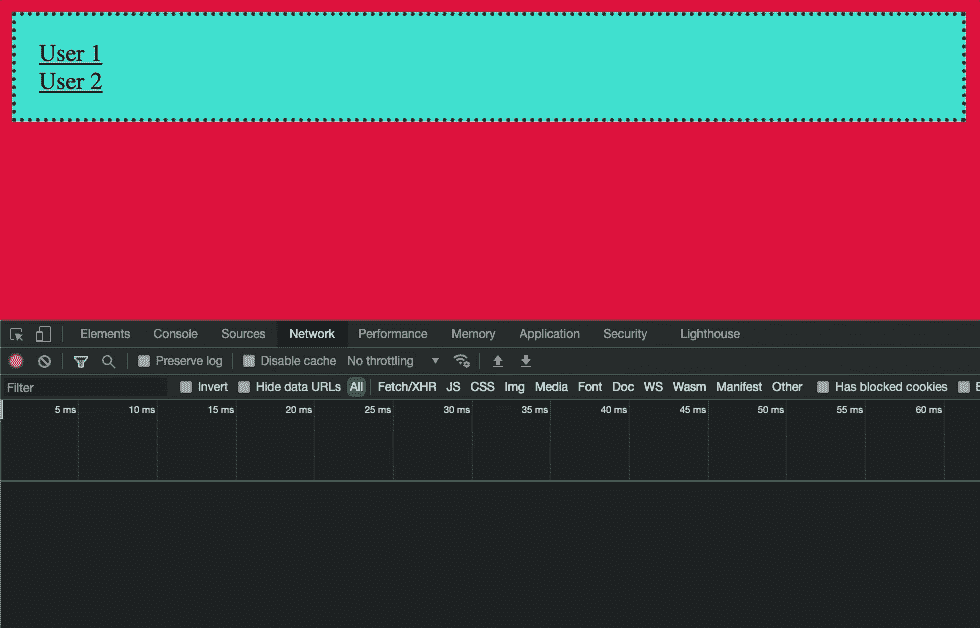

# 你是怎么清理 RxJS 科目的？

> 原文：<https://javascript.plainenglish.io/how-do-you-clean-the-subjects-in-rxjs-298bf129d3bb?source=collection_archive---------1----------------------->

## 使用 RxJS 发现更好的代码模式

## 使用可重置主题重置缓存

在所有的 bug 中，缓存问题占据首位。如果出于某种原因，你没有修复与缓存相关的错误，那么你是幸运的。这经常发生在你使用 RxJS 主语的时候，尤其是`BehaviorSubject`或者`ReplaySubject`。

在本文中，我们将尝试解决这类问题。此外，我们将为这样的需求开发一个新的主题。所以如果你感兴趣，请继续关注！

# #我们要解决什么问题？

假设我们将 RxJS 与 Angular 一起使用。首先，从路由中读取参数，并将它们存储在主题中。其次，用户离开了 URL，Angular 破坏了组件。不考虑组件的析构，服务还没有像父组件中提供的那样被析构。因此，先前存储的值保留在其中。除非你用最初的那个清理过。最后，一旦用户用不同的路由参数打开同一个组件，从主题发出的第一个值将是一个缓存值。此外，如果没有`switchMap`操作符，您可能会因为竞争条件而得到错误的数据。

这个问题在现实世界中是这样的:

您可能会注意到，从第二个请求开始，有两个请求。两个请求中的第一个请求中的用户 id 来自缓存。

## 我们从这段代码开始

在组件中，我们从`paramsMap`中读取`userId`，并将其存储在服务中。就在我们用它加载用户信息之后。

服务负责存储`userId`并提供可观察值，职责是加载用户详细信息。

`UserModel`简单表示用户详细信息。

现在，让我们试着解决这个问题。

# #解决方案是什么:

首先，让我们用一个`ResettableSubject`来看看它的运行情况:

按预期工作。

在服务中，我们进行了以下更新:

*   我们把`mergeMap`改成了`switchMap`
*   我们使用自定义主题— `ResettableSubject`而不是`ReplaySubject`
*   我们添加了一个`resetUserId`方法来清理服务中的`userId`

在组件中，我们只添加了一行来重置`userId`:

# #可重置主题

最后一段代码是我们的`ResettableSubject`:

它增加了将主题值回滚到初始状态的能力。因此，我们不再需要跟踪缓存的值。

# #其他可能性

还有其他选项来实现缓存清理模式。例如，我们可以使用工厂函数来代替使用`ResettableSubject`。

这里有一个简单的概述:

# 进一步阅读

如果你对 RxJS 感兴趣，这里还有几篇文章，你可以从中找到自己感兴趣的东西:

 [## 可观察和/或相对承诺的最终指南(+RxJS7)

### 在这篇文章中，你将全面了解承诺与可观察到的东西有什么不同。我们将尝试覆盖…

obaranovskyi.medium.com](https://obaranovskyi.medium.com/the-ultimate-guide-to-observables-and-vs-promises-rxjs7-296877376668)  [## 这是使用 RxJS 重新加载数据的最简单的方法

### 大多数时候，我们必须从服务器加载数据。为了执行操作，客户端通常会发送请求以及…

obaranovskyi.medium.com](https://obaranovskyi.medium.com/rxjs-data-reload-pattern-with-custom-operators-factory-functions-b929a2103dd8) 

# 结论

我希望你和我一样喜欢它。如果你喜欢这篇文章，或者你学到了新的东西，请点赞并订阅。

*更多内容看* [***说白了. io***](http://plainenglish.io/) ***。*** *报名参加我们的* [***免费每周简讯这里***](http://newsletter.plainenglish.io/) ***。***