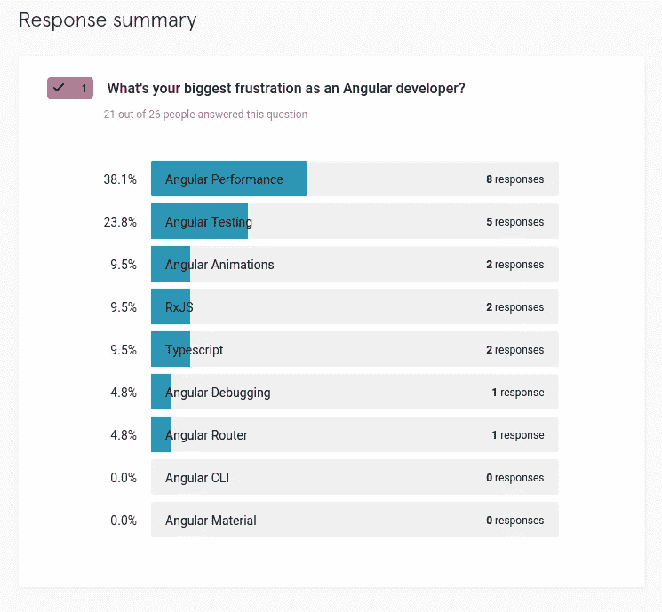
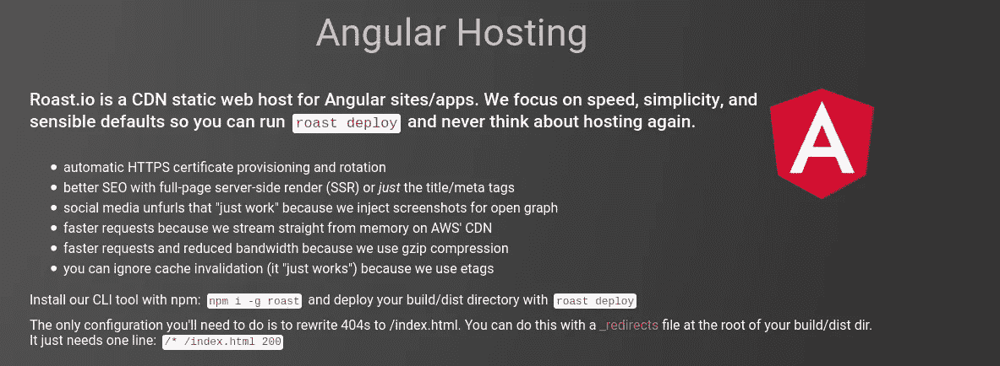
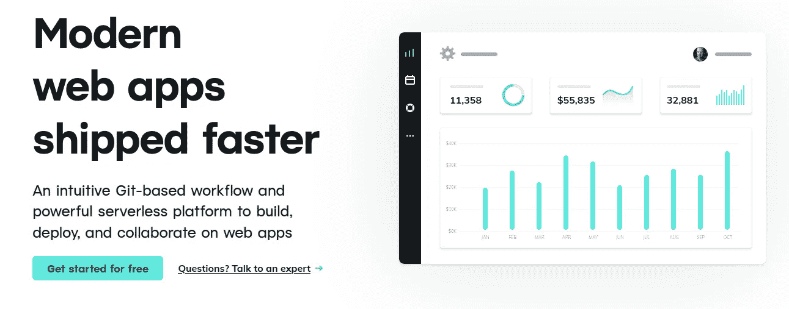

# 你是如何加速你的 Angular App 的？

> 原文：<https://javascript.plainenglish.io/how-do-you-speed-up-your-angular-app-%EF%B8%8F-8da9ca28f66a?source=collection_archive---------1----------------------->

## 以下是如何解决角度性能问题并优化您的角度加载时间。


Photo by [Tudor Baciu](https://unsplash.com/@baciutudor?utm_source=medium&utm_medium=referral) on [Unsplash](https://unsplash.com?utm_source=medium&utm_medium=referral)

角度性能是一个常见问题。这可能是棱角最大的弱点。我哪里知道？

我最近调查了几十个 Angular 开发人员，询问他们对 Angular 最大的不满。这是他们告诉我的。



更不用说我最近读到的一篇文章，是一位 Angular 顾问写的，他在文章中解释了他如何优化一个几乎花了整整一分钟加载的 Angular 应用程序。没错。一个。整体。一分钟。

想想吧。你花了这么多时间来构建一个有棱角的应用，但是一旦它投入生产，人们就开始抱怨它太慢了。


这显然是一个夸张的例子，但角度性能问题是真实的。

更不用说沮丧的 Angular 开发人员，当他们的老板要求一个性能更好的 Angular 应用程序时，他们不知道从哪里开始。

你如何避免这种情况？你如何优化你的角度应用？如何提高角度应用的性能？并解决角度性能问题？

除了雇佣一个角度顾问来帮助你之外，这里有一个深入的指导来改善和优化你的角度性能，并确保它的加载速度惊人。每一个。单身。时间。

[](https://school.danielk.tech/course/unleash-your-angular-testing-skills?utm_source=medium&utm_medium=banner&utm_campaign=unleash_testing_skills)

# 什么是加载性能和运行时性能？

当我们谈论修复 Angular 性能并使我们的 Angular 应用程序更快时，有两个不同的领域需要解决和改进。让你的 Angular 应用**快速加载**和让它**快速运行**是有区别的。这就是加载性能和运行时性能之间的差异。

本指南重点介绍如何让你的 Angular app **快速加载**。

但是，如果你需要优化你的运行时性能，让你的 Angular 应用**运行得更快**，你可以考虑各种角度优化，比如[使用 trackBy 函数来提高性能](https://danielk.tech/home/use-trackby-to-improve-angular-performance)。

或者[建造一个快速运行的角管](https://danielk.tech/home/how-to-build-a-fast-angular-pipe)。

以及[调整 Angular 的变化检测设置，以避免不必要的变化检测周期](https://danielk.tech/home/heres-how-you-can-improve-angular-change-detection-performance)。

如果您怀疑 API 调用可能会阻碍您的 Angular 运行时性能，那么这里有[如何监控您的 HTTP 调用](https://danielk.tech/home/angular-http-logging-how-to-monitor-the-slowness-of-your-angular-app)的速度。

现在我们已经了解了加载性能和运行时性能之间的区别，我们如何改善它呢？

# 开始:这就是为什么你必须分析角载荷时间。

提高 Angular 应用程序性能的第一步是测量在浏览器中加载和引导需要多长时间。

为什么？

一些开发者知道他们需要优化他们的 Angular 应用程序，但是他们不知道要优化多少或者从哪里开始。因此，他们对代码或构建配置进行这些疯狂的尝试，然后刷新应用程序，看看它是否比以前加载得更快。这种优化方法只不过是一场小丑表演，应该受到各种各样的批评。这就像在没有必要的量杯的情况下试着烤一个蛋糕。或者在泰坦尼克号沉没前重新摆放甲板上的椅子。

那么更聪明的方法是什么呢？

测量。测量。测量。

不知何故，我们作为开发人员并不总是注意到会打扰用户的额外的一两秒钟。至少这是我的经历。

例如，我的一个开发伙伴是 Django 开发人员。他一直坚持说他的 Django 应用比我的 Angular 应用快。当我们在一起时，他会拿出一个浏览器，向我展示它有多快，我的 Angular 应用程序有多慢，直到我们开始使用浏览器的开发工具**实际计算毫秒**。在对我的 Angular 应用程序和他的应用程序进行性能分析后，我们发现它们的平均加载时间差不多。

显然，我朋友的内部计时器没有正确计数，这证明了为什么开发人员必须仔细分析他的 Angular 应用程序的性能，并准确知道加载它需要多少毫秒。通过计算加载 Angular 应用程序所需的毫秒数，您将能够准确地知道在尝试优化时，加载速度和性能提高了多少。是的，**计算毫秒**。

# 如何减小有角度的束尺寸？

有各种各样的调整和疯狂优化动摇树的东西在网上到处浮动，关于如何减少你的 Angular 编译应用程序的大小。

一些建议的性能调整令人印象深刻，比如[这个关于使用 Google Closure 编译器将 Angular 应用的大小减少了 2.5 倍](https://blog.mgechev.com/2016/07/21/even-smaller-angular2-applications-closure-tree-shaking/)，我很高兴其他人已经做出了努力来减少几 KB。但是我发现很多建议就像踢一头死驴——尤其是如果你的 Angular 应用程序设计得很差的话。

那么如何设计你的 Angular app 才能执行得更快呢？

**除非我没猜错，对于每 10 个 Angular 项目中的 8 个来说，缩减 Angular 应用程序的大小并使其加载更快的最快和最简单的方法是将你的主** `**AppModule**` **分成更小的模块，并在你选择的时候延迟加载其他模块。**

换句话说，确保你的`AppModule`尽可能小。将你不需要的东西模块化，然后延迟加载，因为延迟加载有助于保持 Angular 应用程序的初始大小更小，并有助于更快的角度加载性能。

# Angular 应用程序的快速托管选项？

当你把你的 Angular 应用程序恰当地分割成懒惰加载的模块后，下一个最好的步骤是什么？

部署到快速的全球 CDN。

以及最快的角度托管选项有哪些？哪里可以托管你的 Angular app，保证最快的加载速度？

这里列出了 3 个不同的主机选项，专门支持 Angular。这不是一个全面的列表，但每一个有角度的主机选项

*   有一个免费层，允许您开始和发展。
*   使用您的 Angular 应用程序也部署的全球 CDN。
*   是我成功使用的托管解决方案。换句话说，我知道我在推荐什么。



如果你想在 bake . io 上开始烘焙一个 Angular 应用，那么这里有一个[Angular 应用入门指南](https://www.roast.io/for/angular)。

# 网络生活



想要在 Netlify 上部署 Angular 应用程序吗？[下面介绍如何入门](https://www.netlify.com/blog/2019/09/23/first-steps-using-netlify-angular/)。

# Firebase 托管

Firebase Hosting 是由 Google 创建的托管服务。如果你想知道更多的信息，下面是如何在 2021 年将 Angular 应用部署到 Firebase 主机上的方法。

# 在 Brotli 的支持下推出我们自己的 Nginx 服务器

但是如果你有自己的服务器，有像数字海洋这样的 VPS 呢？而宁愿不部署到 CDN？

那么 Brotli 是来帮你的。

Brotli 是谷歌开发的一种压缩算法，被认为是 T2 gzip T3 的继任者。我看到它为 Angular 应用程序减少了整整 1000 毫秒甚至更多的加载时间。

如果你使用预先支持的托管解决方案，如 Firebase 托管，微软 Azure 托管，或我上面提到的另一个选项，那么你就不走运了。但是如果你有自己的服务器，可以调整和定制，那么你可以在 Brotli 的支持下编译 Nginx。

为什么要从源头编译？

因为 Nginx 不是在 Brotli 支持下构建的。你得用谷歌的 Nginx Brotli 模块。

但好消息是我有一个剧本可以帮你完成这项工作。

在这里。

```
#Install deps
sudo apt install unzip zlib1g-dev libpcre3-dev libssl-dev brotli -Y

# Pull nginx
mkdir /tmp/nginx-brotli
cd /tmp/nginx-brotli
wget http://nginx.org/download/nginx-1.18.0.tar.gz
tar -xvf nginx-1.18.0.tar.gz 

# Pull brotli module
git clone https://github.com/google/ngx_brotli.git
cd ngx_brotli
git submodule update --init

# Build nginx
cd ../nginx-1.18.0
./configure --add-module=../ngx_brotli

./configure --sbin-path=/usr/local/nginx/nginx --conf-path=/usr/local/nginx/nginx.conf --pid-path=/usr/local/nginx/nginx.pid --with-http_ssl_module --with-http_v2_module  --add-module=../ngx_brotli 
make
sudo make install
```

# 结论

Angular 是一个快速发展的框架——这也是我喜欢 Angular 的原因之一——它是由一大群想知道 Angular 开发人员有哪些挫折的人构建的。Angular 团队已经为改进 Angular 应用程序的规模和 Angular 的性能付出了很多汗水，我希望他们会继续这样做。

如果你喜欢这篇文章，并发现它很有用，请随时点击“鼓掌”按钮，并关注我，获取更多像这篇文章一样的酷文章。

**关注我:** [GitHub](https://github.com/dkreider) ，[中型](https://dkreider.medium.com/)，[个人博客](https://danielk.tech)

[](https://school.danielk.tech/course/unleash-your-angular-testing-skills?utm_source=medium&utm_medium=banner&utm_campaign=unleash_testing_skills)

*最初发布于*[*https://danielk . tech*](https://danielk.tech/home/improve-angular-load-performance)*。*

[*更多内容看 plainenglish.io*](http://plainenglish.io/)