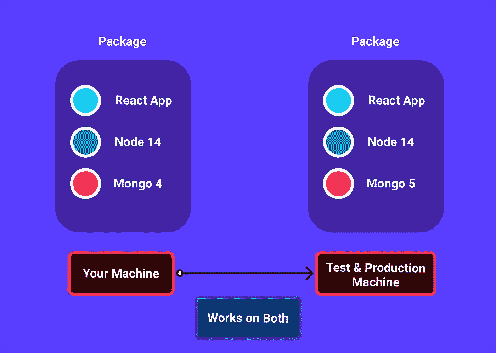

# Docker 是如何工作的，为什么开发者需要它

> 原文：<https://javascript.plainenglish.io/how-docker-works-why-developers-need-it-81b1eebaab5e?source=collection_archive---------14----------------------->

## Docker 入门

# Docker 是什么？

> 构建、运行和发布应用程序的平台。

Docker 是一个开源的容器化平台，使开发人员能够将应用程序打包到容器中，将应用程序源代码与在任何环境中运行该应用程序所需的**操作系统、** **库**和**依赖关系**结合起来。Docker 在开发人员中如此受欢迎的原因是，它使应用程序的生产工作流保持一致，这样一个开发团队就不必围绕一堆依赖项来使东西在其他机器上工作。

***例如，*** 假设您有一个生产就绪的应用程序准备发布，但是由于以下原因，您的应用程序无法在其他机器上运行。

*   **目标机器上的软件版本不匹配。**
*   **缺少依赖项。**
*   **不同的配置设置(e *环境变量)*。**

使用 Docker 可以很容易地解决这些问题，因为所有的东西在工作的时候都在那里。

***比如，*** 比方说你的 **React** 应用使用**节点版本 14** ， **MongoDB 版本 4** 。例如，当您的应用程序必须在一台测试机器上运行时，它可能没有所需依赖项的相同版本，这会中断您的开发工作流。

但是有了 Docker，使用你的应用程序包，你可以在任何地方运行它而不会有任何问题。

> ***Docker*的一个好处是，当我们完成构建我们的应用程序时，我们可以简单地删除所有被不同应用程序使用的依赖工具&，而不会阻塞我们的主开发机器。****

# *容器与虚拟机*

**

## ***虚拟机***

*您可以称之为物理机的抽象，其中虚拟机需要所有的物理硬件，因为我们可以在一台真实的机器上运行几个虚拟机。*

*   ****例如*** ，在 Mac 上，你可以使用一个虚拟机，使用**虚拟机管理程序****VM Ware**&**Virtual Box】****Windows&*Linux*，在这里你可以使用多个虚拟机独立运行多个不同的应用。***

**

*   *但虚拟机的问题是，它们需要 ***一个成熟的操作系统*** 来运行我们的应用程序，而且它们使用主机的一部分硬件，这使得它们在执行 ***资源密集型*** 任务时速度很慢。*

## ***容器***

*说到 ***容器*** ，它们比虚拟机要好得多。因为它们允许我们在非常轻量级的同时独立运行多个应用程序，因为在容器的情况下，我们不需要完整的操作系统(使用主机的操作系统)。*

*   *此外，它们比虚拟机快得多，因为它们只使用主机的一小部分。在容器的情况下，我们不必为我们的 ***CPU*** 和我们的机器的 ***内存、*** &提供单独的**内核**这就是我们可以在一台机器上运行数百个容器而不会出现任何问题的原因。*

# *码头建筑*

**

*Docker 使用客户端-服务器架构，其中 Docker C *客户端*与*服务器* **(Docker 引擎)**对话，后者用于构建和分发 Docker 容器。Docker 客户端和服务器通过 **UNIX** 套接字或网络接口使用 **REST API** 。*

> *在引擎盖下，有很多事情你必须知道，坦率地说，你不必为了使用 Docker 而理解它们，你所需要知道的是当一个应用程序被 Docker 化时，Docker 是如何工作的。*

*   *要对应用程序进行 Dockerize，我们只需添加一个 **Dockerfile** (注意 Dockerfile 中没有使用扩展名)。Dockerfile 只是一个包含运行应用程序的几个指令的纯文本文件，之后我们的应用程序文件被转换成一个**映像**，Docker 使用它在容器内独立运行应用程序。*
*   *这个 I *mage* 包含了我们的应用程序运行所需的一切，比如一个**运行时环境*(节点)*** ，**所有的应用程序文件**，**第三方库，环境变量。***

**

*   *一旦我们有了 ***映像*** ，Docker 就用它来启动一个容器，我们的应用程序被加载到机器上的一个容器中本地运行。*

* [## 您应该订阅的 7 份编程简讯

### 作为程序员，你应该看看时事通讯

javascript.plainenglish.io](/7-developer-blogs-you-need-to-subscribe-as-a-code-newbie-b004ebc6dcf8)  [## 在 4 分钟内解释 4 个关键 CSS 属性

### 基本 CSS 入门

javascript.plainenglish.io](/4-key-css-properties-explained-in-4-minutes-9567d1b5af86)  [## 作为一名程序员在生产力上苦苦挣扎？试试这 9 个工具

### 程序员的关键生产力提升工具，确保工作流程顺畅。

javascript.plainenglish.io](/9-super-productivity-tools-for-programmers-8bb91f4fb642) 

*更多内容看*[***plain English . io***](http://plainenglish.io/)*