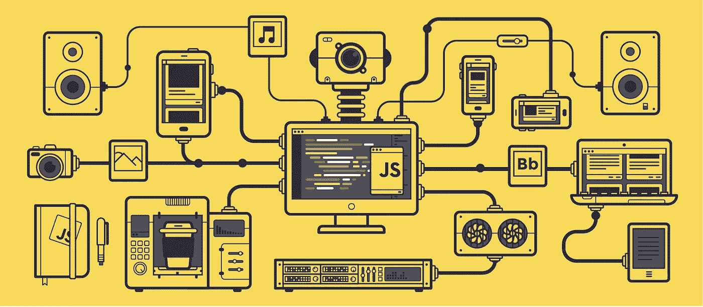
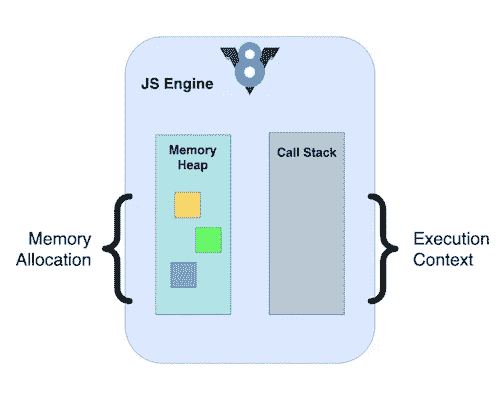
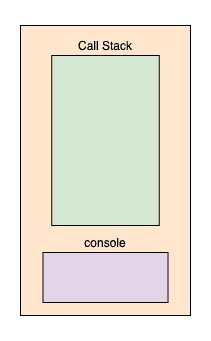
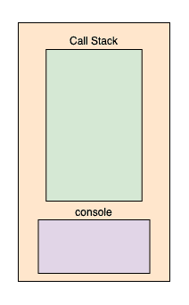
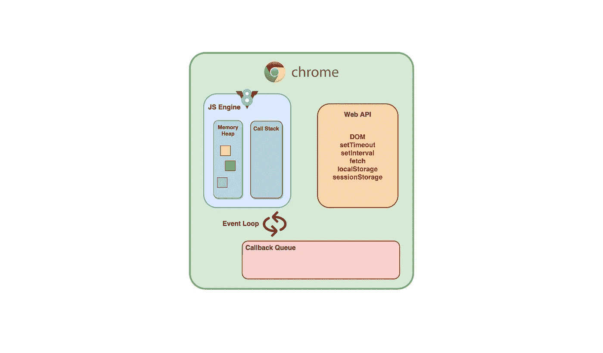
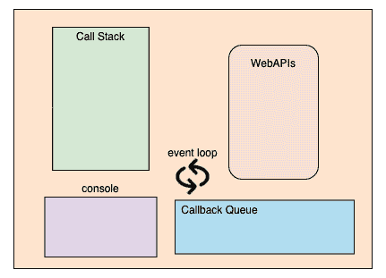
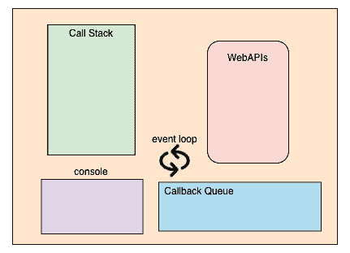

# JavaScript 实际上是如何工作的？

> 原文：<https://javascript.plainenglish.io/how-does-javascript-actually-work-under-the-hood-567f9f17b855?source=collection_archive---------7----------------------->

## JavaScript 引擎、事件循环、回调队列和 Web APIs 的概述。

Image Credits: [wall-street.com](https://wall-street.com/wp-content/uploads/2017/01/JavaScript.gif) | Edited by the author

> JavaScript 是一种高级、单线程、垃圾收集、解释或即时编译、基于原型、多范例的动态语言，具有非阻塞事件*循环。*

由于 JavaScript 是单线程语言，它一次只能执行一组指令。考虑到有许多其他语言擅长处理并发和多线程，这种执行似乎很慢。

但是单线程执行的概念只是部分正确。JavaScript 引擎作为一种执行手段可能是单线程的，但是 JavaScript 以不同的方式处理异步代码以实现并发。这是通过提供一些作为运行时环境一部分的附加组件来实现的，如事件循环、回调队列和 Web APIs，它们是浏览器或 Node.js 运行时环境的一部分。

这里我们将看看运行 JavaScript 代码时所涉及的不同组件。

# JavaScript 引擎

JavaScript 引擎是执行代码的部分。

这里列出了一些流行的 JavaScript 引擎:

*   谷歌 Chrome 浏览器和 Node.js 中使用的谷歌 V8。
*   Mozilla Firefox 浏览器中使用的 SpiderMonkey。
*   在 Safari 浏览器中使用的苹果公司的 Nitro 和 JavaScriptCore。
*   微软的 Chakra 和 CharkraCore，用于微软 Edge 浏览器。

JavaScript 引擎将您的 JavaScript 代码转换为机器语言，以便您的计算机可以执行它。

引擎的两个主要组件是堆内存(内存分配)和调用堆栈(执行上下文)。

Overview of the chrome’s V8 engine

## **堆内存**

它是引擎中为变量和函数声明分配内存的部分。

## **调用栈**

它是引擎中负责执行代码的部分。当从上到下解析代码时，它被推到调用堆栈上。由于堆栈遵循 **LIFO** 顺序，任何被推入堆栈的代码都将被执行，然后被弹出。这个过程将一直持续到每个代码块都被执行完。

任何被推入调用堆栈的同步代码都会被立即执行并弹出。但是异步代码需要一些时间来完成，所以堆栈不会等到它完成才弹出堆栈。

相反，当任何异步代码被推到堆栈上时，它将立即弹出到运行时环境提供的 Web APIs 进行处理。

**示例显示了一个简单的同步任务以及整个执行过程中调用堆栈的状态:**

Different states of the call stack for printing the result of 5 raised to the power of 4

**示例显示了一个简单的同步任务在整个执行过程中抛出一个错误以及调用堆栈的状态:**

The different states of the stack before throwing an error

# 运行时环境

JavaScript 的运行时环境可以是浏览器，也可以是已经安装的 Node.js 运行时环境。

如果代码是同步的，那么它会被立即执行。但是，如果一些代码需要更长的时间来运行，或者需要获取一些数据，或者需要一些繁重的处理，它将阻塞主线程。阻塞主线程直到所有的事情都完成了，这将导致网页停止做其他的事情。这将导致锁定页面，禁止滚动、执行进一步的指令，并且在每个任务执行之前，任何新组件的呈现都将被阻止。

JavaScript 运行时环境(包括 JavaScript 引擎)提供了一些组件，如 Web API、回调队列和事件循环，以使 JavaScript 并发。让我们详细讨论每一个问题。

An overview of the runtime environment including the JS engine

## **Web API**

大多数可能需要一些时间才能完成的异步任务将被推到调用堆栈上，然后立即弹出到运行时环境的 Web APIs 部分。

浏览器提供的一些具有异步行为的 Web APIs 是 DOM APIs、Timer (setTimeout 和 setInterval)、Fetch API，同步的是存储 API(session Storage 和 localStorage)。

你可以在这里查看所有可用的 Web API。

## **回调队列(任务队列)**

来自各种 Web APIs 的所有回调和结果都将被推送到回调或任务队列中。所有的回调/结果将被排队，稍后由事件循环移动到调用堆栈上。

V8 引擎的回调队列有一个微任务队列和一个宏任务队列。

回调、承诺、异步函数调用被归类为微任务。上述任务的优先级高于 setTimeout、setInterval、DOM 事件等。，它们被视为宏任务。

一旦 WebAPIs 处理了结果和回调，它们就被移动到各自的队列中。

## **事件循环**

事件循环是一个连续的过程，它的全部目的是查看调用堆栈是否为空。如果调用堆栈为空，它将在回调队列中查找任何排队的回调或任务，并将它们推送到调用堆栈。现在，事件循环首先选择哪个是基于它们的优先级。

事件循环首先将任务从微任务队列推到调用堆栈上，然后查看宏任务队列。这个过程一直重复，直到回调或任务队列中的所有内容都被推送到堆栈上并执行。

现在，让我们看看几个使用不同 Web APIs 的例子，以及事件循环根据回调队列中的微任务和宏任务选择了什么。

**一个示例显示了设置超时的执行顺序以及正常的控制台日志:**

Different states of the call stack with console logs and a set timeout

**一个示例，显示了设置的超时时间为零时的执行顺序以及正常的控制台日志:**

Different states of the call stack with console logs and a set timeout with 0 waiting time

在上面的例子中，即使`setTimeout()`的等待时间为 0，它也会被推送到 Web APIs 并立即移动到回调队列中，在所有同步控制台日志都打印出来后被回调。

**一个显示多个相同时间的超时以及控制台日志的例子:**

Different states of the call stack with multiple set timeouts of the same time and console logs

在上面的例子中，三个`setTimeout()`有相同的 1000 作为等待时间并被推送到 Web APIs，然后在 1000 后按相同的顺序逐个移动到回调队列，并在所有同步控制台日志打印出来后被回调。

**一个带有设置超时和异步函数的例子，该函数具有获取 API 和控制台日志:**

Different states of the call stack with a set timeout, a fetch API, and a console log

**DOM onClick 事件、setTimeout 和简单控制台日志的示例:**

Different states of the call stack with an onClick event, set timeouts and console logs

## 结论

这是 JavaScript 如何在幕后工作的概述，涉及不同的组件，如 JavaScript 引擎、WebAPIs、回调队列和事件循环。我希望这篇文章对你有所帮助。

## 参考

*   [1]JavaScript:Jeff Delaney 在 YouTube[上介绍了它是如何制作的。](https://www.youtube.com/watch?v=FSs_JYwnAdI)
*   wikipedia.org 上的 JS 发动机。
*   事件循环到底是什么？由菲利普·罗伯茨在 YouTube 上发布。

感谢阅读，祝学习愉快！

*更多内容请看*[*plain English . io*](http://plainenglish.io/)