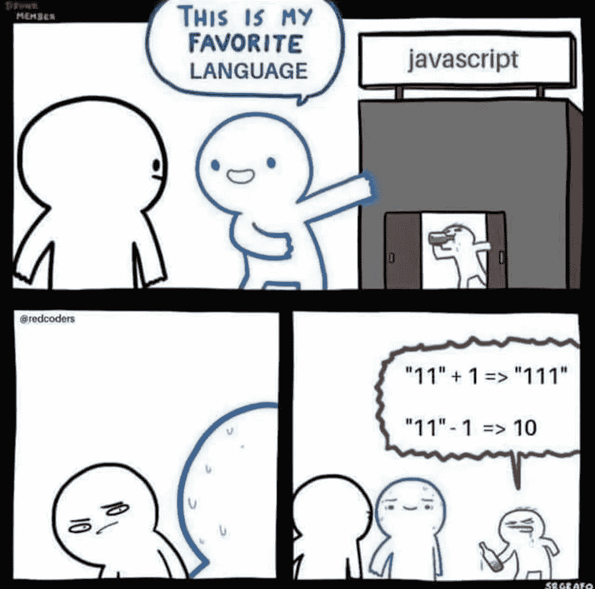
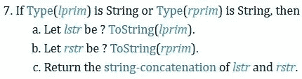
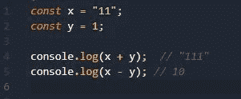
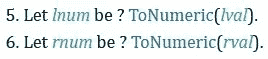

# JavaScript 中使用'+'和'-'操作符的类型强制—它到底是如何工作的？

> 原文：<https://javascript.plainenglish.io/how-exactly-and-operators-work-in-javascript-3798c4bc32c6?source=collection_archive---------13----------------------->

你可能已经看过这个迷因了。今天我们将会看到+和-在 JavaScript 中是如何处理类型强制的。让我们看看+运算符是如何工作的。

Image from [https://www.ecma-international.org/ecma-262/#sec-addition-operator-plus](https://www.ecma-international.org/ecma-262/#sec-addition-operator-plus)

ECMAScript 规范说的是，如果两个操作数中至少有一个的类型是字符串，那么+运算符将两个操作数都转换为字符串，然后进行字符串串联。

如果两个操作数的类型都是数字，那么 JavaScript 执行数字加法。

Image 1

在图 1 中，我们有 x="11 "和 y=1，这里 x 的类型是字符串。于是，x+y 变成了“11”+“1”。作为串联的结果，我们得到“111”。

现在让我们看看-操作符是如何工作的。

Image from [https://www.ecma-international.org/ecma-262/#sec-subtraction-operator-minus](https://www.ecma-international.org/ecma-262/#sec-subtraction-operator-minus)

ECMAScript 规范规定,-运算符试图将所有操作数转换为数字。所以，现在我们只剩下 11 比 1 了。数字相减的结果是 10。

*更多内容看*[***plain English . io***](http://plainenglish.io/)