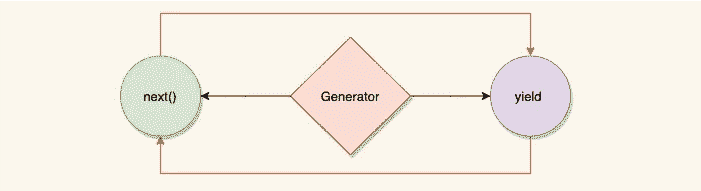

# JavaScript 中生成器的工作方式

> 原文：<https://javascript.plainenglish.io/how-generators-work-in-javascript-133264ce0161?source=collection_archive---------9----------------------->

想象一个函数的可能性，它可以在任何点停止，并且可以返回多个值，这些值是来自外部环境的有价值的输入。

生成器函数是可以生成多个值的特殊函数，对于为 **iterables** 创建数据流特别有用。

通常情况下，`return`语句会停止正常函数的执行并返回一个值，但是在生成器函数中，我们可以使用`yield`关键字来暂停函数的执行以返回一个特定的值，并且可以在以后需要时继续执行，从而返回尽可能多的值。

让我们检查一下语法:

生成器函数语法在`function`后面有一个`*****` *(星号)*符号，并且只能使用`function`关键字创建，所以没有箭头函数。我们也可以使用匿名函数语法。

说到执行这个函数，流程中的一个问题是我们只能调用这个函数一次，但是我们如何恢复并对同一个函数进行后续调用呢？

答案是生成器对象。每当我们调用该函数时，它并不执行该函数，而是返回一个带有方法`next()`的生成器对象，调用该方法可以部分执行生成器函数(如果不是全部的话):

注意，返回的每个值都包装在另一个对象中，其中的`value`属性包含返回的数据。

`done`属性表示功能是暂停还是完成。换句话说，对于每个`yield`，`done`属性返回`true`，一旦所有`yields`结束，最后一个调用返回`false`，或者带有`return`值，或者带有`undefined`。

显式`return`语句之后的所有后续`next()`调用都将返回`{value:undefined, done:true}`。

# 谢谢，下一位()

`next()`的一个神奇之处在于，它是一个与生成器功能通信的秘密网关。自己看:

我们来解码一下上面的代码执行。第一个值得注意的是作为参数传递的`sum`变量，只要函数没有被生成器对象完全执行，它就保持活动状态。

> 发生器函数的`arguments`与普通函数的工作方式相同。

一旦我们得到了生成器对象，我们调用第一个没有任何`argument`的`next()`方法。当传递给`next()`方法的`argument`是从最后一条`yield`语句中收集的时，情况总是如此。

这有点令人困惑，但请耐心等待。`next()`方法执行生成器函数的某个部分，可以传递一些值，但是我们如何收集它们呢？

这个集合正是前面的`yield`语句派上用场的地方，它充当接收在`next()`方法中传递的值的媒介。这也限制了我们向`next()`调用传递多个`arguments`，因为只有第一个`argument`会被收集。

由于第一个`next()`调用执行了没有先前`yield`语句的生成器函数部分，传递的值无法通过当前设计收集。

第二个`next()`调用被传递 40，由第一个`yield`语句收集并添加到`sum`。

第三个`next()`被传递 20，该值由第二个`yield`语句收集并再次添加到`sum`中，最终值由生成器函数返回。

因此，`next()`方法在使功能灵活和建立与外部环境的双向通信方面非常有用。

# 产量多吗？

`yield`是生成器函数中的一个灵活部分，以至于下面的生成器函数完全没问题:

`yields`是嵌套的，使得代码从最右边的`yield`开始运行，它的返回被馈送给它前面的一个，以此类推，直到你点击最后一个`yield`。

事实上，您可以使用`yield*`调用另一个生成器函数的 yields:

`yield*`基本上是将传递的生成器函数的`yields`扩展到当前的生成器函数，作为自己的函数来执行。此外，最后传递的生成器函数的`return`值由`yield*`收集，允许我们在需要时使用内部生成器函数的`return`值。

# 如何让发电机发电？

## 可重复的

生成器满足*迭代器协议*，从而使其有资格在任何对象中用作`[Symbol.iterator]`，使其成为**可迭代**。

`[Symbol.iterator]`是我们使用扩展操作符或`for...of`循环时内部调用的方法。是的，数组和字符串有内置的`[Symbol.iterator]`方法。

每当我们在一个对象上使用一个 spread 操作符时，它的`[Symbol.iterator]`被调用一次，这将返回一个对象，在该对象上调用`next()`方法，直到`done`解析为`true`值，此时迭代结束，我们得到最终结果。

所以从理论上讲，下面的对象是可迭代的:

注意，`next()`方法返回的值只有在`{done:false}`时才被接受。

生成器派上了用场，使我们编写`[Symbol.iterator]`方法变得极其容易，因为它遵循相同的协议。上述对象也可以写成:

## 自定义序列

生成器对象的原型链中也有`[Symbol.iterator]`，它返回自己的实例进行迭代，因此对于创建定制序列非常有用:

## 异步包装器

生成器函数可用于管理异步任务，因为该函数可以暂停以等待异步任务完成，然后可以继续执行其他任务。

我们可以像异步 await 函数一样编写它，但它可以比异步 await 函数更强大，因为恢复控制的函数完全在我们手中。

例如，这有助于避免相同获取调用的重复副作用，因为我们可以通过调用`return()`方法而不是`next()`方法来终止重复的生成器对象，如下所示:

这里控制权交给了`doasync()`函数，它根据传递的文本中是否包含' *get'* '文本来决定是完成`asyncgen()`执行还是中断它。

> C 在生成器对象上调用`return()`方法取消了生成器函数的所有进一步的产出，并且只执行`finally{}`块(如果存在的话)来进行任何清理过程，并且退出函数，生成器对象状态为关闭。

下面是一个小的 **React** 例子，展示了我们如何像异步 await 一样使用生成器函数，但是对副作用有更多的控制。您可以在`App.js`中比较功能`getData()`和`processData()`:

在上面的例子中，生成器包装器考虑了最后一次 fetch 调用来实现副作用，并终止了其他函数调用。然而，我们也可以将其更改为在获取过程已经处于活动状态时不处理进一步的调用。

通过这种方式，可以实现生成器函数，作为获取调用和响应后要实现的任务之间的网关，从而给我们提供了按照我们想要的方式定制它的能力。

# 结论

正常情况下，我们不需要函数在中间暂停，但是在某些情况下，生成器真的可以派上用场。生成器函数与生成器对象建立的通信是非常独特的，可以在某些流中使用。它在定制对象的迭代行为方面也非常有用，并且是对 javascript 特性的一个很好的补充。

感谢阅读！

**延伸阅读**

 [## 发电机

### 生成器对象由生成器函数返回，它符合可迭代协议和迭代器…

developer.mozilla.org](https://developer.mozilla.org/en-US/docs/Web/JavaScript/Reference/Global_Objects/Generator)  [## 发电机

### 常规函数只返回一个值(或者不返回任何值)。生成器可以返回(“产生”)多个值，一个…

javascript.info](https://javascript.info/generators)