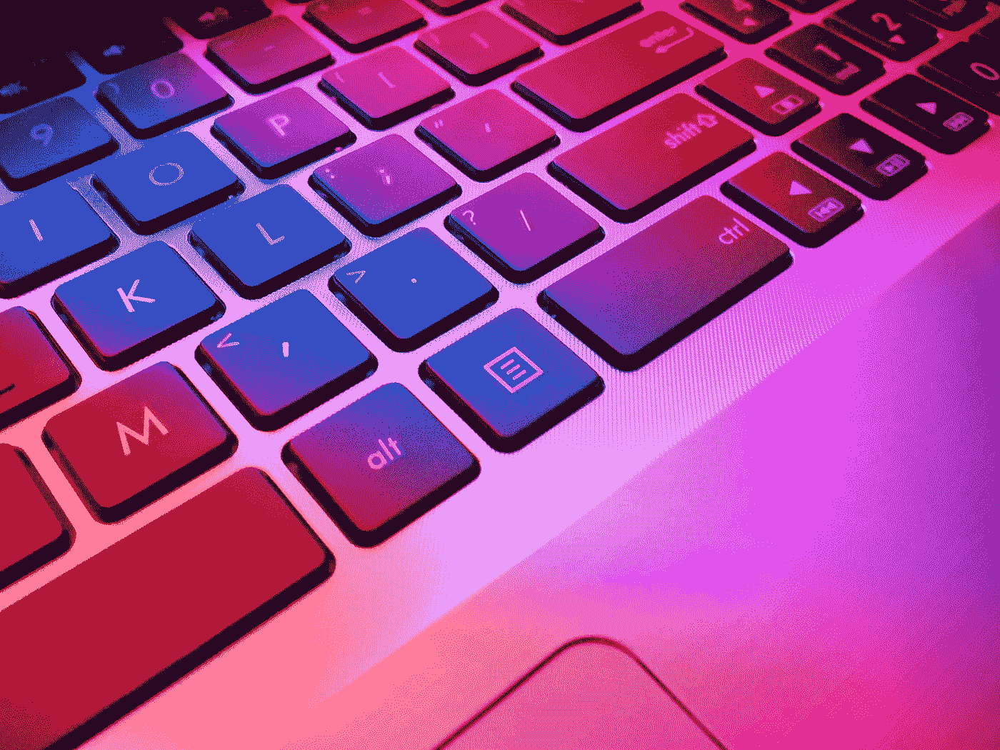

# 好的键盘对程序员来说有多重要

> 原文：<https://javascript.plainenglish.io/how-good-keyboards-are-vital-for-programmers-613114aa85ad?source=collection_archive---------8----------------------->

## 对我来说，我必须定期更换键盘。

Photo by [Aryan Dhiman](https://unsplash.com/@mylifeasaryan_?utm_source=medium&utm_medium=referral) on [Unsplash](https://unsplash.com?utm_source=medium&utm_medium=referral)

作为程序员，我们做文字处理。因此，最重要的界面是键盘和一个有足够空间显示所有相关信息的显示器。

键盘不应该让开发人员分心，例如，完美地工作——例如，在我目前的键盘上，控制键不再可靠地反应，工作时缺少橡胶垫，这就是为什么它在打字时会大声撞击桌子。因此，两个键盘都需要更换，尽管它们对于一般用户来说已经足够了。

如果你打字很快，按键必须可靠地弹奏，并按正确的顺序给出。例如，情况并非总是如此。廉价的键盘有时会扭曲输入键的顺序。因此便宜并不一定意味着不贵。

有些人欣赏机械键盘，因为它们几乎坚不可摧，你不必习惯它们。然后有各种可能的开关，有点击，有触觉反馈，或者完全没有。

我更喜欢剪刀式橡胶圆顶键盘，因为它们有触觉反馈，非常安静。但是大约两年后，它们被揉成这样，我需要一个新的。

在我学习期间，我买了昂贵的键盘，罗技的高级型号。一个持续了九个月，更昂贵的继任者持续了六个月。问题是:随着时间的推移，钥匙卡住了。所以当你触摸按钮时，你不再按下它，但按钮保持不动。你可以在打字的时候分辨出来，但是如果你点的很快，在你能纠正遗漏的字符之前，你已经又写了一两个字了。所以键盘对我来说毫无价值。

根据要求，罗技通知我，罗技没有为我的需求提供任何键盘。我也找到过一次说法。

因为我必须定期更换键盘，所以我买了最便宜的键盘，罗技 Ultra X。正如我所说，它持续了大约两年，价格为 25 马克。虽然，不幸的是，罗技不再生产它们，但有些售价不到 10 美元，所以它便宜，安静，定位好。偶尔，我会在易贝上购买保存完好的模型，以节省我的储备。当键盘变得稀缺时，我为自己留了一堆。

从那以后，我有了各种各样的机械键盘，价格范围在 200 美元左右，这并不能满足我。我已经为它配备了抑制按键以降低音量的环，但我对此还不满意。

微软人体工程学键盘可能是个好东西，但首先，我必须写一篇长文章来适应它。这段文字来自一台樱桃 KC 1000，售价 10 美元左右。还不错，但是跟不上罗技。然而，你仍然可以为此购买它们。

所以键盘对我来说必不可少。

我想知道是否有可能专门为编程制作我的键盘。当然，我也可以在一个糟糕的键盘上工作，但我几乎每次工作都带着我的私人键盘，有时还有我的鼠标。

总而言之:需要？不。但是有意义的是，对一直使用的工具给予一些关注，这样你就有了一些明智的东西。

*更多内容看* [***说白了. io***](http://plainenglish.io/) ***。*** *报名参加我们的* [***免费每周简讯点击这里***](http://newsletter.plainenglish.io/) ***。***