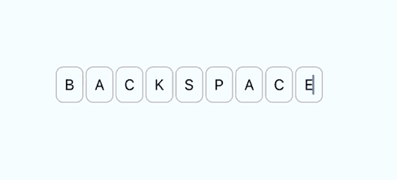
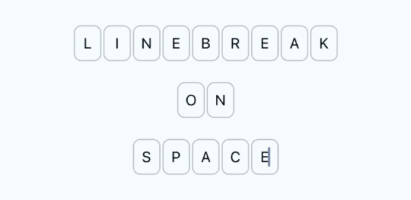
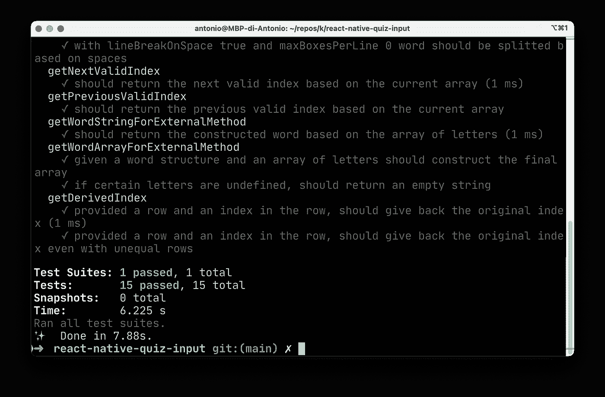
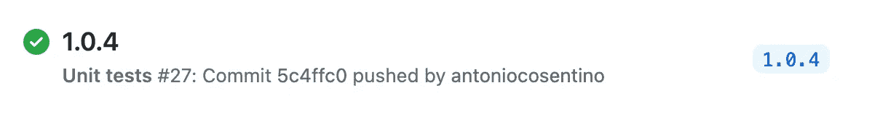

# 我如何构建我的第一个 React 本地库

> 原文：<https://javascript.plainenglish.io/how-i-built-my-first-react-native-library-9d4191c0ad44?source=collection_archive---------3----------------------->

在[之前的一篇文章](https://medium.com/swlh/how-i-built-a-language-learning-app-with-react-native-8c4f09500783)中，我描述了构建**翻牌**的过程，这是一个语言学习应用，也是我的第一个移动应用开发项目。

这款应用期待已久的功能之一是**挑战模式**，用户可以在一个类似测验的界面中测试自己的知识:给定一个英语单词，用户必须用德语键入，包括文章。

在设计这种模式的 UI 时，我意识到一个简单的输入文本对用户来说不是很友好:首先，对于一个名词，你应该键入冠词，然后在冠词和单词之间加一个空格。对我来说，这看起来有点便宜。此外，我想给出这个单词有多少个字母的视觉提示。这促使我考虑这种类型的输入:


所以我开始研究一个 React 本地库，它允许我这样做。第一个挑战是找出这个东西实际上是怎么叫的。我的一些搜索关键字是:

*   单个字符输入
*   单字符输入
*   多框输入
*   单字母输入

结果发现外面真的没有多少。这种类型的界面在 **OTP** (一次性密码)屏幕中似乎很常见，但这通常意味着只支持数字，或者不支持空格、换行符等等。此外，我发现的大多数项目都是为 **React** 而不是为 **React Native** 编写的。在我的搜索结束时，我没有为我的目标留下合适的库。

因此，我最后给出了一个典型的答案:

> “好吧，我就自己造”

## 步骤 1——将它构建为我的项目中的一个组件

在开始的时候，我主要关注的是在我的项目中拥有这个功能，因此我只是把它作为翻转卡片项目中的一个组件来创建。核心思想是接受一个*单词结构*(这是一个布尔数组，其中`true`表示*字母*，`false`表示*空格*)，然后在需要时为每个字母或空格呈现单个的单字母文本输入。在键入时，执行回调函数，并将键入的单词(作为字母数组和字符串)作为函数参数传递。

我不会用所有的细节来烦你，但我必须应对许多不可预见的挑战:

管理*退格键*行为并不那么简单:核心思想是当点击退格键时，焦点转到上一次输入，字母被删除。但是如果你的注意力集中在一个已经有一封信的盒子上呢？在这种情况下，只有当光标位于字母之后的**时，您才希望删除当前字母。**



Different cases for the backspace behavior

另一个挑战是，我想在需要时有效地将单词分成多行。为此，我创建了一个名为`maxBoxesPerLine` 的设置，然后我实现了一个基于该设置创建字母块的逻辑。


A long word with maxBoxesPerLine set to 12

我还创建了一个名为`lineBreakOnSpace`的设置，它总是为一个新单词创建一个新行。



在这个过程的最后，我将这个新组件集成到我的应用程序中，进行了测试，然后发布了期待已久的**挑战模式**功能。

## 步骤 2 —将其作为独立库发布

该特性发布后，我重新查看了我的组件，注意到它足够独立，可以作为一个独立的库轻松发布。

这是我第一次尝试这种类型的项目，所以我开始为存储库寻找一个模板。主要目标是有一个能让我:

*   在设备模拟器(iOS 和 Android)中运行组件
*   使用**热重装**加快更新速度
*   在**类型脚本**中编写代码
*   编写测试
*   轻松地将库导出为 **npm** 包

经过一番研究，我找到了这个[优秀的模板](https://github.com/demchenkoalex/react-native-module-template)，它符合我的所有要求。该项目带有一个包含演示应用程序的`/example`文件夹。这已经以某种方式进行了配置，使我们可以导入我们的组件，就像它是项目中一个现有的依赖项一样。

```
import { ComponentName } from 'react-native-library-name';
```

示例项目可以在设备模拟器中启动，组件可以实时编辑，就像您在处理标准 React 本地项目时一样。

## 测试

由于在需要时将单词分成行的逻辑(基于上面提到的设置)非常复杂，我意识到这对于一些单元测试来说是一个很好的用例。模板已经安装了 **Jest** ，所以我创建了覆盖不同场景的测试。我在测试中包括的另一件事是返回焦点应该转移到的输入框的索引的方法(例如，当按 backspace 或键入一个字母时)。



这些测试甚至在我每次通过 GitHub 动作提交提交时都被执行，因此如果我在更新组件时破坏了什么，我会立即注意到。



仍然缺少的是用可能的道具组合对组件进行可视化测试的方法。对于这一点，什么被证明是一个伟大的工具是反应本地的[故事书。我已经熟悉了 **Storybook** ，它是一个强大的工具，用于在隔离模式下测试 web 项目的 UI 组件。然而，我不知道 React 的本地支持。最棒的是，它允许以两种不同的方式与组件交互:](https://storybook.js.org/tutorials/intro-to-storybook/react-native/en/get-started/)

*   直接从设备仿真程序
*   从故事书服务器(可通过浏览器访问)

在项目中设置 Storybook 后，我创建了这些故事:

*   **默认**情况:最基本版本的组件，只有所需的道具
*   一个**游乐场**案例:由于*旋钮*的特性，在这里我允许定制所有可能的道具(包括背景颜色、输入大小等等)
*   **常见**用例:组件最典型配置的一组标准道具组合


Component Playground built with Storybook for React Native

当一切都准备好并经过适当测试后，只差一件东西:名字。

在与一些朋友/开发伙伴进行了一次投票后，我最终得到了这个名字:`react-native-quiz-input`

该图书馆现已在以下网站提供:

*   [**GitHub**](https://github.com/antoniocosentino/react-native-quiz-input)
*   [**npm**](https://www.npmjs.com/package/react-native-quiz-input)

我还希望有一个游乐场，让想在下载组件之前试用它的开发人员可以方便地进入。因此，我在 Expo.io 上创建了一个[小吃](https://snack.expo.io/@antoniocosentino/react-native-quiz-input-demo)，它允许你在真实的设备上甚至在浏览器中试用这个库，这要感谢 **React Native Web** 的支持。

*更多内容请看*[*plain English . io*](http://plainenglish.io/)