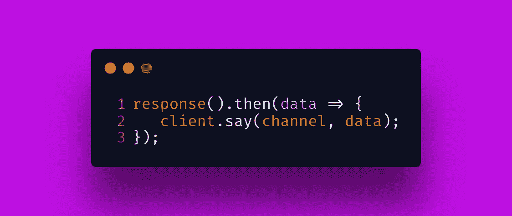

# 我如何用自然语言理解构建我的第一个 Twitch 机器人(NLU)

> 原文：<https://javascript.plainenglish.io/how-i-built-my-first-twitch-bot-with-nlu-66000facdc38?source=collection_archive---------9----------------------->

Photo by [Mohammad Rahmani](https://unsplash.com/@afgprogrammer?utm_source=medium&utm_medium=referral) on [Unsplash](https://unsplash.com?utm_source=medium&utm_medium=referral)

# 介绍

在过去的几个月里，我一直在尝试机器学习和人工智能的不同领域。最近，我试图建立一个能够从图像中识别头发类型的卷积神经网络。要了解更多关于我的实验，你可以看看我的视频[这里](https://www.youtube.com/watch?v=LtqaumBsuPM)。

尽管探索卷积神经网络没有成功的结果，但我仍然受到启发，想了解更多关于 AI/ML 的知识。这让我了解了这个空间中的一个子集，叫做自然语言理解，具体来说就是“问答”在我的新项目中，我决定建造一个 Twitch 机器人，它将回答关于三位黑人女性的问题，她们是人工智能/人工智能行业的先驱，**蒂姆尼特·格布鲁**，**雷迪特·阿贝贝**和**乔伊·波伦维尼**。

# 什么是自然语言理解？

在机器学习和人工智能的文本世界中，有两个副主题:自然语言处理和自然语言理解。**自然语言处理**就是我教机器提取、分类、分解句子结构的时候。比如“敏捷的棕色狐狸跳过懒惰的狗”这句话。使用一种叫做“ ***名称实体识别*** 的方法，机器会将“狐狸”和“狗”识别为“ ***事物*** ”，然后使用“ ***词性标注*** ”，机器会解析出“棕色”、“敏捷”和“懒惰”作为**形容词**，“跳跃”作为**动词**。NLP 中的这两种方法只是帮助机器识别自然语言中的成分，但并没有真正赋予机器理解句子的能力。

这就是副主题**自然语言理解**介绍的地方。NLU 训练机器对它处理的自然语言进行阅读理解。NLU 有一种叫做“**问答**的方法，教机器如何根据接收到的数据回答问题。在我的例句中，如果我问机器“狐狸是什么颜色的？”，它会回答“狐狸是棕色的。”模型可以回答“定义”问题，“如何和为什么”问题，以及语义约束问题。此外，Q & A 模型可以在任何事情上进行训练，这被称为“**开放域**”或者它可以在特定主题上进行训练，“**封闭域**”。对于我将建立的模型，它将是一个封闭的领域，因为它将只能回答关于人工智能/人工智能行业中三位女士的问题，并且它将能够回答“定义”问题和“如何以及为什么”问题。

# 建造机器人

为了构建我的 Twitch 机器人，我必须将三个主要组件拼凑在一起:连接到我自己的个人 Twitch 频道，为数据建立缓存数据库，以及构建“问答”模型。Twitch 有一个非常灵活的 API，允许我在我的频道上阅读和发布消息。我选择与他们的 API 接口的库是 **TMI.js** ，一个 Twitch 消息接口库。我的数据是几个小于 100KB 的文本文件。每次我的模型运行时，它都会检索数据并进行分析。为了加快处理速度，我将创建一个内存缓存数据库。缓存数据库增加了处理时间，减少了检索数据的时间。我选择的库是 **memory-cache.js** ，这是一个简单的 Node.js 内存缓存。

最后，我将使用流行的开源机器学习库，名为 **TensorFlow** 。TensorFlow 最初是用 Python 编写的，但它已经发展到其他编程语言。 **TensorFlow** 写在 **Node.js** 中，包含预先训练好的模型。TensorFlow 有两个版本:CPU 和 GPU。所有这些都意味着模型将在我的机器的 CPU 或 GPU 上运行。众所周知，在 GPU 上运行模型处理速度更快。对于我的模型，我将使用 CPU。我将用来支持我的模型的库是**@ tensor flow-models/qna . js**、 **@tensorflow/tfjs** 和 **@tensorflow/tfjs-node** 。

# 设置抽动

我要做的第一步是初始化我的 Twitch 客户端。 **TMI.js** 要求我提供用户名、密码和频道，以便在我的 Twitch 频道中查看和回复消息。

因为这三项是敏感信息，所以我将它们放在。环境文件。" **dotenv** "是一个将环境文件加载到 process.env 对象的库。它对于为不同环境配置服务器非常安全和有用。我可以用 Twitch 客户端设置的另一个配置是连接类型。为了遵循最佳实践，我将设置我的连接是安全的(HTTPS)。我还将设置我的 Twitch 客户端，以便在连接中断时不断重新连接。

# 构建模型

初始化我的 Twitch 客户端后，接下来要做的是构建我的模型。前面我提到 TensorFlow 使用预先训练好的模型。**预训练模型**是由另一方开发的模型，作为扩展的基础模型。举个例子，如果我想建立一个可以在图片中检测猫品种的模型。我可以选择从头开始构建模型。这意味着我必须训练这个模型，让它知道猫和其他物体之间的区别。这需要包括猫在内的数百万张各种类型的图片。然而，如果我使用一个预先训练好的模型，它就会知道猫和物体之间的区别。这让我有机会更快地建立模型来解决问题。对于我们的用例，我将为“**问答**”使用一个预先训练好的模型

在我使用这个模型之前，我需要输入我自己的数据。数据将存储在文本文件中。这样做的缺点是，每次模型运行时，服务器都必须读取文件系统。

为了绕过这一点，我可以将数据存储在内存中，并从内存缓存中检索数据。我将通过创建一个自调用函数来实现这一点。这将读取文本文件并将它们放入内存缓存中。我将使用文件名作为关键字来检索信息。

现在我已经准备好了数据，我可以拼凑模型了。我的模型将回答三个主题的问题。我将制作一个通用的函数，而不是针对这三个主题定制代码。该函数将捕获主题的名称和提出的问题。

我将把这个函数命名为“ **qnaModel** ”它要做的第一件事是初始化来自 TensorFlow 的 Q & A 预训练模型。然后，根据给定的名称，它将从内存缓存中检索相关的文本。这些信息和问题一起被输入到 TensorFlow 的函数中，名为“ **findAnswers** ”这个函数有两个参数，数据和问题。作为回报，它将为我提供一个对象数组。下面是一个例子:

对象有四个属性:**文本**、 **startIndex** 、 **endIndex** 和**分数**。“**文本**”显示模型得出的答案。“ **startIndex** ”和“ **endIndex** ”都指向模型在文本中找到答案的位置。"**得分**"衡量模型对其答案的信心程度。数字越接近 1，模型对答案越有信心。默认情况下，数组中的第一个条目将具有模型中较高的分数。在代码中，我决定放置一个条件语句。如果数组大于 1，则返回数组中的第一个元素。最后，我导出这个函数供我的 Twitch 客户机使用。

# 将模型连接到 Twitch Bot

Twitch API 有几个事件，我可以用它们在我的 Twitch 通道中进行交互。我将需要使用一个允许我监听“消息”的通道事件。在那里，我可以分析这些消息，并确定用户是否试图与我们的机器人进行交互。我将查找包含**的邮件！joybuolamwini！redietabebe** 和**！timnitgebru** 。这些消息前面会有一个问题。

最后，我将引入为我的问题进行数据分析的函数。在代码片段中，我将删除除“文本”之外的所有属性这是因为我只想在我的 Twitch 频道上显示答案。

之后我准备把答案发到我的 Twitch 频道。为了做到这一点，我使用了“T20”说“T21”的方法。该方法接受两个参数:**通道名称**和**消息**。

下面的代码片段显示了 **src/index.js** 文件中的所有内容。

这是我的 Twitch 机器人在我的 Twitch 频道中工作的一个短片。

# 结论

上面的代码是我结合 NLU 和 Twitch API 的第一次迭代。我可以对这段代码做一些改进。一个例子是缓存常见问题的答案。这将减少服务器和模型的响应时间。然而，我想分享我在自然语言理解实验中的旅程。

我希望这篇教程能给你使用 JavaScript 来涉猎 TensorFlow 的灵感。你可以在这里查看完整代码。

*如果你喜欢这个教程，可以看看我在*[***www.twitch.tv/thestrugglingblack***](http://www.twitch.tv/thestrugglingblack)上的技术流

*更多内容看*[***plain English . io***](http://plainenglish.io/)