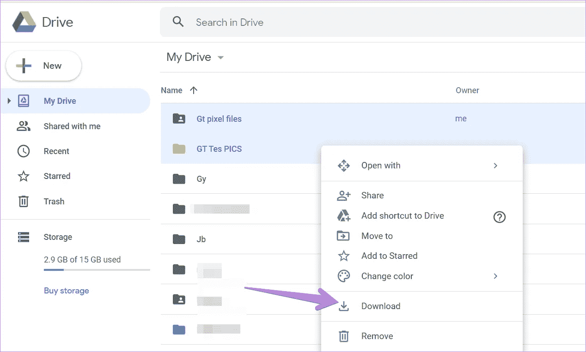

# 我编写了一个脚本，从 Google Drive 下载“下载受限”文件

> 原文：<https://javascript.plainenglish.io/how-i-coded-a-script-to-download-the-download-restricted-files-of-google-drive-718e74c55a68?source=collection_archive---------8----------------------->



正如我在[之前的帖子](/you-can-download-the-download-restricted-files-as-pdf-google-drive-92271e28f148)中提到的，我写了一个 JavaScript 程序从 Google Drive 下载文件，即使他们限制了下载访问。阅读我的[上一篇文章](/you-can-download-the-download-restricted-files-as-pdf-google-drive-92271e28f148)来了解更多。你可以在那篇文章中找到代码，也可以在这篇文章的底部找到。

在今天的帖子中，我将仔细阅读每一行代码，并帮助您理解这一行代码的意图。所以事不宜迟，我们开始吧！

**先决条件** : JavaScript

## 代码的主要逻辑是-

> Google Drive 以图片的形式存储文件。因此，浏览文档→检查有效图像→获取这些图像并将其保存为 PDF。很简单，对吧？

就这样，你完成了！如果你懂 JavaScript，代码几乎是不言自明的。

因此，作为开始，我使用了“jspdf”库，它似乎服务于这个目的。我用的是 jspdf 提供的 CDN。我把它附在了文件的主体上。

```
let JsPDF = document.createElement("script");
JsPDF.src='https://cdnjs.cloudflare.com/ajax/libs/jspdf/1.5.3/jspdf.debug.js';
document.body.appendChild(JsPDF);
```

当我们添加的脚本元素(jspdf)完全加载到文档中时，我们启动 JsPDF。我们用“new jsPDF()”初始化 PDF，并将默认 PDF 的高度存储在一个变量中。它是操纵图像在 PDF 页面上的位置。我们将文档中的所有图像元素存储在一个名为 elements 的数组中。

```
JsPDF.onload = function () {     
let pdf = new jsPDF();      
var height = pdf.internal.pageSize.getHeight(); 
let elements = document.getElementsByTagName("img");
```

然后我们循环遍历图像数组。

```
for (let ith_image in elements) {  
    let img = elements[ith_image];
```

这是整个代码中有趣的部分。图像以[斑点对象](https://developer.mozilla.org/en-US/docs/Web/API/Blob)的形式存储。因此，我们检查在图像的 src 中是否有“斑点”,如果没有就跳过迭代。

```
if (!/^blob:/.test(img.src)) continue;
```

然后，我们创建一个与图像高度和宽度相同的画布元素，并在画布上绘制图像。

```
let canvas = document.createElement('canvas');   
let context = canvas.getContext("2d");          
canvas.width = img.width;        
canvas.height = img.height;        
context.drawImage(img, 0, 0, img.width, img.height);
```

对于 jspdf，图像必须是数据 URL[的形式。因此，我们将画布图像转换为数据 URL 格式，然后将其添加到 PDF 中。最后，我们向现有的 PDF 添加一个页面。](https://developer.mozilla.org/en-US/docs/Web/HTTP/Basics_of_HTTP/Data_URIs)

```
 let imgData = canvas.toDataURL("image/jpeg", 1.0);
   pdf.addImage(imgData, 'JPEG', 0, height/3.5);         
   pdf.addPage();
} // closing brace of "for" loop
```

当这个循环结束时，我们将把所有的图像保存为 PDF 格式。但是我们将在 PDF 的末尾有一个额外的空白页，因为我们在每次迭代中增加了一个额外的页面。为了删除多余的空白页，我们从 PDF 中取出总页数并删除最后一页。(这与删除 vector 或 list 数据结构中的最后一个元素是一样的。)

```
var pageCount = pdf.internal.getNumberOfPages();    pdf.deletePage(pageCount);
```

最后一步，我们将 PDF 文件保存到我们的电脑上。

```
 pdf.save("File_Name.pdf");
}; // closing brace of the function 
```

仅此而已。您可以将代码粘贴到 Developer's tools 的 console 选项卡中，然后按 enter 键。在按回车键之前，请确保滚动到页面的末尾。这是为了确保文件的所有图像都已加载。

以下是完整的代码:

如果你觉得代码或帖子有意义，考虑在评论区分享你的想法和建议。

如果你太高兴了，你可以给我买杯咖啡。😉

[](https://www.buymeacoffee.com/mohithgupta)

你可以看看我其他的一些帖子:

[只需点击](https://python.plainenglish.io/play-youtube-videos-in-vlc-with-just-1-click-2baca84c03f3)
[“转换您的”,即可在 VLC 播放 YouTube 视频。py '到 a '。exe '文件，只需两个命令](https://python.plainenglish.io/convert-your-py-to-exe-with-just-2-commands-4c6cefe9af4c)
[你需要知道的关于 JavaScript](/all-you-need-to-know-about-the-fetch-api-6929930572a8) 中的“获取 API”

如果还有其他疑问，你可以在 mohithguptak@gmail.com 上联系我，或者在推特上找到我。

下一集见。再见！

*更多内容请看*[***plain English . io***](http://plainenglish.io/)