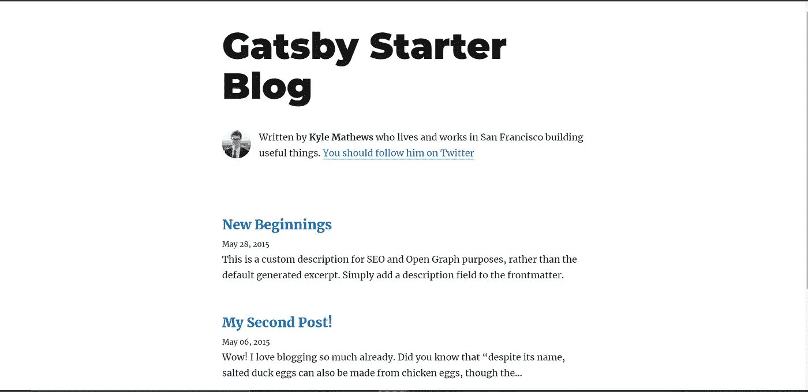

# 我如何创建了一个免费域名和托管的盖茨比博客

> 原文：<https://javascript.plainenglish.io/how-i-created-a-gatsby-blog-with-free-domain-and-hosting-e83f6bfd2824?source=collection_archive---------12----------------------->

## 集成了 Netlify CMS 的盖茨比博客


Photo by [Brooke Cagle](https://unsplash.com/@brookecagle?utm_source=medium&utm_medium=referral) on [Unsplash](https://unsplash.com?utm_source=medium&utm_medium=referral)

我想创建自己的博客，但是是免费的。我做到了。

让我们从头开始。

我告诉过你我想创建一个免费的博客。所以我去学习了它背后的技术。

首先，我学习了 HTML、CSS 和所有相关的东西。但是创建一个简单的博客在某些方面比编码要难一点。至于托管，你需要付费，因为博客由后端组成，不能在 Netlify、GitHub 页面等上托管。此外，我们需要为此创建一个 CMS(内容管理系统)。

[](/how-to-learn-web-development-using-free-resources-1c677e70de14) [## 如何利用免费资源学习 Web 开发

### 初学者的深入指南。

javascript.plainenglish.io](/how-to-learn-web-development-using-free-resources-1c677e70de14) 

所以，我开始尝试用其他技术创建一个博客。

我了解了 WordPress.org。在那里，你可以免费获得很多博客模板。但是你要付费托管。还有 Wordpress.com，但它显示免费托管的广告。

之后我学习了 Medium，Dev，Hashnode。我试过了。他们提供一个免费托管的免费子域。但是在那里，你的博客会被锁定在他们的网站上。所以我需要一些不同的东西。

> 这是我在 Medium 上的博客。

然后我尝试了 Strapi，Ghost，Contentful。实际上，他们为博客提供了预制的 CMS。甚至 freeCodeCamp 也用 Ghost 做 CMS。但我觉得不容易，跳过了。同样是主机服务，Ghost 每月收费 9 美元。

后来，我学习了一个新的概念，叫做静态站点生成器。它真的救了我的命。

简单来说，静态网站生成器生成一个静态 HTML 网站，有助于轻松呈现数据。由于这个原因，静态网站速度很快。

所以我尝试了几种方法(上面列出的),其中我最喜欢静态站点生成器。

# 介绍


Photo by [BRUNO EMMANUELLE](https://unsplash.com/@brunocervera?utm_source=medium&utm_medium=referral) on [Unsplash](https://unsplash.com?utm_source=medium&utm_medium=referral)

我了解到一个静态站点生成器可以用 Gatsby，Hugo 等创建。于是我在 YouTube 上搜索用盖茨比创建博客，找到了相关视频。

通过博客、文章、文档了解了更多之后，我终于创建了一个盖茨比博客。

在这里，我会帮你为自己创造一个。创造一个你兴奋吗？你的答案应该是肯定的。

那我们开始吧。

# 盖茨比是什么？

Gatsby 是一个开源框架，主要处理 React 来创建网站和应用程序。

盖茨比的伟大之处在于你可以在几分钟内创建一个网站。它不是关于博客，你可以创建一个电子商务商店，投资组合，公司主页，创业网站等。

甚至你可以使用 Gatsby 创建渐进式网络应用程序。

这么棒的功能是不是让你应接不暇？嗯，毫无疑问，你想了解更多。

# 让我们快速开始吧


Photo by [Anthony Riera](https://unsplash.com/@frenchriera?utm_source=medium&utm_medium=referral) on [Unsplash](https://unsplash.com?utm_source=medium&utm_medium=referral)

**第一步:全球安装 Gatsby-CLI。**

要使用 Gatsby，您需要全局安装 Gatsby CLI。因为 npm 是 Node.js 的一部分，所以它将和 Node.js 一起安装。除此之外，你还必须安装 git，因为我们将处理 GitHub。

因为您正在安装 Node.js，所以请确保它是最新版本。否则请更新您的 Node.js 版本。

然后让我们在任何目录中编写下面的命令。

```
npm install -g gatsby-cli
```

以上命令将在我们的机器上全局安装 Gatsby CLI。

够了，你需要开始和盖茨比相处了。

**第二步:创建一个新项目**

您可以使用 starter 主题或手动创建博客网站来创建新项目。

在这里，我们将为我们的博客使用 Gatsby-starter 模板。有很多免费的模板可以使用。你可以[点击这里](https://www.gatsbyjs.com/starters/?)查看模板。

我们将使用 [Gatsby-starter-blog](https://www.gatsbyjs.com/starters/gatsbyjs/gatsby-starter-blog) ，一个最简单的博客网站。您可以使用任何模板。

选择您的首选目录，并在其中打开命令提示符，并运行以下命令。

```
gatsby new blog [https://github.com/gatsbyjs/gatsby-starter-blog](https://github.com/gatsbyjs/gatsby-starter-blog)
```

上面的命令很简单:

> 盖茨比:意思是我们在和盖茨比打交道。
> 
> 新的:它将创建一个新的项目或简单的盖茨比的文件夹。
> 
> **博客**:是文件夹名或者项目名。你甚至可以写你喜欢的名字。
> 
> **URL** :提供 URL 是为了克隆代码。

当您运行上面的命令时，它将创建一个名为 blog 的文件夹，并将文件添加到其中。

完成安装后，在 Visual Studio 代码或您喜欢的任何代码编辑器中打开它。我使用的是 Visual Studio 代码，因为其中有一个内置的终端。

打开 VS 代码中的内置终端并运行下面的命令。

```
cd blog
```

在那之后，

```
gatsby develop
```

完成后，终端会指示访问`http://localhost:8000`。你的盖茨比博客也准备好了。

你会看到一个类似的博客网站，如下所示。



Source: Gatsby

是的，你可以根据你的需要改变它并使用它。这是一个功能齐全的博客。既然你有代码，你可以根据我们的需要创建一个导航栏，页脚，甚至是英雄部分。

我知道它有 800 多字，你已经全神贯注了。甚至你们中的许多人都实现了它。

我知道你不知所措。所以给自己一点时间。试着去玩，读书，做让你开心的事。下次再来，把这个故事做个书签，这样你以后就可以读了。

# 修改你的博客网站

我们使用的入门博客是免费的，我们可以免费使用。现在是你修改博客的时候了。

我用同样的方法创建了一个博客，并根据我的需要进行了修改。

# 托管你的博客网站

现在你已经创建了你的博客，甚至根据你的需要修改了你的博客网站。

是时候托管你的博客网站了。为此，我们将使用 Netlify。Netlify 帮助我们免费托管一个网站。

要在 Netlify 上托管一个网站，你需要注册并把你的文件夹放进去。

注册后，转到网站选项卡，拖放您的文件夹就是这样。

Netlify 会给你提供一个免费的子域，你可以使用。

# 写你的博客文章

你可以在你的博客文件夹中写你的博客文章，甚至可以使用 Netlify CMS。

由于我们使用 Netlify 作为主机，我们可以使用 Netlify CMS 来管理我们的博客文章。

这里的是一个链接。如果你不能理解，通过评论让我知道，我会为此写一篇完整的文章。

# 获得免费域名

到目前为止，我们已经创建了一个博客，修改它，免费托管它，并使用 Netlify CMS 来管理我们的博客帖子。

现在，最后我们将为我们的博客网站获得一个免费域名。

但是怎么做呢？使用 Freenom。

Freenom 允许我们免费获得一年的免费域名。

# 让我们结束吧

我希望你觉得这篇文章很有趣。这篇文章旨在帮助读者掌握关于使用 Gatsby 免费创建博客的有价值的信息，并在不太费力的情况下明确主题的基本原理。

不要犹豫留下反馈或张贴您的疑问。

目前就这些——谢谢！

*你可以* [*关注我*](https://medium.com/@nitinfab) *或者看一些我的其他故事。*

[](/5-ways-to-earn-money-as-a-developer-1e42e694a078) [## 开发人员挣钱的 5 种方法

### 从新手到专家:成功的深度指南

javascript.plainenglish.io](/5-ways-to-earn-money-as-a-developer-1e42e694a078) [](/how-i-would-learn-front-end-web-development-if-i-had-to-start-over-again-24e6228050d0) [## 如果我必须重新开始，我将如何学习前端 Web 开发

### 一个白手起家的 web 开发者的故事。

javascript.plainenglish.io](/how-i-would-learn-front-end-web-development-if-i-had-to-start-over-again-24e6228050d0) [](/youtube-channels-that-helped-me-become-a-self-made-web-developer-8644621f4bfe) [## YouTube 频道帮助我成为了一名白手起家的网络开发者

### 一个白手起家的 web 开发人员的故事，他对编码没什么兴趣。

javascript.plainenglish.io](/youtube-channels-that-helped-me-become-a-self-made-web-developer-8644621f4bfe) 

***如果你喜欢我的工作，想要支持，可以*** [***请我喝杯咖啡！***](https://www.buymeacoffee.com/nitinfab)

[*更多内容看 plainenglish.io*](http://plainenglish.io/)