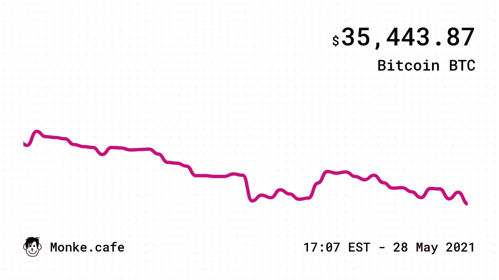

# 我如何使用 rjs、服务器发送事件、Express 和 Node.js 创建事件驱动后端

> 原文：<https://javascript.plainenglish.io/how-i-created-an-event-driven-backend-with-rxjs-server-sent-events-and-expressjs-9f8be1ffc123?source=collection_archive---------1----------------------->


Monke Cafe

大约一个月前，我和一个朋友想出了一个小网站的主意，并决定在几天内创建一个 MVP 来尝试一下。这个想法很简单；一个迷因驱动的聊天室和每种密码货币的实时价格图表。我被分配为这个项目创建后端，我的朋友会制作网络客户端。

在开始使用服务器之前，我为自己设定了三个要求。首先也是最重要的一点，我想尽快得到 MVP。其次，我想让服务器尽可能的轻量级，让它运行在一个便宜的虚拟机上。最后，我想设计一个架构，以便在投资者决定做出另一个愚蠢的决定并使用我们的应用程序时，可以轻松扩展。

第一步是将整个服务器视为一个管道。基本上，整个过程是一个管道，它消耗一组事件，处理它们，然后将它们流式传输到许多客户端。


Pipeline Architecture

任何传入的数据都可以被视为某种事件。例如，我们有用户加入或离开房间，发布或删除评论，以及股票价格更新。另一方面，任何消费这些事件的东西都可以被认为是客户；我们的数据库、缓存和所有连接的浏览器。

仔细考虑之后，我首先想到的是[rjs](https://rxjs-dev.firebaseapp.com)和[服务器发送事件](https://developer.mozilla.org/en-US/docs/Web/API/Server-sent_events)的组合。我从来没有写过服务器端的 javascript 项目，因为我主要使用 Golang 和 Python，但是我真的很想在服务器端尝试 rjs，这似乎是尝试的最佳时机。


Server-Sent Events (SSE) + RxJS

为了更详细地解释实现，我将逐步实现一个非常简单的股票/密码货币实时价格流端点。首先，我们需要一个 [RxJS](https://rxjs-dev.firebaseapp.com) 主题，它是一个可观察到的多播。我们的主题将负责向我们的所有客户(订户)流式传输股票报价事件。

```
import { Subject } from 'rxjs';
import { filter, map } from 'rxjs/operators';// our RxJS subject
const TickerSubject = new Subject();
```

接下来，我们需要一个入口点，将我们的事件推送到我们的流中。我们可以直接向我们的主题发出，或者创建一个包装函数作为抽象层，并在发出新事件之前清理和检查我们的数据。

为此，让我们定义一个名为 ***EmitTickerPrice 的函数。*** 每当我们得到一个新的股票价格数据时，我们会用适当的参数调用这个方法，它会向我们的股票主体发出一个新的事件。

```
/**
 * Emit a new ticker price
 * [@param](http://twitter.com/param) {string} symbol: ticker symbol
 * [@param](http://twitter.com/param) {string} price: ticker price
 * [@param](http://twitter.com/param) {string} currency: ticker currency
 */
const EmitTickerPrice = async (symbol, price, currency) => {
    const ticker = {
        symbol, price, currency,
        createdAt: Math.floor(new Date() / 1000),
    };
    TickerSubject.next(ticker);
    return ticker;
};
```

对于我们的项目，我使用 PostgreSQL 来保存历史股价信息。我还使用 Redis 作为缓存存储，以减少当客户请求数据来呈现价格图表时的数据库负载。如我之前所述，每一个都被视为客户，并独立订阅我们的[rjs](https://rxjs-dev.firebaseapp.com)受试者。我们可以在我们的跑马灯主题上调用 subscribe，并传递一个回调方法来观察和处理每个传入的事件。

```
TickerSubject.subscribe(ticker => {})
```

很容易，对吧？嗯，不完全是。看，在我们的网站上，我们每隔五秒钟就为每个受支持的股票和隐币股票推出一个新的股票报价事件。这些事件也不是同步的，并且以不同的时间间隔出现，这意味着我们每秒钟都会收到几十个 ticker 事件。问题在于，我们不想在每次发出新事件时调用我们的 Redis 和 PostgreSQL 订阅者回调。相反，我们希望在我们的管道中实现一些额外的逻辑来减少这些服务的负载。

## **PostgreSQL 观察者**

让我们从 PostgreSQL 开始；每次发出新的股票价格时单独插入一行是不理想的。这可能因不同的项目而不同，因为在某些情况下，我们可能需要原子插入。然而，对于该项目，30 秒的插入延迟可以忽略不计。幸运的是，[rjs](https://rxjs-dev.firebaseapp.com)通过提供管道和几十个操作员使得实现这个功能变得非常容易。对于我们的情况，我们可以创建一个管道，并使用***buffer times***运算符将我们的事件缓冲 30，000 毫秒。然后，我们可以订阅新定义的管道。

```
import { bufferTime } from 'rxjs/operators';TickerSubject.TickerSubject.pipe(
    bufferTime(30000),
).subscribe(tickers => {})
```

我们的订阅者每 30 秒钟被调用一次，取而代之的是它得到过去缓冲期内的缓冲事件列表。

## Redis 观察者

有了 Redis，我们的问题变得更有趣了。正如我之前提到的，Redis 主要用于缓存生成网站上显示的价格图表所需的价格点。



Monke Cafe Price Chart

此图表是为不同的时间间隔创建的，例如过去 5 分钟、1 小时或 1 天。正如您现在所知，我们的 24 小时图表不需要每 5 秒钟就有一个数据点；相反，每 30 分钟甚至一小时一个数据点就可以完成这项工作。

我们的 Redis 观察员应在致电订户前将每个唯一的股票代码限制 30 分钟。为了实现这一点，我们需要创建一个比我们之前为 PostgreSQL 观察者创建的管道更复杂的管道。


首先，我们必须根据事件的代码对其进行分组。为此，我们可以使用由 [RxJS](https://rxjs-dev.firebaseapp.com) 提供的 ***groupBy*** 操作符，并提供一个箭头函数来指定我们如何对这些事件进行分组。我们希望我们的事件组基于他们的股票代码；因此，我们从 arrow 函数中返回股票代码值。

接下来，我们将限制每个组每 30 分钟发射一次，最后将所有组合并到一个管道中。我们可以使用 ***mergeMap*** 操作符，通过每组映射来添加 ***throttleTime*** 操作符，间隔 30 分钟。最后，我们可以订阅管道并将数据插入 Redis 服务器。

```
import { groupBy, mergeMap, throttleTime } from 'rxjs/operators';TickerSubject.pipe(
    groupBy((ticker) => ticker.symbol),
    mergeMap((group) => group.pipe(
        throttleTime(30 * 60 * 1000),
    )),
).subscribe(ticker => {})
```

我们甚至可以更进一步，缓冲这些事件以利用 Redis 管道，但我将跳过这一部分，因为它看起来几乎与我们对 PostgreSQL 管道所做的一样。

如果你已经走了这么远，拍拍自己的背，深呼吸，然后去喝点咖啡，免得我们被服务器发送的事件弄脏了手。

## 服务器发送的事件端点

对于我们的网站，我正在使用 [Express](https://expressjs.com) 和 [@awaitjs/express](https://www.npmjs.com/package/@awaitjs/express) 库在我的路由器中使用 async/await。通过 GET 方法在我们的 express 服务器上注册路径***/ticker/:symbol/event***来创建我们的服务器发送事件路径。

```
Router.getAsync('/ticker/:symbol/event', async (req, res) => {})
```

为了启用 SSE，我们需要将几个头刷新回我们的客户端。我们要将 ***【连接】*** 设置为 ***【保活】******【缓存-控制】*** 设置为 ***【无缓存】*** 和 ***【内容-类型】*** 设置为到 ***【正文/文***

此外，我还为 CORS 添加了***‘访问-控制-允许-起源’***，并将***‘X-加速-缓冲’***设置为***‘否’***，以避免 [Nginx](https://www.nginx.com) 打乱这条路线。最后，我们可以将标头刷新回我们的客户端，以启动事件流。

```
Router.getAsync('/ticker/:symbol/event',
    async (req, res) => {
        res.setHeader('Cache-Control', 'no-cache');
        res.setHeader('Content-Type', 'text/event-stream');
        res.setHeader('Connection', 'keep-alive');
        res.setHeader('Access-Control-Allow-Origin', '*');
        res.setHeader('X-Accel-Buffering', 'no');
        res.flushHeaders();
});
```

现在，我们可以通过在响应中写入一些内容来开始传输数据。SSE 提供了一个基于文本的协议，我们可以用它来帮助我们的客户区分事件类型。我们的每一个事件应该如下所示:

```
event: ${event name}\n
data: ${event data}\n\n
```

为了让我们的生活变得简单一点，我创建了一个助手函数来为我们处理序列化。

```
/**
 * SSE message serializer
 * [@param](http://twitter.com/param) {string} event: Event name
 * [@param](http://twitter.com/param) {Object} data: Event data
 * [@returns](http://twitter.com/returns) {string}
 */
const EventSerializer = (event, data) => {
    const jsonString = JSON.stringify(data);
    return `event: ${event}\ndata: ${jsonString}\n\n`;
};
```

在我们的网站上，我们有半打类似于我们到目前为止已经创建的主题。为了能够区分这些事件，我们必须为每个事件指定一个名称。让我们使用“ ***price_update*** ”作为股票主题。此外，我们需要根据客户端订阅的动态路径来过滤这些事件。比如在***/ticker/DOGE/event***上，我们只想要与 Dogecoin 相关的事件。为了实现这两个特性，让我们在 ticker subject 周围创建一个新的包装器来过滤管道，并将我们的事件名称添加到事件中。

```
import { filter, map } from 'rxjs/operators';/**
 * Event stream for ticker price update
 * [@param](http://twitter.com/param) {string} symbol: ticker symbol
 * [@returns](http://twitter.com/returns) {Observable<{data: *, name: string}>}
 */
function EventTickerStream(symbol) {
   return TickerSubject
      .pipe(
         filter((ticker) => ticker.symbol === symbol),
         map((ticker) => {
            return { data: ticker, name: 'price_update' };
         }
      ),
   );
}
```

剩下要做的就是将这些事件合并到一个管道中，并创建一个新的订阅者来将它们写入 SSE 连接。我们可以使用 操作符的 ***从我们所有的主题创建一个管道。然后，我们使用 ***mergeAll*** 操作符来收集并合并我们所有的可观测值到一个单独的可观测值中。然后，我们可以订阅可观察对象，序列化我们的数据并将其写入我们的响应。最后，当 SSE 连接关闭时，我们必须确保取消订阅我们的观察者。将所有这些放在一起，我们应该有如下内容***

```
import { of } from 'rxjs';
import { mergeAll } from 'rxjs/operators';Router.getAsync('/ticker/:symbol/event',
    async (req, res) => { res.setHeader('Cache-Control', 'no-cache');
        res.setHeader('Content-Type', 'text/event-stream');
        res.setHeader('Connection', 'keep-alive');
        res.setHeader('Access-Control-Allow-Origin', '*');
        res.setHeader('X-Accel-Buffering', 'no');
        res.flushHeaders(); const symbol = req.params.symbol.toUpperCase(); const stream$ = of(
            EventTickerStream(symbol),
            // other events ...
        ).pipe(
            mergeAll(),
        ).subscribe((event) => {
            res.write(EventSerializer(event.name, event.data));
        }); req.on('close', () => {
            stream$.unsubscribe();
        });
});
```

Aaannddd…就是这样！我们完成了后端服务器。这是我们到目前为止所创造的东西的一个总体视图。


RxJS and Server-Sent Events (SSE) Backend Architecture

## 服务器发送的事件客户端

为了订阅 SSE 路由，我们可以创建 EventSource 接口的新实例，并将端点传递给构造函数。一旦有了实例，我们就可以为特定的事件名称添加事件处理程序来处理传入的数据。在我们的例子中，我们可以为 Dogecoin 订阅***【price _ update】***事件，并使用该数据更新我们的 UI。

```
const eventSource = new EventSource("/ticker/DOGE/event");eventSource.addEventListener(
   "price_update", (event) => {
       const data = JSON.parse(event.data);
       // use the data to update the UI
    }, false
);// close the connection when needed
eventSource.close();
```

最后，我对这个架构很满意，因为它满足了我对这个项目的大部分需求。与命令式模型相比，采用反应式设计使我能够更有效地实现许多复杂的特性，并且不容易出错。RxJS 提供的更高级的函数，比如 throttleTime 和 bufferTime，很快就解决了我的很多问题，也为我节省了很多开发时间。完成 MVP 的第一次迭代花了我们大约 4 天的时间。

我还想将我们的服务部署在最小的虚拟机上，以降低成本并测试服务器端性能。因此，我选择了每月 5 美元的数字海洋水滴。在过去的一周里，我们的服务器服务了超过 370 万个请求和超过 1.2 亿个事件，在某一点上，我们有超过 500 个并发客户端，我认为这是一个非常好的基准。

在可扩展性方面，我们仍有很大的垂直增长空间，可以增加虚拟机上的可用资源。但是如果我们想要水平增长，当前的架构允许我们部署订阅我们的管道的代理，或者通过我们的 SSE 端点或者通过网络订阅主题，然后将事件复用到更多的客户端。

关于我如何为我们的项目实现事件驱动服务器的讨论到此结束。

感谢您的阅读；如果你想聊天，你可以在 Twitter [@imsh4yy](https://twitter.com/ImSh4yy) 或通过这里的回复找到我。

更新:我最近开始了一个新项目，并且一直在使用相同的架构设计向我的用户推送信息。我很想听到你对这个项目的反馈:【logsnag.com

*更多内容尽在*[*plain English . io*](http://plainenglish.io/)