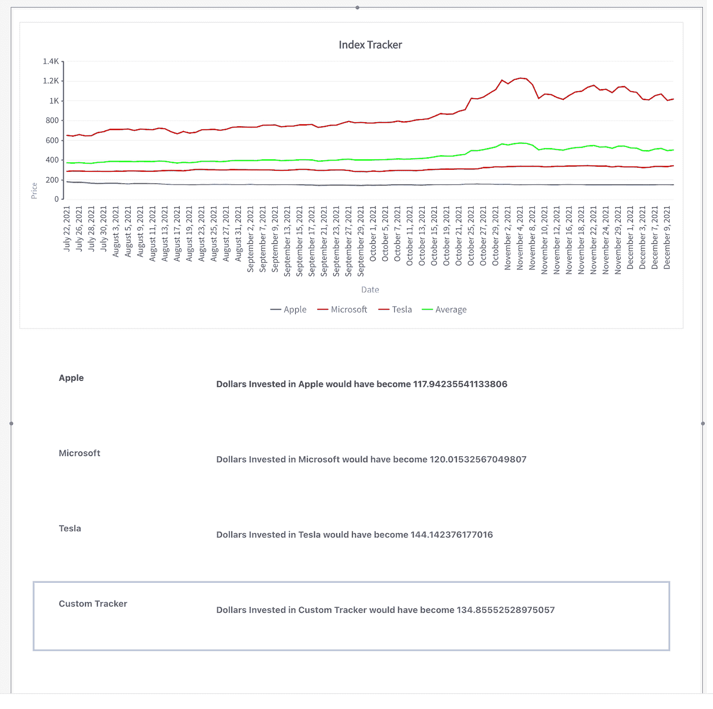

# 我如何用低代码创建了我自己的带有时间序列图表的股票指数跟踪器

> 原文：<https://javascript.plainenglish.io/how-i-created-my-own-stock-index-tracker-with-time-series-charts-using-low-code-2e53cad5549f?source=collection_archive---------6----------------------->

一步一步的教程来建立任何仪表板或跟踪时间序列图表使用低代码！


Photo by [Maxim Hopman](https://unsplash.com/@nampoh?utm_source=unsplash&utm_medium=referral&utm_content=creditCopyText) on [Unsplash](https://unsplash.com/s/photos/stock-market?utm_source=unsplash&utm_medium=referral&utm_content=creditCopyText)

最近开始投资，偶然发现一个产品叫 Smallcase。它的工作方式是——专家为你创建一个多样化的股票和交易所交易基金的长期投资组合，并及时管理它。我真的很喜欢如何将股票添加到投资组合或篮子中以减少市场波动的想法。不幸的是，目前这个产品只对印度投资者开放，这促使我开发了一个应用程序，在那里我可以创建一个投资组合，并在此基础上创建一个自定义指数，具有比较道琼斯/ S 和 p 等基准指数的功能。

从头开始构建这种应用程序会花费我很多时间；我将不得不选择一个前端框架，配置一个数据库，并在不同的可视化框架上工作，以构建时间序列图表。有了 [Appsmith](https://www.appsmith.com/) ，我能够在短短几个小时内完成这个应用。如果你还不知道，Appsmith 是一个开源的低代码框架，用于构建内部应用。在这篇博客中，我将带你浏览我创建这个应用程序的步骤。

首先，让我更详细地分享一下这个应用的规格。

使用此应用程序，您可以执行以下操作:

1.  **跟踪股票**:设置过滤器，默认全天跟踪哪些股票，或者创建特定列表。
2.  **制作自己的篮子**:将定制的股票投资组合制作成篮子。
3.  **比较业绩的时序图**:为这些投资组合创建一个定制指数，并使用时序图将它们与基准指数进行比较。
4.  **通知**:当市场有波动时发送通知和触发。

在这篇博客中，我还将致力于构建一些漂亮的时间序列图表，并构建我们可以与标准普尔 500、道琼斯和纳斯达克相比的股票指数跟踪器。

以下是该应用程序的一些截图:


Image by Author | Screenshot of Custom Index Tracker on Appsmith


Image by Author | Screenshot of Custom Index Tracker on Appsmith — 2

现在，让我们开始吧！

# 我用什么来构建这个应用程序呢？

> TLDR；我使用了 Appsmith 的、 [Fusion Charts](https://www.fusioncharts.com/charts/stock-charts) 、MarketStack 的[API](https://marketstack.com/)、 [Alphavantage](https://www.alphavantage.co/documentation/) 和 Google Sheets 作为后端来构建这个应用程序。

这个应用程序主要使用 Appsmith，这是一个开源的低代码工具，可以连接到任何数据库、API 或 GraphQL 来构建管理面板、仪表板和内部工具。Appsmith 还支持图表选项；它有一个内置的扩展，使用融合图表来创建数据可视化；这让我更容易构建自己的时间序列图表。为了实时获取所有股票数据和价格，我使用了 MarketStack 和 Alphavantage 的免费 API。

*(如果你按照这个教程来构建一个类似的应用程序，请记得生成你自己的 API 密匙！要了解更多关于生成自己的 API 密钥的信息，请阅读这篇博客)*

我用 Google Sheets 作为我的后台来查看股票列表，存储定制的股票投资组合和篮子。

# 创建篮子来分组和跟踪股票

创建投资组合的第一步，或者我喜欢称之为“篮子”，是建立一个用户界面。通过这种方式，一个表单可以包含我们的投资组合名称、创建时间和一个易于查看的徽标…以及一些虚荣心！😎

我用 Appsmith 和 Google Sheets 创建这个用了不到 5 分钟；我是这样做的:

注:我用过 Appsmith 的云版(社区版，免费)；您可以在使用 Docker 的本地版本或 Appsmith 的自托管版本上构建它。

*   在 appsmith.com 上注册一个新的免费帐户
*   点击数据源旁边的`+`图标，选择 Google Sheets 作为数据源。
*   授权您的 Google 帐户，并在保存数据源后点击`NEW API`按钮创建一个新的查询。
*   将查询名称重命名为`assBasket`，因为我们需要在 UI 上访问查询名称。
*   我创建了一个新的 google 表单，包含以下几列:

```
Basket Name
Basket Image URL
Basket Create On
```

*   复制了 google 工作表的 URL，并将其粘贴到电子表格 URL 属性下。
*   将查询类型设置为`Insert Sheet Row`

这样，我们的查询就准备好了。接下来，要在 Appsmith 上构建 UI，只需从屏幕右侧的库中拖放小部件。Appsmith 的画布响应速度非常快，你甚至可以在另外两个小部件之间拖动小部件，它会自动调整大小，为你节省宝贵的时间！我添加了一个容器小部件，这样我们的应用程序看起来就统一了；如果我们想让背景更加风格化，我们甚至可以选择添加颜色。然后，我放下了一个设置应用程序名称的文本小部件和一个按钮小部件。

它看起来是这样的:


Image by Author | Screenshot of Page 1 Custom Index Tracker

整洁，是吗？

接下来，因为我们希望有一个表单来创建新的购物篮，所以我们应该让按钮打开一个模态。为此，请单击按钮小部件上的设置图标以查看属性窗格。

> 在属性窗格中，我们可以配置小部件的所有属性。你可以打开它，只需点击小部件，你会看到它停靠在右边栏，就像上面的截图所示。

我们需要更新按钮的`onClick`属性，并将其设置为打开一个新的模态。您可以在那里创建它，或者将一个模态小部件拖放到画布上。两种选择都可行。你做你的。

接下来，我们需要表单的三种类型的输入，所以我向这个模型添加了三个输入小部件。您可以按如下方式设置标签:

```
Basket Name
Basket Image URL
Basket Create On
```

这是一台织布机的样子:

Screen Capture from Author

到目前为止，事情看起来很好，为了能够根据创建时间跟踪投资组合的指数，我认为最好使用 Appsmith 上预装的库，因为手动跟踪是不可能的。我用 moment.js 做到了这一点。

我们可以将`Basket Created On`的默认值设置为:

```
{{moment().format(“MM ddd, YYYY HH:mm:ss a”)}}
```

这将在创建投资组合时节省时间。

在 Appmsith 上，我们可以在平台的任何地方编写 JS，使用小胡子`{{ }}`绑定来添加定制。还自带了`moment.js`库；因此，在创建这些投资组合时，调用该函数将节省时间。

最后，我打开 buttons 属性窗格，设置`onClick`属性来运行一个查询，并选择`addBasket` query。

有了这个，我的 UI 都设置好了；最后，我返回到`addBasket`查询，将 Row 对象设置为如下:

```
{
 "Basket Name":{{Input1.text}},
 "Basket Image URL": {{Input2.text}},
 "Basket Create On": {{Input3.text}}
}
```

注意，我们将从输入小部件收集值，并通过`addBasket`查询将它们传递给 Google Sheets。

接下来，为了在这个页面上显示我们所有的购物篮，我们需要创建一个新的 API。我从 Google Sheets 数据源创建了另一个名为`getBasket`的数据库。我将查询方法更新为`Fetch sheet row`列出 excel 表中的所有内容。下面是截图:


Image by Author | Screenshot of getBasket query

接下来，我们必须将查询绑定到 UI 小部件。这部分可以这样做:

*   打开`List1` widget 的属性窗格，将项目设置为`{{getBasket.data}}`
*   在列表小部件中，选择图像并将图像属性设置为`{{currentItem[“Basket Image URL”]}}`
*   将文本小部件属性设置为`{{currentItem[“Basket Name”]}}`和`Basket Created On: {{currentItem[“Basket Create On”]}}`

这是它现在的样子:


Image by Author | Screenshot of getBasket query

以下是我们到目前为止所能做到的:

*   增加了添加新的投资组合/篮子并在 Appsmith 上列出它们的功能。

现在，我们将在这些投资组合中加入股票。为此，最好创建一个新页面来搜索股票并将其添加到购物篮中。

让我们创建一个新页面；可以选择左边栏的选项，命名为`‘Basket Page’`。这个想法是从`Page1`重定向到这个页面，并过滤篮子中的所有股票。

但是我们如何筛选股票呢？通常，我们会定期考虑一个`id`，并根据它进行过滤。类似地，在 Appsmith 上，当导航到购物篮页面时，我存储了购物篮页面的值，以便在购物篮页面上过滤和显示数据。

我可以将下面提到的代码片段用在一个新的按钮部件上，这个按钮部件放在列表部件上。因此，当单击时，它应该保存列表中选中的项目，重定向到购物篮页面，并进行相应的过滤。

我们需要按钮的`onClick`属性来:

```
{{
(function () {
    storeValue("selectedBasket", List1.selectedItem["Basket Name"]);
    navigateTo("Basket Page") })() 
}}
```

这里，我们需要使用来自 Appsmith 的 storeValue 将购物篮名称存储在一个名为`selectedBasket`的变量中，`List1.selectedItem`从所选择的列表项中复制数据。

接下来，我们需要使用`**navigateTo**` 函数重定向到一个新的页面。

# 将股票加入篮子

在我们将任何股票添加到我们的投资组合中之前，我们必须确保此页面根据从第一页选择的篮子过滤我的股票。因此，让我们添加一个容器和一个文本小部件来显示购物篮名称。

请注意，该值来自全局存储，因此在文本小部件的属性窗格中的文本属性上，我们必须绑定来自 Appsmith 存储的值，这可以通过一行简单的代码来完成:

`{{appsmith.store.selectedBasket}}`

好了，我们要添加的下一个很酷的功能是搜索功能。这样，我们可以轻松地搜索股票，并将其添加到篮子中；为此，我们需要添加另一个按钮和具有以下字段的模式:

*   输入部件
*   一粒扣得很紧的纽扣
*   列出所有结果的表格小部件
*   一个选择部件，将它们添加到我创建的购物篮列表中

> 表格小部件绝对值得高度赞扬。它允许我们添加过滤器和排序结果。我们可以根据股票的上市地点添加相关股票。例如，我可以简单地搜索纳斯达克，它过滤在那里上市的股票。如果您想知道使用表格小部件可以做的所有事情，您必须查看这个详细的博客。

在我告诉你我如何建造它之前，这里是它的样子:


Image by Author | Screenshot of Basket Page UI

搜索特性与 Stockdata 的一个简单 API 一起工作，为了集成它，我遵循了以下步骤:

*   点击数据源旁边的`+`图标
*   选择`Create New API`，粘贴以下网址:

```
https://api.stockdata.org/v1/entity/search?search={{stockcode.text}}&api_token=YOUR_API_HERE
```

*   将 API 查询重命名为`stockSearch`

为了让它工作，确保在这里添加来自 Stockcode 的 API 令牌。请注意，我在这里使用了`moustache`绑定。这将动态添加我在输入小部件中搜索的值。现在，让我们回到模态，更新小部件的名称。

我将小部件的名称重命名为以下名称，以便于将数据推送到工作表中:

输入部件:`stockcode`

表格小工具:`stockSearchTable`

现在，搜索 API 从输入小部件获取值，在表格小部件上，我们可以为以下功能绑定来自 API 的结果:

*   设置 buttons onClick 属性以运行查询，并选择 stockSearch query。
*   使用`{{ stockSearch.data }}`将`stockSearch`查询绑定到表格小部件

接下来，我们要选择要将搜索到的股票添加到哪个篮子中；为此，我只是从`Page1`复制了我的 API ( `getBaskets`，并用下面的代码将其绑定到所选的小部件上:

```
{{
getBaskets.data.map((row) => 
  {
    return {
      label: row["Basket Name"],
       value: row["Basket Name"]
    }
  })
}}
```

最后，我们需要将所有这些信息保存到一个 Google Sheet 上，所以让我们在同一个 Google Sheet 下创建一个新的电子表格，并从连接的数据源创建一个新的 API。我将这个工作表命名为`Watchlisted Stocks`，并将查询命名为`addtoBasket`。

这些是我在谷歌表单上的栏目:

```
symbol 
name
type
exchange
exchange_long
mic_code
country
watch_listed_on
basket
```

现在，在收集所有这些信息的查询中，我们必须将 Row 对象更新为以下内容:

```
{
"symbol": "{{stockSearchTable.selectedRow.symbol}}",
"name":"{{stockSearchTable.selectedRow.name}}",
"type":"{{stockSearchTable.selectedRow.type}}",
"exchange":"{{stockSearchTable.selectedRow.exchange}}",
"exchange_long": "{{stockSearchTable.selectedRow.exchange_long}}",
"mic_code": "{{stockSearchTable.selectedRow.mic_code}}",
"country":"{{stockSearchTable.selectedRow.country}}",
"watch_listed_on": {{moment().format('MMMM Do YYYY, h:mm:ss a')}} ,
"basket": {{Select1.selectedOptionValue}}
}
```

有了这最后一步，我们的监视名单就准备好了。然而，为了在页面上显示它，我们必须添加一个新的表格小部件。等等，我还得把所有被监视的股票从谷歌列表里调出来。这非常简单，我从 GSheets 数据源创建一个新的查询，将方法设置为`Fetch Sheets Row`，复制我的 GSheets URL，并将我的工作表名称更新为 Watchlisted Stocks。

现在，我们必须将它绑定到新的 table 小部件上，但在这里，它应该只过滤添加到这个篮子或投资组合中的股票，我在绑定时使用了一个简单的转换，使用了以下代码片段:

```
{{ 
    getStocksfromBaskets.data.filter((item) => {
       return item.basket == appsmith.store.selectedBasket
    }) 
}}
```

如您所见，我们现在根据重定向时保存的 Appsmith store 中的 selectedBasket 值过滤股票！

我们现在已经准备好了所有的投资组合和股票。
现在是数据可视化的时候了！

# 构建时间序列图表和跟踪索引

如前所述，Appsmith 的图表小部件附带了 Fusion Chart 配置，这使得构建时间序列图表变得更加容易。我喜欢的另一件事是，我甚至可以为我在应用程序中观察到的股票创建蜡烛图。这些图表被交易者用来根据过去的模式确定可能的价格变动。

首先，让我向您展示如何使用 MarketStack API 获取所有股票价格的详细信息:

*   在购物篮页面中，我创建了一个新的 API (marketStackAPI)，URL 如下:

```
http://api.marketstack.com/v1/eod?access_key=YOUR_API_KEY&symbols={{appsmith.store.current}}&date_from=2021-11-01&date_to=2021-12-12
```

注意:我正在过滤从 2020 年 11 月 1 日到 2021 年 12 月 12 日的数据，您可以根据您的需求相应地更新此 API。

在 API 中，您可以看到，我添加了一个名为 current 的 Appsmith 存储变量；这是为了动态获取我们想要分析或添加到我们的追踪器中的符号或股票的股价。

现在，我们需要在 JS 对象下编写一个代码片段，存储我的投资组合中所有股票的所有数据。

这是我用过的:

```
export default {

getBasketGraph: () => {let stocks = getStocksfromBaskets.data.filter((item) => 
item.basket == appsmith.store.selectedBasket)

  let stockcodes = stocks.map(item => item.symbol)

  let allStockData = [];

  stockcodes.map((item, index)=> {
    storeValue("current", item);
     marketStackAPI.run(()=> {
     let tempData = marketStackAPI.data;
     allStockData.push(tempData.data);
    }, () => {}, { allStockData });
  })

  storeValue("allStockData”, allStockData)

  return appsmith.store.allStockData;
 }
}
```

下面是这段代码的作用:

*   将篮子中出现的所有符号存储在 stockcodes 变量中
*   遍历 stockcodes 数组并将所有股票价格存储在一个新变量`allStockData`中
*   执行函数时返回存储变量

为了创建一个时间序列图表，我们需要将一个新的图表小部件拖放到画布上，在 table 小部件的下面。

它看起来是这样的:


Image by Author | Chart Widget on Appsmith

它带有一个默认配置，因此我们必须将类型更改为自定义图表，以便将数据配置到这个图表上。为了做到这一点，我们需要遵循特定的格式。以下是融合图表的基本配置:

```
{
  "type": "",
  "dataSource": {
    "chart": { },
    "data": [ ]
  }
}
```

这里，我们需要传入三个参数，图表配置、数据和需要在 x 轴上显示的类别。下面是更新后的代码:

```
{
    "type": "MultiAxisLine",
    "dataSource": {
        "chart": {
            "xaxisname": "Date",
            "vdivlinealpha": "",
            "labeldisplay": "ROTATE",
            "theme": "fusion"
        },
        "categories": [{
                "category": {
                    {
                        marketStackAPI.data.data.reverse().map((row, index) => {
                            return {
                                "label": moment(row.date).format("LL"),
                            }
                        })}
                }
            }
        ],
        "axis": [{
                "title": "Price",
                "dataset": [{
                        "seriesname": "Apple",
                        "data": {
                            {
                                marketStackAPI.data.data.map((row, index) => {
                                    return {
                                        "value": row.close,
                                    }
                                })}
                        }
                    },
                }
            ]
        }
    }
```

最后，这是我们的图表在上述配置下的样子:


Image by Author | Charts from Custom Index

此外，我还创建了一个列表，通过简单的数学运算告诉我们索引值:



Image by Author | Custom Index and Predictions with Simple Math

想象一下，有一个自己定制的 app 终端，可以在一个地方跟踪你所有的股票指数。如果你喜欢加密，你可以扩展这个应用程序，甚至有一个加密跟踪器。

我希望你能成功地遵循这个教程，并建立自己的应用程序。如果你被困在某个地方，我很乐意帮助你:)

*更多内容尽在* [***说白了. io***](http://plainenglish.io/) *。报名参加我们的* [***免费周报***](http://newsletter.plainenglish.io/) *。在我们的* [***社区获得独家访问写作机会和建议***](https://discord.gg/GtDtUAvyhW) *。*