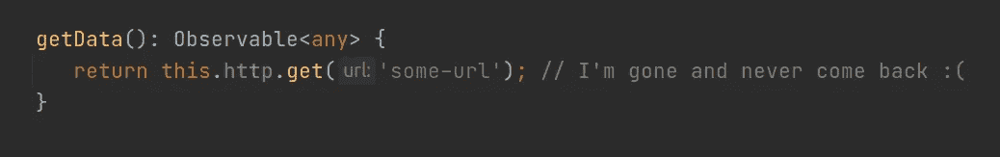
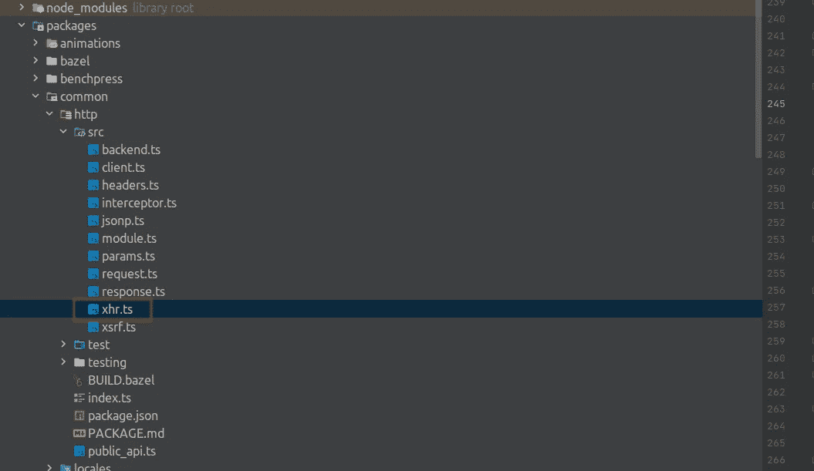
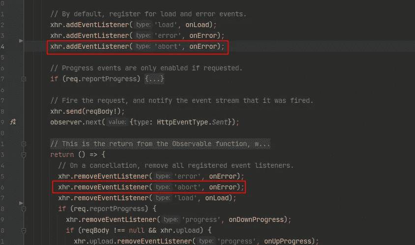
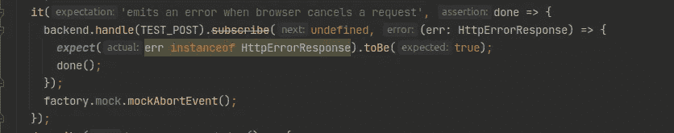
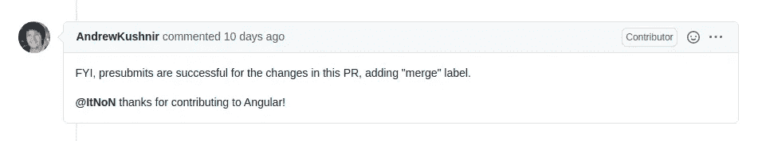

# 我如何修复 Angular 中的一个错误

> 原文：<https://javascript.plainenglish.io/how-i-fixed-a-bug-in-angular-1140b62e0194?source=collection_archive---------2----------------------->


Photo by [Caspar Camille Rubin](https://unsplash.com/@casparrubin?utm_source=medium&utm_medium=referral) on [Unsplash](https://unsplash.com?utm_source=medium&utm_medium=referral)

大家好！今天我要告诉你我是如何为 Angular 社区做出贡献的。您将了解一个大型开源项目的贡献过程，而我将阐明代码评审。我们开始吧！

# 问题

在我以前的工作中，我们有一个长期的 SPA 应用程序，用户可能会在很长一段时间内保持打开状态。在某个时候，我们注意到一些`Observable`HTTP 请求从未完成。



Sad Observable, that is never completed

在做了一些少量的研究后，我们发现 Angular 在浏览器自己取消 HTTP 请求的情况下不会响应 outer `XMLHttpRequest.abort()`。当用户关闭设备进入睡眠模式或按 Ctrl+S 保存网页时，就会出现这种情况。我们甚至找到了合适的[问题](https://github.com/angular/angular/issues/22324)。有人已经提出了修复这个 bug 的请求。我们在项目中写了一个带有`XhrFactory`的解决方案，期望这个补丁会被发布。

但是当我六个月后检查修复状态时，我发现这个问题仍然存在。由于作者没有更新，PR 被取消了。然后我决定:“这是我尝试开源开发的机会。”

# 贡献流程

首先，我通读了 Angular 的投稿指南，你可以在 [COUNTIBUTING.md](https://github.com/angular/angular/blob/master/CONTRIBUTING.md) 文件中找到。以下是你需要做的事情，以便 Angular 团队考虑你的公关:

1.  搜索 [GitHub](https://github.com/angular/angular/pulls) 寻找与您的提交相关的公开或关闭的 PR。
2.  叉项目。
3.  基于“主”创建新的分支。
4.  按照代码风格编写你的代码和至少一个测试。
5.  运行完整的角度测试套件。
6.  用正确的消息提交您的更改**。**
7.  签署贡献者许可协议(CLA)。
8.  为 Angular 的“主”分支创建一个 PR。

我想前三点已经很清楚了。我们将从第四点开始。这个对我来说更容易，因为有一个取消的拉请求，它需要改进。看看这个。

我们对后端的请求有问题。所以，我们需要检查`http`模块。快速找到合适的包。我们知道，这个问题与`xhr`和`abort`有关，因此在`http`模块中搜索`XMLHttpRequest`是在哪里创建的，以及`abort`事件是如何处理的。找到 **xhr.ts** 文件，了解我们已经达到目标。



Structure of http module

为`abort`寻找一个事件监听器。答对了。此事件未被处理。

我们只需要为`abort`添加一个事件监听器，然后如果 HTTP 请求失败的话，一个`Observable`将被完成并显示一个错误。别忘了为此写一个测试。在 **xhr.ts** 中已经有了我们可以使用的`onError`函数。只需要两行。



Two rows of changes

我有另一个想法，可以处理 HTTP abort，比如`HttpEvent`，而不是一个错误。那我们的解决方案会更复杂。但在我看来，当你无法控制的力量决定你的请求不再继续时，这种情况是相当错误的。

修复错误的代码已经编写完成。之后，我们需要对这些变化进行单元测试，目的很简单——如果`http`模块的功能改变了，一切都会正常。`src`目录中的每个文件都有自己的扩展名为 **.spec.ts** 的文件，用于`test`目录中的测试。算法很简单——找一个类似的测试，改一下。我还不得不延长一个模拟。



The test

测试已经写好了。现在我们需要运行所有的项目测试。这可能需要相当长的时间。做好准备。

当我们编写测试时，我们可以检查一个单独的模块，这样会更快。例如:

```
yarn bazel test packages/common/http/test
```

所有的测试都运行了。是时候提交我们的更改了。在此之前，我推荐做`yarn lint`，如果你不应用 [clang](https://clang.llvm.org/docs/ClangFormat.html) 自动格式化程序。代码风格是基础。

我们可以转移到我们的承诺。Angular 团队对[提交消息](https://github.com/angular/angular/blob/master/CONTRIBUTING.md#commit)命名有严格的规定。因此，我们仔细阅读了贡献指南中关于这一点的整个部分。

现在我们发布我们的分支。我们已经到了终点线。我们需要与谷歌签署 [CLA](https://cla.developers.google.com/about/google-individual) 。它允许贡献者保留他们对代码的权利，谷歌将拥有使用这些代码的合法权利。签署 CLA 只需要一次，它会扩展到谷歌的所有项目。

做 PR 等着吧，等有角团队审核的时候。

# 代码审查

在做了一些调查后，我准备等很长时间。但是我的拉取请求 13 分钟后就被审核了！获得如此快速的反馈真是令人惊讶。

Andrew Kushnir 认可了我的公关，并说我的改变对他来说很好。他还添加了 Alex Rickabaugh 作为评论者，因为 Alex 有更多的上下文。30 分钟后，他同意了，并写道，他原本有一些担忧，但他说服自己，这个公关是好的。

然而，这并不是结束。原来还有另一个类似的拉请求修复了[与`xhr timeout`的问题](https://github.com/angular/angular/issues/26453)，代码与我的完全相同。因此，当 PR 落地时，我们会有合并冲突。当时机成熟时，安德鲁要求我调整我的公关并解决合并冲突。我尽了最大努力，用`--force-with-lease flag`推动了我的改变。你可以在这里阅读更多关于这个标志[的信息。](https://git-scm.com/docs/git-push#Documentation/git-push.txt---force-with-leaseltrefnamegt)

第二天，Andrew Kushnir 为我的拉动式请求添加了“ *merge* ”标签，并对我的贡献表示感谢。几个小时后，我的变化是有角度的。



几天后，CHANGE_LOG.md 更新了错误已被修复，并将在版本 12 中发布。

# 摘要

这是一次非常有趣的经历。看到我写了很长时间的框架的结构，运行测试，并发现 Angular 团队中的过程是什么样子，这很令人好奇。事实证明，对开源框架做出自己的改变一点也不困难。

我希望你已经发现这是有用的。感谢您的阅读。

*更多内容请看*[*plain English . io*](http://plainenglish.io/)