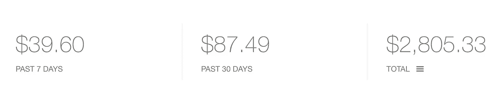
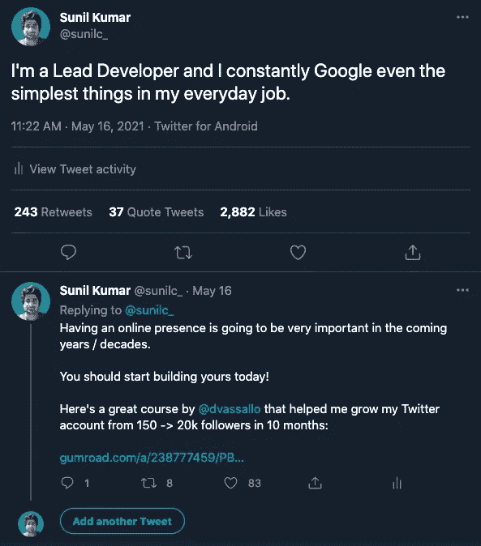
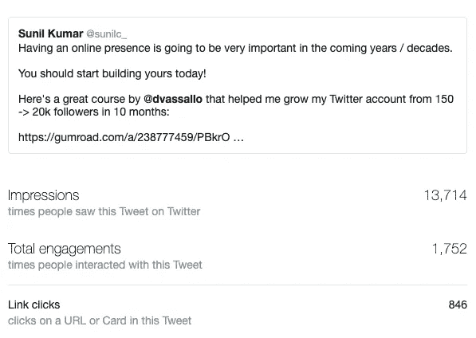
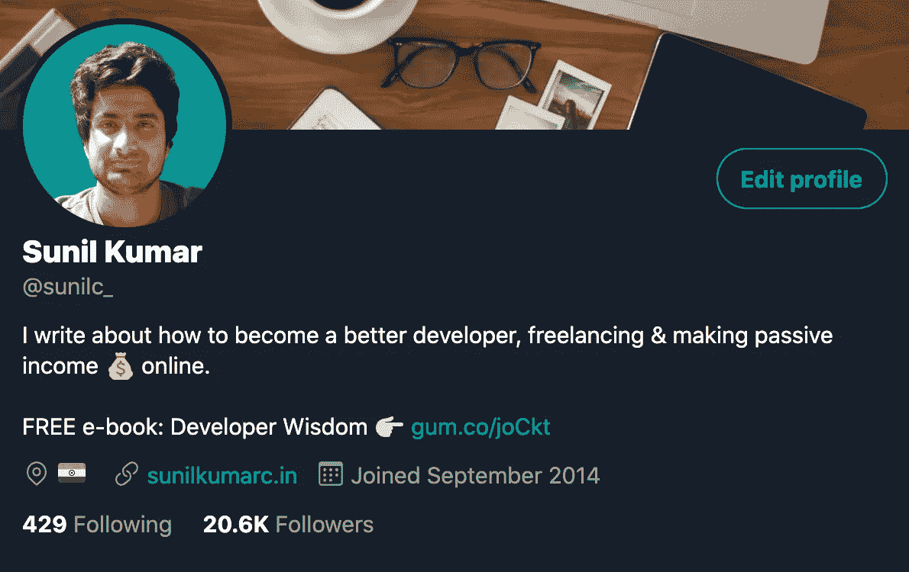
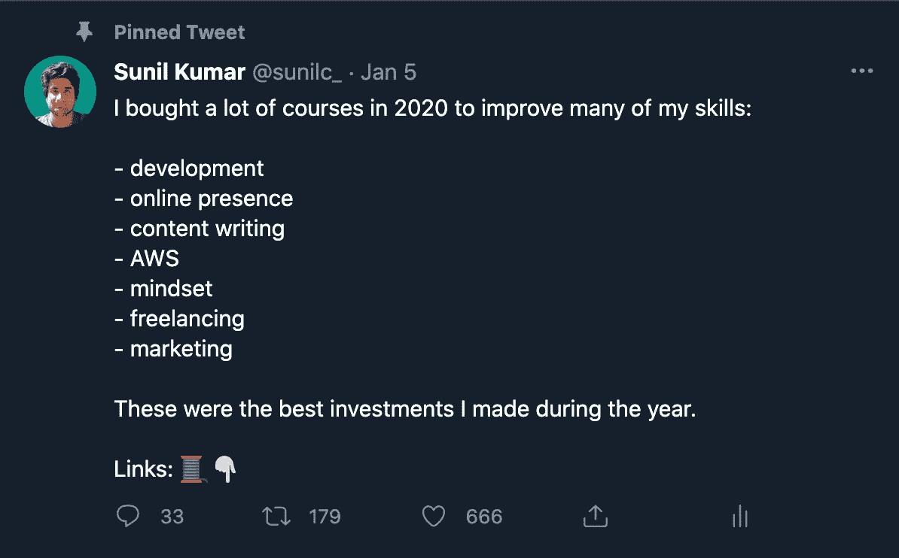

# 我如何在推特上平均每月赚 250 美元

> 原文：<https://javascript.plainenglish.io/how-i-make-an-average-of-250-every-month-on-twitter-eac90d567542?source=collection_archive---------6----------------------->

Photo by [Igal Ness](https://unsplash.com/@igalness?utm_source=medium&utm_medium=referral) on [Unsplash](https://unsplash.com?utm_source=medium&utm_medium=referral)

## 在 Twitter 上赚钱很容易。让我告诉你怎么做。

去年的某个时候，当我看到人们通过使用 Twitter 作为营销渠道赚了多少钱时，我意识到了在线存在的重要性。由于我是在互联网上营销和销售产品的新手，我对如何利用社交媒体建立在线业务感到震惊。

我不知道如何通过在线业务赚钱，但我意识到的最重要的事情是拥有在线业务很重要，它肯定会在未来以某种方式让我受益。

所以我开始在 Twitter 上建立我的在线形象，因为那时我主要使用 Twitter。

已经将近 11 个月了，我的帐户已经从 150 个追随者增长到 2 万个追随者。每个月我平均赚 250 美元。

我知道在这个时候这不是很多钱。但是我用最少的努力赚了这么多，实际上没有花很多时间。我主要是通过 Gumroad 上的联盟计划来赚钱。对于那些不知道什么是联盟计划的人来说，它基本上是你帮助别人销售他们的产品并赚取佣金。

# 我基本上做了三件事来达到这一步

1.  在 Twitter 上培养大量追随者
2.  每天免费提供有价值的内容
3.  偶尔推广电子书和附属链接

如何在 Twitter 上增加你的账户是一个全新的博客话题。有很多文章和电子书可以用来学习拓展客户的策略。我不会在这篇文章中讨论这个话题。

在这篇文章中，我主要想分享我使用的吸引我的观众从我分享的链接中购买的策略。

我主要遵循以下三个策略。

# 1.在推特上分享我的销售链接

Twitter 是一个帖子因各种原因病毒式传播的平台，没有人清楚地知道这些原因。这完全取决于 Twitter 的算法&有时是运气。尝试不同类型的内容，看看什么适合你。不能保证两条类似的推文会像病毒一样传播开来。其中一个可能会失败，另一个可能会成功。

无论如何，在我发布一些东西后，如果我看到这条推文/帖子正在传播，我会立即创建一条新的推文，其中包含我希望用户购买的链接。

例如，我的一条推文最近火了，看看我是如何在意识到这条推文火了几个小时后，在第二条推文中附上一个附属链接的。

自从这条推文在网上疯传后，我通常会获得很多印象/浏览量，进而获得很多链接点击量。虽然转化率相当低，但我确实获得了一些销量。

在写这篇文章的时候，我的销售推文已经获得了大约 13.7 万次点击和 846 次链接点击。这意味着有 846 个独立用户点击了这个链接，并且看过这个产品。如果你仔细想想，这对于一条没有任何广告的推文来说是非常好的可见性。即使我得到 1 或 2 笔销售，我也能赚 25 美元左右的佣金，对于一条几乎没花我一分钟时间写的推特来说，这是一笔很好的交易。

# 2.在我的个人资料中分享我的销售链接

在 Twitter 上建立受众的策略之一是通过分享有价值的内容和评论其他大账户，将用户引向你的个人资料。一旦用户打开你的个人资料，他们注意到的第一件事就是简历。

所以，如果你想把用户转化为你的追随者，你应该有一个杀手级的简历。bio 也是一个很好的地方来保存你想让新用户查看的链接。

如你所见，我在简历中有一个免费电子书的链接。所以当用户看我的简历时，他们会检查这个&如果他们喜欢这个产品，可能会下载它。由于这是一本免费的电子书，我没有从中赚到任何钱，但我确实收到了他们的电子邮件。现在我正试图建立一个电子邮件列表，这就是我提供免费电子书的原因。

但是你明白了。

你甚至可以在这里保留任何销售链接并赚钱！

# 3.保留一个包含我的销售链接的推文

Twitter 有这个功能，你可以发布一条特定的推文，它总是显示在你个人资料的第一条推文中。这是另一个保存销售链接的好地方。Pinned tweet 是用户访问您的个人资料时查看的另一个重要组成部分。

我保留了一条 tweet，它基本上是我推广的所有附属链接的线索。

聪明吧？

# 但是我在哪里可以得到这些附属链接？

问得好！

有成千上万的人在 Gumroad 上开设杀手级课程，其中大多数人都在 Twitter 上。当你开始建立你的观众群时，你会和那些在同一领域的人交朋友，他们要么在推广自己的课程，要么在推广别人的课程(比如我！).

一旦你找到这样的课程，你可以联系课程创建者，询问他们是否愿意将你加入他们。大部分创作者都会同意。但一些创作者只添加那些有足够好的追随者的人，至少有几千人。

一旦他们将你添加为会员，你将获得你独特的链接，你可以开始与你的观众分享，并开始赚钱！

# 分享销售链接时需要记住的重要事项

以上是我在 Twitter 上遵循的主要策略。但是在与你的观众分享销售链接之前，你需要记住一些事情。

*   当你在 Twitter 上建立受众时，你是通过分享某些小众话题的内容来实现的。因此，确保你分享的销售链接属于这些利基话题。否则，对产品不感兴趣的受众可能会认为你的内容是垃圾，不再关注你。
*   不要经常做。否则，你的观众会再次把你的内容视为垃圾，不再关注你。

# 结论

*   持续提供价值，建立信任，让人们愿意购买你的产品。
*   像病毒一样传播的推特是一座金矿。不要让它们浪费掉。在结尾添加行动号召。
*   不要经常分享销售链接。没有人喜欢跟随不断试图向他们推销东西的人。
*   你的简历和推文是保存销售链接的好地方。这些是用户访问您的个人资料时首先检查的内容。你的工作只是获得更多的访问。
*   有一个网上存在肯定会有好处，你这样或那样。即使赚钱不是你的首要目标，你仍然应该建立你的网络形象。
*   许多人仅仅通过 Twitter 销售信息产品、课程、SaaS 等就获得了改变生活的收入。今天就开始改变你的生活吧！

*更多内容尽在*[*plain English . io*](http://plainenglish.io/)