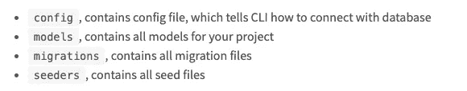

# 如何在微服务架构中使用 Sequelize 设置数据库迁移

> 原文：<https://javascript.plainenglish.io/how-i-setup-database-migration-using-sequelize-in-microservice-architecture-629cbc8115b6?source=collection_archive---------8----------------------->

Photo by [Mariko margetson](https://unsplash.com/@mightyhummingbird?utm_source=medium&utm_medium=referral) on [Unsplash](https://unsplash.com?utm_source=medium&utm_medium=referral)

# 介绍

很久以前，我与 Joe 就为基于微服务的架构建立迁移脚本存储库进行了一次对话。对话是这样进行的:

我:嘿，乔，我们在代码中使用了[序列](https://sequelize.org/)。但是我们的迁移呢？由于我们使用基于微服务的架构，如果我们在每个服务中编写我们的迁移文件，管理起来不会很困难，而且脚本分散在各处。

乔:嗯……你可能是对的。不如我们建立一个名为**迁移**的存储库。我们将把所有迁移脚本集中在该存储库中。因此，我们可以在单个存储库中对所有的变更有一个总体的了解。你怎么想呢?

我:听起来是个好主意。让我们开始寻找&解决这个问题。

# 逐步指南

在我们从头开始浏览分步指南之前，让我们对我们将拥有的东西有一个高层次的概述。

*   具有`sequelize-cli`依赖关系的节点项目
*   `models`文件夹中包含了所有的模型表。我们将总是在这里拥有最新的模型结构，因此整个团队将在存储库中检查最新的表结构。
*   `migrations`文件夹，包含使用`sequelize-cli`生成的所有迁移脚本和开发人员编码的数据库更改。

事不宜迟，让我们开始深入细节。

## 第一步。启动项目

这里是关于我们如何引导项目的命令，并且`sequelize-cli`库提供了引导命令，我们可以把它看作是移植库的样板。

上面的命令将创建名为`config`、`migrations,`和`seeders`的文件夹。下面是您的项目的截图:

sequelize [文档](https://sequelize.org/master/manual/migrations.html)也为这些文件夹的功能提供了非常直观的解释。下面是每个文件夹的描述截图。

现在，我们已经准备好了样板代码。接下来，我们将准备好环境变量，以便我们可以选择在不同的环境中运行迁移脚本。

让我们进入第二步。

## 第二步。使用环境变量的动态配置设置

您可能注意到了，配置是以`json`格式编写的。使用 json 格式，我们无法实现动态配置设置，这意味着每次都需要更改数据库名称、凭证，甚至其他配置。您需要进行代码更改&将源代码提交给存储库。

因此，我们可以按照以下说明使用动态配置进行设置。

*   在*配置*文件夹中创建一个名为`config.js`的文件
*   在根目录下创建一个名为`.sequelizerc`的文件。该文件的目的是覆盖默认配置位置为`config.js`。默认的配置文件是`config.json`
*   创建名为`.env`的环境文件，因为我们将使用 [dotenv](https://www.npmjs.com/package/dotenv) 库来加载本地测试中的环境配置。(如果您使用 pm2 等其他工具，此步骤可能是可选的)或 etc。
*   接下来，我们将安装 [dotenv](https://www.npmjs.com/package/dotenv) 库，并初始化它以将环境变量加载到`config.js`中

事不宜迟，让我们详细讨论一下每一个问题。

现在将以下内容粘贴到`config.js`中。在下面的例子中，我使用的是 MySQL 数据库。您可以随意使用自己喜欢的数据库，比如 Postgresql 或其他关系数据库。

接下来，我们将编辑`.sequelizerc`的内容，以覆盖默认位置`config/config.json`到`config/config.js`的配置文件位置。

在这一步的最后一部分，我们将在您的本地环境中创建`.env`文件，并定义您的数据库凭证。此外，我们还定义了`NODE_ENV` env 变量，该变量应该与您在`config.js`中定义的键相匹配。例如，如果您为 NODE_ENV 定义了`test`，那么 sequelize-cli 将使用在`test.`中定义的配置

此外，出于最佳安全实践，您不应该将该文件提交给存储库。因此，您的数据库凭证不会暴露给每个可以访问存储库的人。

> *注意:您可以将* `*.env*` *文件添加到您的* `*.gitignore*` *中，这样您的 Git CLI &客户端就可以忽略该文件，从而不会意外将其提交到您的存储库中。*

以下是我的`.env`文件的示例。我只在示例 env 文件中定义了测试环境的数据库凭据。

## 第三步。验证动态配置设置

在此步骤中，我们将尝试通过迁移创建一个简单的表，以验证迁移是否在存储库中成功运行。

我们可以按照以下说明验证设置。

*   使用`sequelize-cli`创建迁移脚本模板
*   通过创建用户表完成上面创建的脚本。创建包含多列的表
*   运行迁移命令&确保迁移脚本成功执行。

不用多说，让我们深入探讨每一个问题。

使用上述命令创建迁移脚本后，您将能够看到在*迁移*目录中创建了一个`.js`文件。现在，让我们继续添加迁移命令-创建表和回滚命令-删除表。下面是迁移脚本的示例:

接下来，我们将通过运行下面的命令来运行迁移脚本。

现在，让我们验证迁移脚本是否成功执行。您会看到新的*用户*表被创建。默认情况下，迁移脚本也存储在`SequelizeMeta`表中。请参阅下面的截图。

## 第四步。可选配置(可选)

现在，我们已经拥有了功能齐全的迁移存储库。但是我们可以有更多的额外配置，例如:

*   更改迁移存储表名称
*   更改播种机存储表名称

在此步骤中，我们将尝试将迁移存储表的名称从默认的`SequelizeMeta`更改为`migrations`。让我们深入研究一下。

默认情况下，sequelize 将迁移脚本名称存储在`SequelizeMeta`表中，以便跟踪哪些迁移已经执行，哪些没有执行。但是，我们可以将默认的迁移存储表名称更改为我们更喜欢的名称，在本例中，我们将它更改为`migrations`。

在更改迁移表名称之前，让我们通过运行下面的命令来回滚我们在步骤 3 中所做的更改。

您将看到下面成功回滚的截图。

成功回滚后，通过编辑`config.js`开始。我们将把`migrationStorageTableName`键添加到测试配置中。下面是编辑后的`config.js`的例子。

编辑后，我们现在可以运行 migrate 命令，现在您将看到迁移脚本已执行，新的`migrations`表已创建，我们的迁移脚本名称已记录在表中。参考下面的截图。

现在，我们的迁移脚本存储在迁移表中。

# 结论

在本文中，我们创建了一个用于迁移目的的集中存储库，其中存储了所有的迁移脚本和最新的模型文件。拥有集中式存储库的目的是解决迁移脚本分散在不同微服务中的问题。

此外，我们还深入探讨了细节:

*   引导迁移存储库
*   通过环境变量为不同的环境使用动态配置设置
*   通过创建一个简单的迁移脚本来验证设置是否正确
*   覆盖默认迁移存储表名称

最后但同样重要的是，您可以在这里获得迁移库[的完整源代码。](https://github.com/tlcheah2/sequelize-migration-microservice-example)

我希望这篇文章对你有所帮助，并和我分享你是如何在关系数据库中管理迁移的，我希望看到你的回应。

下篇见，感谢阅读。

*原创文章发表在我的* [*博客*](https://tekloon.dev/how-i-setup-database-migration-using-sequelize-in-microservice-architecture) *。*

**参考**:顺序迁移[文档](https://sequelize.org/master/manual/migrations.html)