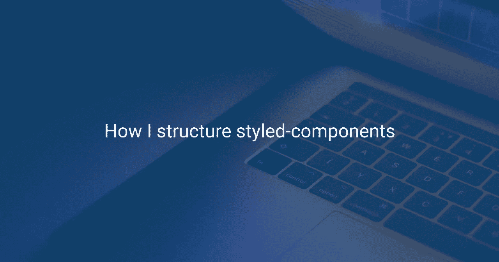

# 我如何构造样式化组件

> 原文：<https://javascript.plainenglish.io/how-i-structure-styled-components-9f139adc9032?source=collection_archive---------4----------------------->

## 样式组件是用 JavaScript 编写 CSS 的一种方法。它具有增强 React 组件样式的所有特性



*   自动关键 CSS —页面上没有不必要的代码，只在组件注入页面时呈现 CSS
*   动态样式——它根据道具调整组件的样式
*   支持全局 CSS
*   支持服务器端渲染(SSR)
*   自动供应商前缀
*   唯一的类名，这意味着没有类名错误

我用[样式系统](https://styled-system.com/)和[样式组件](https://styled-components.com/)配对。它使面向组件的设计生活方式变得简单😊样式化系统的样式函数 API 公开了强大的道具，利用这种杠杆作用，它使得样式化组件更加强大💪我们可以使用这些道具来设计基于主题的组件或元素。

在构建或开发组件时，出现的问题是

`How to design & develop the component, so that the component can be re-used?`

简单，我遵循[原子设计](https://bradfrost.com/blog/post/atomic-web-design/)方法学，它说——将 UI 的大块分割成小的、容易管理的组件。这使得组件可重用♻️

从主题开始🌈

我如何创建可以重复使用的♻️风格元素

如果我们扩展已创建的组件，我们可以创建一个继承主组件样式的新样式组件，并由此创建多个变体。例如

使用样式组件的基本演示👇

## 一切都很顺利，但是有什么问题吗🤔

当使用样式元素并在组件中定义这些元素时，从主题文件中了解所有的东西，如大小、间距、字体细节将非常困难😢所以我们每次都要参考主题文件。这将是一项乏味的任务。

## 我们如何解决这个问题？🤔

首先，让我们分离出标记并在主`theme`对象之外定义，比如字体细节、行高、半径和间距，我们也可以分离颜色。在定义别名时，在`theme`对象之外分离标记会更容易，这也使主题文件更具可读性

然后，定义字体细节的别名，行高，半径，空格和任何东西。这将有助于在组件中定义 props 时进行计算。我同意组件实例将随着时间的推移变得巨大，但这将有助于我们立即理解或调试组件。这也将减少时间旅行到主题文件😁

## 以前

```
<Button m={2} bg="blue" fontSize={3} color="white" p={3} border={0}>
    I'm a button
</Button>
```

## 在...之后

```
<Button bg="blue" m={theme.space.medium} fontSize={theme.fontSizes.title} color="white" p={theme.space.large} border={theme.space.zero}>
    I'm a button
</Button>
```

## 别名演示

## 定义更高的结构组件，如`aside`或`section`

这将定义组件以及将嵌入其中的所有样式。所有的标题，标签，锚可以按照设计定制。`styled-components`还允许我们在主组件中嵌入其他样式的组件，我们也可以覆盖它，这非常方便😉

## `as’`道具

这是一个多形态的道具💪将一个组件转换为任何组件。假设您创建了一个默认设置为`h1`元素的`Heading`组件，使用它们`as`属性，我们可以将标题组件转换为任何标题元素🤯

```
export const Heading = styled.h1``; // Now, use the Heading component with the as a prop <Heading>Deafult Heading</Heading> <Heading as="h2">I'm a Heading</Heading> <Heading as="h3">I'm a also a Heading</Heading>
```

感谢你阅读这篇文章，也请让我知道你是如何构建`styled-components`的