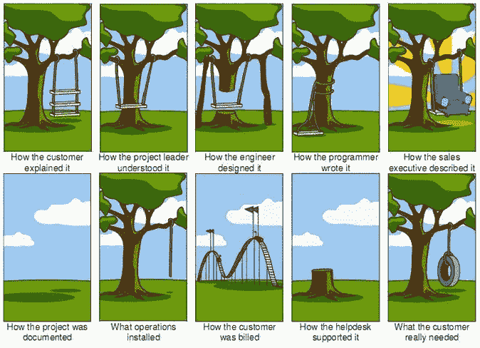

# 我是如何为一个小项目奋斗了七天的

> 原文：<https://javascript.plainenglish.io/how-i-struggled-with-a-small-project-i-worked-on-for-seven-days-bec304e1a595?source=collection_archive---------10----------------------->

## 在我看来，这是大多数编程问题的通病。

我将描述我与一个我应该执行的编程任务的斗争。此时，任务本身是无关紧要的。我的观点是呈现阶段，我必须面对的问题，在我看来，这是大多数编程问题的共性。我必须创建一个只有一个屏幕(GUI)分成两个部分(片段)的 Android 应用程序。

**与编程任务斗争的阶段(任何句子):**

*   没有计划和任务划分——即使是最小的任务也应该被计划和划分成更小的元素。
*   低估任务的复杂性——无知，低估任务。
*   将任务从较小的元素组装成一个整体——使用两个不同的库、框架实现方法。
*   洞察给定库、框架的理论知识——当使用新的库、框架时，你至少应该阅读所选问题的官方文档。
*   文档和教程的局限性——官方文档仅描述和展示孤立的理想解决方案。
*   概念验证、PoC、问题隔离—如果可能，我们会创建更小的独立项目来检查一个元素的运行情况。
*   我们对一行代码进行修改，测试，然后引入另一个修改；最好使用 TDD——测试驱动开发。
*   未能检查应用程序的需求——通常，程序员知道如何解决给定的任务，但不确定整个项目应该是什么样子，然后他不得不“从头再来”最后，问一句“应用程序作为一个整体到底要做什么”就足够了
*   有时你不得不从头再来，不再前进。
*   与编程无关的次要任务——有时您需要配置某些东西，例如服务器，获得对某些东西的访问权，例如 API 密钥。
*   在解决问题的过程中，结果并不像道路本身那样令人愉快——如果你有这种方法，编程就是为你准备的。

# 第一天

我检查了应用程序框架是否可以从 Android Studio (IntelliJ 版本的 Android)中创建项目的向导中生成。网上也有很多这方面的教程。既然可以从向导中生成一些东西，那么它肯定不会是一个困难的任务。我明天就开始。

# 第二天

生成设计后，一切正常，文本显示出来，按钮响应点击。我宣布了一个巨大的成功，并把剩下的任务推迟到第二天。

# 第三天

我开始把屏幕分成几个部分，几个片段。原来这也可以在向导的帮助下生成，网上有很多这方面的教程。我已经生成了另一个使用片段的项目。此时，我有两个独立的项目，包含两种不同的方法，两种使用 Android 框架的不同方式。碎片也能正常工作。又一次成功，第二天我就完成任务了。

# 在第四天

是时候把这两个项目结合成一个整体了。毕竟是有可能做到的，因为我在网上某处看到可以做到。我已经创建了第三个项目，其中将包含应用程序模板的第一个项目和片段的第二个项目。不幸的是，这已经不在官方文档中了。教程也没有提到这个问题。我不得不自己试错把所有的项目放在一起。最后，经过长期的斗争，终于实现了。

为什么我没有立即将代码片段添加到项目模板中，创建第三个项目呢？我们总是创建所谓的概念验证。我们验证给定的功能是否如我们所愿。然后我们将较小的 POC 合并成一个整体，这在大多数情况下不会出现在官方文档或教程中。这里你应该展示逻辑思维。

# 在第五天

一个新的需求“降临”到正在创建的应用程序上，对此我之前一无所知——数据应该显示在谷歌地图上。当然，虽然有向导和教程。我开始了第四个项目。对于 Google maps，还需要做一些与编程无关的活动，即创建一个 API 键。

现在我有四个应用程序—概念验证项目:

*   首先，Android 的应用模板
*   第二，GUI 屏幕中的片段
*   第三，第一和第二种设计的结合
*   第四，连接谷歌地图的应用

# 在第六天

事实证明，将“第四”项目与“第二”项目无缝连接是可能的，但将“第三”项目与“第四”项目连接是不可能的。

于是，项目捆绑又重新开始了。我创建了一个新的“第一个”项目，应用了“第四个”项目，然后添加了一个“第二个”项目。是的，是的，没有别的办法。你可能会问，但是怎么做呢？在官方文档中没有这样的配置，教程集中在孤立的问题上，例如 GUI 屏幕中的碎片，Android 中的谷歌地图。

有一段时间，我试图将项目“第三”和“第四”结合起来，但最好从零开始，我也这样做了。

# 在第七天

我向收到应用程序的人解释了为什么应用程序看起来和运行起来不像预期的那样。

从上面可以看出，实施这个“小”项目花了我六天时间。所以，我建议你不要晚上坐着，假设自己“一天”就能做到。

最好用常识来处理这个话题，并在一天之内完成给定的句子。我想补充一点，我描述的是一种只有我自己在完成特定任务的情况。

如果这个句子要由一个开发团队来执行，情况就会变得更加复杂。

*多内容于* [***浅显易懂***](http://plainenglish.io/)