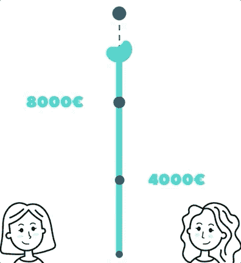

# 我如何成功地用 Remotion 创建了一个简单的淡出动画

> 原文：<https://javascript.plainenglish.io/how-i-successfully-created-a-simple-fade-out-animation-with-remotion-da92815ea26e?source=collection_archive---------17----------------------->

## 基于帧数的插值函数实例。


Photo by [Ferenc Almasi](https://unsplash.com/@flowforfrank?utm_source=medium&utm_medium=referral) on [Unsplash](https://unsplash.com?utm_source=medium&utm_medium=referral)

本文是远程系列文章的一部分。由 [JonnyBurger](https://medium.com/u/a6c9cee7d1f2?source=post_page-----ae0fac09a0e3--------------------------------) 使用 React 和 FFmpeg 创建的视频创建库。

摘要文章和完整的动画链接在本文的末尾。

# 我们将在本文中创建什么

这篇文章将向你展示如何创建蓝色竖条的淡出动画



Scale-out and pop in animation

如果您对如何创建“谢谢”消息感兴趣，这与本系列文章的第 1 部分中介绍的是同一个弹出式动画:

[](https://florentpergoud.medium.com/how-to-created-an-pretty-pop-in-animation-with-remotion-ae0fac09a0e3) [## 如何在动画中创建一个漂亮的 pop 动画

### 远程视频创作的简单介绍

florentpergoud.medium.com](https://florentpergoud.medium.com/how-to-created-an-pretty-pop-in-animation-with-remotion-ae0fac09a0e3) 

# 淡出动画

至于弹出动画，淡出动画是基于组件的**比例**的动画。

因此，我们需要三个部分来创建这个动画:

*   要制作动画的反应组件。
*   一些 CSS 样式和转换组件。
*   一个处理所有动画 JavaScript 代码的函数。

## React 和 CSS 部分

The JSX code animating our container

我在本系列的第一篇文章中使用了样式化组件。但是在这个例子中，它根本不是强制性的。

如你所见，这里没有魔法。如果你想让一个组件淡入或淡出，你必须改变它的规模。

> 该组件需要绝对定位在其父组件中。否则，当这个部件的高度改变时，你的整个构图就会改变。

## 将控制比例值的代码

下面是这段代码的作用:

*   我们希望比例值始终介于 1 和 0 之间。
*   缩放值将随着当前帧数的增加而减小。
*   然后当“durationInFrame”帧将被渲染时，该函数将总是返回 0 的比例值。

## 这是如何工作的

我们用于移除核心实用程序:

*   [useCurrentFrame](https://www.remotion.dev/docs/use-current-frame)():Remotion 独立渲染每一帧，可以并行渲染。那么每个动画都需要基于帧数，而不是基于时间。这个钩子返回实际的帧号。
*   [插值](https://www.remotion.dev/docs/interpolate)()，“允许您使用简洁的语法将一个值范围映射到另一个值范围。”

这里的插值函数是用

*   一系列帧号

```
[0, durationInFrame] -> [from, to]
```

*   比例值是介于以下值之间的值

```
[1,0] -> [from, to]
```

*   有一些延迟的实际帧号:

```
frame-delay 
```

# 那么这个挂钩用的是什么招数:

**夹紧动画**

为了理解它，我们必须更深入地研究一下“interpolate()**”**函数**。**

> 它根据给定的参数返回一个数字。

我们给它一个输入范围，一个输出范围和一个输入数。然后，它返回输出范围内的插值数字。

但是这些数字是我们和函数之间的契约。因为我们是人，所以这个功能是用来处理我们对这个契约的不尊重。

它将外推任何小于或大于输入范围的输入值。

因为我们给出的输入范围为:

```
[0, durationInFrame]
```

> ***外推左边的*** *会默认外推 0 以下的值*
> 
> ***外推右*** *将默认外推“durationInFrame”*上的值

很好是吗？

**嗯，以我们目前的情况，完全没有！**

那为什么呢？

因为我们不希望组件的标度大于 1 或小于 0。

谢天谢地，interpolate 接受了一个 [**选项参数**](https://www.remotion.dev/docs/interpolate#options) **。**

该选项参数允许我们处理**外推**和**缓和**设置。

我们现在将看到它如何允许我们添加一些延迟到我们的动画！

## 有一些延迟的动画

因为我们想要动画化组件的比例值，所以给我们的动画增加一些延迟意味着在动画开始之前将它设置为返回 1。

让我们再次检查我们的代码:

通过给定一个低于 *0* 或高于 *durationInFrame* 的值作为 *interpolate()，*的第一个参数，它将推断出输出值应该是多少。因此，这会输出一个超出[1，0]输出边界的值。

因此，通过将**外推左**和**外推右**设置为**“夹钳”，**我们告诉 interpolate()为:

*   如果帧数参数低于 *0* 则返回 1
*   如果帧数参数超过*持续时间帧*则返回 0

然后，当我们将“frame-delay”作为“frameNumber”参数传递时，它的行为类似于下面的伪代码:

```
if (frame < delay) return 1
if ((frame - delay ) < durationInFrame) return interpolatedValue
if ((frame - delay ) > durationInFrame) return 0
```

因此，使用该代码，我们实际上有一个介于 1 和 0 之间的标度值。缩放值将随着当前帧数的增加而减小。然后当“durationInFrame”帧被渲染后，动画将总是返回 0。

# 结论

现在，您已经了解了这个横向扩展动画中使用的所有内容！


Scale-out and pop in animation

请查看[插补()函数](https://www.remotion.dev/docs/interpolate)的完整文档。还有更多的东西有待发现！

**这是完整的动画**


你可以在下面找到这个系列关于动画的另一部分:

**第 1 部分:动画弹出**

[](https://florentpergoud.medium.com/how-to-created-an-pretty-pop-in-animation-with-remotion-ae0fac09a0e3) [## 如何在动画中创建一个漂亮的 pop 动画

### 远程视频创作的简单介绍

florentpergoud.medium.com](https://florentpergoud.medium.com/how-to-created-an-pretty-pop-in-animation-with-remotion-ae0fac09a0e3) 

*如果您有任何问题，请:*

*   *发表评论。*
*   *联系我上* [*推特*](https://twitter.com/FlorentPergoud) *。*
*   *或者加入我们的* [*移除不和谐*](https://discord.com/invite/6VzzNDwUwV) *！*

*——*——[——*弗洛伦特*——](https://medium.com/u/ad2d39110749?source=post_page-----da92815ea26e--------------------------------)

*更多内容请看*[*plain English . io*](http://plainenglish.io/)