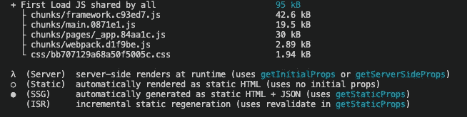

# 我从 Apollo 换到了 Urql(这是值得的)

> 原文：<https://javascript.plainenglish.io/how-i-switched-from-apollo-to-urql-in-my-next-js-site-and-why-it-was-worth-it-9c7394ec150d?source=collection_archive---------2----------------------->

在本文中，我们将研究 Urql 作为 Apollo 的替代品。我们将看看用 Urql 替换 Apollo 的实际情况，以及它对我的(Next.js)项目的影响。

如果您阅读了这篇文章，我将假设您要么已经实现了一个 GraphQL 客户端，并且对其他选项感兴趣，要么正在考虑实现一个 GraphQL 客户端。这就是为什么我假设您知道 GraphQL 是什么以及它是做什么的。

一些其他有用的信息，在这个项目中，我在前端使用 Next.js 和 SSG(静态站点生成)，在后端使用 Express 和 GraphQL 和 MongoDB 数据库。我正在做的并且充满热情的项目是 [winkt.io](https://www.winkt.io) (我们爱墨水)，一个扩展对纹身艺术欣赏的平台

# 转换到 Urql(如何实现)

该项目中当前的 Apollo 实现基于 next.js 中的 [with-apollo 示例](https://github.com/vercel/next.js/tree/canary/examples/with-apollo)。我们可以用新的 urqlClient 替换它:

urqlClient.js

要使用 Urql，我们需要创建一个客户端。Urql 中的 createClient 函数首先接收我们正在连接的 url。其次，我们设置交换条件。如果我们不定义交换，Urql 将默认交换设置为`exchanges: [dedupExchange, cacheExchange, fetchExchange]`。

> 重复数据删除交换—负责重复数据删除操作。
> *cacheExchange —* 负责缓存基于唯一查询+变量的 GraphQL API 响应(文档缓存)。
> *fetchExchange —* 使用 fetch 发送 GraphQL 请求，默认支持取消。

在我们的 urqlClient 中，我们定义了要添加的交换 *ssrCache* 。交换的顺序很重要，最重要的是 fetchExchange 需要最后进行，因为它是异步的。

ssrCache 将允许我们收集所有的结果，因为它们在服务器端被获取并发送到客户端。在客户端，我们可以使用结果来避免重新提取数据。

现在我们已经创建了我们的 urqlClient，我们可以将我们的应用程序包装在 urql 的 provider 中。我们可以通过覆盖 N [ext.js _app](https://nextjs.org/docs/advanced-features/custom-app) 组件来实现这一点。在这里，我们还可以使用来自服务器的数据来恢复客户端。目前在 pageProps 中我们的 urqlState 中没有任何内容，但我们将很快对此进行更改。我们来看看我们的 _app.js:

pages/_app.js

## **更新组件**

让我们看一下查询 GraphQL 数据的组件需要做的更改。在这个例子中，我使用 *getStaticProps* 来利用 SSG，如果您想利用 SSR，您可以将 *getStaticProps* 替换为 *getServerSideProps* 。

在下面，您会发现一个查询数据的组件的精简版本，第一个示例使用 Apollo，第二个示例使用 Urql。您可以查看 Urql 版本中的注释以了解更多信息。

Component that queries with Apollo

Component that queries with Urql

我们还将使用一个示例组件来查看突变的差异。同样，您会在 Urql 版本的注释中找到一些细节。

Component that performs a mutation with Apollo

Component that performs a mutation with Urql

最后，如果您有一个显示 GraphQL 错误的组件，您需要替换“[GraphQL]”而不是“GraphQL 错误:”。就这样，我们现在成功地实现了 Urql。

# 结果

First Load JS shared by all from 132kb to 95kb.

From 2.1s to 626ms in GraphQL calls on the product page

以及 Google PageSpeed 评分的提升。移动设备得分从 41 分上升到 65 分，桌面设备从 65 分上升到 95 分。

# **期末笔记**

*   我在几乎所有页面中都使用 GraphQL 数据，因此将整个应用程序包装在 Urql 提供程序中是有意义的。如果您的情况不是这样，那么您可以为 Urql 使用一个 HOC。
*   Urql 中的默认缓存策略是文档缓存，您也可以使用规范化缓存来防止不必要的调用，并告诉 Urql 在发生突变后需要进行哪些更新。

这是我的第一篇技术博客，我希望你喜欢，如果你对我有任何反馈，请在评论中告诉我。

*更多内容请看*[***plain English . io***](http://plainenglish.io)