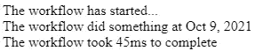

# 我如何使用 TypeScript 装饰器来解决编码问题

> 原文：<https://javascript.plainenglish.io/how-i-used-a-typescript-decorator-to-solve-my-issue-aa4816bf791f?source=collection_archive---------1----------------------->

Photo by [Michael Dziedzic](https://unsplash.com/@lazycreekimages?utm_source=medium&utm_medium=referral) on [Unsplash](https://unsplash.com?utm_source=medium&utm_medium=referral)

我目前正在开发一个 Angular 应用程序，我需要在其中显示工作流执行的历史。这些工作流由不同类型的步骤组成，实际上有许多不同类型的步骤，因此，我必须找到某种通用的和可重用的方式来显示它们。

该解决方案的第一个构建块是一个组件，它接收历史记录条目，并负责通过加载相应的组件来显示它。事实上，我希望有一个历史条目类型的组件。这样，我有非常轻的组件，只接收他们需要显示的数据。

假设我们有以下数组，对应于 REST API 返回的工作流历史。

因此，条目的类型决定了必须加载哪个组件，并且使用输入属性将“数据”属性传递给该组件。

可以想象，用于显示历史条目的组件看起来非常相似，因此我们将为它们创建一个基本组件类:

现在，我可以轻松地创建一个新组件来扩展这个组件，以显示历史条目。例如，假设类型“3”是指示工作流已完成的历史条目，并且应该显示工作流执行所用的毫秒数。

模板中使用的“数据”实际上来自基本组件，并将由实例化子组件的主组件传递。说到这，我们来实施一下。

我们首先在视图中添加一个“ng-template ”,用于实例化子组件。这个实例化是在“ngAfterViewInit”钩子中完成的。这里的主要问题(也是我写这篇文章的原因)是找到一种方法来知道组件工厂解析器需要根据条目类型返回什么组件工厂。不幸的是，目前还不可能(至少就我所知)获得一个定义的角度组件列表，以某种方式浏览和分析它们，从而获得组件和条目类型之间的匹配。

我的第一个解决方案是维护一个将条目类型与组件类型相关联的目录(基本上是一个数组)。它像预期的那样工作，但是它又是一个要添加到解决方案中的文件，而且大多数时候，我总是忘记它，浪费了几分钟才想起我必须为新的历史条目类型添加一个条目。

这就是为什么我决定学习一些关于装饰者的知识，希望它能改进我的代码，而且它确实做到了。这里的想法是向我们的组件添加一个装饰器，以便将它们与相应的条目类型相关联。让我们创建这个装饰器:

这里没什么复杂的。首先，我们创建一个映射来存储类型和组件类之间的关联。然后，我们创建装饰函数(“HistoryEntryComponent”)，该函数简单地将它所应用的类添加到 map 中，并带有传入参数的类型。最后，我们还创建了一个名为“GetHistoryEntryComponent”的函数，它根据条目类型返回组件类。

现在，我们可以将这个装饰器应用于历史条目组件:

> 我们使用 number 作为条目类型，但更好的做法可能是使用枚举或一些常数，在这里，我们尽可能简化代码，以便每个人都清楚。

现在，我们可以在主组件中使用函数“GetHistoryEntryComponent ”,以便获得与条目类型对应的组件工厂:

最后，我们只需要更新我们的应用程序组件模板来循环不同的条目:

所有这一切的结果如下:

因此正确的组件会根据条目类型进行实例化。

> 重要提示:如果您希望在不使用 Ivy 渲染引擎的应用程序中使用此解决方案，您还必须将入口组件添加到模块的“entry components”数组中。

总之，使用一个简单的 TypeScript 装饰器，我可以摆脱关联数组，以一种优雅的方式直接在组件中处理关联。

这篇文章的源代码可以在 [StackBlitz](https://stackblitz.com/edit/angular-uwvskx) 上访问。

*更多内容尽在*[***plain English . io***](http://plainenglish.io)