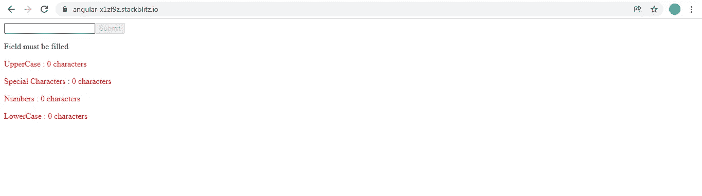
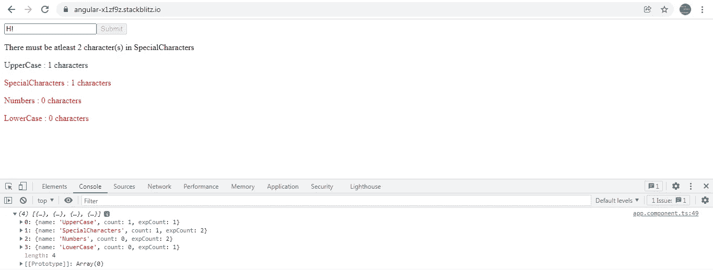

# Angular:我如何使用 Regex 来验证表单并显示文本框中输入的每个字符的类型(大写、特殊等)及其计数

> 原文：<https://javascript.plainenglish.io/how-i-used-regex-to-verify-and-display-the-type-uppercase-special-etc-of-each-character-typed-in-a-b959d3b487f8?source=collection_archive---------2----------------------->


Photo by [Clint Patterson](https://unsplash.com/@cbpsc1?utm_source=medium&utm_medium=referral) on [Unsplash](https://unsplash.com?utm_source=medium&utm_medium=referral)

在一些网站上(最近是 Myntra)，我看到了注册表单，用户需要在密码字段中输入大写字符或特殊字符。当用户输入他的密码时，显示输入的字符类型。该表单还显示用户输入特定类型字符的次数。

在我开始探索 Regex 之前，我从未对这个特性给予太多关注。Regex 是我一直回避的话题，因为它太庞大了。下面的网站在很大程度上帮助了我理解和测试 Regex。

[](https://regex101.com/) [## regex101:构建、测试和调试 regex

### 正则表达式测试器，语法高亮，解释，PHP/PCRE，Python，GO，JavaScript 的备忘单…

regex101.com](https://regex101.com/) 

回到故事，我想分享一个与我在这些网站上看到的功能非常相似的例子。



Character Validator Form

我们的目标如下:

1.  用户可以在文本框中输入最多 8 个字符的**。增加这一限制是为了使测试更容易。用户应该至少输入 **1 个大写字符、2 个特殊字符、2 个数字和 1 个小写字符。****
2.  **我们已经展示了 4 种过滤器类型:**大写、特殊字符、数字和小写**。只要每种类型下的**字符数少于预期数**，这些类型就会显示为**红色**。如果这些类型**下的计数超过预期计数**，标签颜色从**红色变为绿色**。**
3.  **最后，只有当每个过滤器类型的预期字符数都满足时，用户才能提交表单。**

**由于过滤器类型和每个类型下的预期字符数是一个常数，我们将使用名为 **count** 的 **enum** 来定义这个数据。enum 的键包含过滤器名称，对应于该键的值包含用户需要为该过滤器类型输入的预期字符数。**

**我们还导出了一个函数 **getFilterList()** ，它返回 enum 的所有键(过滤器名称)的数组。今后，我们将在多个地方使用该列表。**

****AppComponent 模板:****

**该模板包含一个简单的表单 **characterValidatorForm** ，其中包含一个文本框，并应用了一个指令 **valueCheck** 。在这个例子中，这个指令将完成我们的大部分工作。**

**我们有一个名为**过滤器**的对象数组。每个对象包含 3 个属性:**名称，计数和支出。****名称**属性将包含值**大写、特殊字符、数字和小写。****count**属性将包含用户在上述每种类型下输入的字符数，而 **expCount** 属性包含为使表单有效而在每种类型下输入的字符数。**

**只要表单无效，**提交**按钮就会保持禁用状态。**

**我们将**过滤器**数组作为@Input()传递给 **valueCheck** 指令。**

**每次从 **valueCheck** 指令触发 **filterCountUpdated** 事件时，都会调用 **filterCountUpdated()** 。每当筛选器类型的 count 属性更新时，都会触发此事件。**

**每当过滤器类型的预期计数与过滤器类型的预期字符数不匹配时，我们还会显示一条错误消息 **errMessage** 。**

**如果过滤器类型的**计数**属性超过或等于**支出计数**属性，那么匹配的 CSS 类**将被应用到< p >标签。否则，CSS 类**不匹配**将被应用。****

```
.**matched**{
color:green;
}.**not-matched**{
color:red;
}
```

**现在让我们跳到 **AppComponent 类**。**

**这个类非常简单。**

1.  **正如已经讨论过的，该类定义了**过滤器**数组。我们已经使用导出的方法 **getFilterList()** 和 enum **count** 来填充数组中每个对象的 **name** 和 **expCount** 属性。**
2.  ****characterValidatorForm** 只有一个 FormControl **textbox** 。**

```
public **characterValidatorForm** = new FormGroup({ 
**textbox**: new FormControl(‘’) 
});
```

**3.在 ngOnInit()生命周期钩子中，我们将一个名为 **characterValidator** 的自定义验证器应用到这个 FormControl 中，通过 **setValidator()** 显示错误消息。**

```
**ngOnInit()** {
this.setValidator();    
this.returnErrorMessage();
}
```

**我们还编写了错误消息显示的逻辑。我们已经使用了 **returnErrorMessage()** 来设置 **errMessage** 属性，以便向用户显示。**

****returnErrorMessage()和 setValidator()** 被调用两次:第一次加载组件时，以及每次更新过滤器类型的计数时。**

```
**returnErrorMessage()** {
let errObject = this.characterValidatorForm.get(‘textbox’).errors;
this.**errMessage** = errObject ? Object.keys(errObject)[0] : ‘’;
}
```

**一旦我们完成了指令，我们将返回到 **filterCountUpdated()** 。**

****ValueCheckDirective 类:****

1.  **从 AppComponent 接收到作为 **@Input() filterList** 的**过滤器**数组。**

```
@Input(‘filterList’) filterList: any;
```

**我们将**更新**过滤器列表**中的计数属性**，并将其发送回 AppComponent 以更新显示。**

**这里，我们再次调用了导出的方法 **getFilterList()** 来将过滤器名称存储在属性 **filterNameList** 中。**

```
public filterNameList = getFilterList();
```

**2.每当用户在文本框中输入内容时，就会触发一个 **keyup** 事件。我们设置了一个 **@HostListener** 来监听这个 keyup 事件，并调用 **onKeyUp()** 方法。**

**A.每次触发该事件时，我们都希望将每个过滤器类型的 count 属性重置为 0。应该对每次按键重新进行计数计算。**

```
this.filterList.map((x) => (x.count = 0)); 
```

**B.考虑一个场景，用户输入几个字符，然后删除所有字符。在这种情况下，我们需要用每个过滤器类型的最新计数值来更新 AppComponent。**

```
if (!value.length) { 
**this.filterCountUpdated.emit(this.filterList);** 
}
```

**C.文本框中输入的文本可以是单个字符串或一串字符。我们正在遍历字符串，并使用 **match()将每个字符与一个正则表达式进行匹配。****

**/^[A-Z]*$/检查字符是否是大写字符。**

**/^[a-z]*$/检查字符是否是小写字符。**

**/^[0–9]*$/检查字符是否是一个数字。**

**/^\W$/检查字符是否是数字或字母以外的任何东西。**

```
for (let i = 0; i < value.length; i++) { 
if (value[i].match(**/^[A-Z]*$/**)) { this.updateFilterCount(this.filterNameList[0]); }else if (value[i].match(**/^[a-z]*$/**)) { this.updateFilterCount(this.filterNameList[3]); 
}else if (value[i].match(**/^[0–9]*$/**)) { this.updateFilterCount(this.filterNameList[2]); 
}else if (value[i].match(**/^\W$/**)) { 
this.updateFilterCount(this.filterNameList[1]); 
} 
}
```

**每当有任何正则表达式匹配时，我们调用 **updateFilterCount()** 将过滤器名称作为参数传递。**

**D.在 **updateFilterCount()** 中，我们首先检索 filterList 数组中对象的**索引，该数组具有与方法参数中传递的过滤器名称相同的**名称属性**。我们使用该索引来增加相应对象的计数属性**。最后，我们通过 **filterCountUpdated** 事件发射器将**更新的 filterList** 数组发送回 AppComponent。**

```
**updateFilterCount(filterName: string)** { let match = this.filterList.findIndex( (filter) => filter.name === filterName );
this.filterList[match].count++; 
this.filterCountUpdated.emit(this.filterList); 
}
```

**现在让我们检查由 **filterCountUpdated** 触发的事件是如何在 AppComponent 中由 **filterCountUpdated()** 方法处理的。**

```
**filterCountUpdated(filterList) {**
console.log(filterList);
this.filters.forEach((filter) => {
let match = filterList.findIndex((fltr) => fltr.name === filter.name);
filter.count = filterList[match].count;this.setValidator();
this.returnErrorMessage(); 
});
}
```

**当我输入“H！”在如下所示的文本框中，我已经记录了指令发送给 AppComponent 的更新后的 **filterList** 数组。我们正在迭代**过滤器**数组属性和**更新来自**过滤器列表**数组的每个过滤器类型的计数属性**。**

**每个筛选器类型的更新计数显示在 AppComponent 模板中。**

**我们还重置了自定义验证器 **characterValidator** 并更新了错误消息属性 **errMessage。****

****

**为了理解 FormControl **textbox** 的错误验证是如何发生的，我们需要检查自定义验证器 **characterValidator** 。**

```
export function **characterValidator**(filterList: any) {
 return (control: AbstractControl): ValidationErrors | null => {
//logic
}
}
```

**我们已经将 AppComponent 中的 **filters** 数组作为参数传递给了下面的 **setValidator()** 中的 **characterValidator** 函数。**

```
**setValidator() { **   
this.characterValidatorForm.get('textbox')     .setValidators([**characterValidator(this.filters)**]); this.characterValidatorForm.get('textbox').**updateValueAndValidity**();  }
```

**characterValidator 函数将返回一个错误对象，该对象在键和值为真时包含**错误消息，或者返回 null。在后一种情况下，它意味着 FormControl 没有错误。****

**因此，对于每种过滤器类型，我们检查用户输入的字符数是否等于或超过预期数。如果没有，我们会显示一条错误消息。错误信息不是硬编码的，完全由**枚举计数**控制。因此，我们必须更新过滤器名称或预期计数，我们只需要更新枚举。其他地方不需要改变。**

**你可以在下面的链接查看整个作品:**

**[](https://stackblitz.com/edit/angular-x1zf9z?file=src/app/app.component.ts) [## 角形(叉形)堆叠

### 编辑描述

stackblitz.com](https://stackblitz.com/edit/angular-x1zf9z?file=src/app/app.component.ts) 

## 进一步阅读

[](/best-tool-for-web-scraping-beautifulsoup-vs-regex-vs-advanced-web-scrapers-50b8fb92950d) [## 最佳网络抓取工具:beautiful soup vs . Regex vs . Advanced Web Scrapers

### BeautifulSoup、正则表达式或高级 web scraper——哪一个是 web 抓取的最佳工具？深潜…

javascript.plainenglish.io](/best-tool-for-web-scraping-beautifulsoup-vs-regex-vs-advanced-web-scrapers-50b8fb92950d) 

*更多内容请看*[***plain English . io***](https://plainenglish.io/)*。报名参加我们的* [***免费周报***](http://newsletter.plainenglish.io/) *。关注我们关于*[***Twitter***](https://twitter.com/inPlainEngHQ)[***LinkedIn***](https://www.linkedin.com/company/inplainenglish/)*[***YouTube***](https://www.youtube.com/channel/UCtipWUghju290NWcn8jhyAw)*[***不和***](https://discord.gg/GtDtUAvyhW) ***。*****

*****对缩放您的软件启动感兴趣*** *？检查* [***电路***](https://circuit.ooo?utm=publication-post-cta) *。*****