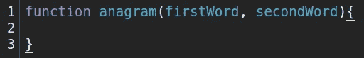

# 我将如何处理和解决这个经典的技术面试问题

> 原文：<https://javascript.plainenglish.io/how-i-would-approach-and-solve-one-of-the-classic-technical-interview-questions-16cebb0f5d41?source=collection_archive---------14----------------------->

当你试图解决一个你从未见过的问题时，被观察和分析会非常令人生畏。尤其是当你能否得到这份工作取决于此的时候。在本文中，我们将了解一个经典技术面试问题的变体。我将带您了解我将如何处理它，以及我将采取哪些措施来解决它。

我们将关注您在求职过程中很可能遇到的面试问题。面试官可能不会以完全相同的方式陈述问题，或者你被要求解决的问题看起来可能完全不同，但是你可以用这个基本的方法让你自己走上正轨。

我们开始吧！

给定两个字符串，编写一个函数来确定第二个字符串是否是第一个字符串的字谜

现在，这里是一个深呼吸的好地方。您可能会认为您有一个解决方案，或者您可能会觉得如果您开始编写代码，解决方案就会显现出来。这种情况可能会发生，但根据我的经验，一旦我意识到我的解决方案没有考虑到某些优势情况，或者我没有完全理解预期，最终得到的解决方案并没有完全解决问题，我就不得不从头开始。所以，深呼吸，试着完全理解这个问题。

询问期望什么，函数应该返回什么，边缘情况如何…等等。一旦你很好地理解了对你的期望，确定你的输入和输出将会是什么样子。什么进入了这个功能，什么出来了。这里我们有两个输入(两个都是字符串)，只有当字符串包含完全相同的字母并且每个字母出现的次数完全相同时，我们才希望返回 true。否则，我们会看到错误的返回。我们不会担心边缘病例。

现在我们已经完全理解了这个问题，对我们的期望是什么，我们的输入和输出将会是什么样子，我们可以开始编写一些伪代码，或者甚至只是列出我们需要采取哪些步骤来解决这个问题。

我们知道，我们需要一个接受两个参数的函数，让我们从这个开始。

好吧，那现在怎么办？嗯，我想我们可以有把握地说，如果第二个单词比第一个单词有更多或更少的字符，它就不能是字谜。这段代码非常直接，应该不会对我们解决方案的其他部分有任何影响，所以让我们继续添加这段代码。

太好了。如果这两个字符串的长度不同，那么第二个字符串不能是第一个字符串的字谜，因此，我们返回 false。

接下来会发生什么？我想解决这个问题的方法是创建两个对象(每个字符串对应一个对象)，其中键是字符串中的字母，值等于该字母在字符串中出现的次数。例如，如果字符串“强调”，对象将如下所示:

`{s:3 t:1 e:2 d:1}`

两个对象包含各自的键:字母的值对和它们的出现，我们可以比较对象。如果第一个对象中的键与第二个对象中的键不匹配，那么第二个字符串不能是第一个字符串的变位词，我们返回 false。此外，如果第二个对象中的任何键的值不同于第一个，那么第二个字符串不能是第一个字符串的变位词，我们返回 false…这需要记住很多东西，所以让我们写出我们的步骤，一次完成一个。

写下这一点可能看起来微不足道，但它向面试官展示了你的思维过程。这也表明你知道为了解决问题需要做什么。这样，如果你没有时间或者忘记了某件事的语法，你至少可以向他们表明你已经很好地理解了要得到想要的结果需要做什么。

现在我们只需要将伪代码转换成有效的 JavaScript。让我们从创建对象开始。

很简单！现在我们要查看字符串中的每个字母，并将其添加到相应的对象中。根据我们的伪代码，在我看来这是一个使用“for…of”循环的好地方。这是一个很好的例子，说明了为什么我们应该等到把代码分解成步骤后再开始写代码。这里，在第 11 行，我们的伪代码准确地告诉我们“对于每个字符串的每个字母”我们需要做什么。如果我们刚刚开始编写代码，而没有想清楚并制定行动计划，这是一个我们可能会陷入困境的地方。通过写下我们的步骤，我们可以清楚地看到需要做什么。这也让我们能够跳过我们不确定正确语法的部分(如果有时间，请确保稍后返回)，或者简化一些内容，如果有时间，稍后再增加复杂性。

这里我们只是循环遍历`firstWord`，对于每个字符，我们检查它是否存在于我们的`firstObj`对象中。如果是的话，我们就把这个数字加 1。如果没有，我们通过将它的值设置为 1 来将它添加到我们的对象中。

现在我们对`secondWord`和`secondObj.`做同样的事情

因此，在这一点上，如果字符串的长度不同，我们将返回 false。如果它们长度相同，我们将为每个字符串创建一个对象，其中键等于字符串中出现的字母，值等于每个字母出现的次数。我们的下一步是比较`firstObj`和`secondObj`，看看它们是否包含完全相同的键值对。让我们看看我们的伪代码。在第 32 行，我们写了“对于第一个对象中的每个键”。看来我们又成功了！嗯，我想我们应该在这一段使用一个“for…in”循环。

现在让我们检查一下`firstObj`中的每个键是否存在于`secondObj`中。如果不是，我们将返回 false。

我们还需要检查每个键的值是否相同。如果不是，我们也将返回 false。

如果它通过了我们的长度测试，键匹配并且它们的值匹配，那么我们应该返回 true，因为第二个字符串确实是第一个字符串的变位词。

是的，解决了问题感觉很好，但此时你应该问自己是否有什么可以重构的地方来提高性能，使代码更简洁或更可读。这看起来会很快。

如果您熟悉大 O 符号，这将有一个线性性能曲线(O(n))。这比我们使用嵌套循环来解决问题要好得多，嵌套循环的时间复杂度为 O(n)。我不打算在这里讨论大 O 和时间/空间的复杂性。如果你想了解更多，你可以在这里找到更多信息。无论如何，我不认为我们需要担心这里的性能。

然而，我确实认为我们应该检查和清理一下，特别是我们的“if…else”语句。我认为我们可以在这里使用三元运算符，并且仍然保持较高的可读性。因此，让我们用三元运算符替换“if…else”语句，并清理伪代码。

我对这个解决方案很满意，我想面试官也会很满意。为了测试这一点，我们可以在 Chrome Dev Tools 的“Sources”标签下运行它。

## 结论

就是这样！我们已经创建了一个很好的小算法来解决一个常见的面试问题，将问题分解成更容易处理的部分。

最后一点建议:尽你所能解决问题。

开始时花点时间去理解问题，但是不要太担心效率或者你的代码有多漂亮。只要解决问题，然后如果需要的话，你可以回过头来重构。开心快乐编码！

*更多内容尽在*[***plain English . io***](http://plainenglish.io)