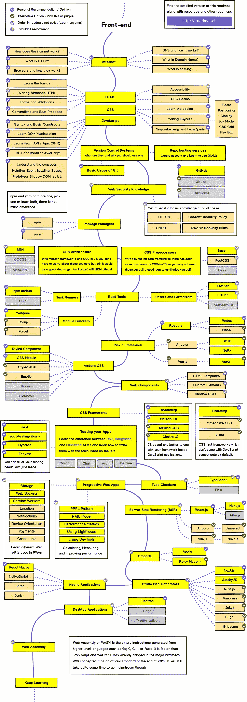
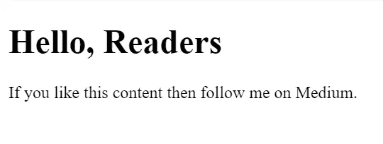
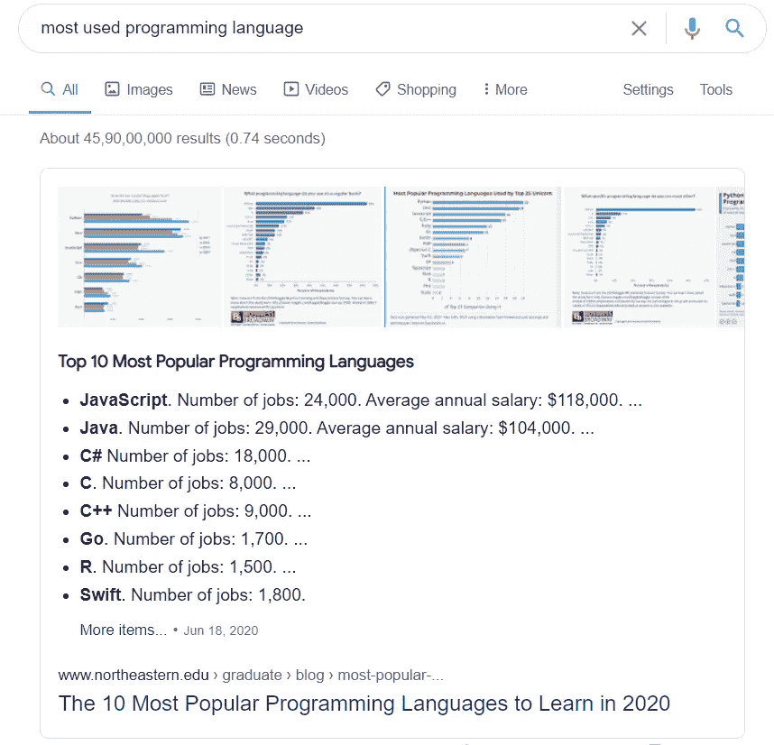
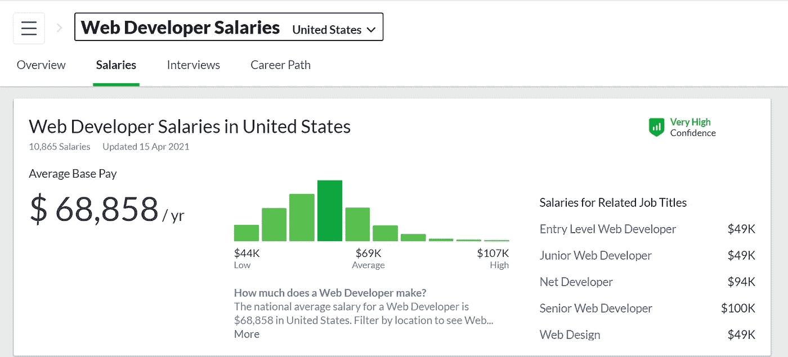
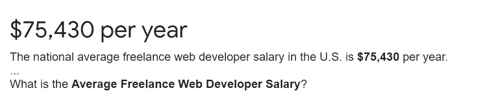

# 如果我必须重新开始，我将如何学习前端 Web 开发

> 原文：<https://javascript.plainenglish.io/how-i-would-learn-front-end-web-development-if-i-had-to-start-over-again-24e6228050d0?source=collection_archive---------3----------------------->

## 一个白手起家的 web 开发者的故事。


Photo by [ThisisEngineering RAEng](https://unsplash.com/@thisisengineering?utm_source=medium&utm_medium=referral) on [Unsplash](https://unsplash.com?utm_source=medium&utm_medium=referral)

我在学习 web 开发的时候，对它知之甚少。没有路线图，没有指南，没有免费资源等。

我没有计划任何事情。因此，我学习了 WordPress、Webflow、Strapi、HTML、CSS、JavaScript、Bootstrap、jQuery、React、Node.js、Express、MongoDB、Mongoose、Git、Three.js 等等。

我不得不努力学习和获得最好的资源。但是你不会——我敢肯定！在本指南中，您将找到作为 web 开发人员入门所需的一切—从路线图到最佳免费资源、免费咨询、指导以及您可能需要的任何其他内容。

在继续下一步之前，不要只是看或读然后离开。总是练习你正在阅读或观看的内容。我犯了这个错误，浪费了我的时间。有时我会花几个小时解决一个错误，如果我在练习时尝试了关键的概念，这个错误可能会在几分钟内解决。

例如，React 完全依赖于 JavaScript。如果你没有练习过 JavaScript，你只是在浪费时间去学习 React。

同样，如果你没有掌握 React 的概念，你也不可能成为 React 原生应用开发者。

学前端开发激动吗？我们开始吧。

# 学习核心概念



Source: GitHub

这里是前端 web 开发的完整路线图。看一看，至少试着理解它。

嗯，你们中的许多人可能会问我:*“我们是否必须学习路线图中显示的所有内容？”*

我的回答是不——一点也不！学习 HTML、CSS 和 JavaScript，这将帮助你创建网站。

如果你接着学习 React、Angular 或 Vue.js，你会很容易找到工作。

那么，我们开始吧。

如果让我从头再来，我肯定会先学 HTML，CSS，JavaScript。

为此，有大量的教程、免费资源和付费课程。

让我给你一点建议:web 开发是一个庞大的主题，所以你不能支付所有的费用。与此相反，你可以免费学习，因为在 [YouTube](/youtube-channels-that-helped-me-become-a-self-made-web-developer-8644621f4bfe) 、 [Google](/how-to-learn-web-development-using-free-resources-1c677e70de14) 、Udemy 等网站上有很多免费资源。

以下是 2021 年针对网页设计师和网页开发者的 [80+免费资源列表。](/80-free-resources-for-web-designers-and-web-developers-in-2021-f400be2875ea)

我来给大家介绍一下 HTML，CSS，JavaScript。

# 什么是 HTML？

HTML 是一种标记语言，代表超文本标记语言。它用于向网站添加内容。您在特定网站上看到的内容仅因 HTML 而可见。您可以在 IDE 中运行 HTML 代码，如 Visual Studio 代码、Sublime Text、Atom 等等。

HTML 由类似于`<h1>`(用于标题)和`<p>`(用于段落)的标签组成。这是一种有趣的语言。只需写一行并获得输出。

例如:

```
<!DOCTYPE html> 
<html>
<body>
  <h1>Hello, Readers</h1>
  <p>If you like this content then follow me on Medium.</p> 
</body>
</html>
```

这里，我们显示一个 h1 标签和一个段落标签。

这段代码的输出如下所示:



Source: Author

我会看一些 YouTube 视频来了解它，然后收藏各种网站，如 W3Schools、MDN 等。

# 什么是 CSS？

CSS 用于样式化内容。它是级联样式表的缩写。它是用来使网站有吸引力的。

再次检查上面的 HTML 代码。它不显示背景色或阴影。这是因为我们还没有对它应用 CSS。

因此，CSS 增强了 HTML 并告诉元素如何在网页上显示。

CSS 主要由 3 种类型组成:

1.  内联 CSS。
2.  内部 CSS。
3.  外部 CSS。

为了帮助你更好地理解，我们将使用内联 CSS。内联 CSS 是一种可以在 HTML 标签中添加样式属性的 CSS。

例如，我们在 body 标签中添加了一个样式属性。我们只是把身体的背景颜色改成了粉色:

```
<!DOCTYPE html> 
<html>
<body style="background-color:orange;">
  <h1>Hello, Readers</h1>
  <p>Thanks.</p>
</body>
</html>
```

并且输出将具有橙色背景颜色。

是不是很酷？

同样，就像 HTML 一样，对于 CSS 也一样，我会看一些 YouTube 视频来了解它，然后将各种网站如 W3Schools、MDN 等加入书签。

当我需要学习一些困难的概念时，我会访问 W3Schools、MDN 等网站。

有超过 [12 个 YouTube 频道学习 Web 开发](https://medium.com/code-blog/top-12-youtube-channels-every-web-developer-should-follow-4b5a4f6ee1e4)——你可以订阅并观看你需要的内容。

之后，我会用 HTML 和 CSS 创建一些有趣的网站。

当我对 HTML 和 CSS 有了扎实的理解之后，我会直接开始学习 JavaScript。

# JavaScript 是什么？

那么，动态网站呢？这一切都归功于 JavaScript。

甚至谷歌也提到 JavaScript 是目前最流行的编程语言。



Source: Google

JavaScript 是一种编程语言，主要用于客户端，以帮助网页更具交互性。

HTML 和 CSS 是赋予网页结构和风格的语言，而 JavaScript 为网页提供了吸引用户的交互式元素。

让我们用一个例子来解释它是如何工作的。

想想你的房子。用砖块和水泥建造你家的基础和框架都是 HTML 的一部分。粉刷和装饰你的房子是 CSS 的工作。集成技术——像物联网——是 JavaScript 的一部分。

就是这样。前端 web 开发的核心由 HTML、CSS 和 JavaScript 组成。

YouTube 视频、 [W3School](https://www.w3schools.com/) 、 [MDN](https://developer.mozilla.org/en-US/) 、 [javaScript.info](https://javascript.info/) 都是学习 javaScript 足够好的资源。

后来我会学习 React，Angular，或 Vue.js .这样我就可以轻松找到工作。

# 额外收获:为网络开发者赚钱

嗯，你知道一个网络开发人员挣多少钱吗？每年超过 68，858 美元。我说的是一个普通的网络开发者。



Source: Glassdoor

我在美国消费者新闻与商业频道上看到一个视频，说一个 UX 设计师每年挣 75，000 美元。是不是很酷？如果你想看视频，这里[就是](https://www.youtube.com/watch?v=aQ5l6pfHwdc)。

最后但并非最不重要的一点是，根据谷歌的数据，一名自由网络开发者的平均年薪为 75，430 美元。



Source: Google

现在，我们来回顾一下一个前端 web 开发人员的工资。

据 skillcrush.com 称，在美国，入门级前端网站开发人员职位的平均工资为 61，000 美元以上。

根据 Indeed.com 的数据，在美国全职工作的入门级前端 web 开发人员平均年薪为 61，512 美元。

如果你有任何疑问，请在这里评论。我会尽量尽快回答。谢谢！

***如果你喜欢我的工作，想要支持，可以*** [***请我喝杯咖啡！***](https://www.buymeacoffee.com/nitinfab)

***前端 web 开发资源:***

[](https://medium.com/code-blog/getting-started-and-earning-105-813-yr-as-a-web-developer-for-beginners-19b2cd26fcc2) [## 作为一名面向初学者的 Web 开发人员，开始工作并获得每年 105，813 美元的收入。

### 成为 Web 开发人员的简单方法。

medium.com](https://medium.com/code-blog/getting-started-and-earning-105-813-yr-as-a-web-developer-for-beginners-19b2cd26fcc2) [](/80-free-resources-for-web-designers-and-web-developers-in-2021-f400be2875ea) [## 2021 年为网页设计师和网页开发者提供 80+免费资源。

### 成为网页开发者的完整指南。

javascript.plainenglish.io](/80-free-resources-for-web-designers-and-web-developers-in-2021-f400be2875ea) [](/how-to-learn-web-development-using-free-resources-1c677e70de14) [## 如何利用免费资源学习 Web 开发

### 初学者的深入指南。

javascript.plainenglish.io](/how-to-learn-web-development-using-free-resources-1c677e70de14) [](https://medium.com/code-blog/top-12-youtube-channels-every-web-developer-should-follow-4b5a4f6ee1e4) [## 每个网络开发者都应该关注的 12 个 YouTube 频道。

### 为网络开发者提供免费的 YouTube 资源。

medium.com](https://medium.com/code-blog/top-12-youtube-channels-every-web-developer-should-follow-4b5a4f6ee1e4) [](/youtube-channels-that-helped-me-become-a-self-made-web-developer-8644621f4bfe) [## YouTube 频道帮助我成为了一名白手起家的网络开发者

### 一个白手起家的 web 开发人员的故事，他对编码没什么兴趣。

javascript.plainenglish.io](/youtube-channels-that-helped-me-become-a-self-made-web-developer-8644621f4bfe) 

> 这个故事的一点点重复了我的另一篇 freecodecamp 帖子的一些细节。

*更多内容请看*[*plain English . io*](http://plainenglish.io/)