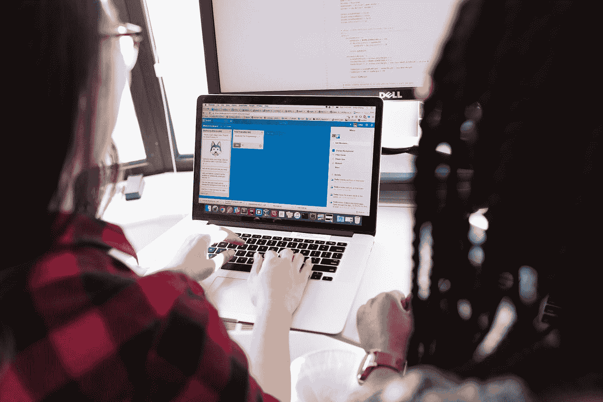

# 冒名顶替综合症如何阻碍了你的编程生涯

> 原文：<https://javascript.plainenglish.io/how-impostor-syndrome-can-get-in-the-way-of-building-a-programming-career-4e3392dba9dd?source=collection_archive---------27----------------------->

## 作为一名程序员，我与骗子综合症的斗争。

Photo by [Christina @ wocintechchat.com](https://unsplash.com/@wocintechchat?utm_source=medium&utm_medium=referral) on [Unsplash](https://unsplash.com?utm_source=medium&utm_medium=referral)

很多开发者有时候缺乏自信。但如果有人认为他的成功纯粹是运气，或者是别人的功劳，那大概就值得你重新审视一下自己对自己的态度了。我将分享一个关于冒名顶替综合症如何阻碍职业发展以及如何开始欣赏自己的故事。

看起来我的开发生涯遵循了一个标准的场景。我 15 岁开始创建网站。我在技校学的是编程和网页设计。我进入了我最想去的大学计算机工程系，并以优异的成绩毕业。我在一家大型科技公司完成了实习。我写的代码被数百人使用。尽管如此，我并不认为自己是一个好的程序员。

## 我对自己有了不同的看法。

我被大学录取了，因为学生中应该有一定比例的女生。多亏了善良的老师和简单的科目，我的平均绩点很高。我是因为面试才被录用的。他们问了一些我知道的事情。我被赋予了优秀的品质，因为我遇到了简单的任务。由于聪明的程序员朋友的帮助，她在大学里很好地处理了项目。

我取得这一切完全是由于一个幸运的巧合，我设法欺骗每个人说我不是一个好的程序员。我一直担心有一天我会写不出必要的代码或修复错误。然而，一个接一个，我成功地掌握了新的语言和框架，完成了项目，并且总是按时完成。

根据一些研究人员的说法，女性更有可能经历冒名顶替综合症。这不太可能适用于其他领域的活动，但是在开发中，他们经常觉得他们“错误地”进入了这个行业。

## 我从来不符合我作为一名优秀程序员的形象。

我对各种组合键或编程语言的一些微妙之处并不了解，只有少数人知道。我无法热情地谈论这种或那种技术的利弊。没有为了好玩发表算法的科学报告。没有因为代码没写完而坐不吃午饭。最后，我一集《星际迷航》都没看过。

似乎所有优秀的程序员都应该知道很多，而与他们相比，我几乎一无所知。我只是不知道没有这些技能我怎么能成为一个人。我决定一个好的程序员永远不会从我身上出来，那不是我的。所以当我们开始创业时，我开始从事市场营销。我仍然在编码，但这只是一个前端，而不是真正的*开发。*

有一天，我的一个同事告诉我，他对我的 JavaScript 代码印象深刻，我认为他是一个优秀的程序员，能够背诵 C 标准。我开始意识到我在虐待自己。

## 有两件事让开发人员觉得自己很失败，尽管他们实际上做得很好。

1.首先，程序员在编写代码时几乎总是要学习一些新的东西。技术正以令人难以置信的速度发展。正因为如此，看起来你总是“跳出框框”，需要掌握的信息量越来越多。

2.第二，编程与失败有着千丝万缕的联系。与其他技能不同，技能来自实践，在编程中，你必须不断地失败，尝试新事物，再失败，再尝试其他东西，直到成功。

新手开发人员和专业人员之间的一个主要区别是，专业人员有更多的经验和备用选择。看着刚开始发展的人，我才知道在不断的跌倒之后继续前进是多么的困难。

如果你没有意识到编程不会以其他方式发生，你会认为自己是一个糟糕的程序员，即使你的成功表明并非如此。我因为太多我不知道的事情而如此绝望，以至于我没有注意到这些年来我逐渐学会的一切。随着时间的推移，我意识到成为一名优秀的程序员没有任何障碍。你需要扩展“专业”的概念，把你自己也包括进来。

## 冒名顶替综合症让我对失败产生了压倒性的恐惧。

我害怕说或问一些可笑的事情，因为周围的人会认为我没有经验。我更加害怕，因为我是几乎所有与我一起工作的团队中唯一的女孩:如果我说了一些愚蠢的话，那只会证实女性在发展中没有位置。所以，如果我对自己的能力没有信心，我会悄悄地试着逃避任务。

任何技能只有通过努力才能获得，但我确信如果我不知道如何做某事，我将永远也学不会。这是最大的错误:我没有接受新的东西，也没有学习，因为害怕我会失败。

两年前，我彻底回归编程。这一点我比营销做的好很多。我开始构建 iOS 应用程序，使用 Ruby on Rails，并开始掌握最新的前端框架。多年的代码工作经验，加上朋友和同事的支持，让我相信了其他人一直告诉我的话:我是一名优秀的开发人员。

*更多内容尽在*[***plain English . io***](http://plainenglish.io/)