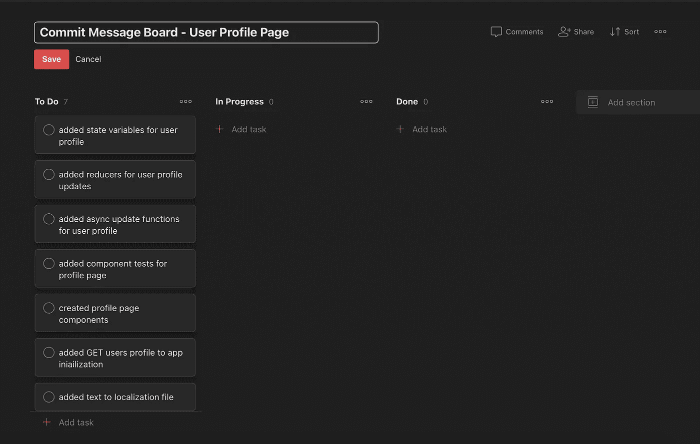
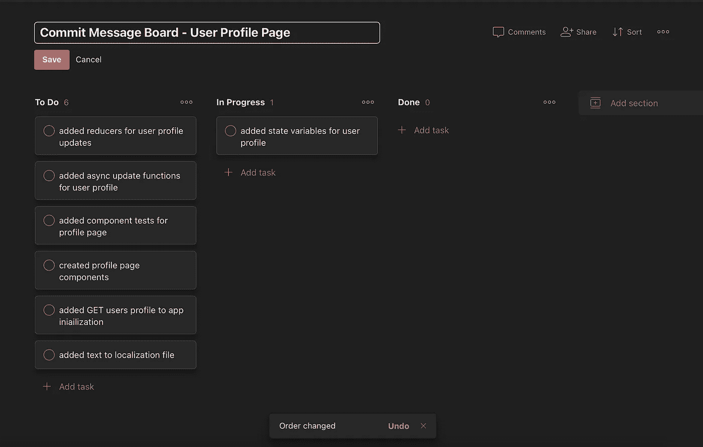
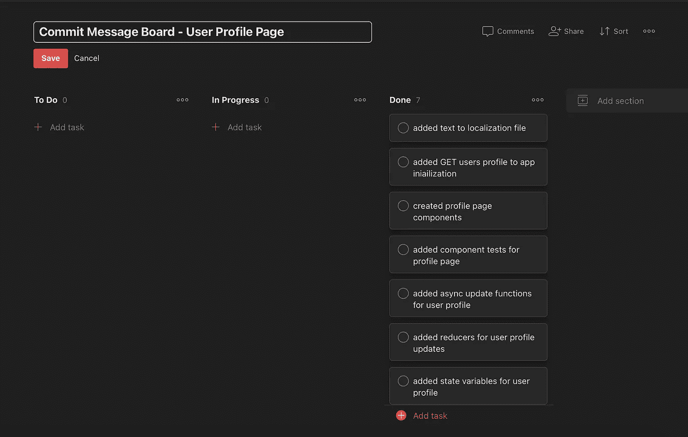

# 看板如何帮助我写出更好的提交信息

> 原文：<https://javascript.plainenglish.io/how-kanban-helps-me-write-better-commit-messages-af53e6c046e5?source=collection_archive---------22----------------------->

最近，当提到写提交消息时，我一直在努力摆脱我的懒惰倾向。

在过去的两年里，我一直在独自开发一个大型前端应用程序。在那段时间里，我的提交信息变得相当糟糕。我很容易忽视他们在项目中的重要性，因为没有人审查这项工作。

我最近的一些作品包括:

*   "重构"
*   "向导的更多功能"
*   "测试更新"
*   "更多更新"

这些消息太糟糕了，它们没有传达任何关于我工作的有用信息。在注意到足够多的这些懒惰的信息后，我决定尝试一些方法来使我未来的信息变得更好。

在我尝试改进提交信息的所有方法中，最好的工具是看板。看板直观地描述了流程各个阶段的工作，用卡片表示工作项目，用列表示流程的每个阶段。

我工作的公司已经使用看板来跟踪新功能的进展，所以我已经熟悉了工作流程。我用 Todoist 做我个人的看板。

假设我有一个需要制作的用户资料页面的新功能。

这就是我将如何构建董事会。我尽最大努力用提交消息的声音来计划任务。你会看到所有这些条目都是用过去式写的。我将一次将一个项目移动到正在进行的步骤中，并添加使消息为真的代码。

一旦我完成了一个任务，我就将该消息复制并粘贴到提交中。

一旦所有的消息都完成了，我应该有一个完整的提交消息的特性，它让我所做的事情变得透明。

即使没有人阅读这些信息，我也不会总是一个人工作。当我回到一个团队时，我会写一些承诺信息来帮助别人。

*更多内容看*[***plain English . io***](http://plainenglish.io)