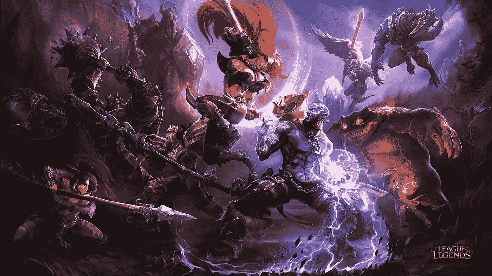
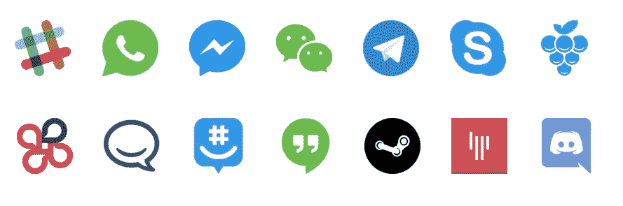
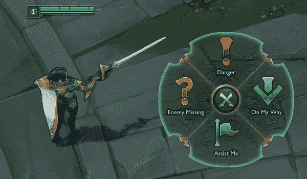
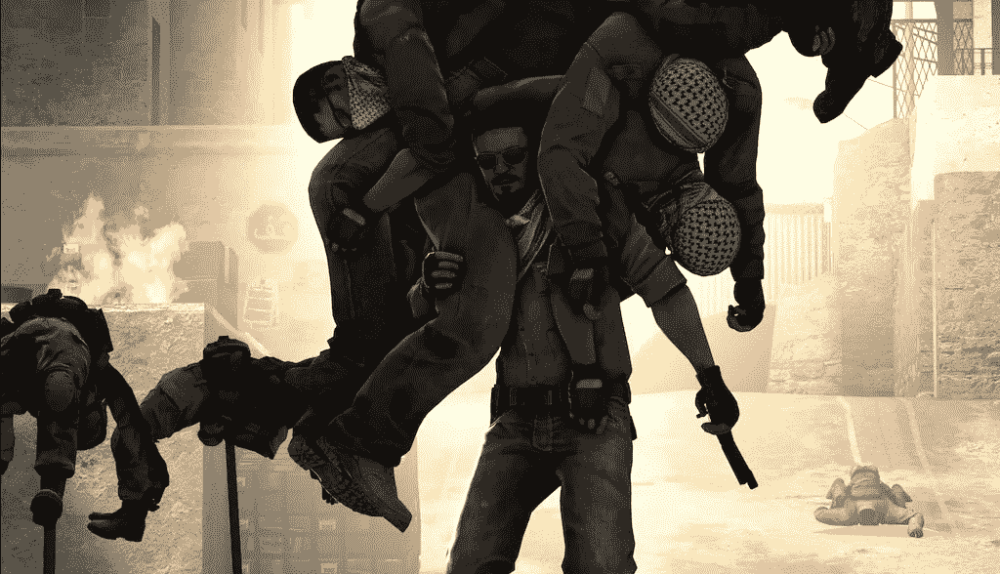
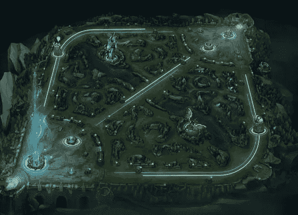

# 英雄联盟如何让我成为一个更好的开发者(和人)

> 原文：<https://javascript.plainenglish.io/how-league-of-legends-made-me-a-better-developer-and-person-a99a69742525?source=collection_archive---------23----------------------->

《英雄联盟》是世界上最大的在线游戏之一。这项游戏已经存在了 11 年，仍然在世界各地大规模进行，没有放缓的迹象，尤其是在充满激情的社区和席卷电子竞技世界的全球规模的职业场景的支持下。

就我个人而言，它已经在我的生活中存在了相当一段时间，从我的第一个高中女朋友到我的第一次分手，从我第一份工作的第一天到我第一份工作的最后一天。不用说，它比许多其他事物或人更多地出现在我的生活中。

正因为如此，它在我青少年时期帮助塑造了我，使我成为今天的年轻人。它还帮助我发展了一些显著的特质，让我成为一个更好的开发人员(和人)。以下是一些方法:

## 沟通

> Slack，WhatsApp，Facebook Messenger，微信，Telegram，Skype…

我们生活在一个前所未有的尖端技术时代，然而不知何故，沟通不畅比以往任何时候都更加普遍。我们花在寻找最佳沟通方式上的时间越多，就越会适得其反。人们已经习惯于在一天的大部分时间里看手机(或任何电子设备)，但在最关键的时候却无法传达最重要的观点。

同样，在《英雄联盟》世界中，开发者在试图促进玩家之间的交流时遇到了一个问题，但事与愿违，玩家们反而用它来否定对方的错误，取笑对方的宗教和种族，并口头辱骂对方的(*无辜*)妈妈。

因此，为了解决这一问题，他们开发了一种叫做智能 pings 的系统，玩家只需点击一个按钮，就可以有效地向对方发送一条关键信息。通过口头或视觉提示，你的队友可以收到这些信息，并当场决定下一步做什么。

send pings by holding down a key & moving your mouse to your desired direction

为了在高强度和高节奏的游戏中获胜，您需要在正确的时间发送正确的 pings。这项技能是在你经常玩游戏时发展起来的，你知道何时以及如何有效地发出信号。

这种想法很好地转化为工作环境，因为关键信息应该以快速有效的方式传递给团队，去掉所有无用的行话，只包括关键的细节。

即使在我刚起步的时候，我也发现我的沟通技巧从未受到损害，相比之下，我的一些同行在这个领域的时间比我长。有几次，我甚至被称赞为一个有效的沟通者，并被问及我是从哪里获得这种技能的。

> 如果以后再有人问我这个问题，我会回答:
> 英雄联盟

## **战胜困难**

《英雄联盟》是为 10 名玩家(5 对 5)设计的，平均每场比赛 30-40 分钟。不幸的是，

> 30%的情况下，一个玩家会因为愤怒或者两者兼而有之而离开，导致一场不公平的比赛。
> 
> 50%的情况下，一个或多个玩家对游戏的理解很差，结果对对手的贡献(喂食)比你的多。
> 
> 80%的情况下，当上述场景之一发生时，一个或多个玩家参与到友军的键盘游戏中，而不是真正地玩游戏。

关键是，在几乎所有其他游戏中，你肯定会遇到不利于你的情况。这个游戏令人惊讶地不公平，有时有白痴队友和无知玩家。另一方面，你的反应将决定你未来的成败。

> 研究一个复杂的算法，你的经理需要你换个部门？
> 
> 经理突然想让你换队？

不管是什么，通常在工作中(以及生活中)，你总是在最奇怪的时候被意外地扔出一些东西(甚至是一些人)。你在这种情况下保持冷静、沉着的能力会让你从优秀的开发人员中脱颖而出，成为一名伟大的开发人员。

目标是*，这是一个游戏术语，指的是那些不会受到队友愚蠢行为和严重错误影响的人，而是专注于尽最大努力赢得游戏。这位球员可能已经经历了痛苦，不再感到悔恨或痛苦，这是我们在工作中应该努力做到的。*

## *背着队友*

**

*a hard carry*

*另一个电子游戏术语是 ***进位。*** 到*背* 队友就是把他们背在背上，带他们走向胜利，尽管他们有失败和弱点。在团队环境中工作也是如此。*

*我们经常会遇到这样的情况，我们的同事没有像你或你的其他队友一样平等地承担责任。当你觉得自己比同事付出了更多的工作，但得到的报酬却一样时，这甚至会令人沮丧。*

*一个好的领导者会收拾落后队友的烂摊子，并在需要时填补空白，但一个伟大的领导者会知道如何识别这个队友的弱点，并从内部将这个人调回到团队和谐的关键，从而确保整个团队的成功。*

*在我早年的时候，我开始玩这个游戏时非常自私，要求大量的资源和每个人都按照我的游戏风格工作。最后，想着得到所有的荣誉，当我是那个*带着*比赛的人。*

*但随着时间的推移，我已经开始信任我的队友，提升他们，增强他们的实力，增强他们的信心，让他们从内部实现自己的潜力。这将:*

> *如果我打得不好，就给自己减压。*
> 
> *2 )更专注于在你的团队周围打球，而不是期望别人在你周围打球。*

*同样，如果你从工作的角度来看，你会理解为什么激励你的队友是至关重要的，这样你和你的队友都可以提升彼此的成功水平。*

*随着时间的推移，你会发现你提供给同事的帮助和鼓舞，将会回报给你，像滚雪球一样把以前的小胜利变成更大的成功。*

## ***绘制游戏地图并播放地图***

**

*即使英雄联盟是一个非常机械密集型的游戏，奖励具有机械天赋的球员，他们有像猫一样的反应能力和控球决策技能。*

*职业球员拥有的最重要的技能之一是从更大的视角看待比赛并主动预见未来潜在的障碍，这是大多数业余球员所不具备的。*

*凭借从这个游戏中获得的经验，我一次又一次地看到自己在工作，为我的团队规划管道，提前计划，并对任务进行优先排序，以最有效的方式部署功能。*

*为了成功，不仅仅是作为一名开发人员，而是在任何领域，都要有领导能力。你可能是编码之神，每分钟 250 个 WPM，知道 8 种编程语言和 50 种框架，但如果你不知道如何用*领导*，你肯定走不远。*

*当然，为了能够*领导*，你需要能够进行有效的时间和资源管理，权衡你的队友的优势和劣势，并在头脑中规划未来。我认为联盟是开始发展所有这些技能的好方法。*

## *结束语*

*现在我已经说明了这几点，希望你明白英雄联盟有多强大。这不仅仅是某个游戏，它在塑造那些可能拥有部分或不拥有所有这些技能的人方面非常强大。*

*我只是在开玩笑，我只是在下班后玩玩，但其中一些可能在一定程度上是真的。嗯，为什么不自己试试看呢？*

*(本帖非英雄联盟赞助)*

*保重，下次见，*

*《提摩太书》*

**更多内容请看*[*plain English . io*](http://plainenglish.io/)*