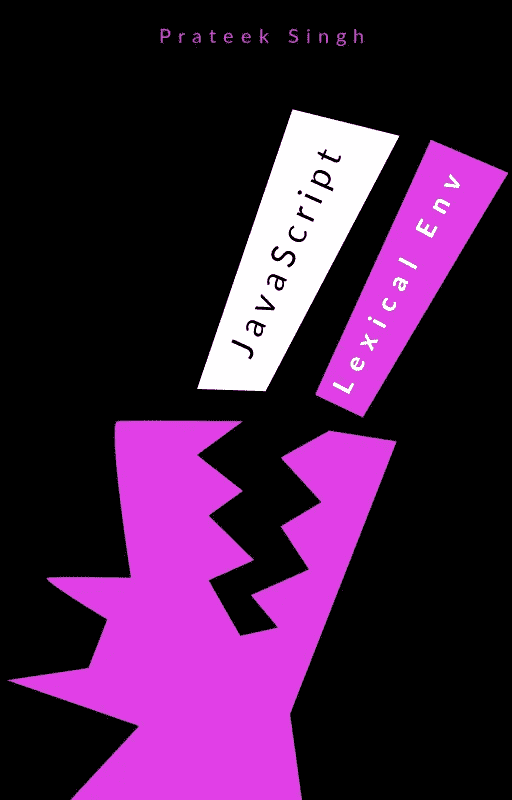
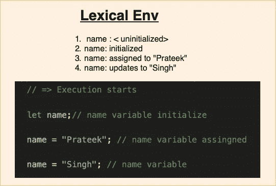
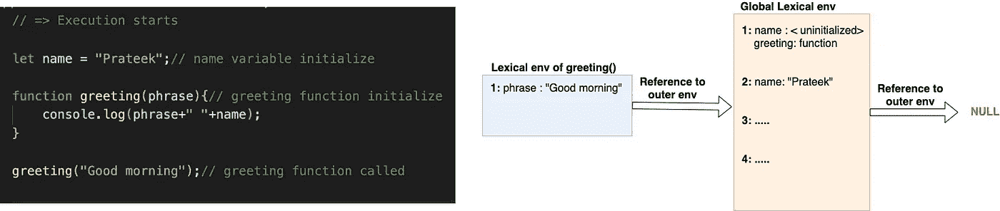
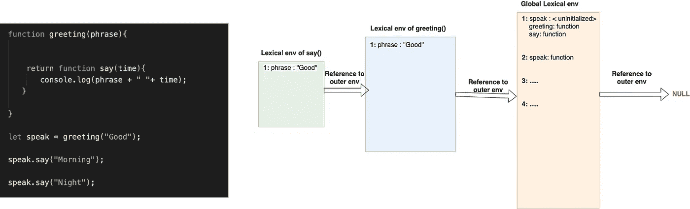

# 词法环境如何影响 JavaScript 变量、提升和闭包

> 原文：<https://javascript.plainenglish.io/how-lexical-environments-affect-javascript-variables-hoisting-closures-9d18e193548d?source=collection_archive---------11----------------------->



Lexical environment Cover

变量就像任何语言中的基本生命支持系统。它们如何运行，如何更新，如何初始化，是每个开发者都应该知道的一些基本事情。然而，一般来说，我们初始化变量，使用它们，然后扔掉它们，而不考虑它们实际上是如何与代码交互的。当我们准备面试的时候，我们关心他们:P 让我们不要浪费时间读糟糕的笑话，看看这里重要的图片“词汇环境”。

在这篇文章中，我们将了解变量在代码中的行为，什么是提升，什么是闭包，以及什么是我们在很多文章中看到但未能理解的词法环境。为了理解所有的事情，我们首先需要从词法环境开始，因为所有事情都发生在这个 env 的内部或外部。它控制变量的行为，提升闭包的工作方式。

# 词汇环境

在 JavaScript 中，每个代码块{…}、函数()甚至整个脚本都与一个称为词法环境的内部隐藏对象相关联。没明白吗？看起来像典型的陈词滥调定义。别担心，我们会清理干净的。

词汇环境对象由两部分组成:

1: **环境记录** —一个将所有局部变量存储为其属性的对象。
2:对外部词法环境的引用，即与外部代码相关联的环境。

**例如:**在下图中你可以看到一个词法环境，它包括了整个脚本，因为没有其他代码块出现。包含整个脚本的词法环境也称为“**全局词法环境**”。在图中，您可以看到一个词法环境(全局)和该变量在词法环境中的生命周期



Lexical environment (Global)

一个“变量”只是一个特殊内部对象的属性，`Environment Record`。“获取或更改变量”意味着“获取或更改该对象的属性”。

让我们首先了解词汇环境是如何工作的:

1.  当脚本启动时，词法环境预先填充了所有声明的变量(在我们的例子中是“ *name* ”。
2.  当执行开始时，词法环境知道所有的变量，但在特殊的内部状态中处于未初始化状态，直到它被' let '初始化。这意味着 JS 引擎知道你的变量，但是在初始化之前不能被引用。所以这和变量不存在一样好。
3.  用“let”初始化后，可以使用该变量，但目前它是“未定义的”。
4.  *名称*分配给“Prateek”。
5.  *名称*更新为“Singh”。

现在我们可以说两件事:

1.  变量是在与当前执行的块/函数/脚本相关联的特殊内部对象中创建的词汇环境的属性。
2.  玩弄变量意味着玩弄内部对象的属性。

现在让我们看一个例子，我们有多个词汇环境。在下图中，你可以看到很多东西。让我们一步步了解一切。



Multiple Lexical environments

## 初始化

您已经知道了整个脚本、变量和函数所在的全局词法环境。现在你会发现*名字*是<未初始化的>，但是*问候*在词法环境中从脚本开始就是一个函数。实际上这里发生的是，当词法环境创建了一个函数声明，准备好使用代码，并且词法环境从一开始就知道它。这就是为什么我们可以在函数定义之前调用它。

## 嵌套词汇环境

在上面这段代码中，我们有两个词法环境，整个脚本(全局词法环境)& T4 问候功能代码块。 *greetings* 本地词法环境只有一个用值“Good morning”初始化的变量，作为用该值调用的问候函数。

## 词汇环境的一部分

让我们回顾一下我们之前读过的另一件事，词汇环境包括两件事，即环境记录和对外部词汇环境的引用。现在你会从上面的图片中得到这两个部分的清晰图片。橙色和蓝色的框是变量和函数离开的环境记录，箭头是对创建内部词法环境的外部词法环境的引用。在我们的例子中, *greeting 的*词汇环境是在全局词汇环境下创建的，因此它引用全局词汇环境。全局词法环境总是指向 null。

## 变量的共享和搜索

现在，从上面的例子中要学习的最后一件事是理解如何在词法环境中搜索变量。每当在代码块中使用一个变量时，该代码块的词法环境在自身中搜索该变量，如果没有找到，则在外部词法环境中搜索。现在在我们的例子中当 ***console.log(短语+" "+名称)；*** 执行*问候语的*词法环境搜索，在本地词法环境中查找*短语*和*名称*。当它不能在本地词汇环境中找到名字时，它在外部(在我们的例子中是全局)词汇环境中搜索。现在它在全球词汇环境中找到了自己的名字，印出了“早安 Prateek”。

了解了所有关于词汇环境的信息后，我们可以前进到 JavaScript 的两个基本概念&让我们试着在词汇环境的背景下理解它。它将清除你对变量及其用法的所有疑问。

# 提升

如果我们按照吊装的官方定义。

> 提升是 JavaScript 将声明移动到顶部的默认行为。

*将声明移到顶部，*我认为这是 JS 引擎在词法环境下做的类似事情。对于每个代码块，创建一个本地词法环境，我们知道词法环境已经知道它的段下使用的所有变量。吊装是同一个东西的正式名称。在提升过程中，JS 引擎将所有声明移动到(词法环境的)顶部。让我们跳到我们最喜欢的例子部分，在这里我们可以快速学习。

1:**var**的吊装

```
 console.log(myName);
var myName = “Prateek”;_____________________________
JS Interpretor
_____________________________var myName; //**hoisted myName variable in the <initalized> form.**
console.log(myName);// undefined
myName = "Prateek";
```

这就是您将在 console.log()中未定义的原因。

2:吊装 **let**

```
console.log(myName);
let myName = “Prateek”;_____________________________
JS Interpretor
_____________________________let myName; //**hoisted myName variable in the <uninitalized> form.**
console.log(myName);// **Uncaught ReferenceError: myName is not defined**
myName = "Prateek";
```

**让**也升到顶部，但处于**未初始化**状态。所以在初始化之前你不能使用它。 **Const** 的工作方式也与 let 相同。

3:托管**功能**

```
say();
function say(){
  console.log("Good Morning");
}_____________________________
JS Interpretor
_____________________________say: function //**hoisted say() function in the <initalized> form.**
say();
function say(){
  console.log("Good Morning");//Good Morning
}
```

但是这样不行:(

```
greet();
let greet = function say(){
  console.log("Good Morning");
}_____________________________
JS Interpretor
_____________________________greet: <**uninitalized>**greet();// **Uncaught ReferenceError: greet is not a function**
let greet = function say(){
  console.log("Good Morning");
}
```

你可以看到这个东西在词汇环境中是如何工作的，所有东西都被提升到顶端。只是有些处于初始化状态(var，function)，有些处于未初始化状态(let，const，classes)。但是一切都到了词汇环境的顶端，叫做提升。

现在要记住一些关于提升和变量行为的要点。

1:用“var”全局定义的任何变量都被分配给浏览器全局 windows 对象，而用“let”则不是这种情况。
2:你不能初始化一个没有值的常量变量。

```
var myName;// COORRECT
let myName; // CORRECT
const myName; // ERROR
```

3:在“let & const”的情况下，你知道 JS 解释器创建变量，但你不能使用它，因为它是未初始化的状态。在词法环境中创建的变量之间的时间跨度，直到您声明它为**时间死区。**

## 克洛泽的

如果我们按照吊装的官方定义。

> 闭包让您可以从内部函数访问外部函数的作用域。

让我们从词汇环境的角度来理解 Clousere 的。



Clousers in Lexical environment

在上图中，您可以看到函数内部的一个函数。所以根据上面的定义 *say()* 可以访问 *greeting()的变量。现在让我们回到我们在词汇环境中学到的要点。*

> 每当在代码块中使用一个变量时，代码块词法环境在它自身中搜索该变量，如果没有找到，则在外部词法环境中搜索。

在上图中，我们可以看到创建了三个词汇环境。
1:橙色:全球词法环境指向 **null。** 2:蓝色:词法环境的 *greeting()* 指向全局词法环境
3:绿色:词法环境的 *say()* 指向 *greeting()* 词法环境。

现在我们知道了，在上面的代码中，每当一个变量被用在类似于**短语&时间**的代码块中。词法环境首先在自身中搜索它，如果没有找到，它将在父词法环境中搜索。这就是我们所知的闭包。

为了更好地理解闭包，我们可以说:“ *A* ***闭包*** *是一个函数的组合，它被捆绑在一起(被封闭)并引用其周围的状态(词法环境***)。**

*现在，我认为你关于提升、闭包和变量的概念越来越清晰了。实际上，您可以将 JavaScript 的基本概念与词汇环境中变量的基本生命周期联系起来。*

> *感谢阅读！
> 快乐编码:)*