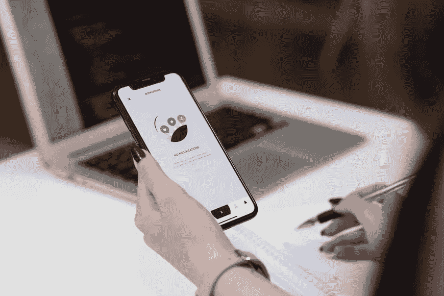

# 开发一个 App 需要多长时间？

> 原文：<https://javascript.plainenglish.io/how-long-does-it-take-to-develop-an-app-c637b3092a9c?source=collection_archive---------14----------------------->

我们都知道时间就是金钱，同样的原则也适用于 IT 世界。如果你能更快地构建面向客户的应用程序，你就能从中获得更多利润。如果你知道构建一个优秀的应用需要多少时间，你也可以节省开发资源和时间。

产品研究、设计等应用开发阶段难以置信的截止日期导致最终应用发布的延迟。如果你不想在发布应用程序时有任何形式的延迟，你必须对研究、UX/用户界面设计、应用程序开发、部署等阶段所需的精确时间有一个概念。

这有助于你制作一款独一无二的应用。在这里，我们讨论了应用程序开发的关键阶段，它们的大约持续时间，影响它们的主要因素，以及如何最小化延迟。让我们继续读下去吧！

# 应用程序开发的关键阶段

应用程序开发过程可能会因为积压而延迟，比如在短期内创建复杂的应用程序。为了避免这样的问题，你必须分析应用程序开发每个阶段的持续时间。

让我们来看看大约持续时间的基本阶段，以及应用程序开发的步骤。

## 1.研究和发现

***大约持续时间:*** 1 至 1.5 个月

大约 [70%](https://clutch.co/app-developers/resources/inside-app-discovery-stage) 的移动应用程序开发机构不回避发现阶段，因为它解释项目的范围并决定其精确的时间框架。通常，发现阶段的长度取决于客户对项目的需求，如应用程序功能的范围、应用程序的复杂性等。

为了评估客户的需求，你必须对潜在的应用程序竞争对手进行市场调查。最后，构建一个可视化的应用程序原型，并接受客户端确认。

## 2.UX/用户界面设计

***大约持续时间:*** 1 至 1.5 个月

UX/用户界面设计是应用程序开发的一个重要阶段。在此阶段，您可以最终确定应用的外观和功能，以满足目标受众的需求。

在这个阶段，你需要从你的应用程序中发现用户的需求、问题和期望，勾勒出可能的用户流，决定减少应用程序开发时间的主要关键功能，并决定用于设计的应用程序功能。

如果你能精确地处理上述步骤，你就能在 UX/UI 设计上做出一个易于使用且视觉上有吸引力的应用程序。为了设计 UI(用户界面)，设计师们关注于应用程序的文本方面和视觉特征。

用户体验(UX)设计是下一个重要部分。在这个阶段，设计师必须在应用程序和它将为目标受众赚取的利润之间取得平衡。

## 3.应用程序开发

***大约持续时间:*** 3 到 6 个月

这个阶段是所有关于前端和后端开发。在这个阶段，开发人员和设计人员都要确保构建和设计一个应用程序，在后端和前端都毫不费力地满足用户的需求和功能。

后端开发不仅是最艰难的，也是应用程序开发过程中最长的部分。这个庞大的功能需要开发人员在每个部分做更多的工作，以提供精确的应用性能。后端开发人员与第三方服务、数据库、服务器和其他开发模块合作，以确保应用程序正确、快速地响应所有用户请求。

后端开发人员完成数据库结构后，前端开发人员开始工作。由于这两个过程是并行的，你可以很容易地减少整个应用程序的开发时间。前端开发人员激活由 UI/UX 设计师制作的应用原型。他们主要是让用户和你的 app 的交互无缝可行。

## 4.应用测试

***大约持续时间:*** 2 周

UAT(用户验收测试)是一个至关重要的应用程序开发阶段。它验证您的应用程序是否适合您的用户要求和业务需求。在 UAT 期间，您可以实施与您的目标受众的生活状况相关的真实条件。

你可以通过 TestFlight 这样的特定软件来引入 beta 测试，或者直接让你有前途的应用程序用户来检查你的应用程序是否按照你想要的方式工作。这有助于您识别 bug、错误或任何其他缺陷，以便您可以在发布应用程序之前减少它们。

## 5.部署到商店

***大约持续时间:*** 1 到 2 周

在这个阶段，开发者准备在谷歌 Play 商店或应用商店发布他们的应用。在部署时，您可以执行以下活动:

*   版本跟踪
*   装置
*   卸载
*   内置更新
*   钝化作用
*   更新

## 6.应用程序启动

***大约持续时间:*** 1 周

你可能认为 app 发布是一个快速的过程。但是，将应用程序发布到谷歌 Play 商店或 App Store 通常需要几天甚至一周的时间。

应用程序商店包含一个审核，其中有许多包含安全检查的检查点。如果一个应用程序不能通过审核，开发者需要解决每个小问题才能成功发布。

## 7.支持和维护

***大约持续时间:*** 无限制

在一个应用的第一个版本发布后，应用开发过程不会停止。操作系统必须定期更新。因此，你应该确保应用程序与操作系统兼容。此外，您应该始终增强当前的功能并创建新的功能。

# 影响应用程序开发时间的因素

我们已经估计了应用程序开发的大约持续时间。但是，有几个因素会影响应用程序开发过程。它们包括以下内容:

## 1.应用范围

这取决于功能的数量、屏幕大小以及你将在多少平台上运行你的应用程序。

## 2.开发人员的专业知识

雇佣没有经验和不熟练的开发者不能让你的应用开发成功。确保雇佣经验丰富的高技能应用程序开发人员，为您的企业带来最佳结果。

## 3.行业差异

这个行业在应用程序开发中扮演着举足轻重的角色。例如，一个社交媒体应用程序需要 2 到 3 个月的时间来开发，而点播应用程序需要更多的时间。

## 4.第三方集成或 API

如果你需要增强应用程序的功能，这些是必不可少的。例如，你正在开发一个应该有聊天部分的食品订购和配送应用程序。通过可行的第三方集成，您不必从一开始就构建上述功能，因为您可以找到一个有利的 API 来集成到您的应用程序中。

## 5.复杂的技术

像 AR，VR，AI 和机器学习这样的技术可以减缓应用程序的开发过程。尽管这些技术可以开发出更好的应用，但它们也很昂贵。这些技术的较高成本可能会减慢应用程序的开发过程。

## 6.项目规模

这是基于团队规模和应用程序的复杂性。应用程序的复杂性决定了应用程序开发的成本和持续时间。

## 7.项目中期变更

应用程序开发是一个持续的过程，其中每个阶段都与另一个阶段相关联。因此，突然改变策略会使过程变慢。除此之外，它还会影响应用程序的性能。

# 如何更快的开发一个 App 并尽快上线？

如果你希望尽快发布这款应用并投入市场，你需要注意不同的方式。以下是其中的几个例子:

## 1.选择跨平台开发

跨平台开发总是有助于减少前端开发和发布后维护等阶段多达 50%的时间。通过选择这样的开发，您不需要为各种平台创建各种应用程序。只需创建一个应用程序，并利用特定的框架使其兼容不同的平台。

## 2.创建 MVP(最小可行产品)

MVP 整合了满足普通用户需求的主要应用程序特性。仅仅因为一些特性，缩短上市时间是很有可能的。此外，通过发布 MVP，企业主可以从最初的用户那里收集反馈，并根据用户的需求改进他们的产品。

## 3.白色标签解决方案

这些是由一个组织创造的产品，然后被重新命名和创造，看起来像是由其他组织制造的。这在构建应用程序时节省了大量时间，因为您不需要从一开始就创建任何东西。然而，这可能不会产生一个好的应用程序，尤其是不会产生大量的销售或流量。

## 4.外包开发

外包是 app 开发最快的方式之一。你只需要花一点时间去搜索一家[专业的手机 app 开发公司](https://www.mindinventory.com/mobile-app-development.php)。一旦你找到合适的，就雇佣他们来帮你完成任务。他们不仅提供专业开发人员，还提供许多其他方法来根据您的情况缩短应用程序开发时间。

## 5.自动化测试

许多人忽略了这种类型的测试。它是缩短应用程序开发周期的有意义的开发阶段之一。它可以一次运行所有的测试。此外，它减少了手动测试的时间，并有助于提高应用程序的安全性。

自动化测试包括许多可以节省时间的测试策略。随着测试过程的加快，应用程序开发过程也在快速加速。实现多种测试方法可以提供完美的代码。

## 6.敏捷开发

许多应用程序开发公司遵循敏捷开发，因为它加快了开发周期。其主要目的是公司不能经历从头再来的困难。它有一个可变和灵活的编程结构，非常适合开发者和应用程序所有者之间的开放式交流。总之，它加快了开发过程，保证了应用程序的及时开发。

## 7.让 IDE 做你的助手

Visual Studio、NetBeans 和 Eclipse 是使开发过程更快更好的一些工具。在这些集成开发环境中，积累了项目处理的所有工具。使用 IDE，识别 bug、与团队协作以及解决错误变得更加容易。

## 8.模块化

使用模块化是减少应用程序开发成本和时间的另一种有效方式。这将代码划分成微小的模块，而不是存储在沉重的大文件中。首先，您应该在构建灵活的文件结构和体系结构上投入更多的时间。尽管如此，模块使得发现问题、扩展应用程序以及在未来更改组件变得更加容易和快捷。

# 底线

这是我们对应用程序开发流程时间框架以及如何缩短开发时间的假设。过程的持续时间基于项目的复杂性和需求、团队的专业知识、使用的开发策略等等。了解增加应用程序开发时间的所有阶段，您可以优化它们并增强应用程序性能。

使用最佳方法来减少应用程序开发时间，您可以比竞争对手更快地发布应用程序。结果，它为你带来了更好的市场份额。

*更多内容看*[***plain English . io***](http://plainenglish.io/)