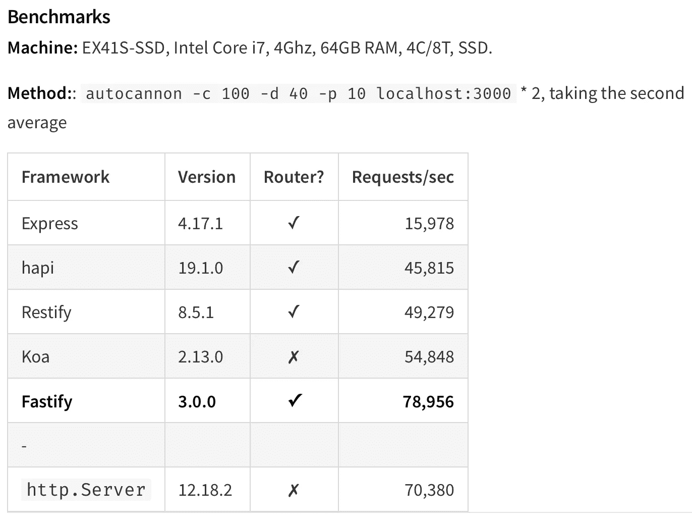
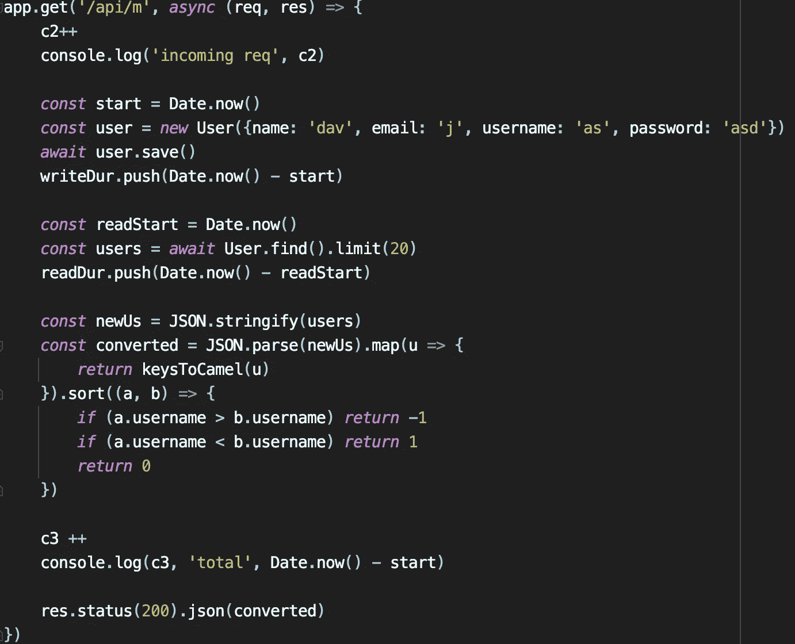
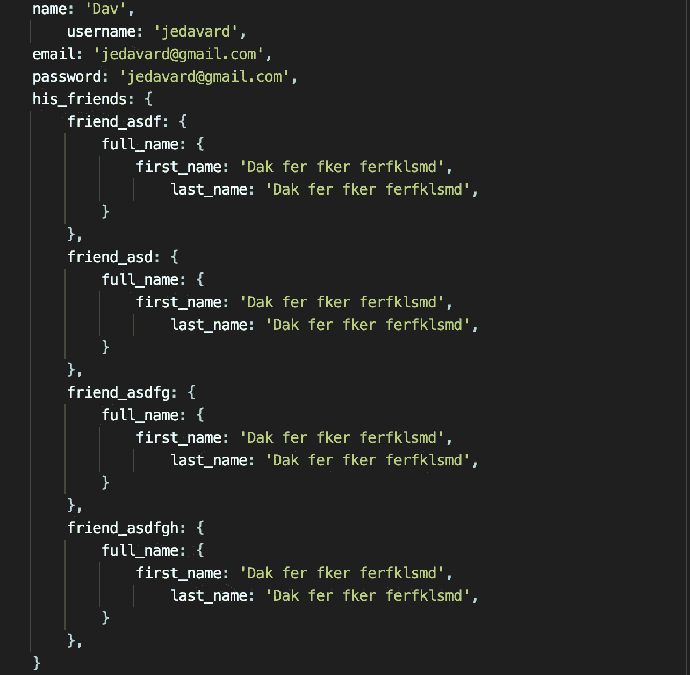
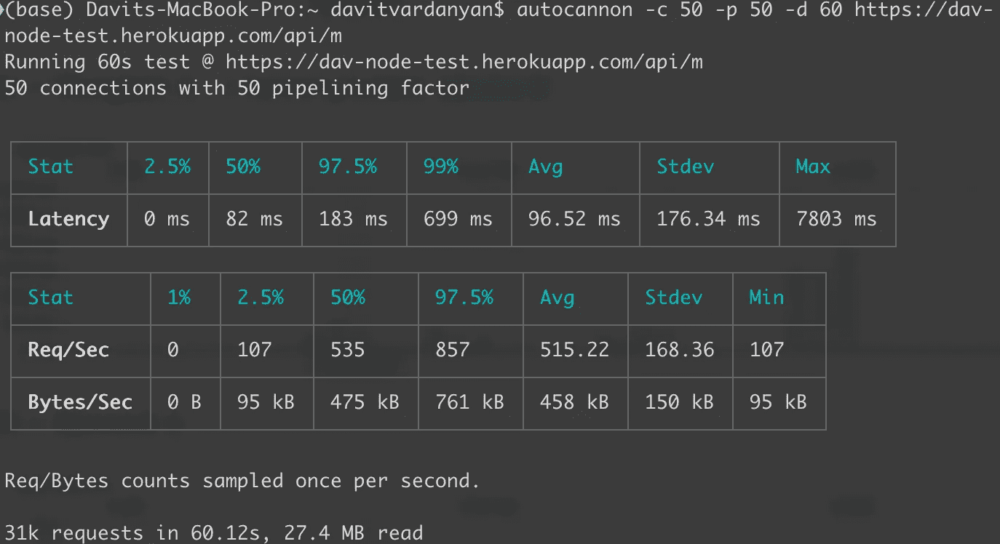
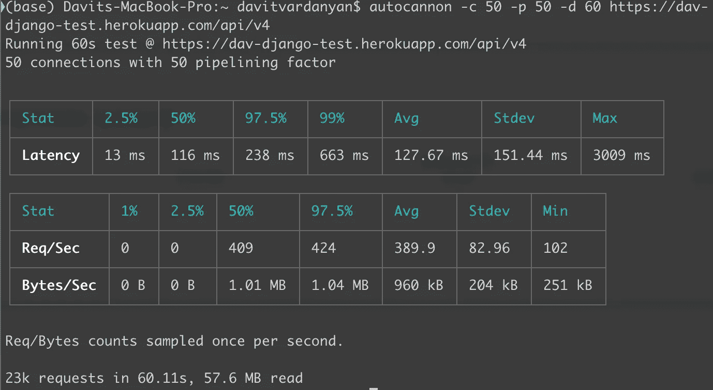
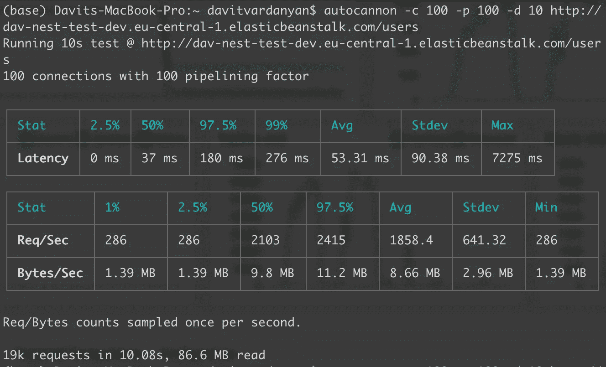

# 一个真实的 Node.js 服务器端应用程序可以处理多少请求？

> 原文：<https://javascript.plainenglish.io/how-many-requests-can-handle-a-real-world-nodejs-server-side-application-55da7a2f06f3?source=collection_archive---------0----------------------->

# **简介**

当我第一次接触 Node.js 时，我想知道在生产环境中(作为一个真实的应用程序)，有多少请求可以真正处理我的 Node.js 应用程序。或者我需要多少服务器实例来处理特定数量的流量。

去年，我在一家独角兽公司 [PicsArt](https://picsart.com) 的一篇文章中读到了一些非常有趣的东西。他们每秒处理 40K 个请求，后端使用 Node.js(主要是)。

嗯，40K rps 确实很庞大，也取决于后端服务器之外的一些其他因素。但此时此刻，让我们忘记这些因素，只考虑后端硬件和软件，特别是 Node.js。

# **研究**

## Fastify 基准

有一个由 [Fastify](https://www.fastify.io) creators 做的基准测试，它显示 express.js 每秒可以处理~15K 的请求，vanilla HTTP 模块可以处理 70K 的 rps。

我用一台 Macbook Pro 15" 2015 试了一下，得到了几乎一样的结果。express.js 连 15K rps 成绩听起来真的很棒。但是基准测试通常是在一个很小的 API 处理器上进行的，这与真实世界的 API 相差甚远。那么，是什么让 API 成为“真实世界”的呢？数据、数据传输以及组件之间的交互。要拥有一个真实的 API，我们必须创建一个与 DB 或其他服务通信的处理程序。

## 我的实验

这些结果并不重要。在大多数情况下，像 express(15K)这样经过验证的框架更好，因为实际上，您不会用一个实例每秒处理 100K 个请求。因此，我为我的基准安装了 express.js，创建了一个具有各种类型操作的小 API 处理程序，并进行了负载测试

Api handler for the load tests

1.  在数据库中写入一个新用户
2.  从数据库中获取 20 个用户
3.  stringify/Parse 20 个用户的数组
4.  递归地将 20 个用户对象转换为 camelCase
5.  对 20 个用户的数组进行排序
6.  还有一些简单的计算和标准输出(Date.now，console . log——它们也消耗计算资源)

响应大小约为 12KB，每个用户对象如下所示

User object, 609 bytes of data

**Heroku 中的 Node.js 与 AWS RDS**

我在 Heroku 以每月 25 美元的硬件部署了这个应用程序。然后，我在不增加平均延迟的情况下尽可能多地发送请求。因此，我的 Node.js 实例能够在 60 秒内处理 31K 个请求，这意味着平均每秒 515 个请求。

Node.js benchmark

**Heroku 的 Django，带 AWS RDS**

然后，我问如果我用非单线程的技术做同样的尝试会怎么样。我用一个等价的处理程序为 Django 应用程序创建了完全相同的条件，并将其部署到相同的服务器上。结果比 Node.js 差一点，我可以在 60 秒内达到 23K 个请求，也就是每秒 389 个请求。

Django benchmark

**带有 AWS RDS 的 AWS EB 上的 Node.js(3 个实例)**

然后，我问，如果我的 Node.js 应用程序是一个真正的生产应用程序，并且部署在 AWS 中，为特定的流量而启动和运行，会怎么样？我选择了法兰克福(eu-central-1，离我最近，大约 3000 公里😁)区域，用于数据库和后端服务器。我在那个测试中使用了 3 个带有 AWS 负载平衡的 Node.js 实例。我的 3 个实例能够在 10 秒内处理 19K 个请求，这意味着每秒 1858 个请求。然后，我持续对我的应用程序进行负载测试，我可以在 13 分钟内达到 150 万个成功的请求，这很令人兴奋😁

Node.js benchmark deployed on AWS EB

那么，我们用一个实例处理 600 个 rps，我们需要什么来处理每秒 40K 个请求呢？如果我们平台的平均 API 比我测试的大两倍 ***** 。因此，对于一个全球规模的独角兽应用程序，我需要 40.000/(600/2) = 133 个位于世界各地不同位置的实例。没什么大不了的😁

******* *它可以大 3 倍，但它也可以使用各种缓存技术、基于事件的*通信、*等来赢得每秒更多的请求，所以我认为大 2 倍是准确的度量*

**我想以一个有用的列表来结束这篇文章，这个列表列出了你正在使用或将要使用的应用程序中可能会遇到的一些问题。**

# 可能的性能问题

有数不清的因素会降低我们的 API。我分离了一些性能相关的部分，我们可以在大多数 web 服务器端应用程序中看到。

*   从数据库中存储或提取的数据大小。尤其是当我们谈到关系数据库时，这一点更为重要，因为大数据量通常意味着数据库管理系统和数据库内存磁盘之间的复杂查询或复杂操作。然而，在所有情况下，我们有越多的字节，我们需要更多的传输时间。我们还应该记住，在 DB 中保存文件是一种反模式，相反，我们应该考虑使用对象存储。理想情况下，我们的数据大小不应该超过几十千字节，通常是 1-20kb
*   后端服务器和数据库服务器之间的物理距离。更远的距离意味着 DB 接收查询并将其发送回后端服务器需要更多的时间。举个例子，我们在美国弗吉尼亚州和德国法兰克福有两台后端服务器，但是在美国弗吉尼亚州只有一台数据库服务器。我们美国用户的请求将被路由到我们美国后端实例，延迟约为 10–40 毫秒，然后从后端(弗吉尼亚)到数据库(弗吉尼亚)的延迟为 1–5 毫秒。还不错。让我们看看对于来自德国的用户来说会发生什么，“用户的设备”—“后端服务器”的延迟将为 10–20 毫秒，但查询数据将需要 120–130 毫秒。因此，如果我们有一个单一区域的应用程序，理想情况下，我们的数据和后端逻辑是邻居。或者，如果我们有一个全球规模的应用程序，我们应该准备好做各种复杂的工程工作，以获得良好的性能
*   DB 服务器硬件也有很大的影响。如果我们有一个小应用程序，考虑购买更好的硬件来适应我们的流量，否则——“各种复杂的工程材料”☝️😁
*   数据库配置。数据库带有默认配置，以避免管理成为一个额外的难题。根据我们的规模，我们将处理它。我想提到的一件事是最大连接数，它可能是我们应用程序的瓶颈，或者是我们数据库服务器的负担。它通常由数据库客户端库(ORM 等)重新配置..).另一件事是连接超时。
*   数据库调用的数量。在现实世界的 API 中，我们可以有几十个独立的数据库调用来最终完成工作，此外，在该 API 中，我们还可以有服务调用，每个服务都有自己的“几十个数据库调用”。我遇到的一个令人印象深刻的例子，是在我很久以前加入的一个项目中，一个银行业整体后端 API。在云开发环境中，有一个响应时间为 9s 的 API。这个 API 下的服务处理程序有 300 行代码，其中我们可以找到大约 30 个 DB 调用和大约 10 个内部服务调用。这通常发生在我们的方法是“代码优先”而不是“设计优先”的时候。根据我们的业务逻辑，有许多解决方案可以帮助避免这种情况。例如，队列和其他异步措施可以让我们有可能在“后台”处理一些 DB 调用。为了利用这一点，我们需要将我们的大服务分解成小服务。此外，我们可以加入查询，以减少数据库调用的数量。
*   钩子。在所有流行的 ODM/ORM 中，有一个特性叫做钩子/中间件。有时候让这个特性处理一些逻辑真的很舒服。有时，尤其是在处理批量操作时，我们可能会面临一个“隐藏的”瓶颈。ODM/ORM 插件也需要计算资源，这也意味着需要时间(例如用于 camelCase/pascal_case 转换的插件)。挂钩真的很有帮助，但需要仔细考虑我们写了什么，在哪里写。
*   CPU 密集型任务不仅会降低服务器速度，还会让最终用户等待。在 Node.js 中，许多 CPU 密集型任务依赖于线程池。虽然它不会阻塞异步 IO，但它会使 API 变慢。例如，用户点击注册并等待线程池散列他/她的密码，顺便说一下，这需要 100 毫秒。
*   事件循环瓶颈。在 Node.js 中，代码的执行依赖于事件循环，所以我们的代码的性能对整个应用程序有直接的影响(因为它是在单线程上运行的)。例如，使用 JSON.parse/stringify 会降低我们的 API 的速度。嵌套循环和递归函数也很危险。当忽略 Node.js 如何工作时，根据数据大小和应用程序流量，我们可能会遇到问题，我们的应用程序可能不可用。
*   糟糕的基础架构。大型基础设施中可能出现的问题不仅仅是整体应用中的问题，它们是不同的，有时需要复杂的架构解决方案。当我们的基础设施包含许多组件时，糟糕的架构会对我们的 API 产生巨大的影响，我们的系统将以资源低效的方式工作，这意味着我们将为本来可以更便宜的东西支付更多的钱。因此，在设计复杂的应用程序时，我们必须考虑特定技术解决的问题，并充分了解替代方案。我们还需要考虑前景，如果我们在两个月或六个月内制作一个功能时有业务需求变化，会发生什么，在每个语句上尽可能多地猜测。想想 [SLA](https://en.wikipedia.org/wiki/Service-level_agreement) 。想想[非功能需求](https://en.wikipedia.org/wiki/Non-functional_requirement)，流量上去了怎么办？随时准备应对意想不到的高流量，即使有一种理论认为我们必须准备处理比我们现有流量多 10 倍的流量。
*   元件规模/硬件/设置。我们在基础架构中创建的组件会降低整个平台的速度。假设我们使用 RabbitMQ。像任何技术一样，它有大量的配置和选项。如果我们一开始就有标准，那就没问题。但是，随着时间的推移，如果我们做更多的研究，如果我们深入到一个特定的组件，我们会意识到，我们可以通过做一些设置审查，或通过重构我们服务中的配置或使用来改善我们的基础设施。此外，我们必须根据使用情况扩展组件，以免在基础架构中造成瓶颈。

感谢阅读。而如果你喜欢与表演相关的文章，别忘了鼓掌，它会帮助我准备更多深思熟虑、见解更深刻的文章。

*更多内容尽在*[***plain English . io***](http://plainenglish.io/)