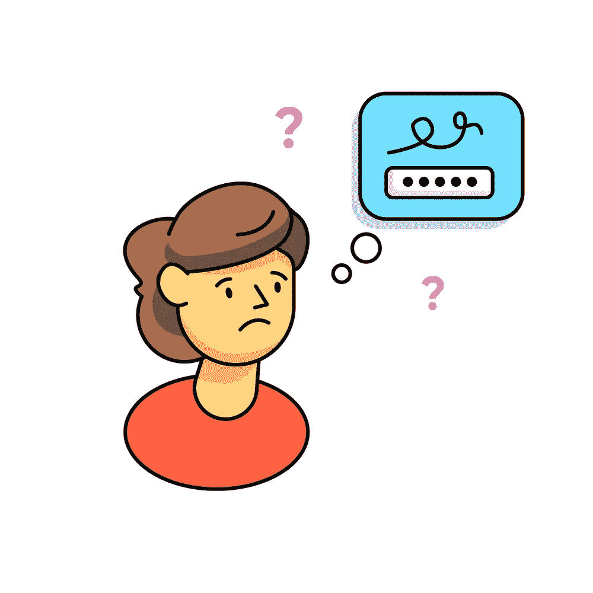
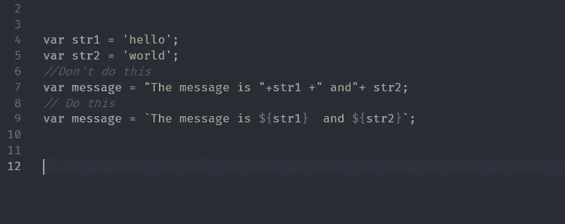
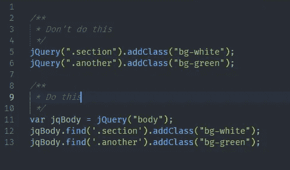
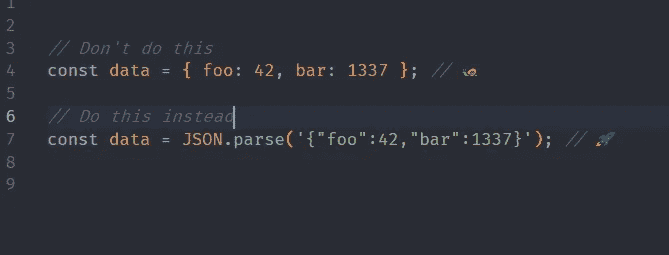
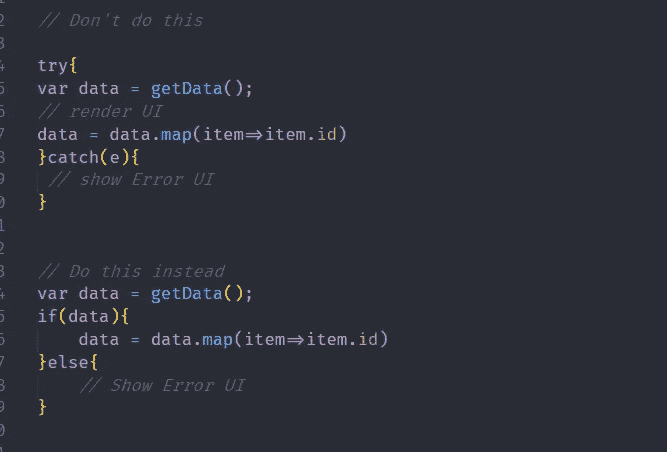
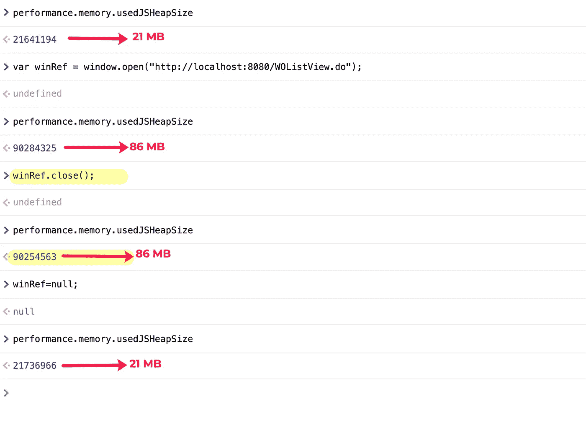

# JavaScript 内存管理入门指南

> 原文：<https://javascript.plainenglish.io/how-memory-management-works-in-javascript-f07ccd544190?source=collection_archive---------3----------------------->


在过去的 8 年里，我一直在写 JavaScript 代码。通过这些年，我学到了很多关于 JavaScript 的知识，比如代码优化、代码可读性、跨浏览器功能、内存管理等等。

以前，我是一名初级开发人员。我在做我的工作，不用担心性能和内存。当我的高级开发人员在讨论像内存管理这样的事情时，我觉得他们好像在说某种外星语言。事情进行得很顺利，直到一个客户报告了一个关于页面冻结的问题。



一位客户报告了一个问题，当点击一个按钮，然后 Chrome 关闭该页面时，页面变得没有响应。我最初认为这可能是 Chrome 扩展的问题。因此，我在隐姓埋名模式下进行测试，但问题也在隐名模式下重现。

解决这个问题后，我花了很多时间阅读和理解 JavaScript 及其编译器。

我以中级或入门级 JavaScript 开发人员能够理解的方式写了这篇文章。如有疑问，欢迎留言评论；我将尝试回答这些问题。

# 内存泄漏

内存泄漏被描述为不需要的内存，但由于某种原因，它没有返回内存池。

JavaScript 的设计方式是，一旦变量被使用，它会自动删除分配的内存，这个过程被称为垃圾收集。

JavaScript 编译器使用两种不同的垃圾收集器，一种是**主要垃圾收集器**，另一种是**次要垃圾收集器**。

信息:【https://v8.dev/blog/trash-talk 

主垃圾收集器:主垃圾收集器从整个堆中收集垃圾。

**未成年 GC** :未成年 GC 在年轻一代收集垃圾。

这些是次要和主要 GC 的单行定义。

让我用简单的英语来解释这些。

## 主要 GC:

主垃圾收集器是主要的垃圾收集器，它识别活的和死的对象，并删除它们死的对象。但是主 GC 是在主线程上运行的，所以如果 GC 被频繁调用，页面就会变得不负责任。

**垃圾收集为什么会冻结页面？**

Garage collector 运行在主线程上，所以它会阻塞所有用户输入，从而使页面变得不负责任。

好吧但是，

**为什么主线程会阻塞所有用户输入？**

简单的答案是事件循环。而对于长篇大论的回答，你需要看这个视频。对事件循环和 JavaScript 编译器的极好解释。

更多信息:[https://www.youtube.com/watch?v=8aGhZQkoFbQ](https://www.youtube.com/watch?v=8aGhZQkoFbQ)

# 提高应用程序内存管理的一般指南。

**1。全局变量**

垃圾收集器从不收集全局变量的内存，所以在开始声明全局变量之前要三思。

但有时，我们会不小心引入一个全局变量。

让我们看看这段代码

```
function foo(arg) {
  bar = "this is a hidden global variable";
}
```

你可能会注意到，bar 没有定义，但是赋值了，所以这将成为一个全局变量。

在这里，我们泄漏了一个字符串内存，你可能认为这不会造成大问题，但它会覆盖其他一些全局方法，导致另一个破坏。

**2。
永远引用**永远做关心内存，说到对象和数据绑定。

```
function run(){
  var domObjects = $(".myClass");
  domObjects.click(function(){
  domObjects.addClass(".myOtherClass");
  });
}
```

一旦函数被调用，JavaScript 将移除分配的内存。但是在代码上面，GC 没有办法收集“domObjects”的内存，因为它被绑定到事件监听器。如果要删除这些记忆，可以手动删除。

```
function run(){
 var domObjects = $(".myClass");
 domObjects.click(function(){
 if(domObjects){
  domObjects.addClass(".myOtherClass");
  domObjects = null;
 }
 });
}
```

**3。字符串串联**

这听起来很奇怪，但是字符串连接需要额外的内存。所以避免字符串连接，而使用模板文字。



**4。避开新物体**

新的内存被分配给新的对象、数组等。尝试找到一种方法来减少这种情况。

让我们看一个 jQuery 的例子，

当从不使用`jQuery`时，它会增加堆中的内存，所以我们可以避免使用 jQuery 链接方法。



**6。JSON 解析**

当您的应用程序在页面加载期间基于 JSON 呈现时，可以考虑使用 JSON.stringify 和 JSON.parse 来处理这些数据。



更多信息:[https://v8.dev/blog/cost-of-javascript-2019#json](https://v8.dev/blog/cost-of-javascript-2019#json)

**7。避免试抓**

Try-catch 比 if 检查分配更多的内存。但是对于大多数应用程序来说，试捕是必要的，如果你正确地分析，你可以把它们变成试捕。



请看看这一期，

由 node js 环境中的 try-catch 引起的一个有趣的内存泄漏问题。您将获得一些关于尝试捕捉和内存泄漏的知识

[https://github.com/nodejs/node/issues/35048](https://github.com/nodejs/node/issues/35048)

**8。新窗口**

在新窗口中工作时，请在窗口分离后取消设置引用变量。
当关闭窗口时，只调用次要的 GC，所以只清除几个内存块。

如果您想检查使用的 JSHeap 内存，请在控制台上输入以下代码。

```
**performance. memory.usedJSHeapSize**
```



**9。回调**

如果事件回调的频率非常高，请考虑避免它。

让我们以卷轴为例。

当您将滚动事件绑定到窗口时，每当用户向下/向上滚动时，都会调用回调。但这里的问题是回调调用的频率非常高。可以避开那些使用去抖或者节流功能的。

一篇关于去抖和节流的优秀文章。

[](https://css-tricks.com/the-difference-between-throttling-and-debouncing/) [## 节流和去抖动的区别

### 前几天我把这些弄混了，有人纠正了我。所以我把它放在博客帖子的旧列表中，这里…

css-tricks.com](https://css-tricks.com/the-difference-between-throttling-and-debouncing/) 

**感谢您的阅读！**如果你喜欢这篇文章，可以考虑[在 Twitter 上关注我](https://twitter.com/NaveenDA_)，并与你的开发者朋友分享这篇文章。

*更多内容尽在*[***plain English . io***](http://plainenglish.io/)