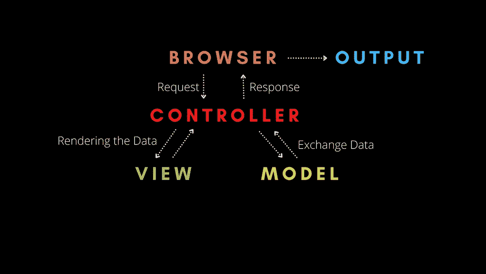
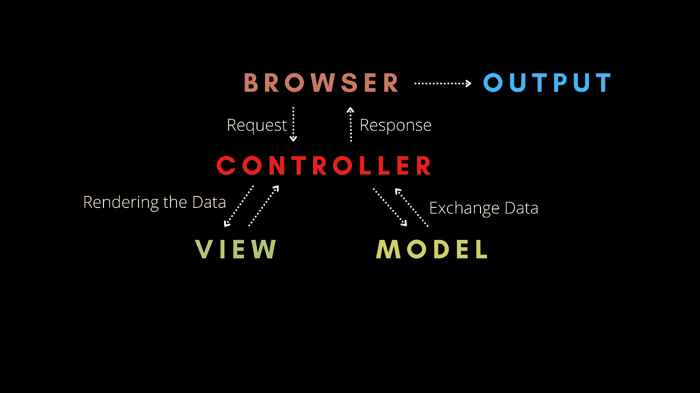
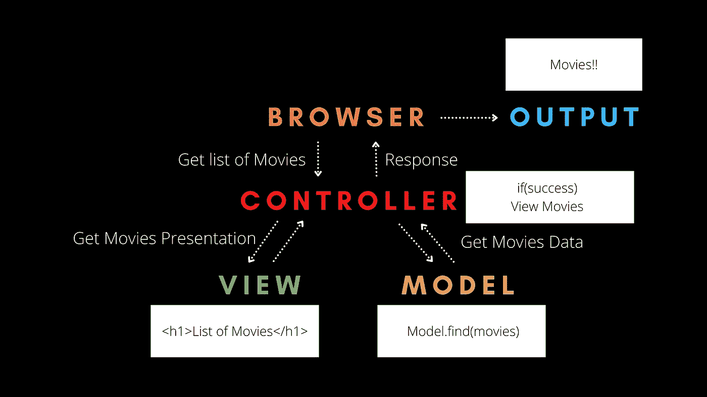

# 模型视图控制器(MVC)架构如何工作。

> 原文：<https://javascript.plainenglish.io/how-model-view-controller-architecture-works-dcfc2e2b4cb7?source=collection_archive---------3----------------------->

架构是一种描述软件、它们之间的关系以及它们如何相互作用的系统方式。软件架构包括几个起作用的因素，如商业策略、质量属性、人类动态、设计和 IT 环境。

换句话说，架构是系统的蓝图。

# 模型视图控制器(MVC)

如今，我们有数百名开发人员在开发应用程序，这很复杂。为了使事情变得简单，开发人员和程序员使用不同的模式来使代码不那么复杂。

其中最流行的是模型视图控制器。

模型视图控制器将任何大型应用程序分为三个部分。

1.  模型
2.  景色
3.  控制器

这些组件中的每一个都是为处理应用程序的特定开发方面而构建的，并且每一个组件都有不同的用途。

# 模型

它包含用户使用的所有数据相关逻辑。例如，项目的模式和接口、数据库及其字段。例如，一个客户对象将从数据库中检索客户信息，操纵它并将其数据更新回数据库，或者用它来呈现数据。

# 景色

它包含应用程序的 UI 和表示。例如，客户视图将包括所有的 UI 组件，如文本框、下拉列表等。最终用户与之交互。

# 控制器

它包含所有与业务相关的逻辑和传入的请求。它是模型和视图之间的接口。例如，客户控制器将处理来自客户视图的所有交互和输入，并使用客户模型更新数据库。同一控制器将用于查看客户数据。

# 他们如何一起工作

1.  浏览器向控制器发送请求。
2.  控制器与模型交互以发送和接收数据。
3.  控制器与视图交互以呈现数据。视图只关心如何呈现信息，而不关心最终的呈现。它将是一个动态 HTML 文件，根据控制器发送的数据来呈现数据。
4.  视图将把它的最终表示发送给控制器，控制器将把最终数据发送给用户输出。

重要的是视图和模型永远不会相互影响。它们之间唯一的交互是通过控制器进行的。

这意味着应用程序的逻辑和界面从不相互交互，这使得编写复杂的应用程序变得容易。

我们用一个简单的例子来理解。

1.  用户发送请求以获取电影列表。
2.  浏览器将向控制器发送请求以获取电影列表。
3.  然后，控制器将要求模型查找电影列表。
4.  该模型搜索数据库并返回电影列表。
5.  如果模型的响应是成功的，控制器将要求视图以 HTML 的形式获取电影的演示。
6.  视图将从控制器获取电影列表，并将列表呈现为 HTML。
7.  控制器将获取该演示，并通过浏览器将其返回给用户。

## 结论

那都是乡亲们！快乐学习！