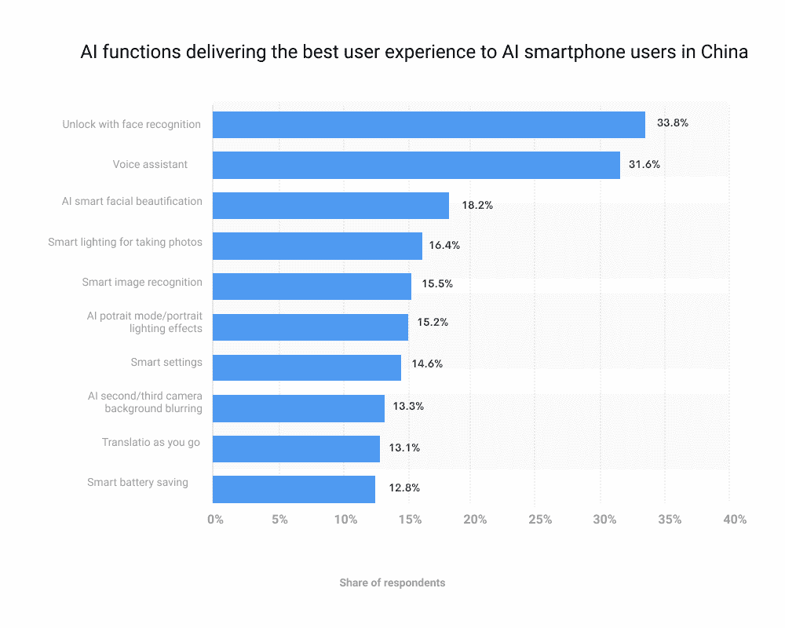
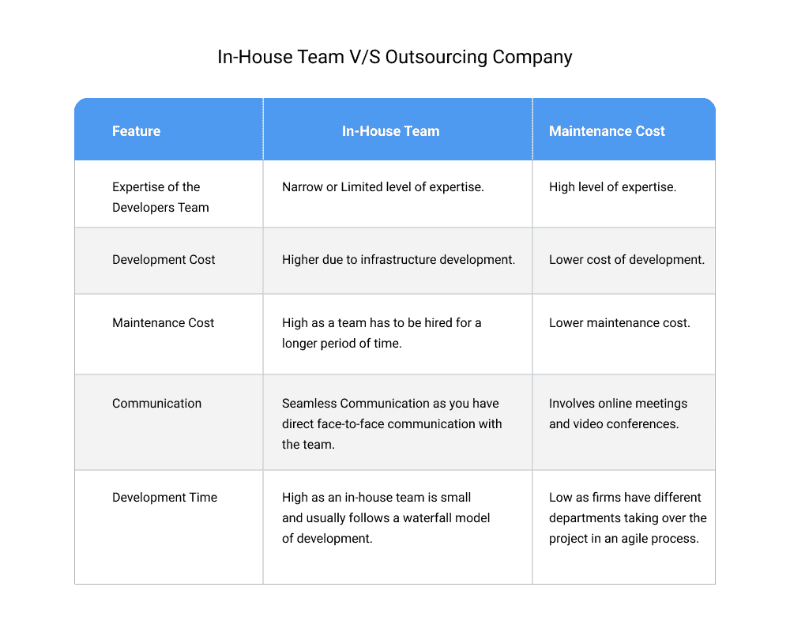
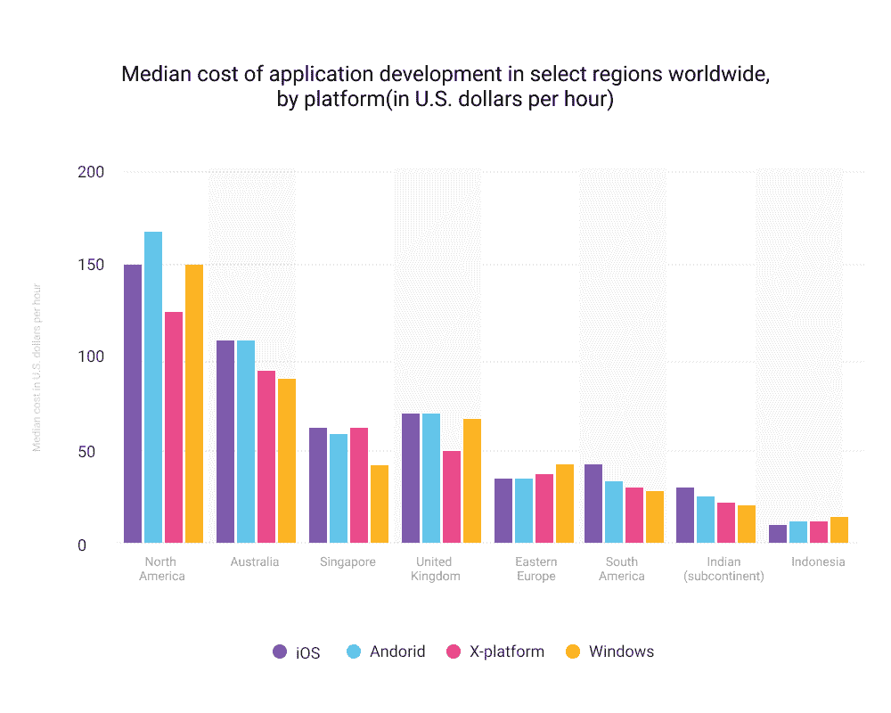

# 构建一个成功的 Web 应用需要多少成本？完全指南

> 原文：<https://javascript.plainenglish.io/how-much-does-it-cost-to-build-a-successful-web-app-the-complete-guide-f8235c6f83bd?source=collection_archive---------11----------------------->

即使是世界上最成功、资金最雄厚的企业也有着卑微的开端，许多企业是在资本非常少的情况下起步的。然而，这并不意味着创业很容易。根据 Statista 的说法，在有前景的选项中，应用程序开发市场从 2021 年到 2026 年的 CAGR 为 8.81%，到 2026 年将达到 2199.765 亿美元(T2)。

如果你是一名企业家，你可能会考虑构建一个 web 应用程序。无论是管理库存还是记录销售活动，许多业务问题都可以通过 web 应用程序得到更好的解决。

也有大量合理的理由来考虑构建一个 web 应用程序，而不是现成的应用程序或雇佣额外的员工，但从头构建一个要花多少钱呢？

你需要钱和大量的钱——尤其是如果你想开发下一个伟大的网络应用程序——

*   ***但是到底有多少呢？***
*   ***你能指望什么成本？***
*   最重要的是，你如何尽可能降低这些成本？

就基础设施和劳动力成本而言，这要视情况而定。但是对于构建一个成功的应用程序需要什么，有一些已知的猜测，让我们详细看看。

# **影响 Web App 价格的因素:**

> **#1。工作范围**

一个网络应用要多少钱？这不仅仅是一个问题，而是成就一款成功应用的诸多因素的融合。构建一个成功的应用程序需要几个要素。首先，需要有一个创新产品或服务的想法，为客户解决问题，帮助他们的日常生活。

接下来，你必须创建一个具有坚实基础设施的线框，漂亮地设计它，并高效地开发它，以便你可以在不打破你的银行账户的情况下达到它期望的发布日期。最后，你必须有效地推销你的品牌，让人们知道你的服务或产品。

工作范围也意味着你将在 web 应用程序上集成的多种功能:它的外观和感觉。你的网络应用有哪些必备功能？你的客户将如何与你的顾客联系，以便他们可以最大限度地享受使用你的产品或服务？

业务增长有可能吗？如果是，那么你认为自己将走向何方？简而言之，特性的数量越多，工作范围就越大，开发成本也就越高。

> **#2。用户界面/UX 设计的复杂性**

好吧，让我们从头开始定义什么是 UI 和 UX。UI 代表用户界面，它包括用户与之交互的所有组件——按钮、菜单、小部件等。UX——用户体验——包括但不限于应用的速度性能或响应能力、视觉吸引力和整体易用性。

随着 UI/UX 设计越来越复杂，各年龄段的用户越来越多地使用移动设备，开发一个单一平台解决方案来满足新手和高要求用户变得越来越具有挑战性。这就是为什么如此多的开发人员选择多平台方法，其中每个平台都使用其独特的功能和 UX 组件从头开始单独开发。

Source: [Statista-AI based UX](https://www.statista.com/statistics/955416/china-best-user-experience-ai-functions-among-smartphone-users/)

创建一个具有多种特性的友好的 UI/UX(,这变得很棘手，最终会增加项目的开发成本。最重要的是，如果你的产品面向国际用户，你必须在设计内容方面考虑文化特性。

> **#3。招聘选项:内部团队 v/s 外包公司**

虽然雇佣一个内部团队是一个更昂贵的选择，但它有其优势。一开始你可能会花更多的钱，但是你会得到一些对你的公司来说独一无二的东西。你的员工也更有可能为你公司的成功投资。最重要的是，通过直接了解复杂的软件项目是如何完成的，你可以**获得对自己业务的无价洞察力**。

另一方面，将项目外包给 [**web app 开发公司**](https://www.pixelcrayons.com/web-development/) 提供了其独特的优势。与内部团队不同，外包开发人员通常更有经验，并能带来多年的专业知识。

这将让你的员工专注于他们的优势，你的 web 应用程序将由知道如何完成的专家来构建。他们还拥有为各种不同的客户工作的丰富经验，所以如果你需要帮助，你可以利用专业人士的网络。

> **#4。项目完成所需的总时间**

当创建一个 web 应用程序时，您可以预期在您的应用程序准备好发布之前大约需要 500 个小时的工作。这个评估包括前端开发(设计和编码)，后端开发(编码)，用户体验测试，以及在这个过程中可能出现的任何事情。

当然，每个项目都有其变量，因此这些数字可能会上升或下降。例如，如果你对 HTML5/CSS3/JavaScript 编码不是很熟悉，那么它会比你已经是专家时要慢。如果你的预算很紧，但你仍然想创建一个专业的应用程序，寻找有经验的自由职业者来帮助加快速度！

**注:**开发时间越高，小时软件开发模式下成本越大。相反，如果您选择不同的关联，如固定时间& &价格模型，项目成本会减少交付时间。

> **#5。开发商所在地**

随着 [**网站开发人员在多个国家招聘**](https://www.pixelcrayons.com/hire-web-developers) ，海外招聘可以为你的企业节省数千美元。当然，远程雇佣开发人员也存在一些挑战(例如，额外的差旅费和通信费用)。

尽管如此，您可能会提出一些解决方案，使您能够成功地运行一个离岸开发团队。如果你成功了，你将遥遥领先于你的竞争对手——也能疯狂赚钱！

最可行的选择包括南亚国家，如印度、孟加拉国、斯里兰卡和印度尼西亚。此外，将工作外包给专门为您的项目工作的开发人员总是更好。

Source: [Statista-App Development Cost by Region](https://www.statista.com/statistics/628636/worldwide-mobile-app-development-costs-by-region-by-platform/)

请记住，位置不一定与价格相关；例如，新西兰软件开发商的收费比澳大利亚同行高 20%左右(而保加利亚大致与乌克兰持平)。但是你为什么要关心你的下一个开发者来自哪里呢？嗯，不同的国家有不同的生活水平；不同地区的工资差别很大。

# **计算 Web App 开发成本的通用公式**

软件开发成本，就像 ABC 一样简单，可以计算为项目所需的总时间和开发人员的小时费率的乘积。因此，在更广泛的范畴上，我们可以说:

美国和欧洲等发达国家的 Web 应用程序开发成本最高，其次是东欧和亚洲发展中国家，包括乌克兰、波兰、中国等。

在印度、孟加拉国、印度尼西亚等国家，开发成本最低是显而易见的。例如，在印度和印度尼西亚，一个简单的网络应用程序的价格在 10，000 到 25，000 美元之间，而一个中等复杂的应用程序的价格在 25，000 到 50，000 美元之间。在这些国家，一个高度复杂的 web 应用程序开发项目将花费你超过**5 万美元**。

# **包装**

构建一个成功的 web 应用程序需要钱，而且是很多钱，这取决于你选择的营销方法、销售渠道和目标受众。不要仓促行事；花时间研究你选择的利基，进行一些关键字研究，并在你开始花任何现金之前创建一个 MVP(最低可行产品)。

最后一点:建立有价值的东西需要时间——如果你想让它有回报，你需要耐心。这不仅仅是创造生意&赚一次性的钱；创造能在未来几年产生收入的东西是人生最重要的成就之一。就这样对待吧！

# **常见问题解答**

**问题:一个人能开发一个应用吗？**

**回答:**是的，但是开发的应用程序质量完全取决于单个成员，并且由于缺乏项目专业知识，可能缺乏广阔的视野。

**问题:有哪些标准的 web 应用程序漏洞？**

**答:**根据 Statista，常见的 web app 漏洞包括以下几种:

1.  SQL 注入- 51.7%
2.  跨站点脚本- 18.2%
3.  恶意文件上传- 9.8%
4.  可执行代码注入- 6.3%
5.  敏感界面或数据暴露- 4.9%
6.  框架不支持的版本检测- 3.5%
7.  授权发行- 2.8%
8.  信息披露- 1.4%
9.  盲目 SQL 注入- 0.7%
10.  文件路径遍历- 0.7%

来源: [Statista-Web App 漏洞](https://www.statista.com/statistics/806081/worldwide-application-vulnerability-taxonomy/)

**问题:哪些国家雇佣开发者最实惠？**

**回答:**最实惠的选项包括印度和印尼招聘开发者。这些国家的收费低至每小时 16 美元。

*更多内容请看*[***plain English . io***](http://plainenglish.io/)