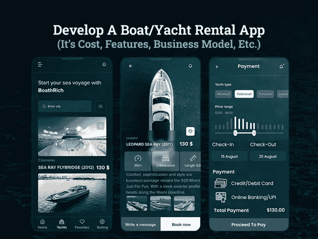

# 创建一个租船应用程序需要多少钱

> 原文：<https://javascript.plainenglish.io/how-much-does-it-cost-to-create-a-boat-rental-app-41e9cada9a56?source=collection_archive---------18----------------------->

## 创建一个船只/游艇租赁应用程序:其成本、功能、商业模式等。

你是居住在沿海地区，拥有豪华游艇租赁和船只，并从事游艇租赁业务的人吗？如果是的话，那么考虑为你的船只/游艇租赁业务采用移动战略可以帮助你打开无数的商机。

自从优步开始提供出租车预订和叫车服务以来，它已经改变了人们预订和使用租赁服务的方式。优步的成功故事实际上启发了租赁业务，并鼓励他们拿出类似优步的应用程序解决方案。

事实上，像游艇租赁行业的 GetMyBoat 这样的商业领袖正在主导市场，并见证着令人感动的成功。想知道他们如何在不可动摇的用户基础上迅速扩大租赁业务吗？这一切都要归功于按需船只和游艇预订移动应用解决方案，这些解决方案采用了出色的用户界面/UX 设计，改变了他们的租赁预订体验。

随着 EZ waves、GeyBoats 和 Hola Ride 等划船应用的推出，找到您选择的船只或游艇变得更加简单快捷。您可以简单地逃避到达时的漫长等待，并可以预订有或没有司机的船只/游艇租赁。

这种商业理念在沿海地区受到了大肆宣传，这就是为什么船只租赁公司要么与服务于庞大客户群的其他此类应用程序合作，要么建立联系。

既然在线船舶和游艇租赁预订服务已经成为这个城市的流行语，为什么不开发自己的船舶租赁应用程序呢？如果你真的有兴趣创建一个船只/游艇租赁移动应用程序，但不知道如何开始，那么这个博客是为你准备的…

在这篇博客中，我们提到了开发按需租船应用程序的所有方面，包括市场洞察、特性和功能、创收策略、应用程序开发团队等等。

*让我们从基础开始……*

## **为什么投资按需租船和游艇租赁移动应用是一个值得做的决定？**

据预测，到 2030 年年底，船舶租赁市场的收入有望超过[的 197 亿美元，可以肯定地说，船舶租赁服务正在增长。](https://www.transparencymarketresearch.com/boat-rental-market.html)

在豪华游艇领域，全球游艇租赁市场预计到 2027 年将达到 278 亿美元，并以 15%的 CAGR 增长。

因为 48%是海洋中最常见的小船，在美国广泛用于娱乐活动，产生 8700 万美元的收入。

有了所有这些船只和游艇租赁的统计数据，可以公平地说，这个租赁行业正在蓬勃发展，并将在未来保持下去。这就是为什么人们开始雇佣移动应用开发公司 来定制应用解决方案，以满足客户不断增长的需求。但是，在了解这些统计数据后，你们中的许多人想知道这些市场统计数据和划船租赁应用程序开发之间有什么关系？

船只和游艇租赁行业正在急剧增长，尽管按需应用被视为客户和服务提供商之间的一个公共平台，使他们能够在几分钟内完成业务交易，并避免所有此类与租赁预订相关的麻烦。

*近年来，按需订船应用正在沿海地区占据中心位置，因为它们解决了租赁者的主要痛点:*

*   消除道路上造成日常通勤者上班延误的可怕交通拥堵。
*   提供了一个负担得起的，可靠的和方便的选择，以预订他们选择的船每天都没有烦恼与长队。
*   为通勤者和游客提供舒适和豪华的租赁服务，而不会面临任何失望或租赁价格的突然上涨。

这一切都要归功于按需订船服务的概念，这种服务将一切转变为组织有序的运输系统，为游客和通勤者提供更好的解决方案。

*现在让我们直接进入这样一个事实:如何创建一本书，一个能让你在市场中脱颖而出的租船应用程序？*

## **开发船只/游艇租赁和预订应用程序的基本功能**

如果你正怀着好奇心开发一个移动应用程序，帮助你吸引潜在的用户群，并使你在市场上取得成功，那么你需要有一个需要包含在应用程序中的功能列表。你可以考虑雇佣一个 [**应用程序开发公司**](https://www.xicom.biz/services/mobile-app-development/) 来定制你的应用程序，使其具备这些特性，因为这是你的应用程序成功的主要决定因素。但最重要的是，请记住简单的用户界面和无障碍导航总是受到用户的青睐。

因此，我们在这里将开发一个船只和游艇租赁应用程序的基本功能分成了多个面板:

> **为用户面板构建船只租赁应用的基本功能**

*   **简单的应用程序注册流程:**要开始使用应用程序，允许用户在电子邮件、电话号码或社交媒体集成的帮助下注册。
*   **预定船只/游艇类型:**通过此功能，允许用户根据自己的愿望选择船只或游艇的类型。雇用一名应用程序开发人员，通过简单的选项定制功能，并允许用户为不同的目的预订船只，如水上活动、钓鱼、帆船、水上运动等。
*   **安排预订:**确保您有此功能选择船只或游艇，获取基本信息并根据方便提前安排预订。
*   **管理预订:**添加该功能，用户只需点击一下鼠标，就可以查看他们之前的预订、已确认的预订。
*   **立即预订:**根据紧急情况，确保您可以立即预订船只，没有任何延误。
*   **成本估算:**租赁和预订成本是租赁者最害怕的，所以你 [**雇佣一个 app 开发者**](https://www.xicom.biz/solutions/hire-developers/) 来集成这个功能，可以根据要走的距离提前提供成本估算。
*   **支付和收据:**确保你的应用程序中有一个数字支付系统，并允许用户通过多种方式进行支付，并提前生成预订收据。
*   **推送通知:**它帮助用户了解他们的预订状态、到达船只的提醒、优惠、交易和折扣。
*   **选择乘客数量**:增加一个功能，允许用户指定乘船的乘客数量。根据乘客的数量，让他们选择船。
*   **取消预订:**增加因紧急情况取消即将到来的预订的灵活性。
*   **跟踪和保护:**通过该功能，用户可以跟踪实时位置，并可以将其与他们的密友共享，以确保安全。
*   **评分和评论:**使用服务后，允许用户根据自己的体验和服务基础添加评分和评论。
*   礼品卡和礼券:为了吸引你的客户，提供礼品卡和礼券被证明是最有利可图的功能之一，也能让你获得更高的收入。

> **创建管理面板的功能**

*   **车队管理:**允许管理员持续跟踪和监控他们所有的车队，并确保他们与应用程序链接，以便用户可以轻松预订。
*   **管理客户:**app 中有一个功能，可以让你管理与 app 关联的，存储在某个 app 类别下的客户。
*   **支付管理:**由于不同用户接入不同支付方式，增加多支付整合选项，链接各种支付网关。
*   **实时分析:**确保业务所有者可以访问该功能，以验证已处理和未处理的租船请求，并通过详细的见解了解营业额。你可以雇佣一个移动应用开发者来定制这个功能，因为有太多的敏感信息需要通过这个功能来管理。
*   **报告和分析:**通过该功能，管理员可以生成实时报告，并为应用程序提供与船只租赁相关的详细信息，如船只的最常用类别、取消数量、累计订单数量等。
*   **管理船队可用性:**一名管理员负责管理船只/游艇的所有类别，因此请提及所有相关信息，以便进行无缝租赁预订。
*   **管理票价/位置基本费用:**所有的船都有不同的价格，因此，特定区域或航线有按需费用或租赁费用。所有这些计算都由管理员决定和管理。

> **创建船主面板的功能**

*   **登录/注册:**如同一个用户面板，船主可以借助发送到自己邮箱和手机的 OTP 验证登录。
*   **接受/拒绝用户请求:**根据可用性，允许应用程序所有者确认或拒绝用户请求。
*   **全面的船长个人资料详情:**允许应用程序所有者在预订船只时，通过提及他们的个人资料详情来更新船长详情，解释其经验和专业知识。
*   **船队管理:**管理和安排用于不同目的的船只或游艇的可用性，例如航行、巡航、划船、钓鱼、水上运动等等。
*   **管理利润:**在你的应用程序中添加一项功能，根据应用程序中收到的预订或用户请求数量，提供每周或每月的业务洞察。
*   **GPS 跟踪:**在应用程序中实现 GPS 跟踪将帮助您出于安全目的跟踪船只，并防止欺诈。

**简而言之:**这些是开发船只预订和租赁移动应用程序时需要考虑的几个基本功能。创建一个具有这些基本功能的游艇预订应用程序的估计成本将在 20，000 美元以上，需要 4 到 6 个月的时间来开发。但是雇佣一家 [**移动应用开发公司**](https://www.xicom.biz/services/mobile-app-development/) 来发布一款基础应用将会帮助你的企业增加竞争优势。因此，如果你准备将预算再扩大一点，那么就值得看看包含所有现代功能的高级应用程序版本。

# **订租船 App 的独特卖点**

为了让你的应用在竞争激烈的市场中脱颖而出，你需要整合一些独特的卖点，这些卖点可以被认为是应用的高级功能。

*   **天气更新:**在租赁水上车队之前，务必向客户更新天气预报。这就像给游客和旅行者一些额外的支持，让他们为天气状况做好准备。
*   **航海图集成:**基本上，航海图是为了船长能够快速顺利地在海上航行。但是在你的应用程序中增加这个功能将会让用户和乘船者保持更新。
*   **人工智能驱动的应用内聊天:**与其他打车应用一样，确保你考虑实施聊天机器人，并确保船长和用户之间在所选行程中的无缝沟通。
*   **操作区域设置:**通过可选的区域设置，用户可以决定您在特定沿海地区或区域提供的服务。此外，这将更好地让他们了解什么地区适合他们的旅行兴趣。
*   **交互式统计:**增加交互式统计，如行驶距离、收到的付款、每次乘车的租车人数等，将有助于企业立即提取所有业务洞察。
*   **促销代码和折扣:**经常使用促销代码和折扣来管理广告活动可以鼓励用户以最低的价格租赁船只。

现在，你们中的许多人都很想知道创建一个用于船只预订和租赁服务的移动应用程序需要多少钱。但在此之前，让我们了解如何从您的业务应用程序中创收…

# 如何将你的船只/游艇租赁和预订应用程序货币化？

无论你的应用想法有多复杂或简单，将你的商业投资货币化都是一个严重的问题。虽然有多种盈利策略可供选择，但以下是您可以考虑的几个最重要的策略:

*   **预订计划:**您可以通过为用户推出预订计划来获得可观的收入，通过这些计划，用户可以在预定的时间段内获得每次租赁预订的额外折扣。你可以考虑 [**雇佣一个移动应用开发者**](https://www.xicom.biz/offerings/hire-mobile-developers/) 来定制你的应用，让用户不会拒绝购买订阅计划。此外，租金和交易范围的选择取决于他们选择的订阅计划。
*   **第三方广告:**通过船只或游艇应用上的第三方广告可以产生大量收入。通过在您的应用上为各种企业提供空间，您可以允许他们通过您的应用推广他们的产品和服务。
*   **应用内购买:**乘船或乘游艇将是一次令人兴奋的经历，但为了让它更有趣，你可以为旅行添加一些茶点和饮料。
*   **佣金费用:**按需游艇或船叫应用程序所有者可以实现基于乘坐的创收模式，船主必须在每次旅行中支付佣金或交易费用。

所有这些都是最常见的策略，以创造收入对你的商业投资。但在利用这些策略之前，有必要了解创建一个游艇预订和租赁应用程序的成本…

## **一款按需游艇租赁应用的价格是多少？**

无论你是创业公司还是创业者，“一个点播 app 要多少钱？”是最常被问到的问题之一。但是这个问题没有简单的答案，因为应用程序开发项目包括几种类型的元素，每一种元素都会给应用程序开发成本带来很大的差异。此外，当涉及到多种类型的用户时，提出一个标准价格是相当具有挑战性的。

平均应用程序开发成本主要受各种因素的影响，如特性和功能、操作平台的选择、复杂性、质量保证、UI/UX 设计、应用程序开发、地理定位等。

平均而言，如果应用程序开发成本基于上述基本特性和功能来构建游艇预订移动应用程序，那么基本应用程序开发成本将在 20，000 美元左右，开发时间约为 6 个月。如果您计划推出一款具有所有这些现代功能的成熟应用程序，那么应用程序开发成本将在 25，000 美元至 35，000 美元之间，创建一个应用程序需要 9 个多月的时间。

由于每个业务需求都不一样，所以建议预约专家免费咨询，以获得更精确的订船 app 成本。

# **结论**

现代社会需要现代的解决方案，尤其是在谈论豪华服务的时候。由于精通技术的千禧一代是游艇租赁业务和船只租赁的主要目标受众，因此，提供一个用户友好的应用程序是满足他们期望的更好方式，并使他们能够提前预订。通过雇佣一家 [**移动应用程序开发公司**](https://www.xicom.biz/services/mobile-app-development/) ，你可以定制具有高级功能的解决方案，让专属生活方式变得更加触手可及。事实上，正确选择专家将利用各种方法和技术，使您获得更好的收入。

如果你心中有任何想法，或者正在寻找专家来帮助你从概念、设计到开发，那么你可以 [**联系我们**](https://www.xicom.biz/contact/) 并获得你的免费评估，或者在下面提出疑问。

*更多内容请看*[***plain English . io***](http://plainenglish.io/)