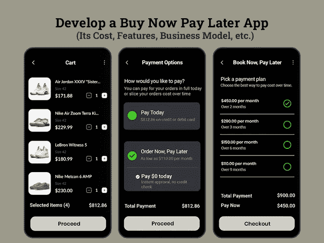

# 创建一个“现在购买，以后支付”的应用程序需要多少成本

> 原文：<https://javascript.plainenglish.io/how-much-does-it-cost-to-create-a-buy-now-pay-later-app-e6cab71f53e0?source=collection_archive---------6----------------------->

## **开发一款“先买后付”的应用程序:其成本、功能、商业模式和盈利策略**

您是否正在管理电子商务网站，并目睹需要购买但不愿意支付账单并在没有购买的情况下查看您的商店的客户比例大幅下降？

毫无疑问，这个疫情为每个人带来了革命性的变化。当全球经济陷入困境，企业在不断下滑的市场中艰难生存，顾客的钱包一天比一天薄——电子商务网站的发展已经提出了创新的金融解决方案，引诱你的顾客买东西，而不必担心在收银台付账。

随着技术和创新的出现，在疫情期间火起来的一个概念是现在购买，以后支付应用程序开发解决方案，这实际上使数百万人摆脱了经济负担。在这种不确定的经济形势下，BNPL 解决方案为人们提供了经济支持，让他们在封锁期间也能买得起东西。

因此，无论你是一家初创公司还是一名管理电子商务业务的企业家，选择开发 BNPL 应用程序都是征服市场和恢复业务增长的正确方式。

但在继续使用这一解决方案之前，你们中的许多人都在追逐几个问题，关于投资“现在购买，以后支付”应用程序将如何有利于你们的业务，它如何工作，以及如何将这一应用程序创意货币化。开发一个 BNPL 应用需要多少钱？…嗯，我们已经收集了这篇博客中的所有细节，并对您的问题给出了答案。

*让我们从头开始……*

## **理解“现在购买，以后付款”的概念**

你曾经用信用卡购物吗？如果是，那么你一定很熟悉这个概念…

听起来很相似，但不知何故，“现在购买，以后支付”的应用程序解决方案通过在以后支付选项中增加极大的便利性，偷走了客户的心。

那些还没有接触到这个行业蓬勃发展概念的人可以这样理解它，BNLP 只不过是一种类似于信用卡的金融服务。但是，这些应用程序已经采用了全新的信用购买方法，客户可以在以后用他们的空口袋支付他们想要购买的产品。

这个星球上的每个人都为获得这些服务而兴奋不已，但很快就以一个假设性的问题告终:从长远来看，是否有可能一点一点地支付这笔费用？这些服务有利率吗？

BNPL 新冠肺炎应用程序给人们带来的经济困难被认为是最方便的后付购物方式，因为它们是专门定制的，通过提供零利率的个性化信用购买选项来改善客户的购物体验。企业通过雇佣 [**应用程序开发公司**](https://www.xicom.biz/services/mobile-app-development/) 走在了前面，并通过牢记当今客户的要求和提供灵活的融资选项(尤其是无息)来引入产品。

如果你仍然怀疑投资 BNPL 解决方案是否是一个有价值的决定，以提高你的业务投资回报率，那么在继续之前，你必须看看“现在购买，以后支付”等金融应用程序的好处和市场统计数据。

## **BNPL App 解决方案市场统计及未来投资范围**

毫无疑问，在新冠肺炎的过程中，当世界经济陷入混乱时，像 BNPL 这样的应用程序开发解决方案已经占据了电子商务市场的中心舞台，并为企业提供了支持。

传统上，当人们用完现金或账户余额时，他们会求助于信用卡，但现在 BNPL 的服务已经开始行动起来，以满足现代人的需求。最常用的行动工具，如 Affirm、Afterpay、Splitit 和 Klarna，允许客户购买一些东西，然后在几个月内付清。

*如果你正在思考这个应用的想法如何围绕着这个行业，以及它如何帮助你创造数百万的收入，那么是时候看看市场统计数据了……*

*   调查报告显示，22 岁至 40 岁之间的客户中，87%对使用 BNPL 等应用更感兴趣。
*   调查报告提到，2020 年初，三分之一的美国人比以前更早使用这些支付应用程序，到 2021 年，10 人中有 6 人使用这些服务。63%的用户几乎都是男性受访者。
*   大宗采购受到 BNPL 服务的冲击，通过 BNPL 的平均采购额为 104 美元。
*   BNPL 服务有助于提高客户保留率，因为一项调查报告显示，65%的 BNPL 用户在六个月内连续购买了两次产品。

**简而言之:** BNPL 解决方案已经成为将持续增长的电子商务行业的重要支撑。从小企业到领先的企业家，所有人都希望 [**雇佣一名移动应用程序开发人员**](https://www.xicom.biz/offerings/hire-mobile-developers/) 来定制这一解决方案，为他们的客户提供卓越的购物体验。让您的客户有机会保护他们的预算将是增加您的业务收入的唯一途径。

*看完这篇文章后，如果你怀着进入这个市场的好奇心，那么请了解这些应用程序是如何工作的，以及如何在 2021 年创建一个 BNPL 移动应用程序……*

## **BNPL 手机应用程序的工作原理:了解立即购买稍后支付应用程序的工作流程**

对于第一次使用的人来说，应用程序的结构可能很难理解，但是为了避免所有的麻烦，我们把它分成了简单的步骤。

*以下是“现在购买，以后支付”( BNPL)应用程序的工作原理:*

*   **第 1 步-用户注册:**要开始使用应用程序，客户应在应用程序中注册以创建和验证帐户。可以使用您的姓名和联系方式进行处理。
*   **第 2 步-批准:**一旦用户获得批准，客户就可以开始购买，在结账过程中，他们需要选择 BNPL 支付选项。根据选择的还款选项，款项将自动支付给商店。
*   **第三步-选择还款方式** —结账前，用户可以选择灵活的还款方式，从每月分期付款到一段时间后全额付款。
*   **第四步:向商户支付款项:**选择还款模块后，商户在扣除部分业务金额后，立即通过 app 获得全额款项。
*   **第五步:还款:**所有手续完成后，客户开始按月向 app 还款协商好的金额。

各种各样的企业都在想，推出这种似乎完全有利于客户的应用程序有什么好处？如果你也有同样的疑问，那么你需要了解开发这种 BSNL 类型的金融应用程序的好处。

## **投资立即购买稍后支付(BNPL)应用程序克隆的好处**

现在购买以后支付的应用程序开发解决方案正在全世界蓬勃发展。无论你是从事电子商务还是零售业务，在 [**雇佣应用程序开发人员**](https://www.xicom.biz/solutions/hire-developers/) 之前，你必须明白，用 BNPL 应用程序管理和留住客户是推动企业成功的最佳方式之一……如何做到？

*开发“先买后付”应用的好处如下……*

*   **增加客户保持率**

从提供从商店购买任何东西的自由到根据他们选择的还款计划偿还贷款的灵活性，你可以成为顾客的最佳购物伙伴。有了吸引人的功能和诱人的优惠，用户总是希望与您保持联系。

*   **扩大客户群**

为了扩大你的业务，重要的是在提供有助于你吸引新客户群的功能或设施的同时留住老客户。不过，BNPL 的应用程序是一个完美的解决方案，通过为购物者提供更好的结账方式，让你能够改善在线买家的购物体验。

*   **给予购物者更多权力**

让你的买家购物直到他们放弃，不要给他们带来任何经济负担。通过提供零利率的灵活分期付款计划，现在购买，以后支付，企业可以见证越来越多的购物车转换。

*   **更高的交易价值**

通过 BNPL 应用解决方案，客户倾向于购买高端产品，而不会有财务负担。有了以后付款的便利，客户往往会顺利地进行大额交易。

如果你很想为你的企业开发一个按需购买的应用程序，你需要先睹为快，看看这个概念真正成为 powerpack 解决方案的特性和功能。

## **构建先买后付(BNPL)移动应用的必备特性和功能**

不管你的应用程序概念有多好，如果它不能满足客户不断增长的需求，那么它将是一种浪费。市场上有许多 BNPL 解决方案，那么您如何在市场中脱颖而出？只有了解市场需求，雇佣最好的 [**移动应用程序开发公司**](https://www.xicom.biz/services/mobile-app-development/) ，向竞争对手学习，并在你的应用程序中采用最好的特性和功能。最重要的是，你的应用程序的 UI/UX 设计可以改变游戏规则。简单、清晰和容易的导航总是受到客户的青睐。

*因此，让我们直接进入创建 BNPL 移动应用程序的基本特性和功能:*

*   **用户注册和授权:**与其他应用一样，用户可以通过使用电子邮件 Id 或电话号码注册应用来开始无缝支付服务。用户通过电话或电子邮件获得验证码，一旦他们确认代码，然后他们就可以开始购物。
*   **搜索框:**通过这一功能，用户可以轻松浏览加盟店，并能够根据位置、购物类型、性别、年龄等过滤条件查找商品。这一特性的加入可以确保出色的用户体验。
*   **应用内购物:**确保您使用该功能允许客户访问该应用，并要求他们稍后在付款时注册。更简单、更快捷、更省事的购物流程将确保更多利润。
*   **特色店:**将所有合作的特色店集中在风头上，用户可以很容易的了解到与你合作的品牌。他们不必手动检查你提供什么品牌。
*   **推送通知:**无论是提醒用户支付费用，还是让他们了解各种支付计划的交易、优惠或折扣，在你的应用中拥有这一功能都很重要。
*   **账户管理:**为了保持账户透明，重要的是要有账户管理功能，使您能够显示每个客户的所有即将到来的付款、订单和账户信息。
*   **自动扣款:**通过在您的账户中设置自动扣款功能，让客户的还款过程变得更简单、更轻松。但是增加了让用户手动设置这个功能的选项，让 app 自动扣费，避免支付失败。
*   **预付款:**由于 BNPL 提供灵活的付款方式，因此雇佣一名专家来整合这一功能并让客户在到期日前支付分期付款非常重要。
*   **重新安排付款时间:**任何人、任何时间都可能发生财务紧急情况。因此，雇佣一家 [**应用程序开发公司**](https://www.xicom.biz/services/mobile-app-development/) ，让你能够为你的客户提供在一定限度内重新安排付款的服务，让他们摆脱财务负担。
*   无息贷款管理信息系统:为你的客户提供获得无息贷款的灵活性。
*   **退款:**在你的应用程序中设置一些退款政策，让你的客户对贴有白色标签的“现在购买，以后支付”应用程序保持关注，并增强他们付款的安全性。

问题来了:什么是白标“立即购买，稍后支付”应用程序，它与基础应用程序版本有何不同…

*该应用模块的高级功能使其与众不同，并且通常被该应用的潜在用户所考虑……*

## 下面是 ***功能构建时-标签现在购买以后支付手机 App***

*   **确保无止境的购买:**让您的高级应用程序用户在选择无止境购物的支付服务时获得更大的优势。请记住，贷款金额越高，利润越好。
*   **超级快速审批:**该应用最受赞赏的功能是获得即时贷款审批。选择了该应用程序任何会员计划的用户可以利用这一功能，从申请贷款到获得批准的整个过程无需等待许多天。
*   **数字流程:**应用程序的整个处理过程都是数字处理的，所以确保你在应用程序中有这个功能，并允许用户以数字方式提及所有信息，如银行账户详情。
*   **不同的还款选项:**为了提供最好的客户服务，您可以 [**聘请一名手机应用程序开发人员**](https://www.xicom.biz/offerings/hire-mobile-developers/) 帮助您定制具有多种还款选项的模块。这将增加在客户愿意支付时偿还金额的灵活性，另一方面，商家将从应用程序中获得全额。

*尽管你的应用拥有最好的特性和功能，但有时由于缺乏应用安全性而无法成功。由于它是一个金融应用程序，因此应用程序的安全性一直是用户和企业迫切关注的问题。*

那么，如何确保一个安全的“先付后买”应用程序开发流程呢？

答案在这里……！

## **BNPL 手机 App 处理安全交易的安全措施**

当处理任何类型的金融项目时，维护和进行安全的交易是一些最重要的考虑因素。

如果谈论现在购买以后支付的应用程序，电子商务中的欺诈活动增加了 30%，销售额增加了 16%。欺诈活动的这种增加已经引起了对寻找维护安全交易的方法的严重关注。别担心，有 fintech 应用程序开发公司，确保您的应用程序开发解决方案更加可靠、安全和易于操作。怎么会？？？以下是他们在“现在购买，以后支付”应用程序开发过程中遵循的安全措施…

*   **两步认证:**为了确保用户在将信用卡或银行详细信息与您的应用程序关联时完全信任您的应用程序，您可以遵循这一标准的双因素认证程序来提高应用程序的安全性，并确保安全的交易方式。
*   **数据加密:**为了防止网络攻击，最大限度地降低破坏风险，开发者可以在数据处理和加工的每个阶段实施数据加密。
*   **多重安全检查:**为了在交易的每个阶段增加额外的安全层，您可以考虑实施各种安全检查，并限制对敏感信息的访问。

了解了所有这些关于 BNPL 应用解决方案的信息后，你一定很想知道这个应用创意将如何帮助你创造商业收入…

## **如何从现在购买以后支付(BNPL) App 赚钱？**

不同的应用程序有不同的商业货币化画布，但当涉及到立即购买稍后支付应用程序的货币化时，您需要采用一个聪明的策略…

*以下是你可以为 BNPL 应用考虑的几个最有潜力的赚钱模块:*

*   **协作费**

向多个品牌收取合作费来与你的应用合作是最常见的赚钱方式之一。通过雇佣一个 [**应用程序开发公司**](https://www.xicom.biz/services/mobile-app-development/) ，你可以要求为商家开发一个单独的模块，以无缝地遵循协作流程，并且没有任何麻烦地进行支付。

*   **会员计划**

通过每年或每季度提供会员计划来获得可观的收入，并允许用户在还款选项上利用额外的灵活性，每当他们在到期日之前支付分期付款时都可以获得奖励积分。

*   **收取滞纳金**

BNPL 的服务不收取利息，但如果客户未能在到期日支付分期付款，你可以收取罚金。

*   **佣金费用**

做好准备，从每笔交易中向商家收取佣金，赚取一大笔钱。

*无论你为你的商业应用选择什么样的盈利策略，确保你能充分利用它。现在来看看最常被问到的问题，构建一个 BNPL 移动应用程序需要多少成本？*

## 为 Android 和 iOS 开发一个“现在购买，以后支付”的应用程序要花多少钱？

估算 BNPL 解决方案的应用程序开发成本是最复杂的任务之一，尤其是当您不了解对整体定价有重大影响的参数时。

*如何？*

通过这篇博客的详细信息，你一定已经明白 BNPL 应用程序集成了复杂的功能，这些功能似乎很容易在多种设备上导航。但是是什么让这些应用程序运行顺畅呢？它只是用于应用程序开发的后端技术和工具。

接下来，它还取决于应用程序开发团队使用技术的熟练程度，以及在项目中部署了什么样的团队。

之后，由非俗气的用户导航是复杂还是简单？应用程序的用户界面/UX 设计将是应用程序成功的一个主要因素。

因此，如果总结所有这些要点，那么很容易理解应用程序开发成本主要受操作系统的选择、用于应用程序开发的技术和框架、复杂性、特性和功能、UI/UX 设计、应用程序开发团队、他们的位置、每小时成本等因素的影响…

这个参数的每一个变化都会带来应用程序开发成本和时间的差异。但是，如果你想了解一下成本估算，那么包括所有上述功能的基本应用程序大约需要 20，000 美元。但是，如果您希望超越基本功能，那么中等到高级水平的应用程序版本将在 25，000 美元到 35，000 美元之间，包含所有现代功能并确保高标准质量。

休息，总是建议咨询专家得到实际的项目估算！

# **结论**

随着电子商务销售额的上升，fintech app 开发解决方案 Buy Now Pay Later 已成为商家的迫切需求。由于数字解决方案似乎是一个未来的业务，建立一个像现在支付，以后购买的解决方案是一个有价值的决定。如果你也计划为你的企业创建一个类似的移动应用程序解决方案，那么你可以聘请一家 [**移动应用程序开发公司**](https://www.xicom.biz/services/mobile-app-development/) ，通过实施独特的功能选择并确保高质量的解决方案，帮助你在行业中脱颖而出。

如果您有任何想法需要转化为稳健的解决方案，那么您可以 [***联系我们***](https://www.xicom.biz/contact/) 并获得您的免费评估，或者在下面提出疑问！

— — — — — — — — — — — — — — — — — — — — — — — — — — — — —

*更多内容请看*[***plain English . io***](http://plainenglish.io/)