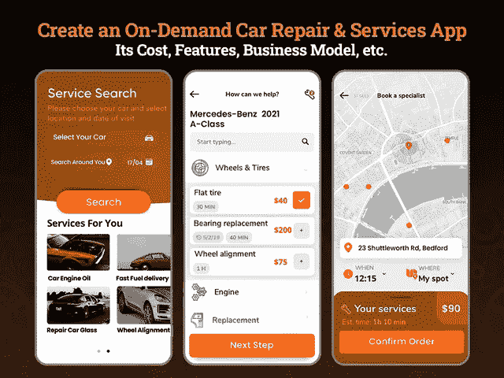

# 创建一个汽车维修和服务应用程序需要多少成本

> 原文：<https://javascript.plainenglish.io/how-much-does-it-cost-to-create-a-car-repair-and-services-app-a77ca44f48b2?source=collection_archive---------5----------------------->

## 开发一个汽车维修和服务应用程序:它的功能、商业模式和成本

数百万人热衷于拥有一辆汽车，让他们的日常出行变得更加容易和方便。但迟早，拥有一辆车的特权会在保养或维修时变成仇恨。在这个快节奏的世界里，没有人有那么多时间去修车，或者在服务站耗上很长时间。但是，为了让他们以同样的方式享受驾车旅行的乐趣，他们不得不忍受定期保养汽车的痛苦。人们总想摆脱这种乱七八糟的任务，但又没有其他选择。

但这一切都归功于技术和按需汽车维修和保养应用程序，它们改变了汽车护理的方式，完全满足了汽车护理的需求。

在这个技术驱动的时代，现代客户服务彻底改变了传统的汽车保养和维修方式，这需要你在服务中心等待数小时，比较服务价格。

预计 2021 年美国市场的汽车机械行业将产生 658 亿美元的收入，几个高效的车间已经推出了数字解决方案，并提供各种汽车维修服务和维护问题。像 CARFAX 这样的按需汽车维修和保养应用程序已经改变了人们日常汽车保养的方式。现在，随着随需应变应用程序的出现，寻找技能和高效研讨会的机制已经变成了点击几下鼠标的事情。

如果你仍然在没有任何数字存在的情况下管理车间，那么开发按需汽车维修应用程序是企业家在数字平台上推出按需汽车维修业务的最佳创业解决方案之一。

今天，数字世界正在快速发展，其中一个主要趋势是为汽车维修服务创建一个移动应用程序。有太多的方法来赚钱和留住用户。你只需要有正确的策略来构建一个成功的按需汽车维修和服务应用程序。

如果你不确定从哪里开始，这些应用程序如何工作，以及它包括哪些特性和功能，那么这个博客就是为你准备的。

**以下是主要亮点:**

*   *了解汽车维修保养 App 的工作流程*
*   *开发完美的按需汽车维修和保养服务的步骤*
*   *创建按需汽车维修和服务应用的基本功能*
*   *先进的功能让您的按需汽车维修和服务应用成为赢家*
*   *利用汽车维修和服务应用赚钱的最佳策略*
*   *创建一个汽车维修服务 App* 需要多少钱
*   *结论:利用数字化解决方案将您的汽车维修车间推向新的高度*

让我们深入了解每一点，以便更好地理解…

# **了解汽车维修保养 App 的工作流程**

您知道点播用户每年平均花费 576 亿美元吗？想知道是什么让这些应用程序征服了世界？只是它给用户生活增加的便利。如果你是一家初创公司，希望开发一款汽车维修和服务应用，比如 CARFAX **、**，那么首先你需要了解这些应用是如何工作的。

按需汽车维修和服务应用程序的工作流程与按需食品交付或杂货交付应用程序相同。在你雇佣一家 [**应用程序开发公司**](https://www.xicom.biz/services/mobile-app-development/) 之前，你需要明白，应用程序将为你提供一个平台，将车主与有经验的汽车机械师或技术人员联系起来，让他们利用这些服务，而不必进行长时间的等待。

> **不过，这里我们还是总结了按需汽车维修服务的基本流程:**

**第一步:应用程序登录:**要开始使用应用程序，用户需要使用他们的凭据登录应用程序。

**第二步:选择车型:**每个车型都不一样，虽然每辆车需要的服务也不一样。允许用户从众多汽车型号中进行选择。

**第三步:选择服务:**根据车主的需求，让他们从服务池中进行选择。

**第四步:价格和时间估算:**一旦用户选择了汽车型号和服务类型，就应该为选择的服务提供合理的报价。

**第五步:预约时段:**如果用户同意时间和成本估计，那么在他们喜欢的时间或日期安排或预约服务时段是值得的。

**第六步:技工到达:**安排预约后，技工到达客户，车主可以跟踪技工的实时位置，以了解到达该位置需要多长时间。

**第七步:付款:**用户可以使用应用内付款集成功能提前付款。

该应用程序的工作流程似乎非常简单和容易，但有许多功能包装在复杂的技术中，总体上使该应用程序工作完美无缺，并允许用户利用即时汽车服务和维护服务。在我们跳到了解创建一个像 CARFAX 这样的汽车维修和服务 app 需要多少成本之前，有必要了解一下如何创建一个汽车维修和服务 app？

# **开发完美的按需汽车维修和保养服务的步骤**

构建一个随需应变的应用程序就是选择特性和功能，使你的应用程序更实用。不过，如果你打算开发一个像 CARFAX 这样的按需汽车维修和服务应用程序，那么有必要先睹为快，看看开发一个能帮助你以高效的方式保养汽车的应用程序的基本步骤。

以下是构建像 CARFAX 这样的按需汽车服务和维修应用程序的几个重要步骤:

## **1。为您的应用程序选择一个唯一的名称**

要开始应用程序开发流程，您需要选择一个对汽车护理服务有意义的独特应用程序名称。你需要记住的是保持你的应用程序名称简短、独特、清晰，便于记忆。此外，避免选择与任何其他此类应用类似的应用名称，因为这会造成混淆。

## **2。集成特性和功能**

特性和功能是决定成功的主要因素，所以请雇佣一家 [**移动应用开发公司**](https://www.xicom.biz/services/mobile-app-development/) ，确保你将基本特性整合到你的应用中，并制作整个用户界面。他们帮助您以合适的方式定制应用程序，以满足您的业务需求，并帮助您在市场领导者中脱颖而出。你需要做的就是小心选择你的应用程序的特性和功能。

## **3。开发和部署应用程序**

一旦您选择了特性和功能，现在是时候编写一个应用程序，将您的应用程序想法变成一个强大的解决方案。这项任务不仅仅是应用程序开发，你需要进行应用程序测试，以评估应用程序的效率，并确保不应该有任何问题或错误。

现在推出你的 app，开始在 app 平台上推广，让人们了解你的服务。事实上，现在你知道了如何为你的在线维修店创建一个应用程序，让我们来讨论一下你的应用程序的特性和功能

# **创建按需汽车维修和服务应用的基本特性**

建立一个像 CARFAX 这样的按需汽车维修和服务 app 是一项复杂的任务；它包括一长串的特性和功能，这些特性和功能会很快增加成本，并需要很长的开发时间。因此，如果你是一家初创公司，或者正在为你的工作站寻找一款汽车服务和维修应用程序，但预算不足，那么开始使用只包含基本基本功能的 MVP 解决方案将是一个很好的选择。

*   **帐户设置:**一旦客户下载了应用程序，您的用户需要做的第一件事就是使用电子邮件 ID 或联系方式设置或注册一个帐户。或者，为了快速简单，你可以允许用户使用他们的社交媒体帐户信息登录应用程序。
*   **用户资料:**通过应用程序中的这一功能，用户可以编辑他们的帐户详细信息，如添加或编辑地址、支付数据、汽车详细信息等信息。
*   **搜索框:**通过 all 中的这个功能，你可以允许用户根据各种过滤器和地理位置浏览服务。这将改善用户体验，并帮助他们在其所在地附近找到最好的维修服务。
*   **查看公司简介:**该应用程序与数百家机械师或服务站合作，因此在选择任何服务提供商之前，请确保用户能够查看汽车服务中心或维修店的描述。
*   **技工档案:**确保应用程序中列出的每个技工都有关于技能、经验、知识等完整信息。通过应用程序中提供的这一功能，用户可以轻松查看分配到该工作的机械师的详细信息。
*   **选择服务:**从公司提供的众多服务中，用户只需轻轻一按，即可选择最喜欢的服务。
*   **安排时间:**该功能将为用户提供在自己选择的时间和日期预订服务的便利性。
*   **订购燃油:**既然是汽车保养维修服务，尽管 [**雇佣手机应用开发者**](https://www.xicom.biz/offerings/hire-mobile-developers/) 可以定制这一功能，并提供根据需求交付燃油或机油的特权是有意义的。
*   **购买汽车配件或零件:**汽车修理公司通常在他们的商店里有各种各样的汽车零件和附件，以便在一个地方提供完整的服务。但是要让用户直接购买这样的汽车配件，可以考虑在 app 内加入这个功能。
*   **优惠和折扣:**通过推送通知功能，您可以让您的用户随时了解折扣、优惠、交易等信息。此外，这一功能将有助于保持用户对应用程序的参与。
*   **GPS 跟踪:**通过此功能，用户可以跟踪技工的实时位置或找到附近的技工商店。
*   **分析:**这是该应用程序的一个重要功能，因为它允许应用程序所有者生成每周、每月或每年的进度报告，其中包含有关服务请求、解决的问题、产生的收入、拒绝的请求等深入信息。
*   **接受/拒绝服务请求:**根据技工的可用性，允许技工或店主接受或拒绝服务请求。
*   **应用内支付:**通过支付集成，用户可以选择信用卡、借记卡、Paypal、电子钱包等支付方式，通过应用进行支付。

这些是创建一个汽车服务和维修应用程序的基本功能，该程序将花费大约 4 到 6 周的时间，每个平台的成本为 20，000 美元。然而，随着汽车维修和服务应用程序在现代时代变得如此苛刻，因此，许多具有独家功能的应用程序已经在市场上推出。因此，如果你希望 [**雇佣一个应用开发者**](https://www.xicom.biz/solutions/hire-developers/) 来创建一个 MVP 解决方案，那么这些基本特性就足够了。但是，如果你正计划创建一个成熟的应用程序，或者想要扩展基本的应用程序，该怎么办呢？超越这些基本特征是值得的。

## **先进的功能让您的按需汽车维修和服务应用成为赢家**

*   **比较应用和定价:**在你的应用中添加这一功能以提供透明的定价将是一个值得做出的决定。将这种按需应用程序与当地商店或机械师、服务费等进行比较，以提供公平但负担得起的服务成本。
*   **安全支付网关:**要进行便捷的支付交易，请确保您的按需汽车服务和维修应用拥有安全的支付网关。
*   **高级搜索过滤器:**搜索过滤器可以轻松改变用户体验，允许车主根据自己的专业知识、经验等，在方便的时间和方式选择所需的服务类型。
*   **多语言支持:**如果你的目标受众来自多个地区，那么让语言成为你的应用的一大障碍。在您的汽车维修和服务应用中添加多语言和货币支持，以便在全球范围内发布您的应用。
*   **应用内聊天:**这显然是一个增值功能，可以帮助你简化对话。应用内聊天功能将允许车主和机械师就服务进行清晰的对话。
*   **发票生成:**让用户通过 app 生成发票，发票上有所有在车内更换过的服务和零件的详细信息。
*   **忠诚度计划:**每次顾客通过你的应用使用服务，你都可以奖励忠诚度积分，这些积分可以在账单上兑换。有了这个功能，就可以提高用户留存率。

你可以考虑在你的应用程序中包含的其他一些功能有短信验证、服务时间表、实时跟踪等。您可以在应用程序中包含的特性和功能是无止境的。但是你的应用程序中的功能越多，应用程序的开发成本就越高。那么问题来了，创建一个像 CARFAX 这样的汽车维修和服务 app 需要多少成本？

## **创建一个汽车维修服务 App 需要多少成本**

当谈到创建汽车服务和维修应用程序的成本时，有许多因素会影响应用程序的开发成本。而这类因素的每一次变异，都能带来 app 开发成本和时间的巨大差异。

如果您正在考虑开发一个具有上述基本功能的应用程序，创建一个按需汽车维修和服务应用程序通常需要每个平台 20，000 至 35，000 美元的预算。但是在你前进之前，你们中的许多人想知道为什么在移动应用程序开发中有巨大的差异。

如果说实话，那么平台选择、特性和功能、技术、应用程序开发团队、UI/UX 设计、应用程序测试等因素都会极大地影响应用程序开发成本。你们中的许多人可以选择直接咨询 [**软件开发公司**](https://www.xicom.biz/) ，但请记住，更复杂的应用程序结构将花费昂贵的价格，因为它需要更长的开发时间，并需要高技能的开发人员和设计人员来构建应用程序。开发人员的每小时成本根据他们的技能、经验、知识和地点而有很大差异。

因为每个企业都有不同的应用程序开发需求，尽管没有适合所有企业的标准应用程序开发解决方案。定制的解决方案是根据业务需求开发的，但为了得到一个公平的估计，值得咨询应用程序专家。他们会评估你的商业想法，并帮助你获得最佳解决方案。

## **将你的汽车维修和服务应用货币化的最佳策略**

如果你计划建立一个像 CARFAX 一样的按需汽车服务应用程序，并期待着将其货币化，那么首先你需要了解什么类型的商业模式更适合你；

*   某单一汽修品牌的汽车服务 app，有本地连锁店；
*   与多个汽车服务中心和当地维修店合作的聚合模型。

根据业务模型，您可以定制应用程序，这意味着最终产品将具有符合您的业务需求和满足最终用户需求的特性和功能。然而，如果你正在考虑开发一个像 CARFAX 这样的汽车维修和服务应用程序，那么你可以通过你的应用程序托管多个无法负担创建自己的平台的业务。你可以在你的应用程序上列出他们，让他们每个人都能创建自己的个人资料，列出维修服务，估计价格等。

但如何将你的按需汽车维修和服务应用程序货币化，是核心问题…

> **你可以为你的汽车维修和服务应用考虑一些潜在的盈利策略:**

*   **服务费:**为了方便您选择服务时预约机械师，并派一名机械师到您的住处修理问题或为服务店挑选汽车，向客户收取服务费是值得的。
*   **佣金:**如果你能为各种企业或服务中心创建一个聚合应用，这种策略将会非常奏效。你可以收取固定的佣金，也可以对通过你的应用程序进行的每笔交易设定一定比例的佣金。
*   **功能列表:**每个服务中心都想在主页或列表中占据重要位置。所以你可以按月、按季度或按年向商家收取刊登费。
*   **订购计划:**您可以通过让用户选择按月、按季度或按年订购计划来提供对特殊功能或附加服务的访问。确保订阅计划的费用对用户来说是经济实惠的。

为了充分利用您的移动应用程序开发，有必要选择合适的功能进行定制，并选择最合适的盈利策略。

## **结论:利用数字化解决方案将您的汽车维修车间推向新的高度**

如果你进入汽车维修和服务行业，并寻找潜在的方法将其扩展到新的高度，那么开发一个按需汽车维修和服务应用程序是一个值得的决定，并解锁几种创收的方法。但是你需要雇佣一个 [**移动应用开发公司**](https://www.xicom.biz/services/mobile-app-development/) 来用先进的技术、特性和功能来帮助你对用户产生积极的影响。正确选择技术、盈利战略和开发方法将帮助您构建一个强大的解决方案，满足现代人的实际需求。

如果您已经有了一个应用程序开发的想法，并且正在寻找专家来处理应用程序开发过程、UI/UX 设计和部署，那么您可以 [**联系我们**](https://www.xicom.biz/contact/) 或者在下面提出疑问。

======================================

*更多内容看* [*说白了。在这里注册我们的*](http://plainenglish.io/) [*免费周报*](http://newsletter.plainenglish.io/) *。*