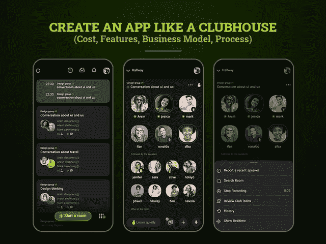
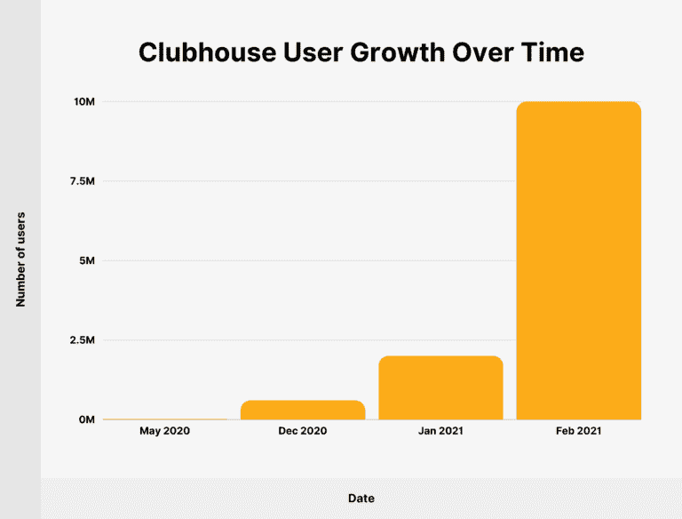
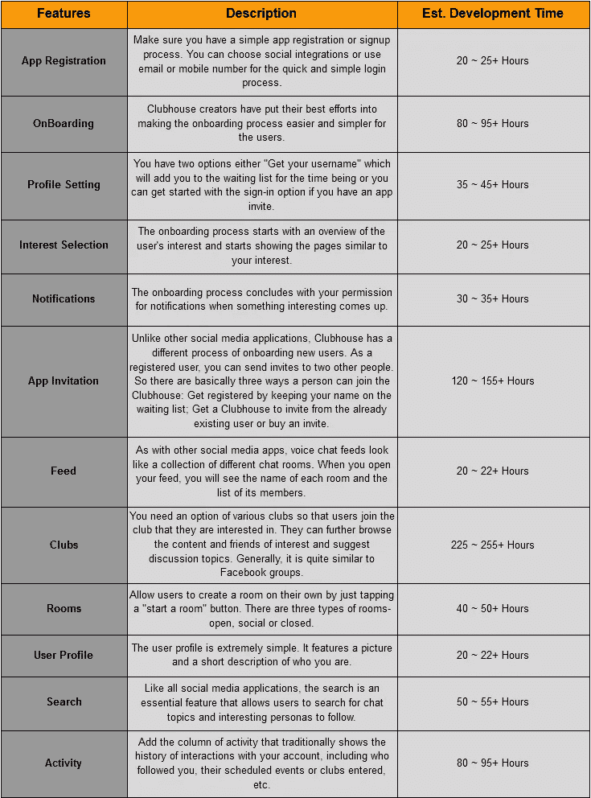
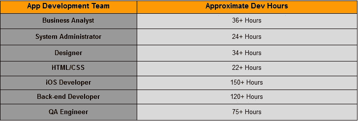
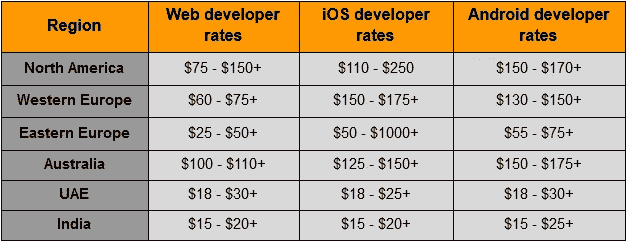
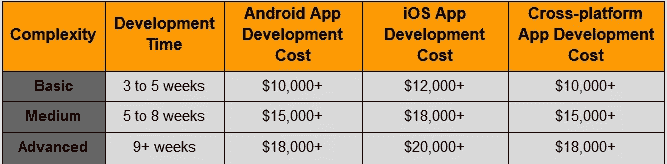

# 2021 年创建一个像 Clubhouse 这样的 App 需要多少钱

> 原文：<https://javascript.plainenglish.io/how-much-does-it-cost-to-create-a-clubhouse-app-in-2021-221df883c162?source=collection_archive---------8----------------------->

## 创建一个类似 Clubhouse 的应用程序:成本、功能、商业模式和流程

How Much Does it Cost to Create a Clubhouse App in 2021

随着疫情的严重影响无处不在，情况与去年完全不同。世界各地的人们有将近一年的时间被关在家里，不得不使用数字通信工具在家里做生意。但缺乏现场交流和社交活动导致了数字产业的巨大繁荣。

因此，新兴的社交媒体公司带来了联系人们、朋友、家人、名人和同龄人的新方式。很少有创业公司在 2020 年取得巨大成功。其中之一就是俱乐部会所。

虽然脸书、Instagram、Twitter 等在线社交媒体平台是这个领域的少数巨头，但用户正在仔细研究一些新的东西，一种更具吸引力和创造力的社交媒体平台。

随着 2020 年 3 月基于音频的社交网络应用程序的推出，Clubhouse 已成为该镇的流行语。

WhatsApp、Snapchat、抖音等即时聊天应用都在尝试新的创意来吸引用户并保持潮流，但凭借过多的最新功能和功能，Clubhouse 正在稳步占据语音聊天应用领域的中心舞台。

自从埃隆·马斯克使用 Clubhouse 以来，该应用程序开始成为头条新闻，用户数量在一夜之间达到 200 多万。

想知道怎么做？让我们直接进入关键事实，帮助你理解为什么基于音频的社交媒体应用程序现在很流行，以及它如何帮助你发展业务。

> 这里有一个目录:

*   会所:基本概况和市场快照
*   是什么让一款语音聊天 App Clubhouse 如此受欢迎？
*   为什么需要创建自己的会所 App？
*   如何搭建一个类似 Clubhouse 的语音聊天 App？
    *-创造你自己的商业战略
    -做出吸引人的 UX/UI 设计
    -选择你的盈利战略
    -添加特性和功能
    -为应用开发雇佣一个团队
    -测试-发布-成长*
*   建一个 App 会所要多少钱？
*   搭建一个类似 Clubhouse 的语音聊天 App 需要多长时间？
*   结论

> 让我们深入每一点，以便深入了解:

## **会所:基本概况及市场快照**

简而言之，Clubhouse 是一个基于语音的聊天和播客平台，在这里你只需要来谈谈你对自己重要的事情，而不必分享任何文本、图像或视频。感谢 [**移动应用开发公司**](https://www.xicom.biz/services/mobile-app-development/) ，他们竭尽全力让这个平台成为擅长演讲和娱乐听众的创作者的理想场所。这个应用程序最好的部分是，它是一个非常舒适的平台，你只需要点击记录和说话。不需要使用光线、照相机、化妆品、滤镜或服装来给别人留下深刻印象。

有了这个平台，人们可以自由地分享播客、想法、创意、故事、演讲，以及他们对俱乐部会所的任何想法。最重要的是，Clubhouse 不会录制任何音频，也不会存储在任何服务器上。

> 如果你仍然想知道这款应用如何在短短一年多的时间里撼动了市场，那么先来看看市场统计数据:

*   [据统计](https://backlinko.com/clubhouse-users)，Clubhouse 从 2020 年 3 月的 1500 人，到 2021 年 2 月已经达到 1100 万周活跃用户。
*   会所目前的价值已经达到 10 亿美元，比 2020 年 5 月增加了[1 亿美元。](https://backlinko.com/clubhouse-users)
*   仅仅一年时间，迄今为止，Clubhouse 已经筹集了超过 1000 万美元。
*   根据 Exploding Topics 的数据，在过去的 6 个月中,“Clubhouse app”的搜索量增长了 2 倍。

[Image Source](https://backlinko.com/clubhouse-users)

你一定左右为难，这个语音聊天应用程序是如何成为轰动一时的热门应用程序并在互联网上流口水的…

## **是什么让一款语音聊天 App Clubhouse 如此受欢迎？**

其核心的高度吸引人和用户友好的功能使其在市场中脱颖而出。它允许用户聚集在一个房间里聊天，也允许房间里的人查看其他人的个人资料。但是只有当你举手并得到主持人的允许时，你才能开始讲话。兴趣相同的人实际上聚集在俱乐部里。

由于它包含简单的功能并且易于访问，因此它在市场上的需求越来越大。

> 除此之外，以下几个因素让它成为一款受欢迎的语音聊天应用:

*   **实时语音聊天** -无录音和音频存储
*   **排他性** -它只是一个基于语音的应用程序，所以只需要专注于语音技术和语音消息。
*   **自发聊天-** 外向者和内向者的理想平台
*   **仅限邀请的应用-** 聊天在获得许可后开始
*   **简单界面-** 简单易用
*   **个性化优化-** 允许用户开始讨论他们个人喜欢谈论的事情。

这是一个非常独特和创新的投资理念。如果你仍然怀疑为什么你应该投资开发一个像 Clubhouse 这样的聊天应用，那就继续阅读吧！

# **为什么需要创建自己的俱乐部会所应用程序？**

音频信息的概念并不新鲜。一些领先的应用程序，如 Whatsapp、Telegram、Snapchat、微信，已经将这一概念作为其应用功能之一。但是，像 Clubhouse 这样的语音聊天应用的新时尚理念让用户能够自发地点击记录，并使语音成为人们再次联系的方式。

*“但核心问题仍然是一样的，什么类型的企业可以利用这一应用理念，他们将获得什么样的回报？”*

随着不断变化的市场趋势和经常变化的用户心理，新兴企业总是需要采用新的应用开发理念，为他们的业务增加优势。

*   **新兴企业或初创企业**

如果你是在 B2B 中工作的初创公司或小企业，你可以创建一个应用程序，比如用于在线营销的 Clubhouse 语音聊天，将客户和商业伙伴联系起来，发展他们的品牌。

*   **商界领袖**

已经处于市场领先地位的企业可以选择雇佣一家 [**移动应用开发公司**](https://www.xicom.biz/services/mobile-app-development/) ，让他们能够按照相同的概念构建一个具有额外功能的应用。利用这个平台，他们可以在这里充当专家和意见领袖，分享他们的经验，推广他们自己的专业知识。

*   **科技投资者**

对科技投资者来说，这是一个创造内容和提高品牌知名度的理想平台。近年来，社交媒体平台已经成为一个令人印象深刻的平台，让人们听到它的声音，并把用户变成有影响力的人和品味者。因此，拥有一个像 Clubhouse 这样的应用程序意味着你可以同时成为一个播客、社区管理者和直播用户。

然而，让我们诚实地说，在你雇佣一个应用程序开发人员来创建一个像 Clubhouse 这样的应用程序之前，重要的是要明白你需要根据你的经验和知识来创建对话。没有假新闻和废话将致力于建立这个应用程序。这是 Clubhouse 成功的关键，也是吸引新观众的机会，他们会通过有趣而真诚的叙述来欣赏你的服务和产品。

因此，如果您已经准备好向开发流程迈出一步，并对有助于应用程序开发流程的参数虎视眈眈，那么您需要阅读下一部分…

# **如何搭建一个类似 Clubhouse 的语音聊天 App？**

开发一个像 Clubhouse 这样的社交媒体即时语音聊天 app 并不是一件容易的事情。从涉及正确的商业策略到盈利模式，雇佣开发团队到开发一个完美的 UX/用户界面设计，还有很多其他的技术问题需要寻找。

> 所以让我们一步一步地开始吧:

## **1。创建自己的商业战略**

毫无疑问，俱乐部会所背后有一个头脑风暴的概念。但在复制应用程序之前，重要的是要决定你想通过这个应用程序实现什么，以及谁将是你的目标受众。你是想创建一个私人聊天室，还是想专注于主持大量的播客和免费的协作会议？

这些问题将有助于你更好地确定你的目标受众是哪一类人，以及这样做的好处和坏处。记住这些方面，建立商业战略，使你能够弥合你的目标和成功之间的差距。

## **2。做出吸引人的 UX/用户界面设计**

有错误的应用程序将很快从挤满应用程序的市场中被淘汰。为了在市场竞争中保持领先，请确保您的应用程序具有吸引人的视觉效果，足以吸引并留住应用程序用户。

有时候，应用程序设计中有太多的创造性和复杂性，以至于发生了几次崩溃，用户很难浏览应用程序。因此，为了创造一个平衡的吸引力，你需要更深入地了解用户到底想要你的应用程序做什么。

*例如，Tinder 在早期开发阶段最初专注于速度。但是，Tinder 很快意识到，如果这些快速匹配不相关，那么它们就没有意义。所以后来他们改变了他们的算法，以提供更好的匹配，结果稍有延迟。*

> 这就是他们如何设法建立自己的应用程序，并使其在顶级社交约会应用程序中排名。

在所有事情的背后，最重要的是你为这个项目雇佣的 UX/UI 设计师。建议 [**雇佣拥有所有技能和经验的应用开发者**](https://www.xicom.biz/solutions/hire-developers/) ，在视觉吸引力和功能性之间取得完美平衡。通常，雇佣一名 UI/UX 设计师的时薪从 12 美元到 25 美元不等，这取决于应用程序的复杂程度。

## **3。选择您的盈利策略**

现在你已经决定了一个商业战略，并制定了决策，但你将如何从你的应用程序中获利呢？虽然有多种盈利策略，但对于一个类似会所的应用程序来说，最适合的商业模式是什么？

如果你真的了解你的用户的需求，那么你就可以很容易地预测他们为什么会为这些服务付费。以下是三种最合适的盈利模式，你可以在 [**雇佣专用应用开发**](https://www.xicom.biz/solutions/hire-developers/) r 创建语音聊天应用时参考:

*   **免费增值:**用户可以免费下载应用程序，并获得基本功能。但是，他们需要为升级帐户或使用高级功能付费。
*   **高级或付费模式:**这是一种简单的盈利模式，用户将为访问你的应用支付一次性费用。
*   **应用内购买:**用户可以使用应用内购买支付各种功能和产品。
*   **广告:**您可以从多个广告选项中选择:
    ***a .每次点击成本:*** *您可以在用户每次在您的应用程序中与他们的广告进行交互时，向广告商收取费用。* ***b .每次动作的成本:*** *当用户完成一个目标动作，如注册你的应用或安装应用时，向广告商收取费用。* ***c .每英里成本:*** *你可以在你的 app 中每 500 次广告展示向广告主收取费用。*

## **4。添加特性和功能**

凭借语音聊天应用程序的出色特性和功能，Clubhouse 取得了发展势头，成为了一家独角兽初创公司。它的成功导致社交音频领域的竞争对手激增，并仍在推动整个音频聊天生态系统。那么，你需要将哪些特性和功能集成到应用程序中才能成为一个成功的应用程序呢？

> 如果你想创建一个像 Clubhouse 这样的应用程序，有一系列你需要考虑的功能:

## **5。应用程序开发团队员工**

要建立一个像 Clubhouse 这样的语音聊天应用程序，你需要一个开发团队，他们可以无缝地将你的应用程序想法转化为一个完美的解决方案。应用程序开发流程通常始于市场调研、创建技术规范、进行成本估算和项目规划。因此，在您参与语音聊天应用程序开发流程之前，您需要聘请一家 [**移动应用程序开发公司**](https://www.xicom.biz/services/mobile-app-development/) 来支持一个团队，该团队包括:

雇佣一个应用程序开发团队的平均成本从 15 美元到 150 美元不等，这取决于开发团队的技能、经验和地点。

## **6。测试-启动-成长**

所以最后你创建了一个应用，但是一定要雇佣一个应用测试员来保证应用的质量。为了识别错误和问题，QA 工程师将让您的应用程序在多个平台上运行，并使用各种不同的测试工具来确保出色的用户体验。

# **建一个像 Clubhouse 这样的 App 要多少钱？**

估算像 Clubhouse 这样的语音聊天应用的最终成本有点棘手。平均而言，像 Clubhouse 这样的应用程序的开发成本，对于一个具有所有基本特性和功能的单一平台来说，可能需要大约 15，000 美元到 25，000 美元以上，但对于所有高级特性来说，它可能需要 50，000 美元以上的昂贵价格。

最终的成本估计主要取决于应用程序的复杂性、平台选择、特性和功能，以及你为项目雇佣的开发团队。

*通常，大多数软件开发公司用于计算最终成本的基本公式是“总开发小时数* app 开发者每小时成本=最终 app 开发成本”。*

> 开发人员的每小时费用因地点不同而有很大差异。我们来看看各个地区的小时价格。

平均而言，美国、加拿大和澳大利亚被认为是最昂贵的地区，应用程序开发人员的时薪从 100 美元到 200 美元以上，而印度和阿联酋以雇佣最便宜的工程师而闻名，时薪为 15 美元到 50 美元以上。

# **搭建一个类似 Clubhouse 的语音聊天 App 需要多长时间？**

像成本一样，应用程序开发时间也取决于不同的因素。例如，一个端到端的加密消息应用程序的后端将需要 560 个小时来构建，而一个复杂程度较低的应用程序将需要 3 个月。

> 以下是构建不同复杂程度的应用程序的时间和成本估算:

总而言之，开发时间取决于应用程序的复杂程度。对于一个平台来说，构建一个纯音频应用程序所需的时间大约为 1000 到 1200 多个小时，包括整个团队成员的工作。

# **结论**

在疫情期间，语音聊天应用程序变得非常受欢迎，并增加了用户对俱乐部会所应用程序的超级新鲜特性和功能的狂热。因此，全球各地的企业都试图通过建立像 Clubhouse 这样的语音聊天应用程序来抓住这个市场的巨大潜力。因此，如果你也在寻找建立一个像 Clubhouse 这样的应用程序，那么请一家 [**移动应用程序开发公司**](https://www.xicom.biz/services/mobile-app-development/) 帮助你创建一个具有所有新功能的语音聊天应用程序，并使你能够接触到你的最终用户。

仅仅开发一个基本的音频应用程序已经不是什么令人兴奋的概念了，所以我们在这个博客中提到了所有的基本东西，来帮助你制作一个成功的应用程序。

*希望这个博客已经以最好的方式解释了每一件事情。但是，如果你对建立一个像 Clubhouse 这样的应用程序有任何疑问，那么你可以联系我们或者在下面提出疑问。*

*更多内容请看*[*plain English . io*](http://plainenglish.io/)