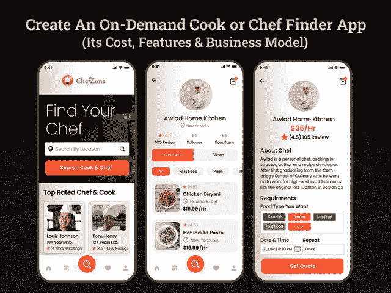

# 创建一个厨师或厨师搜索应用程序需要多少钱

> 原文：<https://javascript.plainenglish.io/how-much-does-it-cost-to-create-a-cook-or-chef-finder-app-48f6cace039f?source=collection_archive---------3----------------------->

## **开发一款厨师或厨师搜索应用程序:其成本、功能和商业模式**

[Dribbble](https://dribbble.com/shots/15890406-Food-Delivery-App-UX-UI/attachments/7717790?mode=media) by [Nasir Uddin](https://dribbble.com/nasirnurency)

毫无疑问，食品和烹饪行业快速发展，并很快成为一个万亿美元的行业。这实际上鼓励了许多食品和烹饪专业人士尽快创业，成为这个蓬勃发展的行业的一部分。由于现在食品和烹饪行业有如此多的竞争对手，因此要想保持领先，你需要密切关注每一个与食品和烹饪行业相关的需求。

随着疫情的出现，事情在一瞬间发生了变化。曾经对按需在线食品交付应用有巨大的需求，这些应用主要帮助人们创造平衡的工作生活，并给在线食品交付行业带来了突然的推动力。然而，现在人们很快转向按需烹饪或厨师搜索移动应用程序，这有助于使用家庭食材烹饪健康廉价的饭菜，并符合他们的饮食计划。现在，人们已经认识到这样一个事实，对于长期饥饿的痛苦来说，网上送餐并不是一个可行的选择。

因此，如果你是一个将烹饪课作为一门艺术或职业或爱好的人，可以开始使用这款按需烹饪或厨师搜索应用程序，与有需要的用户联系。

食品和烹饪行业不断增长和变化的需求为企业和初创公司创造收入和发现新的商机打开了大门。如果你还在犹豫是否要开发一个一流的按需在线厨师或厨师搜索应用程序，那么你需要了解市场洞察力。

## **了解送餐和烹饪行业的重要统计数据**

无论你是专业厨师还是食品企业主，在未来几年，接受按需烹饪或厨师搜索应用程序将是一个有利可图的机会。虽然有许多在线烹饪网站可以指导你用有效的方法找到熟练的厨师或厨师来满足你的烹饪需求。然而，按需厨师或厨师查找应用程序将根据首选位置、菜肴、当地食物风味等提供查找厨师的便利。简而言之，作为一名商人，启动一个按需烹饪搜索应用程序将是一个有利可图的机会。

你不必相信我们的话，这里我们收集了一些与食品和烹饪行业相关的数据和事实。

根据 Statista 的调查报告，2021 年食品市场的收入达到 89.45354 亿美元，预计在 2026 年前每年增长 [4.50%。](https://www.statista.com/outlook/cmo/food/worldwide)

有了这些统计数据，很明显食品行业正如火如荼地进行着，并准备进一步引领这个领域。你只需要雇佣一个 [**手机 app 开发公司**](https://www.xicom.biz/services/mobile-app-development/) 就能成为这个行业的一份子。但由于网上订餐并不是每个人都可行的选择，因此，推出一款帮助人们找到熟练可靠的厨师或厨师的应用程序是值得的。

然而，在您进入开发按需厨师或厨师搜索移动应用程序的过程之前，是否值得了解这些移动应用程序是如何工作的？

## **按需厨师和厨师搜索应用程序是如何工作的？**

与任何其他应用程序一样，按需厨师或厨师搜索应用程序将与任何其他按需预订应用程序相同。

因此，要聘请厨师或厨师，用户需要下载应用程序，并使用他们的初始设置证书注册。接下来，他们需要编辑个人资料的详细信息，浏览厨师列表，并根据他们的位置、时间和烹饪需求对选项进行排序。

任何时候用户需要烹饪食物，他们只需点击应用程序，并提供他们需要找到厨师的位置以及他们想要的美食。根据偏好，应用程序会通知偏好位置的厨师。厨师可以通过该应用程序与用户取得联系，并能够亲自见面。

## **按需厨师和厨师搜索 App 的目标受众是什么？**

在开发移动应用程序时，应用程序的成功主要取决于应用程序中包含的特性和功能。但是，功能的选择可能会因目标受众的不同而有很大差异。为了理解这个参数，你需要先睹为快，看看你的应用面向哪些目标受众。

*   **离家生活的人**

有很大一部分人因为工作、教育或其他原因远离家乡生活。他们通常依赖餐馆、咖啡馆或在线送餐应用。虽然他们确实喜欢在外面吃饭，但在某种程度上，他们不喜欢种类繁多的菜肴。出于这个原因，人们会很高兴聘请厨师或厨师在家里做他们最喜欢的饭菜。

*   **针对特殊事件**

作为一年中最大的事件，新年和圣诞节就在眼前，谁想呆在厨房里忙着烹饪食物。通过选择 [**雇佣移动应用程序开发者**](https://www.xicom.biz/offerings/hire-mobile-developers/) 你可以创建一个按需厨师或厨师雇佣应用程序，让人们可以轻松地从世界任何角落预订厨师，没有任何麻烦。因此，与其错过活动的乐趣，人们可以选择聘请厨师或厨师为他们的聚会或活动制定完美的菜单，并提供新鲜制作的食物，而不必整天呆在厨房里。

*   **旅游型受众**

这些类型的用户喜欢简单快捷地做饭。虽然这类目标受众很少在家使用该应用程序，但他们可以轻松地在家做饭。

*   **生活方式用户**

在当今这个时代，每个人都有不同的生活方式，喜欢和不喜欢。有一个潜在的观众群体，他们更喜欢节食但素食，而其他部分更喜欢便宜和不太复杂的菜肴。定制首选菜品清单总是一件麻烦事。这就是按需厨师或厨师查找应用程序将为您工作的地方。

希望有了这个，你已经很容易明白谁将能够使用你的应用程序，但应用程序的成功主要取决于你选择在应用程序中包含的特性和功能。因此，我们没有东张西望，而是总结了一些最佳的功能选择，帮助您创建按需厨师或厨师搜索应用程序，如 Cookinat、Coox 或 Rockoly。

## **如何创建一个按需烹饪或厨师搜索应用程序，并正确选择特性和功能？**

由于人们已经习惯使用他们的智能设备过他们的生活，因此你需要在应用程序中实现这样的特性和功能，以便通过应用程序雇佣厨师或厨师。厨师或厨师搜索器应用程序开发的核心是用户界面/UX 设计，为用户带来最好的屏幕解决方案。因此，这里我们收集了一些最好的功能选择，分为三个元素，包括用户面板、烹饪面板或管理面板

> **为 Chef Finder 应用程序的用户面板开发功能**

*   **注册:**要开始使用一个应用程序，用户需要使用电子邮件 ID 和联系方式等凭据进行注册。如果你真的想从应用的基本功能入手，应用注册是至关重要的。
*   **编辑个人资料:**通过此功能，允许用户添加或编辑个人资料的详细信息，如您的美食偏好、位置、可用性、时间等。
*   **选择厨师:**让用户根据自己的兴趣选择或找到厨师或厨师，并搜索过滤器，如特定位置的可用性、每小时费用、烹饪专业等。
*   **发送烹饪请求:**在此部分，一旦用户找到满足其烹饪需求的合适的厨师或厨师，他们就可以使用此功能向所需的厨师发送请求。
*   **查看服务:**通过这个功能，用户可以查看厨师的描述，并能够了解不同厨师提供的服务。通过这种方式，他们可以在最终预订之前了解厨师的专业。
*   **追踪厨师:**通过在应用程序中实现 GPS 定位功能，用户可以追踪厨师的实时位置，甚至可以建议到达最终目的地的最合适路线。
*   **查看厨师的详细信息:**在预订厨师之前，用户可以查看厨师的详细信息，如位置、专业知识、经验、每小时收费等。
*   **预约:**通过应用内的这一功能，用户可以在需要之前预约厨师，避免最后一刻的麻烦。
*   **付款:**允许用户使用信用卡、借记卡、网上银行等多种支付方式向厨师或厨师付款。您还可以 [**雇佣一名移动应用程序开发人员**](https://www.xicom.biz/offerings/hire-mobile-developers/) 来定制这一功能，并构建具有应用内支付解决方案的解决方案。
*   **评级和评论:**让用户分享他们的反馈，并根据他们的经验和服务质量对厨师进行评级。

> **为烹饪面板开发功能**

*   **注册:**像用户面板一样，厨师也需要使用他们的电子邮件 ID 或应用程序批准的凭据在应用程序中注册。
*   **管理个人资料:**使用应用程序中的这一功能，厨师可以添加或编辑他们的详细信息，如专业、服务地点、经验、预计烹饪时间等，以使他们的个人资料更具吸引力。
*   **查看用户请求:**通过该功能，厨师可以查看用户请求的完整细节以及他们希望获得的烹饪服务。
*   **接受/拒绝用户请求:**根据用户定义的位置是否有空位或请求，允许厨师根据自己的方便接受或拒绝请求。
*   **预约日历:**允许厨师在应用程序中访问预约日历，这样他们将自动获得关于已经被占用的位置的更新。
*   **招募专业人士:**确保你的应用程序中列出的所有厨师或厨师都添加了简短的描述，解释服务、经验、项目类型等。
*   **接收付款:**允许厨师跟踪从用户处理的集成支付模型收到的付款，同样的信息也将与管理员共享。
*   **管理价格:**在这个部分，允许厨师根据应用程序中的烹饪服务来更改、编辑或更新每小时的费用。

> **为按需厨师搜索应用程序的管理面板开发功能**

*   **管理用户和厨师档案:**所有在应用程序上注册的用户和厨师的档案将由管理员监控。
*   **管理服务:**管理员有权密切监控厨师提供的服务，并确保他们管理和监控的按需烹饪查找应用程序中的服务符合需求。
*   **管理评分和评论:**管理员有权根据用户的反馈和评分对厨师进行评分和评论。这样，管理员可以保持服务质量，甚至在出现负面反馈的情况下暂停厨师的 ID。
*   **报告和分析:**允许管理员访问仪表板，并获得应用程序的所有信息，如每月捕获的 fletching 总请求、创收、支付、用户流量、收到最多请求的位置等。借助这一功能，企业可以了解其业务进展情况，并做出明智的决策。

这些是创建一个按需厨师搜索应用程序的几个基本功能，这将需要大约 4 到 5 个月的开发时间，可能需要 20，000 美元的预算。通过雇佣 [**软件开发公司**](https://www.xicom.biz/) 来开发一个按需厨师预订应用程序来实现所有这些基本功能，对于那些最不愿意花费大量预算的初创公司或企业来说，这将是一个巨大的机会。然而，如果你是那些有兴趣开发一个成熟的 chef finder 应用程序的人之一，那么这里有一些你可以考虑在应用程序中包含的现代功能。

## **创建按需厨师或厨师搜索应用的高级功能**

你在应用程序中添加的功能越多，应用程序开发的成本和时间就越高。但是，对于企业主来说，在这个过度拥挤的市场中建立自己的品牌形象从来都不是一件容易的事情。因此，高级功能列表将为您的业务应用增加竞争优势。让我们来看看您可以考虑在按需厨师查找应用程序中包含的高级功能:

*   **社交媒体整合:**为了给用户和厨师留下持久的印象，值得在您的应用中添加社交媒体整合功能，以全面提升用户的应用注册体验。让他们使用社交媒体凭据快速安全地注册应用程序。这不仅可以快速地将用户与应用程序连接起来，还可以加快整个注册过程。
*   **高级搜索:**该功能将帮助用户应用高级搜索过滤器，并通过简单地选择饭菜类别、地点、专业知识或经验将请求发送给厨师。
*   **发送提醒:**这是你的应用程序最重要的功能之一，它与人工智能技术配合得非常好。通过使用人工智能技术跟踪用户行为，允许应用程序不断通知用户有关优惠、折扣、新服务、新增厨师、新支付选项、请求确认等信息。
*   **应用内聊天/通话:**为了让库克和用户之间进行无缝沟通，添加应用内通信功能并允许进行视频或音频通话以进行进一步讨论非常重要。
*   **News-feed:** 这可能是你的应用程序最吸引人的功能之一，它允许厨师发布健康动机提示，展示诱人的令人垂涎的饭菜图像和烹饪技巧，以轻松抓住用户的注意力。
*   **多语言支持:**如果您的目标是多个地区，并将全球各地的厨师连接到您的应用程序，那么这是一个值得实现的目标。允许用户以本地语言访问此应用程序，享受不间断的体验。
*   **客户忠诚度计划:**这是吸引用户使用你的应用程序的好方法，并为他们提供再次访问你的应用程序的理由。考虑给予推荐积分或忠诚度积分，这些积分可以在您下次购物时轻松兑换。

现在的问题是，创建一个应用程序需要多少成本，如何从你的商业投资中获利？下面我们来找答案…

不过，在此之前，我们先来了解一下，如何让你的 app 在市场上获得成功？

## **让你的厨师或厨师搜索应用成功需要考虑的技巧**

虽然市场上有数百种应用程序，但您如何保持服务质量并在竞争激烈的市场中建立自己的身份？在你 [**雇佣一个移动应用开发者**](https://www.xicom.biz/offerings/hire-mobile-developers/) 来继续开发过程和评估盈利策略之前，这里有一些规则和规定，你可以在让你的厨师使用应用时通知他们。

*   管理所有的厨房员工是厨师的核心职责。
*   通过使用基本原料来推出新的独特的食谱应该是厨师的主要座右铭。
*   确保他们提供不同类型的菜单和食谱，以适应不同的事件和场合。
*   维持预算和烹饪时间表是很重要的。
*   确保他们遵守用户的所有厨房规则，并保持厨房干净整洁。

## 如何将你的按需厨师搜索应用货币化？

无论你是在开发一个基础的还是成熟的应用程序，企业最关心的问题之一就是如何从投资中获利。虽然开发移动应用是一项昂贵的投资，但通过选择最佳的盈利策略，任何人都可以决定未来的成功。然而，在寻找盈利策略时，要确保它必须是可持续的、可扩展的和有利可图的。这里我们提到了按需烹饪和厨师搜索移动应用的各种盈利策略:

*   **功能列表费**

这可能是应用程序所有者赚大钱的潜在策略之一。因为每个厨师都想成为众人瞩目的焦点，但作为应用程序的所有者，你可以收取费用，将选定的厨师列在最佳选择或特色厨师上。此外，要在应用程序上展示，所有厨师或厨师都有兴趣并愿意支付一定金额以获得更多预订。

*   **佣金或交易费用**

这是最常用的货币化策略之一，允许应用程序所有者从每笔交易的厨师那里收取一定比例的费用。因此，这种货币化策略将帮助你创造收入，即使你每次销售收取佣金。

*   **应用内广告**

你知道吗，应用广告是最大的创收策略，大多数移动应用所有者都通过这种策略来从他们的商业投资中获利。在开发按需烹饪或厨师搜索移动应用程序的情况下，应用程序的企业所有者可以通过运行相关产品的广告来创收，如厨房产品、食品、新食谱等。这种货币化可能会破坏或成就你的业务，所以请确保你运行吸引人的广告，以保持你的用户坚持应用程序。

## **为 Android 和 iOS 创建一个按需厨师查找应用程序需要多少钱？**

当您对应用程序的架构和开发应用程序的团队一无所知时，估计和计算构建 chef finder 应用程序的开发成本是非常令人生畏的。因为事情是紧密联系在一起的，所以在我们得出应用程序开发成本的结论之前，了解应用程序开发成本的确切构成是很重要的。

要为 Android 和 iOS 平台创建一个出色的按需厨师或厨师搜索器移动应用程序，首先，你需要由移动应用程序开发人员、测试人员、UI/UX 设计人员、业务分析师和项目经理组成的最佳团队，以确保应用程序开发流程在开发人员之间无缝协调。

根据开发者的技能、专业知识和知识，雇佣移动应用开发者的费用从每小时 20 美元到 25 美元不等。除此之外，应用程序的每小时成本和开发时间可能会因功能、应用程序的复杂性、UI/UX 设计、应用程序大小、错误修复、应用程序维护等因素而有很大差异。

如果要根据上述因素计算按需 chef finder 应用程序的开发成本，那么基础应用程序版本和每个平台的开发成本约为 20，000 美元。如果你计划开发一个由高质量标准驱动的功能丰富的应用程序，应用程序开发成本可能会达到 25000 美元到 35000 美元。

但是，在您得出任何结论之前，这些只是基于上述特性和功能的估计。为了构建一个超级有趣的应用程序，提供令人瞠目结舌的结果，你可以与专家预约咨询时间。

# **结论**

毫无疑问，食品和烹饪行业在疫情爆发后一枝独秀，通过融合技术和高要求功能的独特组合，它触及天空。如果你也梦想成为这个蓬勃发展的行业的一部分，那么请一家 [**移动应用程序开发公司**](https://www.xicom.biz/services/mobile-app-development/) 将你的商业想法变成现实，并在你的应用程序上搭载顶级厨师。专家可以帮助您在数字领域建立强大的存在，选择合适的功能，为用户的屏幕带来优秀的解决方案。此外，通过实施成熟的开发策略和敏捷方法，可以使事情变得更简单，开发速度更快，并帮助您给用户留下持久的影响。

如果你已经准备好推出一款与美食和烹饪相关的应用程序，或者有任何其他想法，那么你需要快速营销，然后你可以 [**联系我们**](https://www.xicom.biz/contact/) 或者在下面提出疑问。

====================================

*更多内容请看*[*plain English . io*](http://plainenglish.io/)*。报名参加我们的* [*免费周报*](http://newsletter.plainenglish.io/) *。*