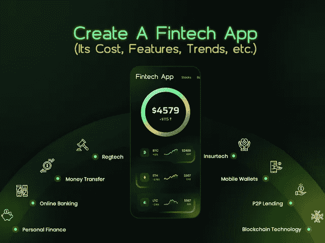
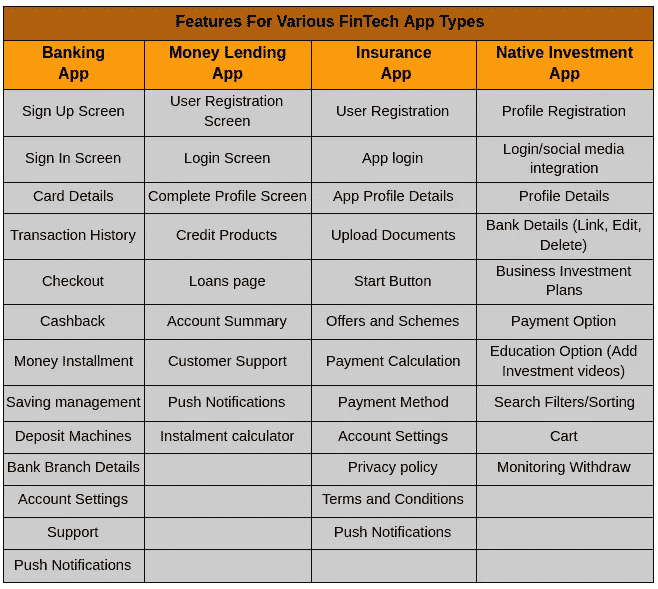

# 创建一个 FinTech 应用程序需要多少成本？

> 原文：<https://javascript.plainenglish.io/how-much-does-it-cost-to-create-a-fintech-app-efc5b826cb02?source=collection_archive---------4----------------------->

## **开发 FinTech 应用程序的估计成本和功能指南，及其成本和功能**

你是否正在管理一家金融企业，并试图通过所有传统的工作模式在数字驱动的市场中取得成功？当然，尽管你很努力，但你不会在事业上取得任何成功…

*为什么？*

随着对全球金融科技市场的强烈预测，预计到 2025 年[将达到 3050 亿美元](https://www.prnewswire.com/news-releases/fintech-industry-report-2020-2025---trends-developments-and-growth-deviations-arising-from-the-covid-19-pandemic-301080282.html)，毫无疑问，金融科技应用已经占据了金融领域的中心舞台。

来自世界各地的组织正通过邀请新的投资者和实施这种技术驱动的解决方案来简化运营和发现更好的商业机会，为其增长做出贡献。

无论你属于银行部门、贷款公司、金融投资公司、保险集团还是消费融资集团，金融科技应用开发都已成为 2021 年取得成功的最热门趋势。

在你深入了解如何开始使用 FinTech 应用程序，要实现什么功能和趋势，以及在 2021 年为你的初创公司创建一个 FinTech 应用程序需要多少成本之前，让我们从基础开始…

## **1。理解金融科技的概念**

许多仍然坚持传统运营方法的金融公司肯定陷入了两难境地，不知道金融科技到底是什么，以及它与他们的业务有何关联…

一般来说，金融科技应用程序是指通过软件解决方案向最终客户提供金融服务的企业。金融科技是数字化转型的结果，数字化转型继续以各种方式服务于各个行业，并为组织确定更多的业务增长机会。

金融领域的现代技术浪潮已经影响到全球数百万人，并增加了对无缝交易的技术驱动型解决方案的需求。

通过拥抱金融科技解决方案所承诺的敏捷性和灵活性，大公司和创业公司等可以通过简单地投资于技术驱动的金融解决方案来提供以下服务:

*   *无缝支付流程*
*   *网上银行服务*
*   *无限支付交易*
*   *快速开票和计费服务*
*   *个人理财实时跟踪管理*
*   *无忧数字保险系统*
*   *股票交易服务*
*   *金融交易的轨迹*
*   *比特币、加密货币等虚拟货币的兑换*
*   *数字抵押服务*
*   *审计、风险和法规遵从性软件*
*   *还有更多。*

根据德勤的[报告，金融科技解决方案的投资从 2020 年的 127 亿美元增加到 2021 年的 234 亿美元。](https://www2.deloitte.com/us/en/pages/financial-services/articles/the-next-phase-of-fintech-evolution.html)

如果你仍然想知道为什么雇佣一家 [**移动应用开发公司**](https://www.xicom.biz/services/mobile-app-development/) 对金融科技解决方案变得如此重要，那么你需要阅读下面的内容。同时，随着对移动应用程序的快速适应，组织创建通过这种渠道向客户提供服务的应用程序变得非常清楚。

尽管如此，我们仍然有一个框架，列出了一些令人信服的理由，说明为什么金融科技公司是未来的发展方向，并将继续保持繁荣…

## **2。2021 年创业公司为什么要考虑投资 FinTech 应用？**

在当今的高科技时代，当人们谈论最赚钱和最有利可图的投资领域时，一个名字总是浮现在脑海中，那就是金融科技应用。但是，是什么让金融科技成为组织和创业公司的良好投资选择呢？

*   根据调查报告，预计 2022 年金融科技行业的价值将达到 26.5 万亿美元。
*   四大公司之一“德勤”的调查报告显示，包括投资银行和资本市场、投资管理和保险相关金融科技在内的金融业务经历了显著增长，占总资金的 87%。
*   来自五个国家的投资占总资金的 72%,但 55%的资金来自美国和加拿大。

组织正迅速 [**雇佣一名应用程序开发者**](https://www.xicom.biz/solutions/hire-developers/) 进入金融技术发展的新阶段。这个部门在不到十年前开始受到欢迎，现在已经成为企业家和投资者最有潜力的行业。事实上，在新冠肺炎遭受严重打击后，金融科技服务在金融领域的应用已成为新常态。

原因如下！

*   电子钱包已成为新钱包

在新时代经济中，大部分交易都是在网上进行的，大多数人已经放弃了携带实体钱包的习惯。有了金融科技应用，你可以轻松地在手机上保存银行信息，并为产品和服务付款。金融科技应用带来了一个巨大的转变，让世界变得没有现金。

*   **财务数据宝贵**

使用金融科技应用的公司往往会收集大量与消费者消费习惯相关的数据，并能够接受审查，以便为客户提供更好的服务，确保出色的客户体验。

*   **增强金融数据安全性**

在保护客户数据方面，金融机构和公司面临着巨大的挑战。因此，为了提供高度加密的金融服务，各机构正在投资金融科技解决方案，以消除它们因网络攻击而遭受财务损失的弱点。

由于金融科技应用使整个在线支付系统变得更快、更安全、更便宜，因此许多人倾向于金融科技应用。凭借所有这些优势和产品，金融科技应用已证明自己是最有利可图的投资领域。要开始使用你自己的解决方案，你需要做的就是雇佣一家 [**软件开发公司**](https://www.xicom.biz/) ，这家公司有开发这种技术驱动的金融应用的记录。但主要问题是“你能为 2021 年的初创公司开发什么类型的金融科技应用”？

## **3。创业公司的金融科技应用类型**

有了才华横溢的软件开发人员，根据您的业务需求定制财务应用程序不再是一项复杂的任务。但你们中有许多人正在关注可以帮助你在 2021 年重塑业务的金融科技应用类型。

*以下是金融科技应用的类型，它们会给你一些有希望的目标，并让行业所有者很容易相信它如何能为他们的业务带来成果……*

*   **手机处理 App**

数字转账已经成为人们最常见的做法之一，因此通过雇佣移动应用程序开发人员来开发在线转账应用程序是一个值得做的决定。

这种类型的金融科技应用程序将允许人们在无需承担任何交易费用的情况下接收和发送资金。最成功的公司正在利用区块链、NFC、人脸和语音生物识别以及其他创新技术，使整个资金转移过程更快、更安全、更便宜。

这类金融科技应用的最好例子是 Ripple、Transferwise 等等。

*   **投资和交易应用**

在投资平台的帮助下，用户可以在一个地方轻松管理他们的资产，通过移动应用程序，处理这些投资变得更快、更轻松。

在金融科技应用的其他领域中，投资和交易应用出现了巨大的增长。因此，无论你是计划开发一个移动应用程序还是渐进式网络应用程序，用户总是希望应用程序能够提供无缝的功能来购买、出售、持有股票、股份、外汇、加密货币、基金，并能够检查其价值。

这种类型的应用程序的完美例子是 Addepar，Hedgeable 和更积极地使用人工智能和商业分析来做出合理的决策。

*   **众筹/股权应用**

随着全球创业公司越来越多，众筹 app 的数量也在突然上升。据统计，全球众筹总额达 162 亿英镑。在众筹平台的帮助下，你可以利用各种愿意投资你的商业想法的风险企业的集体努力，轻松地为你现有的或新的业务筹集资金。

【Kickstarter、Indiegogo 等知名公司投资了众筹/股权应用 ideas。

*   **基于区块链的金融应用**

不讨论区块链技术，如何完成你的 FinTech 应用列表？据预测，从 2017 年到 2021 年，全球区块链市场将以 55.59%的 [CAGR 增长，因此，雇佣一名移动应用开发者](https://www.360marketupdates.com/global-blockchain-technology-market-2017-2021-10533841)**来帮助你构建一个符合你业务需求的金融科技应用是值得的。**

*   ****InsurTech 应用****

**属于保险领域的组织可以通过投资保险金融科技应用程序来见证显著的增长。通过使用移动解决方案、物联网和商业智能，保险公司可以收集庞大的数据库，帮助提供个性化的报价、建议和令人惊叹的定价方案。**

**此外，借助实时用户数据，保险公司可以高效地管理风险。**

*   ****P2P 钱贷 App****

**在个人对个人的金融科技应用程序的帮助下，人们可以直接从其他用户那里获得贷款，而无需使用任何金融机构的服务。**

**通过启动这种类型的应用程序，您可以在同一个平台上轻松地连接借款人和贷款人。**

*   ****P2P 支付应用****

**美国对点对点支付应用的需求正在显著增长，2020 年达到 3964.8 亿美元。使用这种类型的应用程序，用户可以执行交易，并能够直接向收款人汇款，同时保留交易记录。**

****简而言之**:这些是少数受欢迎但要求最高的金融科技应用创意，初创公司或金融机构可以计划通过雇佣 [**移动应用开发公司**](https://www.xicom.biz/services/mobile-app-development/) 来投资。除此之外，你还可以计划投资大量金融科技应用开发创意。你所需要做的就是考虑选择你想要在你的应用中实现的特性和功能，以便脱颖而出。**

## ****4。如何在 2021 年为你的创业公司或公司创建一个 Fintech 应用程序(特性和功能)？****

**每个企业都有不同的目标和市场目标，所以没有你可以盲目依赖的标准功能列表。因此，无论你决定构建一个基本的还是现代的应用程序，都要确保该应用程序应该是高性能的，并通过新的边缘功能得到充分增强，这样你才能满足客户的期望。**

***虽然每个金融机构都想以独特的方式迎合客户，但这里仍然有一些重要的特性和功能，你需要在你的金融科技应用中实现:***

*   ****账户验证和管理****

**你的金融科技应用的基本功能是拥有一个会计系统，允许用户轻松管理他们的银行账户。确保会计系统在执行任何交易之前必须具备验证功能。**

**因此，当用户使用银行应用程序时，你可以监控他们的常规交易、账户历史和检查余额。您还可以通过简单安全的方式访问资金传输。要创建一个帐户管理系统，你需要雇用一名开发人员来构建这个功能，添加多个功能来无缝转移资金。**

*   ****个性化****

**市场上有很多会计应用，那么你会如何让你的应用听起来与众不同呢？这就是应用定制帮助您带来改变的地方。为了提供个性化的银行服务和资金管理方案，你可以使用各种技术，如物联网、机器学习、人工智能驱动的机器人和更多的企业技术。**

*   ****数据分析****

**为了提供潜在的金融建议，金融科技公司必须通过跟踪金融交易历史来分析数据和寻求商业见解。此外，该应用程序分析整个数据集，并为用户生成报告。**

*   ****推送通知和更新****

**这可能是让您的客户保持活跃和消息灵通的最重要的功能之一。将交易更新或任何应用程序更新通知给每个用户是很重要的。**

*   ****用于无缝导航的创意用户界面/UX****

**获得成功的简单咒语是推出一个有吸引力、简单、引人入胜的移动支付应用程序，拥有良好的用户界面。选择合适的文本样式和用合适的底纹代码逻辑地呈现内容是漂亮 UI 的重要关键。**

**这些是一些非常基本的特性考虑。但以下是你可以为你的金融科技应用考虑的几个应用特有的功能:**

****

## ****5。金融科技行业倾向于融入移动应用开发****

**毫无疑问，新兴技术和创新正在迅速改变传统企业的工作方式。根据 Statista 的数据，2020 年美国 43.1%的智能手机用户使用银行和金融应用程序，随着金融科技应用程序开发利用最新的解决方案和趋势快速发展，这一数字将继续增长。**

***以下是 2021 年你需要关注的金融科技应用开发行业的几个最新趋势:***

*   ****区块链技术****

**区块链技术只与加密货币相关联的日子已经一去不复返了。其强大的算法确保了整个行业的安全数据共享，因此，银行、企业、保险和物流公司可以在金融科技应用中利用这项技术，并能够提高生态系统的效率。**

*   ****聊天机器人****

**将聊天机器人应用于金融科技应用将使公司能够与客户进行类似人类的对话，并能够立即回答重复但常见的问题。通过雇佣一家 [**应用程序开发公司**](https://www.xicom.biz/services/mobile-app-development/) 你可以选择将聊天机器人添加到金融科技应用程序中，因为这是一种经济高效、易于扩展、即时可供客户使用的数据驱动功能。**

*   ****语音技术****

**金融业另一个最受欢迎的趋势是语音识别，它允许消费者使用语音命令进行交易和其他操作。尽管一些公司已经开始使用语音技术，如 Siri、谷歌助手或 Alexa 等，以便客户可以毫无麻烦地管理他们的交易。**

**此外，在金融科技应用中增加语音命令将大大减少电话呼叫的数量，使事情更容易管理，并帮助组织更有效地执行。**

*   ****人工智能****

**人工智能的实现不仅仅是自动化这个过程，它将有助于检测数据模式的变化，并自行改变模型。此外，在收集信息时涉及到许多参数，因此数据的准确性和质量总是很高。人工智能技术的实施使您能够获得有助于做出潜在决策的见解。**

*****简而言之:*** *虽然金融科技应用程序简化了整个在线交易流程，但这些流行趋势和技术正逐渐转向采用金融应用程序。但你们中的许多人很好奇，在 2021 年建立一个金融科技应用程序需要多少钱。***

***我们来了解一下！***

## ****6。2021 年做一个 FinTech App 要多少钱？****

**无论你是龙头企业还是创业公司，一个 app 的开发成本都是企业的重大转折点。由于每个企业的工作节奏不同，目标也不同，因此没有一个金融科技应用程序可以满足所有企业的需求。因此，为你的企业开发一个金融科技应用没有标准成本。**

**然而，要继续开发一个应用程序，你必须对预算和时间有一个粗略的估计，从而相应地计划你的目标。因此，要开发一个应用程序，确保安全、透明、有效和方便地进行在线支付转账，您至少需要 20，000 美元的预算来开发一个基本的应用程序，大约需要 3 到 4 个月的时间。**

**然而，如果你考虑在 FinTech 应用程序开发中采用所有提到的趋势和功能，那么应用程序开发的时间线可以从 4 个月增加到 9 个多月，预算将在 25，000 美元到 35，000 美元之间。**

**这些是粗略的估计，可能会根据平台特性、功能、API 集成、应用程序的复杂性、应用程序开发团队、开发人员的小时工资、参与模式等各个方面而有很大差异。**

**此外，应用程序开发的成本会因您选择 [**雇佣开发团队**](https://www.xicom.biz/services/mobile-app-development/) 的地点而异，根据调查报告，印度是雇佣资源的最佳地点，因为有大量软件开发公司提供服务，价格比其他国家低 40%。**

**通常，印度应用程序开发者的每小时费用从 20 美元到 25 美元不等，而在北美、澳大利亚、加拿大等其他国家，每小时费用从 100 美元到 150 美元不等。**

**但是你不用担心！为单一平台开发一个具有基本功能和简单用户界面的财务应用程序将花费 20，000 到 25，000 美元。**

**然而，构建一个具有广泛功能和现代技术的高级解决方案将花费 30，000 到 35，000 美元以上。**

**此外，应用程序开发的成本也可能会因你选择启动应用程序的操作平台(Android 或 iOS)而异。因此，有许多因素会影响为你的企业开发金融科技应用的成本。**

## ****结论:开发应用的成本降低 40%****

**希望在读完这篇博客后，你一定已经明白，对于金融科技机构来说，金融应用正变成一个重大机遇。选择正确的 [**移动应用开发公司**](https://www.xicom.biz/services/mobile-app-development/) ，您可以轻松地将最佳技术、趋势、特性和功能融入到您的金融解决方案中，以智能和经济高效的方式运营您的业务。**

**因此，如果您准备好在金融领域大放异彩，以具有竞争力的价格带来具有最佳功能选择的伟大应用程序开发理念，那么您可以 [***联系我们***](https://www.xicom.biz/contact/) 或在下面提出疑问！**

***更多内容请看*[***plain English . io***](http://plainenglish.io/)**