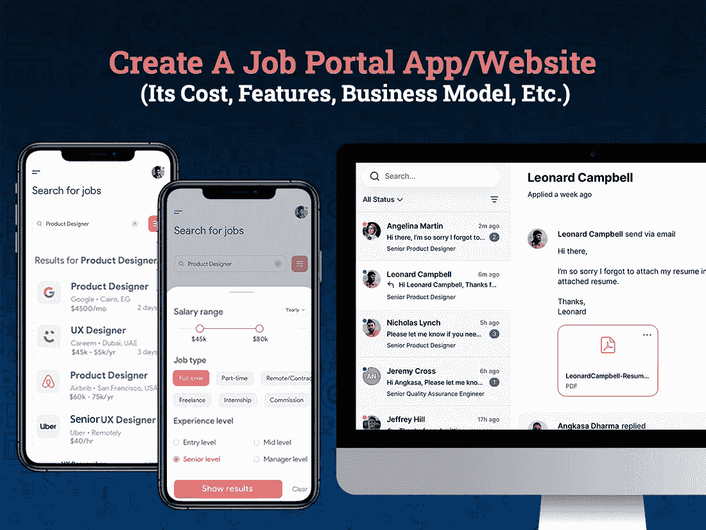

# 创建一个求职门户应用程序和网站需要多少成本

> 原文：<https://javascript.plainenglish.io/how-much-does-it-cost-to-create-a-job-portal-app-and-website-aadf993c0004?source=collection_archive---------2----------------------->

无论你是打算创办一家招聘公司，还是用陈旧的传统方式管理一家公司，想想拥有一个像 LinkedIn 这样的工作门户应用程序或网站，确实是启动你的业务和抵御市场需求变化的完美方式。

在疫情事件之后，招聘市场发生了巨大的变化。随着全球经济陷入困境，企业纷纷倒闭，组织失去项目，员工被解雇，找工作已经成为全世界数百万人面临的一个重大问题。

可能有无数的工作机会，但如何抓住最合适的机会，如何为该职位招聘合适的候选人，实际上是一个复杂的过程。

但你知道吗，像人工智能结合机器学习和深度学习这样的新兴技术在过去几年里迅速彻底改变了整个求职和招聘过程。移动应用行业的前景涵盖了所有领域，并成功地在招聘人员和候选人之间架起了一座桥梁。

由于技术的进步，现代企业，无论是初创企业还是企业家，都不再有兴趣把钱花在招聘的平面广告上。相反，他们更愿意专注于简化任务并使其处理速度更快的数字工具或平台。最有潜力的解决方案是求职门户应用程序或开发一个网站，帮助你吸引最好的候选人。

另一方面，求职者可以摆脱从一个雇主换到另一个雇主，从一个地方赶到另一个地方放弃申请的负担。通过张贴简历，他们可以很容易地与数百名招聘人员取得联系。

如果你非常想知道建立一个工作门户应用程序的成本是多少，在哪里雇佣一个移动应用程序开发公司来通过建立一个像 Monster 这样的工作门户应用程序来体验成功的滋味，那么它是你获得应用程序开发的真正见解的正确博客。

这个博客已经涵盖了所有的事实，并为你提供了一个全面深入的指导，告诉你如何创建像 Monster 或 Indeed 这样的应用程序，以及为什么现在是投资建立工作门户网站或应用程序的最佳时机。

## **目录:**

*   *你为什么要投资一个求职门户应用或网站？
    -行业统计或市场规模*
*   拥有像 LinkedIn 这样的求职应用程序的主要好处
    ——对于招聘者和求职者来说
*   *如何从你的求职门户或网站赚钱？
    -应用/网站所有者的最佳盈利策略*
*   *如何搭建求职或招聘 App/网站？
    -求职者面板功能
    -招聘人员面板功能
    -管理面板功能*
*   *如何让自己的求职平台成为行业赢家？*
*   *构建招聘或求职应用的技术和团队需求*
*   *开发一个招聘手机 App/网站要多少钱？*
*   *结论*

让我们先睹为快，深入了解每一点，以便更好地理解…

## **1。为什么要投资一个求职门户 App 或网站？**

你曾经找过工作吗？当然，你有！

但是，你不觉得这是一个令人生畏的过程，而这一过程有望变得更加简单和容易吗？

作为一名招聘人员，总会有一些顾虑，比如每份工作的平均申请数量是多少？招聘一个 [**app 开发公司**](https://www.xicom.biz/services/mobile-app-development/) 需要多少钱，招聘流程需要多长时间？

但是，如果在一个地方收集招聘统计数据和工作统计数据，难道不是很有帮助吗？

是的，肯定的！

根据劳工统计局的调查报告，每年有 20-24%的美国人换工作，这意味着仅在美国每年就有超过 4100 万人在找工作和被招聘。

由于求职门户或招聘应用程序或网站正在打开一个信息世界，使其成为一个即时通信过程和多媒体内容，毫无疑问，这些平台已经改变了雇主寻找新员工和人们找到工作的方式。

你不必相信我们的话。开始统计吧！

> **招聘行业统计或市场规模:**

*   根据[调查报告](https://zety.com/blog/job-search-statistics)，79%的求职者表示他们可能会在求职中使用社交媒体，对于更年轻的求职者，这一比例上升至 86%
*   68%的美国人拥有智能手机，其中至少 41%的人使用智能手机寻找工作。
*   一般来说，找工作需要 5 个多月的时间，但是根据顶级简历研究，大多数使用专业简历的求职者可以在 3 个月或更短的时间内找到工作。
*   60%的候选人用手机浏览公司网页，39%的人用手机申请职位。

有了这些统计数据和事实，很明显，招聘和求职应用程序在未来仍将有需求，同时也为企业带来了巨大的潜在机会。

现在的问题是它将如何使你受益…

## **2。拥有像 LinkedIn 这样的求职应用程序的主要好处**

开发一个求职门户将确保双向利益。其中一个主要的好处是，它将为求职者提供来自世界各地的数千个工作机会，作为回报，招聘人员只需在门户网站上发布一个职位空缺，就可以收集大量数据。

让我们深入吧！

***求职手机 App 对招聘人员的好处:***

*   **简单、快速、快捷的选择流程:**通过使用工作门户，您可以轻松查看申请该职位的候选人名单。你所需要的是根据经验、专业知识和技能来筛选申请。这将使招聘过程更快、更有效、更容易。
*   **推广品牌:**通过选择 [**雇佣一名移动应用程序开发人员**](https://www.xicom.biz/offerings/hire-mobile-developers/) 您可以定制工作门户，帮助您在线推广您的品牌。根据调查，80%的雇主同意，通过这些门户网站，品牌能够方便地吸引优秀人才。
*   **性价比高的解决方案:**在你的招聘门户上发布无限的职位将是一次性投资，而不是在报纸上为每个职位做一个昂贵的广告。

***求职者使用在线求职平台的优势***

*   **定期的工作提醒:**一个潜在的招聘应用程序会定期向你提供每个新职位空缺的最新信息。这将确保候选人不会错过任何申请机会，并能够尽早开始工作。
*   工作建议:通过常规的工作建议，求职者可以找到数百份与他们的技能、经验和专长完全吻合的工作建议。
*   **用户友好型仪表板:**通过用户友好型仪表板，用户可以轻松了解他们如何申请、谁将他们的个人资料加入了书签，以及有多少招聘人员对他们的个人资料感兴趣。
*   高效:求职网站能非常高效地帮你找到理想的工作。它们缩短了招聘周期，让求职者更容易找到合适的工作，没有任何麻烦。
*   **无尽的工作机会:**一旦求职者向门户网站提交了申请，他们将能够在同一个门户网站解锁数百个机会。

## **3。如何从你的求职门户或网站赚钱？**

当涉及到开发一个移动应用程序时，企业主总是很关心它如何给你带来利润？有各种各样的货币化策略，但是货币化策略的选择实际上取决于你选择构建的应用程序。因此，在你着手 [**雇佣一个网络开发人员**](https://www.xicom.biz/offerings/hire-web-developers/) 来定制一个工作门户网站之前，了解不同的经常性收入策略是值得的。以下是你如何选择从你的求职门户应用和网站中获利的方法:

> **答:会员计划:**

这是求职门户应用最传统的盈利方式之一，会员计划可以按月、季度或年付费。*门户的主要会员将获得如下特别优惠:*

*   获得一定数量的大量简历下载。
*   特定时期的常规工作列表。
*   访问与员工培训和资源相关的教育资源。
*   进入论坛或社区，志同道合的雇主可以分享有效的建议和技巧，以导航潜在的工作申请。

> **B .功能列表:**

另一种最常见的应用程序盈利方式是在你的主页上，或者在发给求职者的电子邮件通讯中，或者在你的博客上，展示某些雇主的简介。为了突出雇主的名字，你可以收取一定的费用。

作为回报，雇主可以选择不同级别的特色新闻，支付不同的费用。例如，特色刊登费将取决于他们选择在顶部突出他们的个人资料的天数。

> **C .第三方广告:**

广告是一种将你的应用货币化的流行方式。由于这是通过广告产生业务的最佳和直接方式之一，第三方企业可以同意为使用你的应用程序/网站中的空间做广告支付一定的费用。

**一言以蔽之:**以上是你可以考虑从招聘平台赚钱的少数几种变现策略。但主要问题是如何创建一个像 Glassdoor、LinkedIn 或其他类似的求职门户网站。

## **4。如何搭建一个求职或者招聘的 App/网站？**

当涉及到像 LinkedIn、Indeed 或 Glassdoor 这样的求职门户或招聘应用程序/网站开发时，重要的是要将主要精力放在你想在应用程序中实现的特性和功能上。应用程序开发流程将与其他应用程序保持一致。

因此，在雇佣一家 [**网站开发公司**](https://www.xicom.biz/services/web-development/) 时，要确保你选择了最佳的特性和功能来帮助你在竞争激烈的市场中脱颖而出。在创建求职门户时，请记住该应用程序有三个面板，一个是为用户在应用商店发布的，另一个是为卖家发布的，第三个是监控和管理一切的管理面板。

> **求职者面板功能**

*   **注册/登录:**下载应用程序后，接下来你需要使用个人信息或社交媒体账户注册或注册应用程序。确保注册程序必须更简单、更短、更快。
*   简历写作:对于用户来说，这可能是最基本和最重要的功能，可以帮助求职者使用标准的写作工具来撰写简历。确保它提供了所有的指导方针，简历格式和样本，以简化简历写作的任务。
*   **上传简历**:在网上求职门户上传简历必须快速直接。
*   **发送简历:**添加将简历直接发送给他们认为与其专业领域相关的招聘人员或公司的选项，使他们能够寻找更多的机会。
*   **职位搜索:**该功能允许用户广泛搜索完全符合其需求的职位。他们可以通过设置地点、经验、技能或期望薪资来筛选所有适合他们的工作选项。
*   **给工作做书签:**这是你可以选择创建的最重要的功能之一，你可以考虑 [**雇佣一个移动应用开发者**](https://www.xicom.biz/offerings/hire-mobile-developers/) 。通过这一功能，用户可以将他们希望以后申请的工作加入书签，或者根据需要发送简历，或者能够与朋友分享工作细节。
*   **工作提醒服务:**工作提醒服务在应用程序中可用，以保持用户参与应用程序。

> **招聘人员面板的功能**

*   注册/注册流程:职位发布和筛选最佳候选人的流程，招聘人员必须完成注册程序，或者只需添加电子邮件 ID、电话号码等详细信息即可注册。
*   职位发布:一旦创建了个人资料，招聘人员就可以根据空缺的数量和完整的描述来发布职位，这样求职者就可以很容易地与你取得联系。
*   **工作邀请:**确保你的应用程序有这个功能，允许招聘人员向想要的候选人发送工作邀请。因此，他们可以通过电话或应用程序本身上的文本消息要求用户安排面试，以便进一步进行。
*   **电子邮件招聘:**有数千家公司的职位空缺有限，所以招聘人员必须能够直接将工作机会发送给想要的候选人。
*   **简历筛选:**现在，这将节省他们在整理和筛选完全符合工作要求的简历方面的巨大努力和时间。招聘人员可以在数据库中搜索简历，并且能够联系期望的候选人进行进一步处理。
*   **简历下载:**招聘人员如果愿意也可以下载简历。下载简历后，他们可以据此进行分析，并安排与候选人的面试。
*   **付款计划:**作为一名招聘人员，有时您可能需要访问工作门户的特殊功能，以便下载更多简历、列出工作等。招聘人员可以根据自己的需求和预算从众多支付计划中进行选择。

> **管理面板的功能**

*   **管理招聘广告:**为了避免任何麻烦，重要的是要有一个功能，使您能够以排序的方式管理多个发布广告的职位。
*   **管理候选人资料:**管理员有权监控候选人资料，并根据指南创建或拒绝申请。
*   **招聘人员档案管理:**管理员拥有管理多个招聘人员档案的所有权限。
*   **邀请:**管理邀请，并在发布新的工作机会或有紧急空缺时向用户发送通知。
*   **生成收入报告:**你可以聘请专家定制仪表盘，提供实时分析报告，帮助你了解你从门户网站赚了多少钱，从哪里获得潜在候选人等等。

这些是少数几个功能，使你能够建立一个基本的求职和招聘门户应用程序结构。如果你是一家初创公司，想要用有限的预算启动你的业务，并且想要验证客户的反馈，那么通过雇佣一家 [**移动应用程序开发公司**](https://www.xicom.biz/services/mobile-app-development/) 来建立一个 MVP 是一个合乎逻辑的考虑。最好的部分是，如果你想创建一个现代版本的应用程序，它可以很容易地随着时间的推移进一步扩展。

## **5。如何让自己的求职平台成为行业赢家？**

app store 中有许多提供基本功能的求职和招聘门户，但它不会确保你有足够的实力与市场领导者站在一起。为了与领域巨头竞争并取得成功，您需要直接查看使您的门户访问更加方便的高级功能。

*   **注册:**与使用基本注册和注册流程不同，您可以允许用户使用他们的社交媒体帐户直接注册。
*   **高级筛选和排序:**允许用户和招聘人员使用高级筛选(如地点、薪金、工作类型、专业知识、薪金范围等)来筛选职位空缺和候选人。
*   文档扫描仪:这可能是你的应用程序的一个重要功能，可以帮助候选人使用你的应用程序内扫描仪扫描他们的所有文档。他们可以轻松地扫描他们的成绩单，身份证证明，证书，工资条等，并轻松地上传到他们的个人资料。
*   **应用内聊天/消息:**这些功能有助于促进招聘人员和求职者之间的无缝互动，并能够讨论进一步安排面试。
*   **简历创建:**简历是这个门户网站上最重要的元素之一，所以要确保应用程序/网站有不同的工具，让用户可以刷简历，使其易于上传，并允许用户在门户网站内创建简历。
*   视频会议面试:这将真正帮助雇主更快、更轻松地完成招聘过程。他们可以轻松安排与入围候选人的视频电话面试。在这个疫情，每个人都被迫遵循社交距离，这个功能真的很有帮助。
*   **电子学习课程:**为了进一步提升求职者的职业形象，求职者可以选择工作门户网站上列出的不同电子学习课程。你可以选择 [**聘请 app 开发者**](https://www.xicom.biz/solutions/hire-developers/) 定制这个功能，提供简历撰写、面试技巧、职业指导等短期课程，超越自己的职业生涯。
*   **文档管理模块:**这是一个重要的功能，使求职者和雇主能够在一个安全的地方存储、创建和管理文档，并在需要时方便地访问。
*   **实时分析:**该功能使管理员能够提取重要信息的实时信息，如分配的工作总数、链接的雇主数量、提供的工作数量等。
*   **支付集成:**一个好的工作门户结合了多个网关，以方便用户。您可以提供流行的支付方式，包括信用卡/借记卡、移动钱包、UPI 等，让您轻松付款。

## **6。构建招聘或求职应用程序的技术堆栈和团队需求**

无论你脑海中的应用程序开发概念有多么辉煌，解决方案的成功在很大程度上取决于处理过程的顺畅程度。技术的选择和你的团队投入到项目中的专业知识将决定你的应用程序的熟练程度…

*以下是你可以选择的几种求职和招聘门户技术:*

*   操作系统:安卓、iOS、网络应用
*   前端开发者:Java，Swift，Angular，Java，CSS，HTML，React，Flutter
*   后端开发者:Python，Laravel，Node.js
*   推送通知、短信和应用内消息:批量
*   支付处理:PayPal API、Stripe API 和 Braintree SDK
*   数据库:MongoDB
*   云环境:谷歌云、AWS
*   社交登录:脸书、谷歌、Twitter APIs

> **招聘和求职门户所需的团队结构**

开发和定制求职应用程序门户是一项复杂的任务，因为它需要合适的专业人员以及合适的专业知识和技能。因此，与一家知名的 [**移动应用程序开发公司**](https://www.xicom.biz/services/mobile-app-development/) 取得联系是非常重要的，该公司雇佣了一个智能技术人员团队，致力于为您提供准时的项目交付和熟练程度。

要建立像 LinkedIn 或 Glassdoor 这样的求职门户，你需要一个由以下人员组成的团队:

*   商业分析员
*   项目管理人
*   应用开发者
*   后端开发人员
*   质量保证工程师
*   UI/UX 设计师

## **7。开发一个求职招聘手机 App/网站需要多少钱？**

无论你是一家初创公司还是一名领先的商业企业家，如果你正通过一个 app/网站开发解决方案步入招聘行业，那么你首先要考虑的是确定建立一个求职和招聘门户需要多少成本。

应用程序开发的过程相当漫长和复杂，因为它包括各种元素，如特性和功能，应用程序的复杂性，操作系统，你选择雇用的应用程序开发人员及其位置，UI/UX 设计等等。

获得一个具有最少功能的基本应用程序的成本约为 20，000 美元，随着功能数量的增加，成本会越来越高。如果你选择开发一个具有高级功能的应用程序，它的最高价格可能会达到 35，000 美元左右。

其余的，这些都是粗略的估计，可以根据应用程序的复杂性和特性而有所不同。

# **结论:**

*如何搭建自己的求职招聘 App/网站入口？*

使用 LinkedIn 或 Glassdoor 等求职和招聘门户网站已经成为招聘人员和求职者的常见做法。但为什么只有这些平台是最值得推荐和信任的职位空缺和合适候选人搜索平台呢？简单是因为出色的用户体验和直观的导航。因此，如果你也梦想拥有一个像 LinkedIn 这样的工作门户应用程序/网站，你可以聘请一家 [**移动应用程序开发公司**](https://www.xicom.biz/services/mobile-app-development/) ，帮助你创建一个使用最新技术、行业需求特征并融入敏捷开发方法的平台。

因此，如果你有任何想法或者你想要一个团队来集思广益这个应用程序，帮助研究工作，UI/UX 设计，测试和应用程序开发，那么你可以 [***联系我们***](https://www.xicom.biz/contact/) 并获得你的免费评估或在下面提出疑问。

=====================================

*更多内容请看*[***plain English . io***](http://plainenglish.io/)